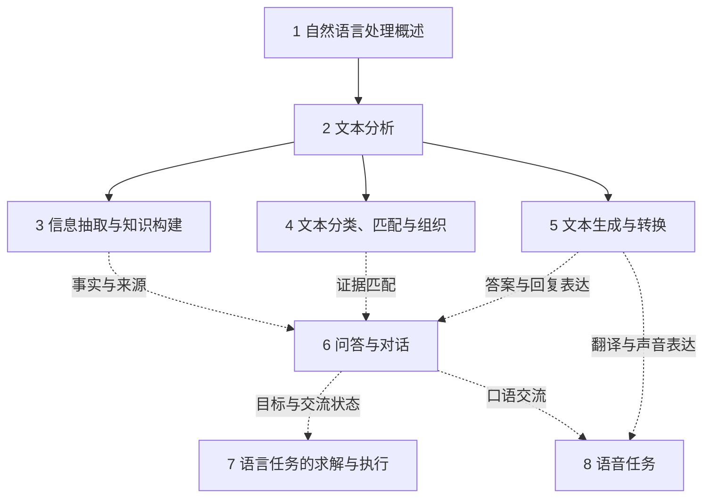

# 第十五部分《自然语言处理》大纲

正文入口：`tex/05-applications/01-natural-language-processing/part.tex`。当前仅有部分首页，尚未接入章节正文。以下章目与方法是后续写作规划；章、节编号用于本大纲内部定位，不表示当前 PDF 已有这些内容。

本文件规划第五卷“应用”中“自然语言处理”部分的八章内容，细化到节、小节及必要的小小节。章次和节号表示本部分内部顺序，正式章号由LaTeX在全书中连续编号。正文归属目录为`tex/05-applications/01-natural-language-processing/`；当前仅确定写作大纲，不创建占位章节。

层级与展开深度参照[强化学习](reinforcement-learning-outline.md)、[知识的获取](efficient-knowledge-use-outline.md)和[知识的演进与迁移](knowledge-evolution-and-transfer-outline.md)三份大纲：同一父节点使用统一的划分依据，进入下一层时可按子问题改用对象、过程、条件或方法，但须说明关系。独立子问题设小节，包含多种机制的小节再向下展开；紧凑的共同说明和各章小结不为追求层数而拆分。章和节仍按语言任务及处理对象组织；任务小节下的重要模型与算法设为独立编号的小小节，标题直接标出名称及解决的问题。共同输入、标注、约束和评价在父级交代，各方法分别展开任务特有的计算、输出恢复和例子。同一方法的通用原理与完整网络结构回指前卷，在其他任务中复用时只补输入、目标或解码的差别。

各叶级小节列明正文要展开的概念、具体方法、实现步骤、必要推导、可复核例子与适用条件。“完整展开”表示从数据到结果走通代表实现；“主讲”标明该任务的讲解路线，仍须说明计算和恢复步骤，但共享模型原理不重复推导；“比较”说明其他路线改变了哪些输入、操作或输出及为何适用。概述中的“写作内容”规定要讲清的概念与例子。方法名称是写作选材，正文仍先提出问题，再解释机制。图表随相关内容规划，每项说明表达目的、主要元素或行列及比较条件；临时编号不等于正式排版编号。目前所有图表均待制作，结构与流程优先使用TikZ，定量图只使用可追溯数据或明确标注的教学构造。

## 部分定位与组织依据

本部分回答：给定一项语言处理需求，怎样把它定义为可求解、可评价的任务，再选择合适的数据、预测形式和实现过程？读者已经接触经典模型、神经网络、概率图模型及主要学习范式，这里只简要回顾任务所需的模型接口，重点讲语言任务的输入、输出、监督依据、求解过程和失效情形。

全部分沿“文本分析—文本处理与应用”组织。第1章建立共同概念、研究内容和研究历史；第2章解释文本的语言单位、结构、意义及语境作用；第3至6章分别交付事实记录、类别与对应关系、新文本、答案与交流结果；第7章把语言要求落实为解答、程序和环境行动；第8章增加声音输入、声音输出与实时交流条件。文本处理任务按需要使用显式分析结果、联合预测或直接文本输入，书中的阅读顺序不规定应用必须执行同一条分析流水线。

大纲结合近十年的代表论文与会议研究主题形成，主要覆盖2017—2026年，检索截止日期为2026年10月5日。经典任务方法另作实现依据保留，不将其发表时间混入近十年的研究样本。来源、纳入理由和适用边界见[自然语言处理研究文献地图](natural-language-processing-literature.md)。这是面向教材选题的定向检索，不是全部论文的计量统计；研究脉络是据所选材料作出的组织判断，不用于声称课题占比或某方向已替代其他方向。

## 章节安排与章内划分依据

| 次序 | 章名 | 本章要回答的问题 | 主体内容的划分依据 |
| --- | --- | --- | --- |
| 1 | 自然语言处理概述 | 语言处理研究什么，怎样定义任务，这些问题如何发展至今？ | 应用需求、基本概念、研究内容、研究历史 |
| 2 | 文本分析 | 文本的单位、结构、意义和语境作用怎样形成明确结果？ | 词法、句法、语义、篇章和语用五种分析视角 |
| 3 | 信息抽取与知识构建 | 怎样把表达中的事实整理为有对象、有条件、有来源的记录？ | 实体、关系、事件三类抽取对象，再整合知识记录 |
| 4 | 文本分类、匹配与组织 | 怎样判定文本属性、比较文本并组织语料？ | 单篇文本、文本对、文本集合三种处理对象 |
| 5 | 文本生成与转换 | 怎样按要求从输入材料产生新文本？ | 共同生成基础之后，按翻译、摘要、编辑、写作的目标分组 |
| 6 | 问答与对话 | 怎样依据证据回答，并在多轮交流中完成不同目标？ | 证据问答、事实核验、任务型对话、开放与协作对话 |
| 7 | 语言任务的求解与执行 | 怎样把语言要求落实为可检查的解答或执行结果？ | 数学与逻辑解答、程序产物、环境任务三种交付对象 |
| 8 | 语音任务 | 怎样从声音取得语言信息、生成声音并完成实时交流？ | 识别、口语理解、合成、翻译、口语对话五类任务 |

共同基础和综合收束可以承担与主体分类不同的职责，但不将它们称为另一种任务。具体模型与算法放入所服务的处理环节，多语言、低资源、领域变化、长文档和实时性作为可叠加条件进入相关任务。章末均保留独立的“本章小结”。

## 章节关系与内容边界

第2章建立位置、结构和意义表示，第3章用这些信息组织事实，第4章转向属性和文本关系，第5章控制信息怎样进入新文本，第6章增加问题、证据和交流历史。各章也比较直接预测自己的输出的方案。第7章增加可执行产物与环境反馈，第8章把声音与时间条件接入已有语言任务。

实线表示主要概念依赖，虚线表示特定任务复用的能力；图中的连线不表示每个应用都必须经过相应章节的完整流程。正式书稿用TikZ重绘。

| 相关部分 | 本部分需要保留的讲解 | 交叉引用的内容 |
| --- | --- | --- |
| 经典模型、神经网络与概率图模型 | 输入表示、预测头、标签依赖、任务损失与解码怎样对应语言对象 | 通用分类器、HMM、CRF、网络架构、注意力和优化的完整推导 |
| 知识的获取、演进与迁移 | 语言任务的标注、提示示例、少样本与跨语言条件，以及适应方案改变了什么 | 自监督、弱监督、主动学习、参数高效适应、上下文学习、持续更新与蒸馏的通用机制 |
| 强化学习 | 对话和行动中的目标、反馈、可验证结果与运行条件 | 策略学习、探索、信用分配、RLHF及其他优化算法的推导 |
| 推荐与搜索 | 语言查询、相关性标注、证据单位及检索结果怎样进入语言任务 | 通用检索与排序模型、索引和搜索系统的完整讲解 |
| 可信性 | 语言歧义、虚构事实、错误引用、偏见、数据泄漏与执行偏离的任务表现 | 一般可靠性、公平、隐私、行为约束与对抗安全的框架和保证 |
| 图像和多模态处理 | 纯文本与纯语音任务的接口，以及视觉结果交给语言任务后的处理 | 图像描述、视觉问答、指代表达定位、OCR、文档图像、图表、视频及音画联合证据，见其“多模态理解”章 |
| 机器学习系统 | 任务所需的输入输出、执行记录与成本口径 | 分布式训练、量化、缓存、服务编排、数据与运行维护 |

语音部分覆盖以语言识别、理解、生成或交流为目标的声音任务。文本和声音之间的转换在第8章主讲；使用图像、版面、视频或音画联合证据的多模态任务归入后续图像和多模态处理部分。纯文本中的表格数据可用于抽取、生成或问答，页面图片中的表格识别与版面恢复由图像部分主讲。

## 代表实现与讲解深度

完整展开的代表实现必须交代输入组织、监督或提示、目标量、候选形成、解码或结构恢复、结果核验与错误定位。比较内容复用已建立的流程，仍说明输入、输出或约束改变后怎样实现，不以“也可采用某模型”代替讲解。

| 章节 | 完整展开的代表实现 | 比较与延伸的重点 |
| --- | --- | --- |
| 第2章 | BMES＋CRF／Viterbi边界标注；PCFG／神经跨度分数＋CKY成分解析 | 词义、角色、语义图、查询、共指和篇章关系各自的输出构造与核验 |
| 第3章 | 跨度分类／双仿射实体识别与位置还原；ATLOP／EIDER文档关系及证据预测 | 身份链接、事件记录、事件关系、来源条件与知识整合 |
| 第4章 | 多标签分类及阈值选择；联合或独立编码的句对判定；pLSA的EM与LDA的文档主题推断 | 情感与立场、来源判定、相关性、对齐、主题与聚类的目标差异 |
| 第5章 | 条件最大似然、束搜索／采样及核验；MMR选择去重与查询导向摘要的综合、来源对应 | 翻译、编辑、数据到文本和开放写作对信息变化的不同要求 |
| 第6章 | BM25／DPR检索与证据回答；JointBERT、TRADE和规则行为选择组成的任务型对话 | 事实核验、开放交流、知识与记忆、澄清和协作的新增要求 |
| 第7章 | 程序生成或Agentless式修复的候选—测试—修订循环；ReAct工具任务的行动—观察—调整循环 | 静态求解、代码转换、仓库修改、用户协作与完成证据 |
| 第8章 | CTC递推／前缀解码与RNN-T对齐；文本规范化、Tacotron 2／FastSpeech 2和声码器合成 | 直接口语理解、级联与直接翻译、流式输出和完整口语交互 |

## 第1章 自然语言处理概述

本章回答“语言处理研究什么，怎样把实际需求变成明确任务，这些问题如何发展至今”。读者已经知道模型、损失和泛化，这里建立任务对象、信息条件和评价依据。贯穿使用一份活动通知及围绕它的咨询：同一材料可以被分析、分类、抽取、压缩、翻译、问答或朗读，各任务交付的结果与验收依据不同。研究历史用于定位问题的扩展，不重复模型卷的架构演进。

### 1.1 语言处理的需求与应用场景

从“通知里写了什么”“我要保留哪些事实”“应当怎样回复咨询”三个需求出发，区分描述语言结构、整理内容和完成交流。比较人工逐篇阅读、关键词规则和自动预测能提供什么，指出歧义、上下文、省略、多种合理表达及领域术语怎样增加任务定义的难度。保留为紧凑的场景说明，不按应用行业另开一组小节。

**写作内容。** 给出一份含活动名称、时间变更、地点和报名条件的完整通知，以及三条咨询。逐项写出分析标注、类别、实体与事件记录、摘要、译文、问答和语音输出样例；分别指出哪些结果依赖原文、哪些需要日期背景、哪些需要业务状态。对照关键词规则、人工整理和模型预测的具体错误，形成后续八章共用的任务说明。

**图1-1 同一材料的不同语言任务（关系图）。** 以教学构造的活动通知为中心，分别连接分析结构、类别、事实记录、摘要、译文、答案和朗读输出。箭头表示材料被用于什么任务，不表示这些任务必须依次执行；图注给出各输出的验收对象。

### 1.2 自然语言处理的基本概念

按定义一项语言任务所需的对象展开：处理什么、输出什么、能够使用什么信息、结果依据什么成立。模型内部的向量是计算表示，任务输出则须能对应具体的预测对象。

#### 1.2.1 语言单位与上下文

建立字符、词、子词、句子、文档和对话轮次的关系，用中文切分和混合书写说明语言单位与模型词元可能不同。定义原文位置、跨度与分段，展示规范化后怎样保存位置映射，避免标签正确却无法还原到原文。

区分当前片段、相邻文本、文档背景、交流历史与外部资料。用“时间改到明天下午”说明同一句话的日期需要参考时间和先前通知才能确定。词法处理的算法放在第2章，此处只建立后续标注与输入组织需要的概念。

**写作内容。** 用字符切分、词典分词和子词切分的三组结果解释语言词与模型词元的差别；点名BPE、WordPiece和Unigram分词模型，具体算法回指模型卷。列出原文、规范化文本、词元及字符偏移的对应记录，演示全角转半角、大小写转换及空格处理后如何恢复跨度。分别构造句内歧义、跨句指代、相对日期与对话省略的例子。

#### 1.2.2 任务输出与正确答案

比较类别、数值、跨度、树或图、事实记录、文本、程序和行动结果，逐项说明它们记录了什么。用同一通知的实体位置、活动记录和摘要区分“位置命中”“记录正确”“表达有依据”。

解释多参考答案、语义等价、标注分歧、无答案和未知类别。正确性由任务规范、可用背景与交付用途共同限定，合理措辞可能不唯一。要求依据指定材料的任务不能接受无支持的内容；开放写作和程序生成则分别按照创作要求与功能规格判断。

**写作内容。** 为同一通知填写类别标签、连续得分、字符跨度、依存树、事件字段、摘要、数据库查询和执行回执。区分原文位置正确、字段值正确、语义等价、证据充分及执行完成五种验收对象。用两个合格摘要、一个部分匹配实体和一个不可回答问题，说明多参考、严格匹配、部分匹配与拒答规范。

#### 1.2.3 数据、监督与信息条件

区分原始文本、任务标注、参考表达、证据、工具结果和执行反馈。说明怎样构造训练样本与独立评价样本，人工、规则、已有模型和数据内部目标的获取机制回指范式卷。

记录语言、领域、资源、文档长度、资料时点及允许访问的信息。按文档、实体、来源或时间留出，并用近重复通知说明随机切分可能使同一事实跨训练与测试出现。低资源与未见类别是条件，不能仅由一个方法名称推断可用监督。

**写作内容。** 展示分类样本、BIO序列、关系与事件记录、源文—目标文对、问题—证据—答案及行动轨迹的样本格式。比较人工标注、词典与规则生成、远程监督、伪标签和指令示例提供的监督信息，完整学习机制回指范式卷。给出按来源、时间、文档和实体划分的方案，并解释近重复、同模板与测试答案混入资料库的泄漏风险。

### 1.3 自然语言处理的研究内容

本节分别回答任务如何组织、已有模型怎样形成任务输出、怎样建立评价证据。三者共同支撑语言应用，任务、实现与评价承担不同职责。

#### 1.3.1 文本分析、文本处理与扩展任务

复用部分开头的章节安排表，说明词法、句法、语义及上下文分析提供什么结果，分类、抽取、生成和问答如何选择所需信息。用直接文本分类和使用显式句法的关系抽取作对照，解释分析结果可帮助应用，但下游任务也可直接预测输出。

定位可验证求解、程序与环境执行、语音输入输出，明确视觉及文档图像任务转交图像部分。应用可以组合多个任务，仍需约定各接口的对象与最终完成条件；此处不将后续章名再次展开为重复的小节。

**写作内容。** 用三个完整需求说明组合关系：通知事实登记采用抽取与记录合并；资料咨询采用检索、阅读和回答核验；改期办理采用对话状态、工具调用和回执。各例列出中间结果及最终验收依据。比较显式分词／句法辅助方案与直接预测方案，说明前者的错误传播和后者的结构约束需求。

#### 1.3.2 已有模型怎样形成任务输出

用简短对照说明特征加分类器、编码加预测头、结构化预测、条件生成、检索或工具辅助各自怎样得到输出。给出类别选择、跨度还原、结构解码、生成结果解析和行动参数检查的接口例子。

说明分类、抽取也可采用生成接口，结果仍分别满足标签或原文证据要求。语言模型、预训练、微调、提示与学习范式的完整原理回指前卷，只回顾当前任务确实需要的接口。

**写作内容。** 用TF-IDF加朴素贝叶斯／线性分类器说明特征到标签；用BERT加分类头或跨度头说明编码到任务得分；用HMM／CRF加Viterbi说明序列恢复；用编码器—解码器和自回归语言模型说明条件生成；用检索器、阅读器与工具接口说明外部信息进入计算。每类只给任务输入、得分对象、输出恢复和一项约束，完整架构及优化推导回指前卷。

#### 1.3.3 评价依据与应用比较

按输出对象选择精确匹配、语义等价、参考表达、证据支持、功能测试或环境状态核验。自动指标、人工判断与模型评审各提供部分证据；用一条流畅但改错日期的摘要说明偏好、表面相似与事实正确不能互相替代。模型评审需与独立依据核对，并控制顺序、冗长与评价者条件。

固定语言、领域、外部资料、时间和计算或交互预算。借助CheckList与Dynabench安排否定、数量、实体替换、语序、未见组合、证据冲突和动态困难实例；用HELM、XTREME、Belebele与Global MMLU说明跨任务、跨语言评价需要保留逐项结果及文化条件。数据获取机制和一般可信性保证回指相应部分。

比较完整应用时同时记录质量、延迟、标注与调用成本、用户负担及维护要求。按输入处理、检索、预测、解码、核验和执行定位错误；局部模块分数与完整应用成功分别报告，各任务专门指标随后文展开。

**写作内容。** 计算一个混淆矩阵的准确率、精确率、召回率及F1，比较宏平均与微平均；用实体跨度展示严格匹配与部分匹配，用句对得分展示Pearson与Spearman相关。定位UAS／LAS、Smatch、BLEU／ROUGE／SARI、WER／CER、pass@k和任务成功率分别验收的对象，详细计算进入对应章节。安排验证集定阈值、独立测试、分条件报告和行为反例，避免把不同指标直接相加。

**表1-1 输出对象与评价证据。** 行为类别、跨度、结构、事实记录、新文本、程序和环境行动；列为任务例子、正确性依据、常见替代指标、替代指标遗漏的要求。用同一材料填写可比较的行，不把各类指标合成未经解释的总分。

### 1.4 自然语言处理的研究历史

按研究问题梳理几条并行线索，在每条线索中依时间说明代表材料增加了什么能力或暴露了什么限制。规则与统计方法作为已有背景简要定位；近十年部分以文献地图中的一手材料为依据，不把论文发表年份写成任务或思想的唯一起点，也不以模型规模给全部任务划时代。

#### 1.4.1 语言结构与文本判定的研究

从语言单位、句法和意义结构的显式表示，连接端到端共指（2017）、成分解析与语义角色（2018）、UD v2（2020），说明联合预测和跨语言标注改变了哪些条件。文本判定这条线由STS（2017）、MultiNLI（2018）、PAWS（2019）至ANLI与CLUE（2020），分别增加评分、体裁、角色变化、困难实例和中文条件。结构分析与直接判定持续并存，二者的联系由具体任务证据说明。

事实记录这条线以DocRED（2019）的跨句关系证据、MAVEN（2020）的事件提及、WikiEvents（2021）的文档论元、MAVEN-ERE（2022）的事件关系及EventRelBench（2025）的关系评价说明对象和范围的扩展。与此并行，Few-NERD（2021）把细粒度和少样本条件引入实体识别；不能将这些代表资源写成整个方向的唯一起点。

**写作内容。** 在既有时间线中补入规则与词典、HMM／CRF标注、词袋分类和概率主题模型的背景位置，随后连接神经结构预测与上下文表示。分别选句法、共指、分类和主题发现的一个前后对照，写清新增预测对象或监督条件；pLSA、LDA与神经主题模型的具体使用留在4.3.1，不在概述重复推导。

#### 1.4.2 文本转换与语言覆盖的研究

借JFLEG与WebNLG（2017）、XSum（2018）、ASSET（2020）说明纠错、数据表述、摘要与简化各自怎样规定信息变化。翻译这条线由STACL（2019）的实时输出，连接MQM评价（2021）、NLLB（2022）、WMT24（2024）和DiscoX（2026），说明等待、人工错误分析、语言覆盖与专业篇章持续扩展任务要求。模型变化只解释其提供了什么任务接口，不替代意义保持、内容选择和表达约束。

**写作内容。** 用模板生成、统计机器翻译、神经条件生成和预训练模型的任务接口解释实现变化；分别追踪词语与短语对应、内容选择、复制、术语约束、篇章上下文和增量输出怎样进入翻译、摘要与编辑。各线索保留一个输入—输出对照和一个持续存在的问题，不按模型名称另分历史阶段。

#### 1.4.3 证据使用与多轮交流的研究

由SQuAD 2.0、HotpotQA、FEVER进入不可回答、多处证据与主张判定，再借RAG说明外部资料怎样进入生成过程。对话这条线用MultiWOZ与Persona-Chat（2018）、Wizard of Wikipedia（2019）、SGD（2020）及近期τ系列，定位状态追踪、人物条件、知识支持、未见服务与用户协作。检索到资料、形成回复和完成交流分别需要证据，不把它们概括为一个自动保证正确的能力。

**写作内容。** 对照给定段落的抽取式问答、开放域检索问答、检索增强生成，以及意图／槽位流水线、状态追踪和条件回复的实现。说明无答案、多跳证据、事实核验、未见服务和用户纠正分别增加哪些要求；文献节点服务于这些问题，模型原理和通用学习史回指前卷。

#### 1.4.4 可检验产物与实时语音的研究

沿GSM8K、HumanEval、Tree of Thoughts、ReAct、WebArena与SWE-bench说明研究怎样增加候选验证、可执行程序和环境任务。另一条线以Tacotron 2、CoVoST 2、Whisper、SeamlessM4T、Moshi及τ-Voice说明声音的识别、形成、翻译和交流时间条件。2026年预印本仅作为近期问题入口，保留其发布状态和验证边界。

**写作内容。** 对照单次生成与计算器／解释器／测试参与的求解，以及单次工具调用与行动—观察循环。语音线索比较传统识别流水线、CTC／注意力／RNN-T转写、文本到声学序列与声码器合成、级联和直接语音翻译；此处只交代任务接口及时间条件，具体解码、合成和执行机制分别在第7、8章展开。

**图1-2 近十年任务问题的扩展（历史脉络图）。** 以文献地图中的发表年份为横轴，分行标出结构与事实记录、文本判定、文本转换、证据与交流、程序行动、语音六条线索。节点仅放年份与短名称，连线表示本文讨论的问题联系；不同线索允许时间重叠，不暗示替代关系或未经核验的直接继承。

### 1.5 本章小结

把语言需求、任务输出、可用信息与评价依据连起来，说明同一模型接口可以服务不同任务，正确性仍由交付目标决定。研究历史显示任务条件与证据要求不断扩展；后续章节据此展开具体实现，而非把任务归结为模型名称或一条生成结果。

## 第2章 文本分析

本章回答文本怎样形成语言单位、结构和意义，以及跨句信息与交流背景怎样影响理解。主体按词法、句法、语义、篇章和语用五种分析视角组织；这些视角可以联合使用，篇章与语用也可能影响句内解释。每种分析都约定输入、表示规范、预测对象与可检查的结果，不将内部向量当作唯一的分析产出。

### 2.1 词法分析与局部标注

本节按局部分析的产出区分单位边界、词形与形态属性、词性与组块。边界任务完整展开序列标注的任务实现，后续标签任务复用并解释新增约束；HMM、CRF和神经编码器的一般原理回指模型卷。

**图2-1 原文、单位与标签的位置对应（示意图）。** 同一短句按字符、词和模型词元三行对齐，另画边界及组块标签；箭头表示位置映射。构造一处切分差异，使读者看到标签结果怎样还原到原文，而不是比较模型性能。

#### 2.1.1 分词与边界确定

用中文通知中的人名、时间与领域术语展示不同切分及其后果，定义字词边界、词元与原文位置。以下比较词典中的候选选择与边界状态预测，说明未知词和领域词典怎样进入判断；分别检查完整词边界和对下游跨度的影响。

模型子词切分另作输出对照：BPE、WordPiece和Unigram依据合并、词表或概率分割目标确定模型词元，这些目标不等同于语言学分词。比较时固定原文，说明字符、词与模型词元的位置怎样对应。

##### 2.1.1.1 词典最大匹配与候选切分图

比较正向和逆向最大匹配怎样按词典贪心选择局部最长词，展示两种方向在歧义短句上的不同结果。把词典许可的词作为原文位置之间的候选边，说明最短路径或最大概率路径怎样比较整句切分；用同一短句走通候选生成、路径选择和词跨度恢复。词典缺项与错误长词分别造成漏候选和误选择，规则覆盖及领域词典更新作为使用条件说明。

##### 2.1.1.2 HMM边界标注

将字符作为观测、BMES边界作为隐状态，BMES分别标记词首、词中、词尾和单字词。交代由标注切分得到状态序列、估计状态转移与字符观测概率，再复用前卷的Viterbi求整句标签并恢复词跨度。用未见字符或未见词说明平滑和状态转移提供的信息，保持训练概率估计、解码和任务标签合法性三项检查的区别。

##### 2.1.1.3 BMES–CRF边界标注与Viterbi解码

完整展开字符输入、BMES标签、位置得分、转移得分、序列训练目标及最优序列解码。CRF的概率推导回指模型卷；此处由合法转移表推导任务所需的动态规划递推和回溯，用掩码排除非法起止状态与转移，不能仅靠学习到的转移得分保证合法。

给出一个短句的教学得分表，手算逐位置最高分与合法序列最高分的差异，再把标签还原为词和原文跨度。神经编码器加CRF改变位置得分的来源，标签规范与解码检查仍保留；分别诊断未知词、领域术语和位置映射错误。

#### 2.1.2 词形还原与形态属性

区分表面词形、词的基本形式（lemma）和数、时态等形态属性，基本形式与模型词元分别使用准确名称。用屈折词形与中文缺少对应显式变化的对照说明语言条件；各路线分别交付基本形式和属性组合，词干提取的规则截断不能替代基本形式恢复。

同一词形可能具有多种合法分析，候选选择需使用上下文。规范形式与属性组合分别评价，未见词、拼写变化和语码转换进入相应条件；语码转换指一次表达过程中切换语言。知识资源提供的信息在方法中说明，通用跨语言学习回指范式卷。

##### 2.1.2.1 词典与有限状态形态分析

用规则及有限状态转导器表达词干、词缀和表面形式之间的映射，展示同一词形怎样产生多个“基本形式＋属性”候选，再用上下文分类或排序选出分析。沿一个有歧义的屈折词形走通规则匹配、候选展开和语境消歧，比较词典缺项与规则不覆盖造成的错误；属性分类器恢复合法组合时须检查语言和标注规范。

##### 2.1.2.2 词形编辑脚本预测

把删除、保留和替换字符等词形变换组织为编辑脚本，以标注的词形—基本形式对构造脚本类别或操作序列。说明词语表示怎样产生脚本分数、选中脚本怎样应用到输入词形，并用未见屈折形式检查规则共享的条件。脚本预测正确与生成的基本形式存在于目标语言分别核验，词形相似不保证同一还原规则适用。

##### 2.1.2.3 字符级序列到序列还原

将表面词形作为字符输入、基本形式作为字符输出，解释条件训练、复制与修改以及停止生成怎样恢复目标形式；编码器与生成模型的一般原理回指前文。用同一未见词形比较编辑脚本和直接生成，检查不存在的词形、遗漏字符及上下文消歧。形态属性另用多标签预测头恢复，并按规范检查属性组合，不能从生成一个基本形式自动推断全部属性。

#### 2.1.3 词性标注与短语组块

词性说明词语在语境中的语法类别，组块标出浅层短语范围。确定标签集合和组块边界，用同一词在不同语境下承担不同作用，以及分词错误造成标签错位的例子，比较给定词边界和从原始文本预测的条件。

各路线报告标签准确性、完整组块及原始文本上的端到端结果，位置已给定的局部标注另行说明。最大熵或线性分类器的逐词判定作为局部基线，比较加入标签依赖、全句表示和联合输出空间后改变了什么；不重讲通用分类器。

##### 2.1.3.1 HMM词性标注

明确词性作为隐状态、词语作为观测的对应，由标注语料估计转移和观测概率，复用2.1.1.2的Viterbi恢复整句词性。用歧义词展示相邻词性和观测概率怎样共同影响选择，检查未见词及词形线索的处理；分词已经给定时，评价只覆盖这一条件下的标签任务。

##### 2.1.3.2 CRF与BiLSTM-CRF局部标注

由邻词、词形特征或BiLSTM上下文表示产生位置得分，复用2.1.1.3的序列目标和约束解码。短语组块采用BIO或BIOES标签，展示标签怎样恢复完整组块及非法起始标签怎样处理。固定同一歧义词，比较特征CRF、独立词元分类和神经得分加CRF的信息及解码差异；循环网络与CRF推导回指模型卷。

##### 2.1.3.3 字符级分词—词性联合标注

把词边界与词性组成联合标签，说明一个字符序列怎样同时产生词和类别，训练样本怎样由已标注词序列转换。沿一处分词歧义展示联合标签恢复、词级词性输出和原文位置映射，与先分词再标词性的流水线比较错误传播。组块仍按其边界规范另行恢复，不把联合分词词性视为已经完成所有局部分析。

### 2.2 句法分析

按句法结果的表达方式展开成分结构与依存结构。二者描述词语怎样组合或依赖，约束与解码方式不同；本节分别形成合法结构，再讨论错误和用途。

**图2-2 同一句话的两种句法表示（对照图）。** 左侧成分树标出短语嵌套，右侧依存边标出中心词与关系。固定原文与分词，图注说明两种结果回答的不同问题，不把它们画成互相替代的处理阶段。

#### 2.2.1 成分结构与解析

定义短语跨度、成分类别和嵌套树，用歧义短句说明多个局部高分跨度可能无法组成合法树。以下比较文法规则、神经跨度得分和转移动作三种构造依据，明确树的表示、监督形式及可分解的得分条件。

用小型图表手算候选组合，解释局部打分与全局结构约束的分工。评价成分跨度与标签，按句长、嵌套和领域分析错误；二叉化与单分支链等表示处理须能恢复目标树，编码器变化只解释输入信息差异。

##### 2.2.1.1 PCFG与CKY图表解析

完整展开概率上下文无关文法（PCFG）的规则概率与CKY图表解析：在采用相应二叉规则形式的条件下，较短子区间组合为较长成分，规则与子树分数形成候选树得分。推导最优树递推、分割点保存和回溯，在小图表上手算不同组合，再解释文法二叉化及原始树恢复；PCFG的一般概率结构回指模型卷。

##### 2.2.1.2 神经跨度成分解析

以Kitaev与Klein的解析器为代表，说明句子编码怎样产生跨度及标签得分，标注树怎样形成结构训练目标，以及哪些得分分解条件允许复用CKY式解码。用同一短句的跨度得分表比较局部最优标签与最高分合法树，检查单分支链、空标签和目标树恢复；自注意力的推导回指模型卷。将表示变化与结构搜索分别解释，不把编码器得分视为已经得到一棵树。

##### 2.2.1.3 Earley文法解析

用预测、扫描和完成三类图表操作说明一般上下文无关规则怎样解析输入，给出一条规则在各位置形成的项目及完成条件。沿同一句话走通候选项目与树恢复，并与CKY对文法形式的要求比较；有歧义时交代候选保留和评分依据，不能只展示识别成功而省去目标树选择。

##### 2.2.1.4 移进—归约成分解析

展示栈、缓冲区和树片段，定义合法移进、组合及标记动作，以标注树构造训练动作序列。沿完整动作序列恢复树，比较贪心与束搜索保留的候选范围；用早期错误动作的例子解释搜索和表示约束。动作系统能表达的树形与单分支处理须先约定，最终仍按成分跨度和标签评价。

#### 2.2.2 依存结构与解析

定义中心词、依存边、关系标签和根，用同一句话与成分树对照。基本依存采用树约束，以下比较动作构树、边得分构树及增强图预测，说明单中心词、根、投射与非投射条件分别约束什么。

[增强依存](https://universaldependencies.org/u/overview/enhanced-syntax.html)可包含多入边、空节点和环，须按图规范恢复与核验。用UD v2说明共享标注怎样支持跨语言比较，同时保留自由词序、中文切分和语言特性；分别检查边、标签和根。显式句法用于抽取或生成的收益须在下游检验，解析分数更高不能单独证明应用更好。

##### 2.2.2.1 arc-standard与arc-eager转移解析

分别定义两种动作系统的栈、缓冲区、连边动作和前提，由标注树构造动作监督并逐步评分候选动作。用一个完整动作序列恢复同一句话的依存树，比较贪心与束搜索的搜索范围，检查错误动作后哪些结构仍可到达。树与根的合法性由动作系统和任务约束共同确定，不把任意最高分动作串直接视为合法解析。

##### 2.2.2.2 Eisner投射树解码

把候选依存边得分组成树目标，说明投射条件限制边交叉，推导Eisner对完整和不完整子结构的动态规划组合。用短句边得分手算局部最高分边与最高分投射树的差异，再回溯边和关系标签。树约束及根约定须与目标表示一致；解码只优化给定得分，不保证语言分析正确。

##### 2.2.2.3 Chu–Liu/Edmonds非投射树解码

在非投射基本依存条件下，以最大权有向生成树目标选择每个词的中心词，展示局部选边出现环后怎样收缩、重新评分及展开。用一组含环的教学边得分走通恢复过程，交代根和单中心词约束；与Eisner比较允许结构的差别，不把放宽投射条件当作无约束选边。

##### 2.2.2.4 双仿射依存解析

说明中心词和依存词表示怎样形成双仿射边分数，以及选定两端后怎样形成关系标签分数；标注中心词与标签分别进入训练目标。把这些分数接入前述树解码，沿同一句话恢复带标签树，诊断中心词选错与关系标错。双仿射评分与树解码承担不同职责，通用编码器和参数化原理回指模型卷。

##### 2.2.2.5 增强依存图预测

由词节点、允许的空节点及上下文预测多标签边，解释候选形成、训练标签和图恢复。用同一句话对照基本依存树与增强依存图，展示共享论元或新增关系怎样进入输出；多入边、空节点和环遵循所选规范，不沿用基本依存树的单中心词检查。评价按增强边及标签口径报告，不能直接与树解析分数互换。

### 2.3 语义分析

语义分析需要约定“意义以什么形式交付”。本节按产出区分词义标签、谓词论元、句子语义图和可求值的形式表达；跨句对象联系与交流背景分别在2.4、2.5展开。这些表示各有覆盖范围，不承诺给出文本意义的唯一完整答案。

**表2-1 语义分析的产出与核验。** 行为词义、语义角色、AMR、逻辑表达式和SQL；列为预测对象、教学输入、具体输出、结构检查、意义检查及未覆盖信息。表格直接回答“语义分析产出什么”，不以“语义向量”代替各任务的交付结果。

#### 2.3.1 词义消歧与词汇意义

给定词语及语境，输出词义清单中的标签或候选释义。用同形词在不同句中的用法说明仅看词面为何不足，约定词形检索、候选覆盖和词义粒度，再比较释义重叠、监督句对判定、表示检索与语义图排序。

词义标签正确与该词在翻译或检索中被正确使用分别检查。未收录用法、细粒度分歧和跨语言对应需约定拒绝或待补录结果；逐词义监督分类作为固定标签清单的基线。词汇关系可作附加特征或单独的关系输出，词义选择不能自动恢复所有词汇关系。

##### 2.3.1.1 Lesk与简化Lesk释义重叠

Lesk以候选释义之间的词汇重叠提供选择依据，简化Lesk比较语境与候选释义的重叠；分别写出候选范围、归一化、重叠计数和最高分选择。用同一多义词的两句语境手算候选分数，检查停用词、词形处理和释义长度怎样影响判断；缺少释义重叠不等于候选词义不成立。

##### 2.3.1.2 GlossBERT语境—释义判定

把目标词语境与每个候选释义组成句对，从标注词义构造正负候选，训练可接受性分类并按分数选出词义。走通“词形检索词义—候选评分—词义标签恢复”，用释义相近的候选解释目标词位置和语境信息的作用；BERT原理回指模型卷。候选遗漏、评分错误与清单未收录分别诊断，不能让分类置信度替代清单覆盖检查。

##### 2.3.1.3 释义双编码检索

分别编码目标词语境与词义释义，用已配对的语境—词义及负候选学习匹配分数，再检索候选释义并恢复词义身份。固定同一候选清单与GlossBERT比较独立编码和联合编码保留的信息及检索代价；未知用法须另设拒绝条件，匹配最高分不保证清单中必有正确词义。

##### 2.3.1.4 词汇语义图上的个性化PageRank

以词义节点和词汇语义关系构图，把当前语境作为随机游走的偏置，再按目标词候选节点得分选义。展示语境词怎样关联到节点、偏置怎样改变排序及候选词义怎样恢复；用两种语境在同一小图上比较结果。一般图排序可回指相关方法，普通全图PageRank不能直接替代语境条件的词义排序。

#### 2.3.2 谓词、论元与语义角色

用“小王昨天把一本书交给小李”说明输出：谓词“交给”，施事“小王”，受事“一本书”，接受者“小李”，时间“昨天”；实际名称遵循所选标注规范。定义谓词候选、论元位置和角色关系，区分谓词已给定与同时预测谓词的条件，以下比较成分候选、角色序列、跨度和词节点四种任务实现。

用省略、跨短语论元和多谓词例子检验边界；评价位置与角色的联合正确性，不自行补入未表达的原因。跨度与中心词标注不能直接按同一口径比较，句法及跨句信息按可用条件提供。事件抽取使用任务本体组织事实，主讲在第3章。

##### 2.3.2.1 成分候选与角色分类

由句法成分形成论元候选，将候选短语、谓词及两者的句法关系作为特征，训练角色或无角色分类器。沿同一谓词列出候选、评分和选中短语，检查句法候选遗漏与角色分类错误的区别；同一角色是否可重复、论元能否重叠由规范决定，句法成分不能覆盖的论元须说明任务边界。

##### 2.3.2.2 BIO–CRF语义角色标注

对每个谓词构造一个角色标签序列，将论元跨度与角色编码为BIO类标签，复用2.1.1.3的训练与约束解码。用含多个谓词的短句展示为何同一句话需要不同的谓词条件标签，再从序列恢复论元和角色；核心角色重复与附加角色重复按规范分别检查，普通转移约束不自动处理全部角色层面的冲突。

##### 2.3.2.3 联合跨度式语义角色标注

参照联合预测谓词和论元的路线，枚举并裁剪谓词及论元跨度候选，构造谓词—跨度—角色分数，把无角色候选纳入训练目标，再恢复论元位置及角色。用同一谓词的重叠候选展示选择与冲突处理，解释谓词漏检、跨度裁剪和角色错误怎样影响联合结果；跨度与结构预测的一般基础回指前文。

##### 2.3.2.4 依存式语义角色标注

将论元表示为词节点或论元中心词，预测谓词到论元的有向角色边，说明候选边、标签训练和输出恢复。用同一句话对照跨度式论元与中心词式论元，指出从中心词还原完整短语需额外约定；角色边的合法性和评价遵循所选依存式规范，不能把它当作句法依存边的改名。

#### 2.3.3 句子语义图

以抽象意义表示（abstract meaning representation, AMR）说明概念节点和关系边怎样表达句子内容，解释同一概念被多条关系使用时为何不只是句法树改名。用一句教学材料比较词语、概念与边之间的对应，约定概念、关系和变量引用的合法形式。

以下比较转移构图、节点—边预测及线性化生成。核验概念、关系、变量引用与合法图结构；Smatch在变量对齐后比较图三元组，需交代对齐搜索与结构匹配的作用，结构匹配不能单独证明意义等价。图到文本回用第5章的内容表达约束。

##### 2.3.3.1 CAMR转移式AMR解析

说明依存结构怎样经合法动作变换为意义图，展示动作对概念、关系及节点连接的修改，并由训练图形成动作监督。沿一个短例走通初始结构、动作选择和目标图，检查共享论元及重入节点的恢复；输入句法分析错误与图转换错误分开定位，不把意义图视为原依存树只改标签。

##### 2.3.3.2 概念识别与关系图构造

分别形成概念节点候选、节点间关系候选及重入连接，说明各预测对象的监督、候选筛选与图恢复。用共享论元例子展示节点正确而边错误、重复建节点而遗漏重入的不同结果，按图规范检查连通和引用；只服务当前表示的结构约束须明确，不从“图模型”这一名称推断输出已合法。

##### 2.3.3.3 SPRING图线性化与序列到序列解析

给出PENMAN式表示及重入节点的序列化约定，将文本—图序列作为监督样本，说明条件训练及概念、关系和引用符号的生成。经解析、引用解析和合法性检查还原节点与边，用共享论元区分“创建两个同名节点”与“引用同一个节点”。

借SPRING对照文本到图和图到文本的接口，生成模型的一般原理回指前文。非法引用、重复概念与不合法图须能定位到生成或恢复环节，序列可以解析不代表意义正确；反向表达任务在第5章展开。

#### 2.3.4 语义解析与形式表达

把文本映射为受约束的逻辑表达式或数据库查询，语法合法、可以执行和符合原问题分别检查。逻辑式任务须固定实体、谓词、类型、运算符及允许的背景知识，用数量、关系、否定和量词范围的例子比较文本、目标结构和求值结果；进一步搜索与求解由第7章承担。

数据库查询以问题、数据库模式及必要元信息为输入，用连接、聚合和条件的具体查询说明模式链接与查询构造。借Spider与Spider 2.0比较未见数据库、复杂模式、方言和缺少元信息，借[SParC](https://aclanthology.org/P19-1443/)与[CoSQL](https://aclanthology.org/D19-1204/)补充上下文查询与数据库对话。不同查询可能等价，当前数据上偶然得到相同结果也可能掩盖错误；多轮省略、示例检索、澄清及状态承接改变可用依据。本小节负责形式结构与问题的语义映射，查询结果形成答案见第6章，跨步骤工具执行与恢复见第7章。

以下在同一级比较逻辑式与SQL各自的构造和筛选方法，例子分别使用限定事实环境及两张教学数据库表。共同核验检查目标结构、求值／执行结果与原问题的对应，不把一种目标形式的语法要求移用到另一种形式。

##### 2.3.4.1 类型化文法约束的逻辑式构造

固定常量、谓词、类型与组合规则，将词语映射为常量或函数，用产生式动作或抽象语法树节点逐步构造表达式，候选搜索同时检查类型和语法。展示否定、数量及量词范围怎样进入目标树，再在小型事实环境中求值；用未见组合和量词范围反例检查语义，结构合法不自动构成问题解答的证明。

##### 2.3.4.2 CCG与类型化λ表达式

用组合范畴语法（CCG）给词语规定句法类别与语义函数，示范函数应用和组合怎样形成句子逻辑式，交代词汇映射及候选分析的来源。沿同一数量或关系句恢复目标表达式和求值结果，比较多种组合及量词范围；词汇语义、类型与允许组合规则必须一致，CCG语法分析正确仍须检查语义映射。

##### 2.3.4.3 逻辑式序列生成与答案监督

将目标逻辑式序列化，以文本—逻辑式对训练条件生成，比较无约束和文法约束束搜索怎样形成候选，再解析并求值。只提供答案时，说明如何对能产生该答案的候选逻辑式求和或选择，及训练信号从何而来；用“答案碰巧正确”的伪解展示额外样例和反例核验的必要性。通用生成原理回指前文，证明搜索回指第7章。

##### 2.3.4.4 SQLNet查询骨架与槽填充

在论文所限定的查询范围内，给出查询骨架及待填槽位，说明列关注、槽位依赖和序列到集合预测怎样选择列、运算符及条件值。沿一张教学表构造并执行查询，比较同一条件集合的不同排列；查询骨架的覆盖范围需明确，不能把它视为任意连接、嵌套和方言SQL的通用解法。

##### 2.3.4.5 RAT-SQL模式关联与语法树解码

把问题词语、表、列、主外键及字符串／值匹配组织为关联信息，说明关系感知表示怎样帮助选表选列。沿SQL语法树构造连接、筛选和聚合，交代训练目标、产生式选择与查询恢复；用两张教学表走通模式链接、构造、执行及语义核验，关系注意力的一般原理回指模型卷。模式链接遗漏与结构选择错误分别检查。

##### 2.3.4.6 PICARD增量解析约束

在自回归SQL生成的每一步增量解析候选前缀，拒绝不符合当前解析约束的词元，再在剩余候选中继续搜索。沿一个错误括号、列引用或语法组合的例子展示过滤及合法查询恢复，区分生成阶段的候选拒绝与生成后的语法验证；PICARD限制不合法结构，不能保证查询回答了原问题。

##### 2.3.4.7 执行引导查询解码

在候选查询形成过程中使用可执行部分或完整候选的运行反馈，说明运行错误和任务允许的结果条件怎样筛选搜索候选。固定数据库比较语法合法但不能运行、可以运行但含义错误及偶然同结果的查询；执行反馈不得被扩大为语义正确保证。检索示例加语言模型生成仍需同样的模式及内容检查，多轮任务展示上下文查询重写或状态承接。

### 2.4 篇章分析

按跨句联系的对象区分提及身份、篇章单元关系、论证关系和内容连贯。共享的长文档输入条件放在各任务中，不单列为分析类型。

**图2-3 共指与篇章联系（关系图）。** 在同一段落上分别标实体共指、桥接与篇章关系，使用不同线型和明确图例；给出一处中文省略的位置及先行项。图注明确各边的对象，不把这些关系合成无区分的“语义联系”。

#### 2.4.1 提及、先行项与共指

显式提及沿跨度检测、先行项选择和聚类形成共指簇或共指链，用代词、别名和同名对象说明身份判断。共指连接同一对象，桥接连接相关对象，话语指示指向事件或前述内容，分别给出候选和标签；知识库身份链接见第3章。

中文零代词先检测省略位置，再选择先行项，位置已给定的预测与原始文本完整任务分别评价。跨文档条件使用候选阻塞与匹配，来源及时间帮助或限制合并；提及对分类加凝聚聚类、联合预测和生成后恢复作为两条代表路线的对照，均须交代局部判断怎样形成簇。

##### 2.4.1.1 Hobbs句法先行项搜索

依照Hobbs方法的句法树遍历次序寻找代词的先行项，展示候选出现顺序及语言特征筛选，以一个代词句走通树搜索和最终选择。句法树质量、语言及一致性特征决定适用条件；零代词没有显式代词位置，须先完成位置检测，不能直接套用同一输入过程。桥接和话语指示另用关系标签，不能并入同一对象的等价簇。

##### 2.4.1.2 端到端跨度共指与先行项排序

参照Lee等的路线，从候选跨度、提及得分、先行项得分和虚拟先行项构造输出；说明对多个正确先行项的边缘训练目标，展示候选裁剪、指向选择和簇恢复。用别名、代词和同名对象检验，候选裁剪及粗到细筛选改变计算量与遗漏风险，共指对象仍为同一身份；簇内误合并与提及漏检分别评价。

#### 2.4.2 篇章单元与关系

定义篇章单元、连接词、关系类型与结构，用因果、转折和解释例子说明文本怎样承接。借DISRPT构造单元分割、连接词检测及关系分类三个任务的样本，比较显式与隐式关系；共享任务的关系分类不能替代完整篇章结构解析。

PDTB式分析输出论元及关系，不强制全文形成同一棵树；RST式完整解析另规定单元、核心／附属地位、关系与树结构。边界、关系和结构分别检查，语言、体裁及标注规范作为使用条件。文本表达因果主张只说明语言关系，不能从连接词直接推出真实因果。

##### 2.4.2.1 篇章边界标注与论元对关系分类

用BIO／边界标签和CRF或逐位置分类恢复基本篇章单元，连接词经词典候选及上下文分类消歧，再将两个论元与允许上下文输入关系分类器。沿一段含显式和隐式关系的材料恢复边界、连接词和关系标签，分别说明监督及输出；隐式关系由论元内容判断，连接词检出不等于已确定正确论元。

##### 2.4.2.2 RST移进—归约篇章解析

以基本篇章单元为输入，定义单元入栈、组合、核心／附属地位及关系标记，说明标注树怎样构成动作监督。展示一组动作如何形成完整RST树，比较局部关系选择与合法树恢复，并检查不同核性及关系规范；单元分割错误与组合错误分开定位，不以DISRPT关系分类分数代表完整树质量。

##### 2.4.2.3 递归分割式篇章树恢复

在较长篇章跨度中选择分割点、核性与关系，再对子区间递归形成子树，交代分割监督、任务得分和停止条件。用同一篇章与移进—归约路线对照，追踪上层错误分割怎样影响下层结构；树形、核性和关系的评价口径与所选RST规范一致，不把所有篇章联系都强制编码为同一种树。

#### 2.4.3 论点、理由与论证结构

把观点陈述、理由和支持或反驳关系映射为跨度、类型与关系。由单元类型及关系得分恢复有向边，核对方向、对象与结构约束，用同一段材料区分“表达了论点”“提供了理由”“理由足以支持结论”。

隐含论点、跨段依据和多种合理结构进入标注条件；单元识别与关系恢复分别评价。流水线SVM／编码器分类作为基线，受约束生成需还原原文位置和方向；事实真伪与逻辑有效性另行核验，格式和论证边预测不能保证支持强度。

##### 2.4.3.1 论证单元分类与ILP结构恢复

以Stab与Gurevych的路线为例，用序列标注定位论证单元，预测类型、连接对象及立场，再将类型和边得分组成整数线性规划（ILP）目标。写清选边变量、结构约束与最优结构恢复，用三段论证的教学得分展示局部最高分为何可能冲突；树或森林仅在标注规范要求时采用，多前提和跨段结构另说明允许关系。

##### 2.4.3.2 双仿射论证依存解析

把论证结构的单元或边界与有向连接组织为依存式预测对象，以双仿射评分学习连接及类型，再按所选结构规范恢复论证。沿同一材料与分类加ILP路线对照，说明哪些结构条件允许依存式表示，以及多前提、隐含结论或跨段关系怎样处理；句法依存评分的通用基础回指2.2.2.4，论证标签和约束另行定义。

#### 2.4.4 内容衔接与连贯性

将段落排序、连贯性判断和内容承接落实为顺序、分数或关联位置，固定原文与受控扰动文本比较实体延续和句子选择两类依据。用交换段落、删除关键指代和插入无关信息构造可复核例子，检查排序与联系是否恢复。

编码器连贯性分类作为直接判定基线，层次处理和长上下文按可用信息及成本比较。位置线索、段落长度及扰动类型可能形成捷径，恢复人为打乱文本的能力不能等同于所有篇章质量；文档事实组合、摘要和证据回答分别由第3、5、6章承接。

##### 2.4.4.1 实体网格与排序学习

实体网格以句子为行、实体为列，记录主语、宾语、其他出现或缺席，计算相邻句的角色转移频率，再用排序SVM或成对排序目标区分原文与扰动顺序。手工构造一个小网格，追踪共指识别错误怎样改变转移特征及排序；该表示主要捕捉局部实体衔接，主题或论证连贯性仍需其他依据。

##### 2.4.4.2 句对衔接评分与束搜索排序

以相邻句对及允许背景训练衔接得分，组合局部得分评估候选排列，用束搜索逐步选择未使用的句子。沿一组三句材料展示候选扩展、保留和无重复排列恢复，检查局部衔接高分却破坏整体内容的反例；搜索范围和输入中的位置提示须与测试条件一致。

##### 2.4.4.3 指针式句子排序

将候选句子编码，在每一步根据已选句子及剩余候选输出下一句的指针，用标注顺序构造训练目标。展示掩码怎样排除已用句子并恢复完整排列，与句对分数加搜索比较整段历史进入决策的方式；句数、长上下文和扰动类型作为条件，最终检查内容关系与顺序而非只检查排列格式。

### 2.5 语用分析

按交流中需要判断的作用区分话语行为，以及语境支持的隐含内容。与篇章分析共享历史信息，但这里关注说话者在特定背景下表达了什么要求或意图。

#### 2.5.1 话语行为

将请求、确认、承诺等交流作用定义为标签，明确说话者、被回应对象和背景。用同一句“明天能完成吗”在询问进度与提出催促两种情景中的判断，比较句级与历史条件预测；句式与交流作用并非一一对应。

标注和模型预测必须使用相同信息范围，分别检查标签及其进入对话行为选择的效果。最大熵／SVM句级分类以词语、句式及说话者特征为基线；标签描述条件的候选匹配用于说明新标签定义和示例提供的信息。多功能话语使用多标签或分段规范，后续任务型对话回用行为概念，识别行为与选择响应行为分别验收。

##### 2.5.1.1 跨轮HMM与CRF话语行为标注

把轮次行为作为状态，结合当前表达和行为转移得分恢复整段标签，分别说明HMM的观测及转移概率与CRF的条件序列得分。用同一问句在不同前轮之后形成的候选展示训练及解码，复用前文序列模型原理；训练信息和测试可见历史须一致，不允许预测时使用尚未发生的后续轮次。

##### 2.5.1.2 层次对话编码与行为预测

分别组织轮内文字表示和跨轮历史表示，在当前轮次的行为预测头中结合二者，用行为标签训练。沿同一问句的两种历史展示信息怎样改变输出，比较单轮基线和层次模型可见的背景；网络结构回指模型卷。句级标签不足以表达多功能话语时，输出和标注规范须相应扩展，不能靠更长上下文掩盖目标定义不足。

#### 2.5.2 隐含意义与省略恢复

用相同字面表达在不同背景下构造成对实例，明确需要选择的含义或补足的表达。将字面表达、允许背景和候选含义输入句对分类或排序，设置背景不足的结果；省略恢复从句法平行结构、对话槽位和可用先行表达形成候选，再检查角色及上下文对应。用“那明天呢”说明缺少问题类型时不能唯一恢复，零代词身份预测回用2.4.1。

比较带复制机制的序列到序列补全、上下文查询重写及受约束解释生成，说明内容取自历史还是模型补足，走通候选、补全及原文／背景检查。蕴含接口可筛查支持，但语用可接受性须按任务定义，不直接视为逻辑蕴含。保留多种合理答案和标注分歧，输出位置、补全内容及背景支持分别核验，信息不足时交付未知或澄清。

### 2.6 本章小结

综合局部单位、句法约束、句子意义、跨句联系与交流背景，回答分析能够交付哪些可检查结果。表示规范和上下文决定每项结果的覆盖范围；后续任务按需要复用，是否改善应用仍须在对应任务中检验。

## 第3章 信息抽取与知识构建

本章回答怎样把文本中的事实转为可查询、可合并和可核验的记录。主体按实体、关系、事件与事件联系展开，再将这些结果组织为带条件和来源的知识记录。需要跨句信息时回用第2章的共指与篇章分析，也比较联合或直接预测。抽取以原文依据和任务模式限制输出，生成接口仍须遵守这一要求。

**表3-1 抽取产出与错误诊断。** 行为实体、链接、关系、事件、事件关系和综合记录；列为定位错误、类型或角色错误、身份错配、条件遗漏、无依据新增及验收入口。固定原文与本体，避免用一个端到端分数掩盖不同错误。

### 3.1 实体识别与身份确定

按提及位置与知识库身份两种产出展开。提及识别说明原文中哪里表达了什么对象，链接说明该对象对应哪一个已登记身份；文档内共指复用第2章，三者分别核验。

**图3-1 实体提及、共指与身份链接（关系图）。** 固定一段通知和一个小型教学知识库，分别画原文跨度、文档共指簇与库中身份，三种连线注明含义；加入一个无库中对应项的提及。图注解释三项任务可以组合，但结果不能相互替代。

#### 3.1.1 实体提及识别

定义原文跨度、实体类型、嵌套与不连续提及，用活动通知中的组织名称和内部地名说明不同标注结构。以下按具体预测方法比较序列、跨度、类型查询、词元关系图和结构生成，各方法能表达哪些结构须与实体规范对应；少样本、新类型和领域变化进入具体路线的条件，借Few-NERD说明细粒度和少样本需求。

固定原文与类型规范，分别检查边界、类型和联合正确性，候选已给定与原始文本任务分别报告。平面标签序列不能直接表达任意重叠或不连续实体，不连续提及须输出多个片段及其关联；生成接口仍需输出实体位置或可对齐的原文片段，格式合法与原文支持分别验收。

##### 3.1.1.1 BIO–CRF与BiLSTM-CRF实体标注

从实体跨度与类型构造BIO／BIOES标签，以位置得分和转移得分形成序列目标，复用2.1.1.3的合法转移掩码及Viterbi解码，再还原实体跨度。比较特征CRF、独立词元分类和预训练编码器标签头，BiLSTM作为上下文得分来源，通用模型原理回指前卷。

用边界完整而类型错误、类型正确而边界错误，以及切分错位的例子检查实体级结果。分层或多序列标注可用于特定嵌套规范，但须交代层间对应与冲突处理，不能声称一条普通BIO序列已经覆盖任意嵌套或不连续提及。

##### 3.1.1.2 跨度分类与双仿射起止评分

完整展开候选跨度或起止对、上下文表示、类型／非实体得分、正负候选训练及选择；长度裁剪作为本书的教学设置单独声明。参照Yu等的跨度NER，以起点与终点的上下文表示分别投影，经双仿射评分预测实体类型，解释类别不均衡与训练目标，再按平面或嵌套规范保留候选并还原原文位置。

用一条含嵌套名称的通知手算重叠候选保留及排除，与独立起止指针比较同类型多个实体怎样配对。长度截断、候选漏检和配对错误分别诊断；双仿射只是起止评分方式，不在NER输出上强制建立依存树，单个起止跨度也不能表达任意不连续提及。

##### 3.1.1.3 查询式阅读理解NER

将实体类别描述组织为问题，把原文作为待阅读材料，按类型条件预测答案起止或实体跨度，并说明无答案和多答案的训练及恢复方式。沿同一通知对组织与地点分别发问，展示类型描述怎样改变候选，以及嵌套实体怎样由不同查询恢复；查询与标签清单提供的信息须对应。

比较固定类型查询、新类型描述和少样本示例的条件，检查同类型多个实体的配对及原文位置。问题形式提供任务条件，不能替代实体边界、类型和联合正确性的评价；编码器及位置预测原理回指模型卷，第6章再展开证据问答接口。

##### 3.1.1.4 W2NER词元关系图

说明W2NER怎样把实体识别转为词元之间的关系分类：NNW关系连接实体内部相邻词，带类型的THW关系连接实体尾部与头部。由实体标注构造关系标签、训练词元对分数，再沿连接路径恢复连续、嵌套或不连续实体。

用一个含不连续片段的教学例子走通关系矩阵、路径及原文片段，区分词元连接遗漏、首尾类型错误与路径误组合。首尾之间的所有文本不能自动视为实体内容；不同结构的覆盖与合法路径恢复按所用规范检查，不把图格式合法当作实体正确。

##### 3.1.1.5 UIE结构化生成与模式提示

将实体类型和原文片段等字段组织为UIE式结构化抽取语言，以模式提示说明要抽取什么，用目标结构序列训练并解析生成结果。模式提示提供生成条件，本身不等于显式硬约束；教材实现另用结构文法和类型词表限制候选，区分生成阶段过滤与生成后格式验证，通用生成原理回指前文。

比较复制原文片段、输出位置记录及指令加示例的生成NER，用原文重复字符串和补出未出现实体的反例检查定位、遗漏及虚构。片段须结合位置和上下文消除歧义，缺字段、超出类型表及原文不支持分别处理；这些核验是本书抽取流程要求，不声称UIE原方法已经保证事实正确。

#### 3.1.2 实体链接

由别名或提及构造候选，结合上下文、类型及知识库描述消歧；知识库没有对应对象时保留无链接结果。用两个同名组织说明候选召回与身份选择的不同错误，明确知识库版本和候选范围。

候选覆盖、正确身份、无对应对象及时间变化分别检查。无对应身份（NIL）须另设拒绝、阈值或专门标签，已知候选选择不自动解决NIL；名字相同或文档共指簇相同不能单独保证知识库身份正确。

##### 3.1.2.1 别名字典与实体先验排序

按名称、别名及常见指向形成候选，用实体先验、类型兼容和上下文线索排序，交代字典及先验来源。沿同名组织的两段语境展示候选生成和身份选择，比较别名缺项与先验偏向高频实体的错误；拒绝规则须结合候选覆盖，不能把字典里没有名字直接视为现实中没有对象。

##### 3.1.2.2 BLINK双编码召回与交叉编码重排

分别编码提及上下文和实体描述，以相似度召回身份候选，再联合编码提及与候选描述进行重排。写清正负候选、召回及重排的训练对象，沿同名组织走通召回、重排和身份恢复，并说明候选库规模改变的代价；网络原理回指模型卷。召回遗漏与重排错误分开诊断，BLINK的已知候选选择须配合单独的NIL处理。

##### 3.1.2.3 文档全局一致性重排

在提及—身份局部得分之外加入同一文档候选身份之间的兼容得分，说明候选组合、整体评分及选择怎样利用共同语境。用一篇包含多个同名或相关组织的通知比较局部最高分与一致组合，并保留来源及时间条件；同文档对象有关联不保证它们必须来自同一领域，兼容约束过强时可能误排真实身份。

##### 3.1.2.4 生成式实体名称预测

由提及上下文生成知识库中的规范实体名称，用实体词典或前缀树限制可输出名称，再将名称恢复为身份标识。展示名称生成、候选限制及身份映射，比较别名文本与规范名称；重名、知识库版本变化和无对应对象须另外处理。合法名称只能证明它属于候选表，仍需核验与原文提及的对应。

### 3.2 实体关系抽取

本节主讲实体参与的关系事实，事件实例之间的联系由3.4展开；按对象绑定、关系预测、记录恢复的处理过程组织。句内与文档级、封闭模式与开放关系、二元与多元关系是任务条件，放入相应环节，不与预测机制混列。

#### 3.2.1 关系对象的绑定

确定实体提及或身份、关系参与者及角色，建立候选实体对或多元参与集合。用“组织在某日期于某地举办活动”说明只预测两个名字之间的标签可能丢失时间、地点或角色；文档共指将多个提及绑定到同一身份。

实体已给定时枚举有向实体对，按类型、句间距离和角色条件形成候选，展示裁剪怎样降低数量又可能遗漏跨句关系。以下比较联合定位的两种代表方法，给定实体条件与联合抽取条件分别报告；开放关系约定关系短语和论元边界，多元事实须将各角色绑定到同一记录，不能随意拼接独立二元判断。

##### 3.2.1.1 CasRel级联主体—关系—客体抽取

把关系视为由主体到客体的映射，先定位主体，再按主体及关系类型预测客体边界，说明主体与客体标签怎样构造训练目标。用两个共享同一主体或客体的三元组展示级联绑定及输出恢复，检查主体漏检怎样影响后续客体预测；类型、方向和原文位置仍需分别核验，二元级联结果不能自动恢复多元事件记录。

##### 3.2.1.2 TPLinker词元对联合标记

说明TPLinker怎样用词元对标记实体边界和关系的首尾连接，在共享的handshaking标记布局中学习各项连接。沿同样的重叠三元组恢复实体、关系首尾对应及完整三元组，与CasRel比较绑定依据；连接高分但无法共同绑定到同一组实体时须区分恢复错误，不把独立关系边直接拼成任意多元事实。

#### 3.2.2 关系与证据的预测

以DocRED组织文档上下文、对象表示、关系标签或表达及证据位置，明确人工与远程监督标签的不同来源。跨句证据须能支持具体关系，背景输入不自动成为证据；UIE式生成复用3.1.1.5的结构接口，并按当前关系模式定义字段。

用否定、条件和发生时间改变关系的例子检查方向、对象与依据。评价关系及证据时说明标注覆盖和未标注事实的处理；远程监督提供候选标签，不是独立正确答案，噪声及来源建模回指知识获取部分。

##### 3.2.2.1 句内实体对分类与依存路径特征

把两个已绑定实体、位置和句子上下文组织为关系分类输入，比较词汇特征、最短依存路径及编码器表示怎样形成标签分数。由标注实体对训练方向和关系类别，沿同一句话恢复关系并定位使用的文本；句法错误、对象错绑和关系误判分开诊断。句内条件不能覆盖全部跨句事实，依存路径包含信息也不保证关系成立。

##### 3.2.2.2 ATLOP文档实体对预测

完整展开同一实体的多次提及聚合、按实体对定位的局部上下文以及关系得分。用可学习的阈值类别区分当前实体对的正负关系，写出阈值排序目标和多关系恢复；用一段跨句材料走通实体表示、关系分数、阈值选择及输出。

固定实体和关系规范检查多提及、多标签及关系方向，说明局部上下文池化与自适应阈值分别处理什么问题。阈值以上的标签仍需原文核验，提及遗漏和实体错绑可改变关系表示；通用注意力和网络原理回指前卷。

##### 3.2.2.3 EIDER证据增强与推理融合

在关系预测之外按实体对学习各句的证据概率，交代人工或启发式证据标签怎样监督候选句，并说明关系与证据的联合训练。推理时为当前实体对选取证据句组成伪文档，分别从完整文档与证据伪文档取得该实体对的关系分数，再融合结果；沿跨句关系展示实体对条件、选句、两路分数及最终记录恢复。

比较证据遗漏、背景误选与关系标签错误，原论文允许启发式证据监督，不能将其等同于独立人工事实核验。关系和证据分数分别检查，选出高分句子仍需验证这些句子是否支持对象、方向、否定及时间条件。

##### 3.2.2.4 ReVerb开放关系抽取

以关系短语的句法及词汇约束形成候选，再恢复左右论元边界，输出原文支持的关系表达及对象。用同一句通知比较封闭关系标签与开放短语，走通候选短语、论元恢复及表达检查；语言和模式限制决定覆盖，不能把出现两个名字的文本都恢复为三元组。开放关系的同义归一化和限定条件由3.2.3处理。

#### 3.2.3 关系记录的恢复与核验

把预测还原为对象、关系、限定条件及来源记录。用JSON Schema或等价规则检查字段、类型和必填项，按原文跨度或复制片段恢复来源；改写片段可用编辑距离查候选，但须保留定位歧义。关系别名表、方向规则与类型兼容检查将开放表达映射为规范记录，保留否定、时间、条件及原始措辞。

比较文法约束记录解码、SHACL图约束及证据—记录支持判定：生成阶段过滤和事后验证分开，SHACL按模式检查类型、字段及基数，不将所有关系假定为单值。支持判定可复用蕴含／句对接口，另核对对象、数值和限定条件；用同义措辞与漏掉否定的记录规定精确匹配及语义等价口径。流水线、联合预测和生成记录逐项定位错误传播，格式通过不能代替事实正确。

### 3.3 事件抽取

按事件记录形成的过程展开提及与类型、论元填充、同一事件的提及合并。任务本体定义需要记录的事件，语义角色标注提供句子意义信息，两者的角色集合与目标不必相同。

#### 3.3.1 事件提及与类型识别

定义触发词、事件提及和事件类型，用“会议延期”与“拟延期”说明发生、假设和计划状态。借MAVEN说明类型覆盖与不均衡；无显式触发词时约定事件锚点及实例定位依据，给定触发词分类与原始文本检测分别评价。

以下比较触发标注、位置池化、类型查询和结构生成。位置、类型及有相应标注的事实性分别检查，同一位置多个事件标签须约定编码；触发词分类不能称为已完成论元填充及全部事件抽取。

##### 3.3.1.1 触发词BIO标注与事件跨度分类

按事件本体构造触发位置和类型标签，复用CRF序列标注或跨度分类恢复提及，说明同一位置多类型时的目标和解码。沿“会议延期／拟延期”恢复触发及类型，在有相应标注的任务中另设发生、否定、假设或计划状态；MAVEN提供任务与类型范围，不把基准名当作算法。

##### 3.3.1.2 DMCNN动态多池化触发分类

围绕候选触发位置划分上下文，说明卷积特征怎样按相对位置动态池化，再形成事件类型分数及分类训练目标。用包含多个候选触发词的短句比较池化区域和分类结果，检查触发定位及类别不均衡；本节解释位置条件怎样进入特征，卷积网络原理回指模型卷，不从类型输出推断完整事件记录。

##### 3.3.1.3 查询式事件检测

把事件类型说明组织为查询，将原文与查询输入检测模型，预测触发位置或模式允许的事件锚点，并恢复事件类型及无事件结果。沿同一通知对不同类型发问，说明标签描述、候选位置及训练样本怎样对应；查询条件增加的信息须记录，缺少显式触发词时不能仅生成类型名称而省略实例定位。

##### 3.3.1.4 Text2Event序列到结构生成

将事件类型、触发和角色论元线性化为结构序列，说明目标结构训练、课程学习安排及模式约束解码，再解析为事件记录。用一条通知走通文本、结构序列、事件提及和原文依据，复用UIE时回指3.1.1.5并比较其模式接口；Text2Event交付记录，当前环节仍分别检查提及与类型，论元及完整事件验收接入3.3.2。

#### 3.3.2 事件论元填充

给定或预测事件后，按本体寻找参与对象、时间、地点等论元并分配角色。借WikiEvents组织跨句上下文、候选论元及事件—论元绑定，区分给定触发词与端到端抽取、提及跨度与信息更充分的共指表达。

用一篇包含两场会议的通知检查同名对象是否绑定到正确事件，加入省略、共指和跨段论元。角色重复、论元缺席和候选范围按本体约定，论元位置、角色、完整事件和证据分别评价；联合跨度图及类型模式提示作为输入和联合预测条件比较，生成表达仍须能追溯原文对象。

##### 3.3.2.1 事件—论元跨度分类

为每个事件形成实体或文本跨度候选，结合触发语境、论元表示及事件类型评分角色或无角色，构造候选正负训练目标并恢复角色绑定。用同一对象参与两场会议的材料说明候选相同而事件条件不同，检查跨句候选裁剪、角色遗漏和错绑；语义角色标注的基础回用2.3.2，角色集合按事件本体重新定义。

##### 3.3.2.2 EEQA角色问答式抽取

参照EEQA，将事件、触发词及角色组织为问题，预测原文中的答案跨度及无答案结果，说明问题—答案监督和多论元恢复。沿同一会议分别询问时间、地点及参与者，展示问题条件怎样保留事件绑定；比较直接答案位置与前置实体候选的覆盖，不把可回答性预测等同于论元已经正确归属。

##### 3.3.2.3 事件模板条件生成

以WikiEvents论文中的方法为代表，把事件角色槽位和文档作为条件，训练生成填入论元的模板，再解析角色并对齐原文；WikiEvents是基准，条件生成是方法，两者分别说明。沿两场会议的文档恢复模板及证据，检查同名字符串、跨句共指和更具信息的表达；模板中重复字符串不能自动视为同一对象，通用生成原理回指前卷。

#### 3.3.3 事件共指与合并

比较不同句子或报道是否描述同一次事件，结合触发语境、参与对象、时间、地点及事实性形成共指簇。候选阻塞按类型、词义、时间或来源减少比较，事件对模型学习同一事件分数，受约束凝聚聚类逐步合并并检查簇内不相容条件；用重复报道与同一组织不同日期举办活动的对照走通候选、判定和簇恢复。

比较事件先行项排序、共享表示的联合抽取—共指及可靠记录键归并，先行项机制回用2.4.1.2但预测对象改为事件。类型或内容相似不能单独决定合并，阈值后传递闭包可能串起不相容事件；保留各提及、来源及时间，实体共指、事件共指和知识库身份分别验收。

### 3.4 事件关系抽取

按关系的语义区分时间、因果与组成关系，借MAVEN-ERE和EventRelBench说明共同事件输入与不同输出要求。给定事件的关系判断与同时定位全部事件及关系分别报告。

#### 3.4.1 时间表达与时间关系

利用文档日期、参照事件与时间区间解析“明天”“三天后”等表达，再判断先后、同时或包含关系。时间表达归一化、事件时间关联及事件对关系分别输出，用跨日通知形成时间线，检查区间重叠、传递关系和未知顺序。

局部关系得分高仍可能冲突，时间表达、事件时间及整体时间线分别核验。标签集合与所用规范对齐，不强行给所有事件排出唯一顺序；以下将规则归一化、关系预测及结构约束分开解释。

##### 3.4.1.1 HeidelTime与SUTime时间归一化

用规则、语言资源及上下文线索识别时间表达，再结合文档日期或参照事件恢复日期、时长和区间。沿跨日通知手算相对日期，展示规则匹配、参照时间和规范输出，区分表达归一化与事件关联；规则资源须适合所讲语言，不能把英语工具直接视为已覆盖中文。背景缺失时保留尚未确定的时间。

##### 3.4.1.2 事件对时间关系分类

把事件实例、时间表达及允许上下文组织为有向事件对输入，以先后、同时、包含或所选规范的关系标签训练，恢复局部时间边。用同一通知比较明确时间、参照事件及信息不足的情况，检查方向和逆关系；局部标签不能自动形成一致时间线，时间表达缺失也不能统一当作无关系。

##### 3.4.1.3 Allen区间约束与全局关系恢复

用Allen区间关系区分先后、重叠、相接和包含等情况，以关系组合表展示路径一致性怎样缩小可能集合。将局部得分及已声明的逆关系、传递或无环等约束写入ILP选边，用一组三事件关系检查冲突和保留未知顺序；只满足局部或三元约束不必然解决任意完整区间网络的一致性，不声称得到唯一总时间线。

#### 3.4.2 因果关系

区分原因表达、事件间因果主张与外部事实支持。用连接词、谓词及依存路径形成显式原因—结果候选，再将两个事件、上下文和允许证据输入有向关系分类器，训练并恢复原因、结果、无关系或信息不足及证据位置；SVM、编码器和双仿射得分改变分数来源，通用原理回指前卷。

比较时间—因果—组成的多任务预测、证据条件问答和受约束因果记录生成，各任务共享事件输入但使用独立标签、损失及方向。用“天气变差后会议取消”与“因天气变差会议取消”比较先后和因果信息，再加入共同原因及材料不足的反例；外部知识仅在允许访问时使用。抽取语言中的因果主张不等于统计因果发现，时间先后不能作为因果标签的充分依据，未标关系不统一当作明确否定。

#### 3.4.3 组成与子事件关系

预测事件实例之间的组成关系，例如一场会议包含报告与讨论环节。将事件及语境输入有向分类器，以“组成／被组成／无关系”或规范中的对应标签训练，结合类型兼容及同一活动背景恢复关系；用“会议—报告—讨论”区分同一事件、子事件、类型上下位和仅时间包含，按规范评价直接或传递组成边。

比较局部选边与ILP结构约束，用低分但造成环的一条边说明筛选和语义核验的分工。无环等条件须来自所选实例组成定义，允许多父节点时恢复有向无环图，不能强制为树；传递闭包补出已确认关系的间接联系，传递约简整理冗余边，两者都不能创造新的文本证据。

### 3.5 知识记录的构建

本节按记录对齐、合并、核验与维护的后续过程组织，使用实体、关系和事件抽取结果。知识图谱是组织语言事实的一种形式，这里保留记录与来源的构建需求，通用知识表示理论不重复展开。

**图3-2 从文本证据到知识记录（流程图）。** 画原文提及、对象绑定、关系或事件候选、记录及来源字段；反馈箭头表示核验失败后重新定位。另放两条冲突通知及带有效时间的输出，图注区分教学构造与真实数据。

#### 3.5.1 记录对齐

确定不同记录的对象身份、字段含义、单位、时间粒度与关系表达，形成可比较记录。用两份字段名称不同的活动通知展示模式映射、实体链接和时间规范化怎样共同作用；名称、单位、日期及类别先规范化，再按可靠字段分组形成候选，说明阻塞造成的覆盖限制。

模式映射与记录身份匹配分开输出，保留不确定、一对多及多对多对应。纯文本表格可作为输入，页面图像的文字识别及版面恢复回指图像部分；知识整合的一般模型复用前卷，此处比较经典匹配与学习型匹配怎样适配语言记录。

##### 3.5.1.1 Fellegi–Sunter记录匹配

用编辑距离、名称词项相似度及字段一致性形成比较向量，在匹配／非匹配条件下估计比较概率，以似然比划分接受、拒绝和人工待核验区域。沿别名及日期缺失的记录说明比较依据怎样变化，走通候选、分数和判断；说明比较概率的估计、阈值选择及字段依赖假设，缺字段不能当作明确不匹配。

##### 3.5.1.2 监督匹配与受约束分配

监督分类器学习字段组合，字段双编码候选匹配补充名称和描述的语义对应，说明正负记录对、训练得分及最终配对。确有一对一要求时，以候选得分用匈牙利算法求全局分配，用局部最高分冲突展示选择差异；条件不足、一对多或多对多不能由一对一最优化强行处理，通用编码原理回指前卷，受约束分配所需的求解过程在此说明。

#### 3.5.2 记录合并与冲突处理

去除重复事实、连接互补论元，保留来源、条件及有效时间。完全相同记录用规范键或哈希去重，近重复候选用受约束凝聚聚类归并，再按对象、字段及条件合并值和来源；并查集可恢复已确认等价的记录簇，任意相似对的传递闭包不能当作身份事实。

对分类式候选值比较来源加权投票与Dawid–Skene式估计，交代类别先验、来源混淆及条件独立假设，交替估计潜在值后验与来源误差；完整机制及可辨识条件回指知识获取部分。用转载、独立报道和日期更正说明证据相关性、数量偏差及适用时间，冲突按条件解释或保留并存、待核验结果，最新记录仍须对应正确对象。

#### 3.5.3 记录核验与更新

检查模式合法性、原文支持、对象绑定、限定条件及来源完整性。复用JSON Schema／SHACL和原文跨度检查，按身份、字段、条件及时间比较新旧记录，区分补充、修改、撤回和过期；用日期更正走通增量差分、旧值保留及来源更新。有效时间表达事实适用期，写入时间表达系统获知时点，最新写入不能等同于最新事实。

比较证据—记录蕴含筛查、约束冲突检查及来源依赖回溯，独立核对数字、否定和对象身份，来源撤回时定位需复查记录。评价事实正确性、覆盖、重复、冲突及证据位置，按抽取、绑定、归一化、归并和更新定位局部错误及对查询／问答的影响；通用更新、版本维护及服务实现回指范式与系统卷。

### 3.6 本章小结

将提及、身份、关系、事件、限定条件与来源连接为可使用的记录，回答知识构建比输出一组名字或三元组多承担了什么。格式与模式约束帮助恢复结果，事实是否正确及能否合并仍取决于原文、上下文和证据条件。

## 第4章 文本分类、匹配与组织

本章回答怎样判定文本属性、比较文本关系并从语料中形成组织结构。主体按单篇文本、文本对、文本集合三种处理对象分组；各组再按交付结果展开任务。输入单位仍可为句子或文档，粒度与长文本条件在相关任务中明确，不重新讲通用分类器和表示学习。

**表4-1 属性、关系与组织结果的区别。** 行为多标签分类、情感、立场、相似度、复述、推断、相关性、对齐、主题和聚类；列为输入对象、输出含义、监督依据、典型反例与评价口径。固定示例材料，直接展示共享接口为何不能使任务标签互换。

### 4.1 文本分类与属性判定

按标签表达的属性区分内容与用途、情感与情绪、目标立场、生成参与和来源。它们可以共享分类接口，标签含义与所需证据不同。

#### 4.1.1 内容类别与用途判定

定义单标签、多标签和层次类别，确定分类单位、类别关系及未知类别的处理。内容、用途、文体或体裁分别给出标签规范；有害内容判定明确对象、语境与依据，不把关键词出现直接视为成立。完整展开文档表示、逐标签得分与训练目标、验证集定阈值及输出选择；比较稀疏特征、上下文编码和标签描述驱动的判断。

用一份兼有时间安排与报名说明的通知演示多标签输出，说明类别互斥、层次约束和类别不平衡怎样改变决策。按类别与实际阈值评价，未知类别检测与在候选描述中择优分别验收；长文档分段聚合和未见标签是具体条件。

##### 4.1.1.1 多项式朴素贝叶斯文本分类

主讲词频样本、类别先验及类内词计数怎样形成文档得分，给出加性平滑、对数得分和类别选择。用一份通知手算类别比较，说明未见词、词频与文档长度的影响；朴素贝叶斯的独立性假设和完整推导回指经典模型。

##### 4.1.1.2 线性文本分类：逻辑回归与SVM

将TF-IDF与类别标签组成样本，比较逻辑回归的条件概率损失与线性SVM的间隔判定。展开特征稀疏化、类别不平衡和阈值选择的任务接口；用同一文档比较两类得分，概率校准与模型推导回指前卷。

##### 4.1.1.3 fastText：词与n-gram表示聚合

说明词和词n-gram表示怎样聚合成文档表示，再进入类别预测；列明监督样本、聚合规则和输出。用包含相同词但不同短语的通知比较词袋与n-gram信息，不与字符子词词向量训练混为同一算法。

##### 4.1.1.4 TextCNN：局部模式与池化

用词向量序列形成局部窗口特征，解释多个窗口宽度和池化怎样保留分类线索，再接分类头。追踪一个局部触发短语对文档类别的贡献，并检查否定范围和跨句条件；卷积网络的通用结构回指模型卷。

##### 4.1.1.5 BERT类模型：上下文编码与分类头

展开词元化、文档编码、分类位置或池化、类别损失及预测，长文档补充分段与聚合；架构及预训练只作回顾。单标签用互斥类别选择，多标签用逐标签sigmoid与二元交叉熵，展示全局或逐标签阈值、层次一致性与宏／微F1。标签描述匹配和受约束标签生成作接口比较，未见标签条件另行记录。

#### 4.1.2 情感与情绪

情感判定说明对评价对象的正负或等级，情绪判定说明文本表达的情绪类别；先明确整篇、指定目标或局部方面的粒度。用一条同时表扬服务、批评价格的评论说明整体标签可能不足。

比较文本分类、目标条件分类、方面定位与属性预测的联合流程，意见持有者、方面与证据跨度需要时回用抽取。解释讽刺、否定、多个评价对象及混合情绪，按目标和粒度评价；SemEval的整条文本或目标任务不能代替全部方面级分析。

##### 4.1.2.1 情感词典与否定规则

列出情感词、程度词和否定范围怎样组成局部得分，再汇总到约定粒度。用“价格不算高，但服务很差”手算两个对象的判断；词典得分不是已校准概率，讽刺、混合情绪与领域词义变化作为反例。

##### 4.1.2.2 BERT目标条件情感分类

复用上下文分类头，把目标／方面与评论共同编码，按目标预测极性或等级。分别构造整体、目标和局部方面的监督，展示目标替换后的预测；情绪类别、多标签及强度回归依各自标注协议决定，不由正负极性自动推出。

##### 4.1.2.3 方面与观点的联合抽取模型

展开方面跨度、观点跨度与极性的候选及配对，可采用跨度打分或结构化生成；原文位置与对象绑定复用第3章。用“服务不错，但价格太高”恢复方面—观点—极性三元组，检查共享观点、隐含方面和错配，分别评价抽取与属性。

#### 4.1.3 目标立场

给定文本与目标或主张，输出赞成、反对、中立等约定标签。用语气消极但支持政策的例子区分情感与立场，目标名称、背景和允许的外部信息同时记录。

展开目标—文本输入、关系判断及标签选择，比较已见目标、未见目标和跨语言条件，借Bi-STANCE定位这些差异。检查目标替换、隐含立场和无相关内容，正负情感不能直接推出赞成或反对。

##### 4.1.3.1 BERT目标条件立场分类

将目标或主张与文本组成有序输入，预测支持、反对及任务定义的其他标签；说明“中立”与“未讨论目标”是否合并。用同一文本换目标检查依赖关系，再测试引用他人观点与隐含立场；已见、未见目标及跨语言标签条件分别记录。

##### 4.1.3.2 自然语言推断式标签描述匹配

把“作者支持目标”等描述改写为候选假设，与原文配对并映射到立场标签。说明候选模板、关系分数、校准与标签恢复，再比较直接分类的监督；背景资料只有在允许时加入，情感分数不能直接代替立场证据。

#### 4.1.4 文本来源与生成参与判定

根据任务定义区分来源类别、纯人工、纯模型与人机共同编辑等标签，用Creator-Editor研究说明创作者与编辑者改变了什么判定目标。展开已知来源样本、特征或条件表示、类别预测与阈值选择。

控制主题、生成系统、编辑程度、长度和来源留出，检查模型是否只记住格式或特定语料。候选作者归属需固定作者集合与可用样本，展开文本特征、候选评分与未知来源处理，与生成参与判定分别定义。统计预测受目标分布与标注条件限制，不能把一个检测标签当作作者身份的确定证明。

##### 4.1.4.1 文体特征与来源监督分类

分别定义作者归属和生成参与标签，以字符n-gram、功能词、标点、句长加线性分类器建立可复核基线，再比较上下文编码器。固定作者候选及来源样本，按主题、作者或生成系统留出；用共同编辑文本检查标签粒度，不能将统计标签视为身份的确定证明。

##### 4.1.4.2 困惑度与词元概率检测

在给定模型概率访问条件下，形成平均对数概率、困惑度或词元概率统计特征，规定长度归一化、阈值及开发集条件。比较语域、罕见词和生成来源变化对分数的影响，不把一套阈值直接迁移到未知来源或重写文本。

##### 4.1.4.3 DetectGPT：扰动与概率曲率信号

依据原始论文比较原文和多份扰动文本的模型对数概率，说明扰动生成器、分数聚合及阈值判定。用保持主题却改变局部措辞的文本追踪检测分数，写清概率访问和来源假设；重写与混合编辑的任务标签重新约定。

### 4.2 文本匹配与关系判定

按需要交付的关系区分相似度、复述、蕴含与矛盾、任务相关性、对应及重复。共享的句对表示在前两项建立，候选集合、方向和阈值随具体关系调整。

#### 4.2.1 语义相似度

定义连续相似判断，用STS说明评分规范及跨语言条件。比较独立编码后计算相似度、联合编码预测分数与生成后解析评分，解释相应训练目标和可用监督。

固定同一组句子，改变实体、数量和角色检查分数是否响应意义差异。相关主题不等于相同含义，相关系数反映与参考排序的一致性，不能直接当作部署阈值的正确率。

##### 4.2.1.1 TF-IDF与词向量相似度基线

比较TF-IDF余弦、词向量平均和归一化后的相似度，列明参考语料、池化及距离。固定句子改变实体、数量与角色，观察高词汇重合的反例；Pearson和Spearman衡量与参考得分的关联，不能直接当作部署阈值准确率。

##### 4.2.1.2 Sentence-BERT：孪生编码与句向量

展开共享编码、池化和句向量比较，说明句对监督或三元组样本怎样约束表示；训练目标选择随具体SBERT设置明确。用句子对走通编码、相似评分及结果解释，网络结构回指模型卷；联合编码评分作为应用比较。

##### 4.2.1.3 SimCSE：句向量对比学习

分别展开同一句子两次dropout构造正对的无监督方案，以及NLI蕴含正例、矛盾难负例的监督方案。写清批内候选、相似得分、对比目标和运行时句向量，再用角色交换与否定测试；通用对比学习推导回指范式卷。

#### 4.2.2 复述与语义等价

把句对判定为是否表达相同或任务允许的等价含义，完整展开正负句对、联合或独立表示、关系预测与输出。用PAWS式高词汇重叠反例比较“甲到乙”与“乙到甲”，解释为何要保留语序与参与角色。

检查否定、数量、条件和信息增减，按任务规范处理近似复述。相似度可为候选筛选提供信号，复述阈值仍需验证；两句共享大多数词不能证明等义。

##### 4.2.2.1 双编码器复述判定

分别编码两个句子，用拼接、向量差和逐维乘积形成关系特征，再接二分类头；复用4.2.1的表示训练。交代正负样本、交叉熵及验证集阈值，比较候选预计算与细粒度角色信息；相似度只能筛候选，最终等义另行验收。

##### 4.2.2.2 交叉编码器复述判定

联合输入两句，使词语与参与角色在句间交互，再预测复述标签。用PAWS式“甲到乙／乙到甲”和否定、数量、条件增删展开反例，对照独立编码的表示差异；标签生成作比较，仍限制合法标签并核验解析。

#### 4.2.3 自然语言推断

给定前提与假设，输出蕴含、矛盾或中立，说明关系具有方向。沿同一材料构造三种标签，展开句对输入、监督判断与反例测试，借MultiNLI、ANLI与XNLI比较体裁、困难实例和语言条件。

区分前提支持假设、前提未提供信息与现实世界真假，检查词汇捷径、否定与角色交换。任务关系判断不等于证明任意命题，证据主张核验由第6章进一步定义。

##### 4.2.3.1 可分解注意力模型

依据原始方法展开前提与假设的词语软对齐、局部比较与聚合，恢复蕴含、矛盾、中立标签。手工给一组对齐分数说明未对应信息怎样进入判定，三分类监督依任务标注；第6章事实核验复用接口并加入证据条件。

##### 4.2.3.2 ESIM：上下文编码与局部推断组合

依据[原始论文](https://aclanthology.org/P17-1152/)展开BiLSTM语境编码、前提—假设软对齐、比较特征和再次序列组合，再池化分类。用涉及角色与否定的句对追踪局部比较如何组成句对判断；BiLSTM原理回指模型卷，不把树结构扩展与顺序ESIM混为同一配置。

##### 4.2.3.3 BERT类模型与生成式关系判定

将前提—假设有序配对，采用上下文编码加三分类头，交代损失、输出方向及标签含义；比较受约束标签生成。固定前提构造三类假设并交换输入，诊断词汇重合、假设捷径和量词；解释文本或依据跨度还需独立核对，不证明现实世界真假。

#### 4.2.4 查询与候选文本的相关性

分别定义查询—文档、问题—候选答案和需求—证据片段的使用相关性。展开正负样本、难负例、独立编码召回与联合编码重排，说明候选范围和标注标准怎样影响结果；通用排序与搜索理论回指推荐与搜索。

用一个时间查询对照主题相关但缺少答案的通知，以及包含确切时间的短片段。检查排序、阈值和证据可用性，检索相关性良好不能代替语义等价或最终回答正确。

##### 4.2.4.1 BM25：词汇相关性基线

说明查询词项匹配与文档长度等因素如何产生语言相关性得分，固定索引语料、分词和查询。用相关却不含所需时间的文档比较证据用途；公式与索引完整原理回指推荐与搜索，本节保留评分对象和任务标注。

##### 4.2.4.2 DPR类双编码器：稠密相关性

查询与候选片段分别编码，以内积评分并组织正例、随机负例和难负例；展开对比目标、候选召回与来源恢复。索引原理回指搜索，完整检索问答回用第6章；Recall@k与最终回答成功分别报告。

##### 4.2.4.3 BERT交叉编码器：候选重排

在已有候选上联合编码查询和片段，预测相关性并排序，交代点式或成对训练与所选监督。用同一候选集合检查主题相关、答案相关和支持主张的差异，报告MRR或nDCG；候选召回遗漏不能由重排器补回。

##### 4.2.4.4 ColBERT：词元表示与后期交互

依据[原始论文](https://arxiv.org/abs/2004.12832)分别保存查询和文档的词元表示，以每个查询词元对文档词元的最大相似度求和形成MaxSim得分。用小相似矩阵手算并与单向量内积、交叉编码比较；细粒度匹配接口在此介绍，向量索引与完整搜索系统回指推荐与搜索。

#### 4.2.5 文本对应、重复与版本关系

平行句对齐输出两种语言中的对应单元，重复识别输出同内容关系，版本判定记录修改或继承关系。先分别约定对应含义，再比较候选检索、句对判断、全局配对和阈值选择。

用跨语言通知与修改日期后的通知说明一对多、部分重复和实质变更。评价候选覆盖与最终配对，控制语言和时间条件；同语言阈值不能直接移用于跨语言对齐，近似重复也不意味着事实完全相同。

##### 4.2.5.1 Gale–Church式句长对齐

从平行文档句子长度建立对应代价，以动态规划恢复有顺序约束的句对，允许一对多、多对一和未对应单元。用两种语言的通知手算候选与回溯，说明语言及长度假设的边界；词对齐输出与句对齐另行区分。

##### 4.2.5.2 跨语言表示匹配与全局对齐

用跨语言句向量检索对应候选，再按顺序、距离或匹配约束恢复最终配对；写清候选评分及未配对处理。词汇证据可复用IBM模型或fast_align，但二者输出词间关系；候选覆盖与最终对应正确分别评价。

##### 4.2.5.3 MinHash：片段集合的近重复检索

先以规范化哈希识别精确重复，再将字符或词片段组成集合，以Jaccard相似及MinHash签名检索近重复候选。说明理想随机排列下最小项构造、实践哈希近似、候选和精确相似核对的职责，手算一个小集合签名，检查短文档与模板词导致的误合并；本节保留所需散列说明，规模扩展回指搜索部分。

##### 4.2.5.4 SimHash与版本差异核验

说明文档特征加权、指纹位及汉明距离怎样近似向量相似关系，比较MinHash所对应的集合相似。候选版本再读取日期、实体、数值、文本差异与编辑来源，恢复实质修改；近重复分数不意味着事实相同，版本先后需时间证据。

### 4.3 文本集合的组织

按组织结果区分主题分布、文档簇与代表性词语。分类已有主题与发现潜在主题不同，单篇关键词可以作为集合导航的局部信息，但其得分不自动构成全文摘要。

#### 4.3.1 主题发现

当类别事先未知时，怎样从词语共现和文档表示中发现内容结构？先建立文档—词计数矩阵，解释词表、停用词、词形处理、文档长度和低频词过滤怎样改变问题。沿用一组涵盖讲座、报名、场地及混合内容的教学文档，比较主题词、文档主题比例和文档簇三种结果。

本小节比较矩阵分解、经典概率主题模型、神经主题模型与表示聚类四类实现路线；神经主题模型也可以具有概率生成机制，分类用于组织实现，不能据此认为概率模型与神经模型互斥。pLSA与LDA主讲任务中的拟合、使用和解释；概率结构的完整推导回指概率图模型部分。最终评价单独收束各路线，防止把一种方法的输出要求直接套给另一种方法。

**表4-2 主题发现方法的实现与输出。** 行为LSA、NMF、pLSA、LDA、NVDM／ProdLDA、CTM和BERTopic；列为输入表示、拟合或推断操作、主题／文档输出、新文档处理、文档主题权重及其概率含义、评价条件。固定同一教学语料，比较输出语义与机制，不编造性能排名。

##### 4.3.1.1 LSA：截断奇异值分解与潜在语义

- **主讲：潜在语义分析（LSA）。** 从TF-IDF矩阵进行截断奇异值分解，交代词与文档的低维表示、保留维数、代表词选择和新文档投影；用一个小矩阵展示一个潜在方向如何同时关联多个词和文档。SVD推导回指降维章节，注意分解载荷可为负，不能直接解释为主题概率。

##### 4.3.1.2 NMF：非负成分与主题权重

- **比较：非负矩阵分解（NMF）。** 展开文档—主题矩阵与主题—词矩阵的非负分解、重构目标、初始化及停止，选择高权重词解释主题。说明权重归一化与概率生成假设的区别，用同一数据比较稀疏性、重复主题和随机初始化的影响；通用更新公式回指模型卷。

##### 4.3.1.3 pLSA：概率潜在语义分析

- **主讲：词分布与文档混合。** 用[pLSA原始论文](https://arxiv.org/abs/1301.6705)建立“每篇文档可混合多个主题、每个主题给出词分布”的任务解释。列出文档—词计数、文档主题比例和主题词概率，说明词袋条件下的混合似然及其与矩阵分解的关系；计数似然下的等价需注明损失与归一化条件。
- **主讲：EM拟合与新文档分析。** 沿前卷的模型，在小计数表上计算一次词的主题责任度，再按加权计数更新两类分布；写清初始化、归一化、停止及零计数处理。新文档固定已学主题词分布，单独拟合主题比例；解释这项局部推断及每篇文档持有自由参数的含义，不把它误写成已学习文档先验。

##### 4.3.1.4 LDA：潜在Dirichlet分配

- **主讲：从文档参数到文档先验。** 依据[LDA原始论文](https://jmlr.org/papers/v3/blei03a.html)，承接pLSA对新文档和稀疏数据的处理问题，说明Dirichlet先验如何约束文档主题比例；采用含主题词先验的常用形式时，明确其相对于原始参数化的变化。解释文档主题、词主题指派及主题词分布如何产生任务结果。这里的LDA指主题模型，区别于线性判别分析。
- **主讲：拟合、后验与使用。** 选折叠Gibbs采样走通移出一个词的计数、计算各主题条件权重、重新采样、累积后验估计及新文档推断；说明变分推断是另一条求解路线，完整推导回指概率图模型部分。比较主题数与先验对稀疏性的影响，检查混合主题文档、短文本、词序被忽略和主题编号置换。
- **比较：受监督与动态扩展。** 监督主题模型说明标签如何约束主题与预测；动态主题模型说明主题词分布如何沿时间变化。只交代增加的输入、输出和估计对象，完整学习与更新机制回指范式及模型卷，不在本节扩展成新的应用章。

##### 4.3.1.5 NVDM：神经变分文档模型

从词袋计数进入推断网络，得到高斯潜在分布的均值与方差，经重参数化采样取得连续潜在量，再由解码器的softmax词概率重构文档。展开重构项、先验约束及新文档使用，并在小计数表上说明哪些词概率需要提高。把训练目标接回VAE框架，但不把连续潜在坐标自动当作LDA主题比例；用高权重词及混合文档检查解释，通用ELBO推导回指模型卷。

##### 4.3.1.6 ProdLDA：摊销推断与专家乘积

承接神经推断，说明在softmax参数空间近似Dirichlet先验、由推断网络取得文档主题权重的过程。ProdLDA先按主题权重组合词的logits，再做softmax形成词概率；LDA先取得各主题的词概率，再按主题权重混合。用两个主题、三个词计算这两种组合的差异，解释专家乘积如何改变共同高权重词的概率。写清词袋重构项、先验约束、训练及新文档推断接口，沿用相同语料检查重复主题和词分布；完整变分推导回指模型卷。

##### 4.3.1.7 CTM：上下文文档表示与主题推断

以CombinedTM为代表，将SBERT文档向量投影到所需维数，与词袋表示拼接后送入推断网络，得到潜在分布参数，再沿ProdLDA式主题权重与词分布解码重构词袋；复用文献地图N004。用含相同词汇但语境不同的短文比较输入表示与主题输出，检查词表覆盖、上下文截断、训练语料变化、主题词重复及随机运行差异；上下文表示提供推断线索，其输入本身不等同于可解释主题。

##### 4.3.1.8 BERTopic：表示聚类与c-TF-IDF

- **主讲：BERTopic。** 依据[原始方法论文](https://arxiv.org/abs/2203.05794)，走通文档编码、UMAP降维、HDBSCAN聚类及按簇汇总文本的c-TF-IDF代表词选择，解释各步骤的输入与输出。固定文档展示离群项、簇合并和代表词变化，新文档归属按所采用的聚类预测接口处理。
- **比较：主题解释与混合比例。** 区分文档簇、簇代表词、聚类成员得分与pLSA／LDA的文档主题比例。给簇生成名称时核验代表文档，不能仅据名称推断所有成员的含义。通用表示学习、降维和密度聚类回指前卷，本节保留它们如何共同形成主题发现结果。

##### 4.3.1.9 主题数选择、解释与评价

- **主讲：共同评价与路线专属评价。** 说明主题连贯性、NPMI等词共现指标、主题词多样性、跨运行稳定性及词语／文档侵入测试；计算一个教学词对的共现评分。生成式模型的留出似然或困惑度只在相同词表与评价协议下比较，不能代替可解释性，聚类路线不强行计算LDA式似然。
- **主讲：主题数选择与使用边界。** 固定语料、预处理与评价条件比较多个主题数，结合重复主题、混合文档、离群项和人工解释选择；记录主题命名及新文档推断。用短文本、领域缩写与词义多义的反例说明稳定词共现仍可能不足；无标签主题与已知业务类别分别验收。

#### 4.3.2 文档聚类

由文本表示、距离和聚类规则形成文档簇，再选择代表文档解释各簇。比较不同粒度、离群项与一份文档涉及多个主题的处理，通用聚类目标回指模型卷。

固定同一批通知改变表示或簇数，检查簇稳定性、与业务分组的一致性及使用效果。共同评价使用轮廓系数和跨运行稳定性，有参考分组时补ARI／NMI及业务一致性，并说明密度聚类离群项如何纳入评价。簇标签好看不证明所有成员归属合理，未知新文档的分配也需独立验证。

##### 4.3.2.1 K-means与球面K-means文档聚类

比较TF-IDF、LSA和SBERT表示，走通文档分配、中心更新与停止；球面方案另说明单位向量、中心归一化与余弦目标。用同一批通知手算一轮，解释归一化条件下的距离关系；通用优化推导回指聚类章节。

##### 4.3.2.2 凝聚层次聚类

固定文档表示与距离，说明单链接、全链接或平均链接如何决定簇间合并，形成树后按所选标准截断。用代表文档解释簇，并比较链接方式导致的链状连接与细分；层次结构不自动对应业务目录。

##### 4.3.2.3 DBSCAN与HDBSCAN密度聚类

展开文档邻域、密度或密度层次、离群项及簇恢复的任务使用，参数和距离随输入表示固定。比较同一文本集合中的稀疏主题、小簇及混合内容，说明新文档预测接口依实现确定；完整算法回指聚类章节。

##### 4.3.2.4 高斯混合与文档软分组

在选定的连续文档表示上说明成分分布、软归属、拟合及新文档后验，写清协方差等假设。比较软成员权重与主题词生成比例，不能把二者视为同一输出；以一份内容混合的文档展示成分后验和最终分组。

#### 4.3.3 关键词与关键短语组织

怎样从文档取得适合检索和导航的短语，而非只留下出现频率高的词？先规定单篇关键词、主题代表词和簇代表词的用途，再选择统计、图排序、表示匹配与学习式预测的代表实现。统一说明候选生成、排序、去冗余与结果核验；抽取原文短语与生成概括词分别验收。

##### 4.3.3.1 TF-IDF：词频与跨文档区分度

主讲词频、文档频率、逆文档频率和平滑，交代单篇计数所需的参考语料；用分词、词性模式或连续n-gram生成短语候选。展示停用词、候选长度和低频术语如何影响排序，高权重词不自动组成完整短语。

##### 4.3.3.2 RAKE：候选切分与词共现度

以停用词和分隔符形成短语候选，计算词频与共现度得分，再聚合到短语。用同一通知走通候选、词评分、短语排序及去重，说明多词术语和通用高频词的差别，规则与语言资源的适用条件明确记录。

##### 4.3.3.3 YAKE：单篇文本的局部统计

说明大小写、出现位置、频率和上下文等局部统计特征怎样形成候选分数，交代分数组合方向、候选长度及去重。用缺少参考语料的通知比较YAKE与TF-IDF的输入条件，再检查标题词与领域缩写。

##### 4.3.3.4 TextRank：共现图与关键词排序

建立候选词节点和窗口共现边，给出PageRank所需的阻尼迭代、边权归一化、无出边节点约定及停止，再按原文相邻关系恢复短语。手算小图一轮得分，比较窗口与词性筛选；第5章句子选择复用排序，节点及交付物另外说明。

##### 4.3.3.5 EmbedRank：语义表示与MMR选择

将文档和候选短语编码，按相似度评分，以最大边际相关性（MMR）平衡相关性与已选短语冗余。用三个候选展示逐步选择和权衡参数，再检查语义接近却没有关键事实的候选；参考原论文的实现条件。

##### 4.3.3.6 序列标注与跨度式关键短语抽取

用参考短语构造BIO标签或跨度候选，复用编码器、CRF或跨度排序恢复原文位置。说明跨词短语、多处出现与重叠标注的约定，分别检查候选覆盖、完整边界和最终选择；通用预测基础回指第2、3章。

##### 4.3.3.7 CopyRNN：生成与复制式关键短语预测

依据[原始论文](https://aclanthology.org/P17-1054/)，以文档—单条关键短语配对训练注意力编码器—解码器，加入原文复制分支以处理输入中的低频或未登录词；展开词表生成、同词多位置复制概率汇总、归一化和目标损失。通过结束符与束搜索取得多个候选短语，再去重并核验；与将整组短语序列化生成的方案比较。输入中出现与未出现的短语分别评价，参考匹配、内容支持与导航用途不混为同一要求。

### 4.4 本章小结

收拢单篇文本的属性、文本对的关系与文本集合的结构，说明表示和计算部件可以共享，类别含义、关系方向、候选范围与无标签组织目标仍须分别定义。方法选择由这些要求和可用监督决定，分数或分组还需对应实际用途验证。

## 第5章 文本生成与转换

本章回答怎样依据输入材料和任务要求形成新文本。翻译、摘要、改写、纠错和简化复用条件生成接口，区别在于哪些信息必须保留、哪些允许压缩或改变；数据到文本与开放写作则增加材料组织和允许创造内容的要求。共同实现先建立，主体按写作、编辑、摘要与翻译的目标展开，在任务之下比较代表方法，内容约束与评价在章末综合。

### 5.1 条件生成的共同实现

本节建立输入、监督、搜索和结果恢复的共同接口。任务可以采用模板、选择、局部编辑或序列生成；网络内部结构回指模型卷，后续小节说明这些方法怎样交付各任务的结果。

**图5-1 同一条件生成接口中的不同任务（流程图）。** 输入材料与任务要求进入候选形成，再分别接翻译、摘要与编辑的内容检查；反馈箭头注明重新选择或修订。训练监督与运行时反馈使用不同线型，图注说明各任务的数据与核验对象不同。

#### 5.1.1 输入内容、要求与目标文本

将材料、任务描述、参考文本及允许的背景组织为训练样本或提示，明确输出语言、篇幅、文体与格式。用同一通知的译文、摘要和改写解释输入接口共用而目标不同；多参考答案保留其任务意义，提示示例、微调和资料选择的通用机制回指范式卷。

以教师强制（teacher forcing）展开条件最大似然训练：目标文本移位后分别作为生成前缀和预测标签，结束符进入监督，输入段与补齐位置不计入目标损失。推导条件序列概率的逐步分解和负对数似然，再比较编码器—解码器与仅解码器的输入及监督位置。列出运行时可见内容，检查参考答案是否被错误放入评价输入。

#### 5.1.2 候选文本的形成

按从条件分布取得候选的方式，比较确定性搜索与随机采样。内容规划、模板、编辑和候选重排在此给共同接口，在相应任务展开；长度、术语及格式限制回用5.6.2，搜索分数不直接等于任务质量。

##### 5.1.2.1 贪心解码与束搜索

贪心解码每步保留最高分后继，束搜索同时保留多个前缀。给出累计对数概率、候选扩展、结束候选保存、长度归一化和停止条件的伪代码，说明采用的归一化如何作用于候选比较，不把扩大束宽写成无条件质量提升。

用三步、每步三个符号的教学分布，手算贪心与宽度为二的束搜索得到的文本，定位遗漏在哪一扩展步出现；最终候选再交任务核验，而非直接接受最高概率输出。

##### 5.1.2.2 top-k采样与核采样

top-k保留固定数量的高概率符号，核采样（top-p）保留达到给定累计概率的最小候选集合。展开温度调整、候选截断、重新归一化和随机取样；用同一分布说明候选集合怎样随top-p变化。

固定提示、随机种子和候选数比较多样性、重复及条件满足。采样温度改变分布，不承担事实保证；开放写作与翻译采用相同采样接口时，允许变化仍按任务分别约定。

#### 5.1.3 结果解析、核验与修订

还原模型词元、特殊标记、段落和结构字段，按模式检查格式，再把实体、数字与日期同输入记录对照。Levenshtein对齐恢复生成文本相对原文的插入、删除与替换；编辑对齐说明改了哪里，不能单独判断该不该改。

用两份候选演示硬条件筛除、任务分数重排及数量不匹配后的局部修订。反馈保留错误位置、证据和允许操作，修订后重新校验；来源问答、推断和人工核验回用5.6.1，核验器自身另与独立依据核对。

### 5.2 数据到文本与开放写作

按待表达内容的确定方式，区分给定事实的表述与允许规划新增内容的写作。二者都形成新文本，事实约束和内容规划自由度不同。

#### 5.2.1 结构化数据到文本

将记录、表格或图中的事实表达为自然语言，明确哪些事实必须表达、哪些可以选择。借WebNLG定义词语选择、事实聚合、指代、句子切分和表层表达，统一核对对象、日期、数量、覆盖与冗余。图像中的表格识别归图像部分，本节从可用的结构化记录开始。

##### 5.2.1.1 模板与槽位填充

由输入模式确定字段、格式规则与模板槽位，规范日期和数字后回填；多条记录按明示规则合并或拆句。以活动安排表生成两句通知，恢复每个槽位的记录来源，并检查缺值、重复对象及同名字段。

这一基线无需文本生成训练，参数来自任务规则；内容组合受模板覆盖限制。固定记录比较人工模板与直接记录序列化生成，保留未表达事实和重复事实的独立统计。

##### 5.2.1.2 内容选择与规划后生成

展开内容选择与规划（content selection and planning）：记录规范为对象—属性—值，模型先选择记录并预测次序，再根据规划形成文本，用复制机制保留名称和数值。分别说明选择、规划序列与文本监督，以及缺少规划标注时采用的规则或弱监督。

用五条活动记录追踪所选事实、合并顺序与最终两句表达，再反向对齐输入记录。比较直接生成和规划后生成的监督与代价；复制名称正确不能证明跨记录关系组合正确。

#### 5.2.2 开放写作与续写

给定题目、片段、风格或情节要求，明确可以创造的内容与必须保持的条件。用短故事定义人物、时间线、篇幅和风格，创作多样性、读者偏好与约束满足分别评价；真实事实和允许虚构的部分预先界定。

##### 5.2.2.1 Plan-and-Write情节规划

Plan-and-Write将情节组织与文字形成分开：由题目预测有次序的情节或关键词，再依据规划写故事。展开规划及文本样本、训练目标和生成过程，比较先形成完整规划的静态方式与边规划边写的动态方式。

用三段教学故事追踪人物位置、事件先后和铺垫回收，另外维护用于核验的人物—事件记录。该记录是教学检查手段，不宣称原模型已保证状态一致；规划变化造成的跨段影响需在最终文本检查。

##### 5.2.2.2 语言模型直接续写与候选重排

给定已有片段及要求，以条件语言模型预测后续文本，训练和采样复用5.1，网络与预训练回指模型卷。展开前缀、停止标记、篇幅限制和固定候选预算，再依据条件满足或约定偏好重排。

与5.2.2.1固定题目及总预算，比较何时决定情节、哪些历史仍可访问及跨段冲突。直接续写可以接入互动修订，协作过程回用第6章；偏好最高的候选仍按人物、事实与允许虚构条件核验。

### 5.3 文本编辑

按修改目标分为改写与风格转换、纠错、简化，分别约定必须保持的内容和允许改变的表达。各任务下面比较编辑或生成路线，完整重写、局部动作与候选重排可以组合。

#### 5.3.1 改写与风格转换

确定保留的命题、实体、数量、关系与立场，改变措辞、句式或文体。用正式通知转为易读说明定义合法修改，统一检查语义保持、风格满足和表达质量，加入否定、角色及数量变化的反例。

##### 5.3.1.1 条件改写与局部编辑

有成对样本时输入原文及目标文体，以目标句训练条件生成；局部路线预测替换、插入和删除，并保护任务要求保持的片段。展开编辑位置、动作执行和结果恢复，生成目标与搜索复用5.1。

比较完整改写、局部编辑及回译形成的复述候选，用含义保持和文体判别分别重排。标出通知中允许改变的表达，检查删除“不”或误改日期后的失败；词语重合和风格分类都不能独自保证等义。

##### 5.3.1.2 Delete–Retrieve–Generate属性转换

Delete–Retrieve–Generate从句子删除与原属性相关的片段，检索目标属性片段，再用生成器重组。说明只有属性标签、缺少成对修订样本时的训练材料，以及内容保留和目标属性对候选的不同要求。

原任务可以指定改变情感等属性，保留的是属性之外的内容；本书的通知改写若要求立场不变，须重新定义允许操作。用同一片段比较文体改变与立场改变，说明这一路线作为何种条件下的比较方法。

#### 5.3.2 文本纠错

定义拼写、语法与表达错误，给出原文—修订文本或错误标签监督；纠错与润色的允许修改范围分开。以中文同音字、搭配和英文语法为例，评价遗漏、正确修改、过度修改与意义变化，JFLEG只支持其相应入口。

三条路线共用编辑执行与核验：一轮动作以原文坐标应用，重建序列后开始下一轮，并处理重叠动作。保留正确句、多个合法修订及数字不变的反例；修改级工具M2与ERRANT在5.6.3.2比较，不能以文本更流畅代替纠错正确。

##### 5.3.2.1 混淆集与语言分数筛选

由同音、形近、拼写或任务词典构造可替换候选，依据上下文语言分数和明确规则筛选。说明候选范围、正确原词保留、阈值及训练或词典来源；替换后的完整句子再接受意义核验。

用中文同音字和领域词比较混淆候选与本来正确的词，检查词典未覆盖和高频词误替换。该路线主要处理所定义的局部错误，插入、删除和长距离语法问题需要其他编辑操作。

##### 5.3.2.2 GECToR编辑标签纠错

GECToR把纠错写为逐位置变换预测。由原句—正确句对齐得到KEEP、DELETE、REPLACE、APPEND及语言适用的变形标签，展开分类监督、编辑词表、阈值及多轮应用，正确句与错误句共同进入训练。

用一次插入加一次词形变化手动恢复目标句，解释一轮无法表达的组合修改怎样通过迭代完成。中文另定字词对齐、混淆集和动作类型，不直接沿用英文形态标签；编辑更局部也不能自动排除意义变化。

##### 5.3.2.3 条件序列生成纠错

将错误句映射为完整修订句，用成对数据训练条件生成；展开任务提示、目标监督、候选搜索和源文—结果编辑对齐，BART、T5等架构回指模型卷，只比较纠错接口。

与GECToR固定样本、预算和允许修改范围，检查生成整句与受限编辑各能表示什么变化。用含两个错误却额外误改一个正确词的句子恢复编辑并计算得失，多参考或人工标注处理合法修订差异。

#### 5.3.3 文本简化

以目标读者的阅读难度与信息保持共同定义简化，明确允许删减的内容。借ASSET说明词语替换、拆句、重排和删减可能共同需要，评价语法、原意、必要信息和真实理解；较短或更口语不自动等于更易读。

##### 5.3.3.1 词典替换、拆句与规则重排

用适配目标读者的词典提出常用表达，再依据句法结构拆分从句、补足主语或调整次序。展开候选适配、执行规则和文本恢复，词典及规则来自哪里需明确，分析与结构恢复回用第2章。

用一句带否定和适用条件的长通知检查拆句后角色、条件与指代是否仍完整。规则只能覆盖已规定变换，不能把词频更高或依存树更浅当作所有读者理解更好的充分依据。

##### 5.3.3.2 ACCESS受控简化

ACCESS把目标长度比、词汇复杂度、句法复杂度和改写程度编码为条件标记。展开训练对属性测量、离散化、标记输入、目标损失与生成恢复，说明运行时目标条件怎样选择。

固定同一句通知比较受控与普通条件生成，观察词语替换、拆句及必要删减。分别检查控制标记遵守和信息保持，SARI计算回用5.6.3.2；自动复杂度指标与目标读者理解分开评价。

### 5.4 摘要与信息综合

按来源组织区分单来源摘要与多来源综合。查询导向、长文档、会议、对话和领域材料是输入条件；摘要可选择、概括、融合及重组，不把所有路线都定义为删减。

#### 5.4.1 单来源摘要

定义篇幅、关注点与必须保留的信息，用同一通知区分通用和查询导向摘要，借XSum说明极短概括条件。共同检查内容选择、冗余、组织、来源支持和关键遗漏；会议材料还保留说话者、决策与行动项。

##### 5.4.1.1 Lead与TextRank抽取摘要

Lead按原文前部取句建立基线，TextRank把句子作为节点、相似度作为边，经迭代评分选择句子。展开句子切分、边计算、篇幅预算与按原次序恢复；图排序原理回指第4章。

对通知手算小型句图，比较前句、高分句和查询相关句的差异。查询导向时显式加入相关性，再按5.4.2.1去重；高中心性不保证覆盖用户所问，抽取原文也可能因断开条件而误导。

##### 5.4.1.2 pointer-generator复制与生成

pointer-generator以混合概率在词表生成和来源复制之间选择，将同一词多个来源位置的复制概率汇总。展开来源注意、生成门、目标监督和输出恢复，并说明coverage累计注意及其重复惩罚；网络结构回指模型卷。

用含未登录名称与重复短语的通知计算一步输出，比较复制与生成的贡献。覆盖惩罚减少何种重复须按任务检验，复制内容不保证对象绑定或概括正确，数字与来源仍单独核对。

##### 5.4.1.3 BART与T5的条件摘要

以BART、T5比较预训练编码—生成模型接入摘要的方式：给定来源、查询及篇幅条件，组织目标摘要监督、微调或提示，复用5.1训练与搜索，预训练架构回指模型卷。

完整走通相关内容选择、MMR去重、组织、生成和来源核验；与直接输入全文比较中间选择改变了什么。长文采用分段摘要再合并或直接长上下文，追踪压缩丢失；会议例子在最终摘要恢复行动项，不能以语言模型分数代替忠实性。

#### 5.4.2 多来源信息综合

给定关注点和多份材料，区分转载、互补、不同条件及真正矛盾，保留对象、时间和来源。下面比较选择式、融合压缩式与规划生成式综合；它们可组合，共同验收所需覆盖、组织、错误绑定、来源支持与冲突表达。

冲突核验先对齐对象—属性—值—时点—来源，再决定保留最新状态、分别表述或补充资料，不按转载数量投票。SummEval与FActScore分别提供质量维度及原子事实支持入口，核验方法复用5.6.1和第6章，事实精确性不代替完整性。

**图5-2 摘要内容与来源的对应（关系图）。** 以三份教学通知的片段为输入，标重复、互补和冲突，再连接摘要中的陈述。箭头表示支持关系，遗漏与无支持新增另作标记；不用箭头暗示所有多来源信息都应合并。

##### 5.4.2.1 MMR与最大覆盖的选择式综合

最大边际相关性（MMR）每轮综合片段对关注点的相关性及与已选片段的最大相似度，在预算内选择。给出权重、选取和停止过程，先聚合近重复来源再保持每个片段的来源对应，选后按主题或原文关系组织抽取结果。

用三份活动报道手算重复日期和互补地点的取舍，再以加权最大覆盖比较新增事实覆盖与长度成本。相关性直接取前若干条作为基线；相似度与来源独立性分开，待核实的冲突不能因去重而消失。

##### 5.4.2.2 词图最短路径压缩与多句融合

词图压缩从表达同一信息的句子簇建立词语节点及相邻有向边，合并节点时利用词形、词性和上下文。展开边权、起止节点、候选短路径及过滤，再从路径恢复一条压缩句；图算法只推到能复核教学小图。

用三条近重复报道比较选一句与词图融合，保留重要对象、动作和条件，核对输出片段的来源。该路线主要压缩相关句簇，不宣称自动处理所有互补事实；路径连通与较短都不能独自保证语法或事实正确。

##### 5.4.2.3 内容规划与多文档条件生成

将证据归为带对象、时间、事件、条件及来源的事实单元，确定主题或时间次序后逐组生成。规划后生成复用5.2.1.2，直接多文档生成复用5.4.1.3，当前任务增加跨来源对象绑定与陈述—证据恢复。

用“同日不同活动”构造误合并，展示错误内容表怎样在生成前造成错误关系；从正确内容表恢复两句综合。比较全文直接生成、规划后生成及分段后合并的上下文和成本，逐项检查冲突限定、事实覆盖及引用支持。

### 5.5 机器翻译

按所需上下文范围区分句子与篇章翻译。低资源、领域、术语、交互及实时性是附加条件；声音输入或输出由第8章补声学实现。翻译在目标语言传达原意，允许语序调整与句子拆合，不是逐词一对一替换。

#### 5.5.1 句子翻译

给定源句、语言方向和允许背景，形成目标语言文本，分别核对实体、数量、否定及关系。语言方向、领域与数据条件固定后比较，NLLB和WMT24作为多语及领域入口，支持语言数不能替代实际效果。

下面比较统计与神经实现，并给神经路线补前缀翻译的流式变种；交互修订接入用户反馈，翻译质量、等待和修改代价分别报告。术语约束复用5.6.2。

##### 5.5.1.1 IBM词对齐与短语统计翻译

IBM Model 1把词对齐视为隐变量，说明空词、词翻译概率、对齐后验及期望计数更新，手算一轮EM。短语模型在对齐基础上抽取短语对应，结合翻译、语言模型和重排等特征搜索译文；通用概率估计原理回指模型卷。

用一对短句恢复对齐、短语和目标序列，说明单词独立对应不能处理哪些短语与语序变化。只保留统计路线的任务计算，不扩展全部IBM模型；词对齐质量与整句翻译质量分别检查。

##### 5.5.1.2 神经条件翻译与回译训练

以平行样本、语言方向及任务条件训练目标序列，展开输入词元、目标损失、束搜索与译文恢复，编码—生成结构回指模型卷。多语共享输入与领域术语提供的信息明确记录，不将模型名称代替训练接口。

回译具体展开“目标语单语→合成源文→与真实平行数据混合训练”，枢轴翻译作为两步推理比较。固定实体、数量和否定例子核对遗漏与误译，合成源文噪声和两步误差传播分开分析。

##### 5.5.1.3 STACL与wait-k前缀翻译

源文未结束时，STACL的前缀条件在每次生成只提供已读内容；wait-k规定第t个目标符号可见源前缀长度为min(k+t−1,源长)。展开前缀训练、READ／WRITE动作、源文结束后的处理和停止条件。

用动词后置或句末限制词演示提前生成的判断代价，明确尚未读到的源词不能进入输入。固定候选预算比较质量和延迟，说明等待参数与交互修订各改变什么；声音层面的端到端时间回用第8章。

#### 5.5.2 篇章翻译

增加跨句指代、省略、术语一致、篇章关系和使用目的，统一核对实体、数量、关系与跨段表达。用反复出现的组织名和省略对象说明句句流畅仍可能全文不一致，DiscoX及MQM为专业领域、篇章准确性和适切性提供评价入口。

##### 5.5.2.1 上下文条件神经翻译

在当前句之外加入相邻句、检索相关上下文或全文，标明当前要译片段及历史译文的可用条件。展开文档样本、上下文连接、目标监督和分段协调，维护实体及术语对应，约束解码复用5.6.2。

固定上下文范围比较句级、分段后协调与整篇生成，用代词和省略的对比译文检验语境依赖。篇章信息提供什么收益需按现象检查，不能由句级平均分推出全文已满足用途。

##### 5.5.2.2 DocRepair目标语篇章修订

DocRepair在句级译文上进行目标语篇章修订。其训练用单语篇章提供连贯目标，逐句往返翻译产生不一致输入，再以条件生成恢复篇章；说明它与读取源语上下文的路线取得不同信息。

用重复名称和跨句代词恢复修订前后结果，检查更连贯是否仍保持源意。单语上下文不能恢复所有源语差别，术语一致、篇章适切与事实正确分别核验，目标语后编辑不当作源语证据。

### 5.6 生成与转换结果的综合比较

从内容约束、条件与资源取舍、评价依据三个方面综合前述任务。具体检查方法归入相应小节，它们服务所有任务，不新增一种文本生成目标。

**表5-1 生成任务的信息变化与验收。** 行为翻译、摘要、改写、纠错、简化、数据到文本和开放写作；列为给定内容、必须保留的信息、允许改变或新增的内容、代表实现、核验依据。固定示例和资源条件，避免仅按模型名称比较。

#### 5.6.1 信息保持与忠实性

翻译核对原意，摘要核对选择与支持，编辑核对必要性及非预期变化，数据到文本核对记录，开放写作核对必须真实或一致的部分。以同一材料的不同输出制定检查清单，实体、日期和数量规范化比对作为规则基线，人工核验提供独立对照。

##### 5.6.1.1 SummaC的句对推断核验

SummaC将来源与输出分句，构造句对推断分数矩阵，再聚合为文档一致性判断。展开分句粒度、蕴含及矛盾信号、聚合与阈值来源，句间关系模型回指4.2.3。

用支持日期却不支持人数的摘要定位问题句；跨句才能提供的证据与未找到支持分开处理。句对预测有误差，其评分与人工标注对照，不能把相同模型的自我赞同当作来源支持。

##### 5.6.1.2 QAFactEval的问答核验

QAFactEval从输出选择答案并生成问题，到来源阅读后比较答案及可回答性。展开答案选择、问题过滤、来源回答、匹配聚合和不可回答处理；问答实现回用第6章，本节说明核验调用与结果含义。

用日期、人数和条件三个问题检查一段摘要，追踪错误是输出事实、问题生成还是阅读器造成。问题遗漏的重要信息另外统计，答案相同不单独保证所有关系成立；FActScore的原子事实支持计算回用6.2.1.1。

#### 5.6.2 写作条件与资源取舍

把长度、文体、术语、格式和时间要求落实为提示、编辑、筛选或解码限制。以下比较约束实施方法，可在同一任务组合；固定材料及预算，分别核验内容质量、约束满足、计算、修订与等待，冲突时明确优先级。

##### 5.6.2.1 Grid Beam Search词汇约束

Grid Beam Search在文本前缀之外记录词汇约束的完成进度，按进度保留候选，只有满足全部要求才接受结束。展开词语或短语约束、状态扩展与候选保存，不把约束完成计数替代短语内部进度。

用两个必含术语和最大长度手算搜索状态，再构造无可行解的约束组合。比较普通束搜索与生成后筛选的预算，硬词汇满足不保证术语使用正确或句子意思正确。

##### 5.6.2.2 Dynamic Beam Allocation约束搜索

Dynamic Beam Allocation在约束完成进度之间分配固定总束宽。沿用5.6.2.1的约束和候选，解释分组、候选分配、未完成约束扩展及结束判断，与网格分别保留候选的代价比较。

固定总候选数追踪两步搜索，观察哪些进度组获得或失去候选。预算分配影响搜索覆盖，不宣称固定束宽对任意约束都找到最优可行文本；内容核验仍复用5.6.1。

##### 5.6.2.3 FUDGE软属性控制

FUDGE在部分序列上预测最终满足指定属性的可能性，并据此调整已有生成器的下一步概率。展开属性训练样本、前缀监督、预测得分和概率调整，比较文体控制与硬词汇约束，生成器结构回指模型卷。

用正式程度条件比较调整前后的短候选，固定生成预算和属性标注。软分数可能与语义保持冲突，不能保证事实或所有条件；多个属性组合时另查冲突与代价。

##### 5.6.2.4 有限状态与语法约束解码

把格式或结构要求写为有限状态或语法状态，根据当前前缀屏蔽非法后继，合法结束后解析结果。展开字段名、类型、括号或段落标记的教学约束，说明模型词元到合法终端串的对应。

用一段带字段的文本跟踪状态和候选，区分无法继续、格式合法但值错误及完全满足条件。规则约束来源固定，格式可解析不等于内容正确；模式复杂度与额外搜索成本进入比较。

#### 5.6.3 自动指标、人工评价与质量估计

评价方法按检查依据比较：参考表达、编辑操作、语义表示、学习式质量预测和人工错误判断。多种合理输出约定参考与等价规则，分别报告流畅度、偏好、事实支持及完整性；分数或质量估计不直接证明结果正确。

##### 5.6.3.1 BLEU、ROUGE与chrF参考重合

以小例子计算BLEU截断n-gram精确率和长度惩罚、ROUGE-L最长公共子序列，以及chrF字符n-gram精确率、召回率与F分数。明确每种指标的任务用途、分词、参考数、平滑及句级或语料级汇总。

用高重合却改错数字的输出说明边界，再用合法改写检查参考不足。公式展开到可复核一次计算，不以不同指标数值大小直接排序质量，系统比较使用固定协议。

##### 5.6.3.2 SARI、M2与ERRANT编辑评价

SARI根据来源、输出及参考分别评价简化中的保留、增加和删除。纠错的M2从编辑格和短语级候选中寻找与参考标注重合最多的编辑；ERRANT结合语言相关对齐、编辑归并和错误分类，两者不等同于任意一条最短对齐。

用正确修改、遗漏和过改的小例子恢复编辑，计算精确率、召回率及采用的F值；F0.5说明偏重精确率的协议，原始M2与后续任务采用的F值分开。中文另定边界、类别和多参考匹配，不能直接照用英文分类规则。

##### 5.6.3.3 BERTScore语义匹配

BERTScore用上下文词元表示计算候选输出与参考的相似匹配，再聚合精确率、召回率及F分数。展开表示提取、匹配方向、可选权重与汇总，模型结构回指模型卷。

以词语替换和角色交换的两组句子复核得分，比较字面重合与表示匹配的差别。表示相似不直接证明忠实或等义，参考缺失和模型偏差单独检查，数字及否定仍有独立核验。

##### 5.6.3.4 COMET与无参考质量估计

COMET以源句、译文、参考及人工质量标签学习评价。展开训练样本、质量预测损失和系统汇总，无参考QE路线明确不使用参考的输入与监督；不同模型版本的接口和标注标准分开。

用一条参考缺失和一条数字错误的译文比较重合指标与预测质量，分析训练语言及领域之外的误差。质量估计可帮助筛选或安排复核，不替代对源意、术语和事实的独立验证。

##### 5.6.3.5 MQM错误标注与人工比较

MQM按约定类别和严重程度标注翻译错误，明确评价者、上下文、来源、标注单位及分值汇总。与成对偏好比较固定同一候选，分别记录喜欢哪份和具体哪里有错，复评或置信区间反映判断不确定性。

用流畅却遗漏限制条件的译文区分偏好、错误及用途满足。其他生成任务的人工规范按目标重新约定，不把翻译错误表直接当作所有创作质量定义；模型评审共同原则回用第1章。

### 5.7 本章小结

把材料来源、允许变化、输出用途和核验条件联系起来，说明翻译、摘要与编辑为何可以共享生成流程，又为何需要不同的内容选择和验收。方法是否合适，取决于在给定信息与预算下能否满足这些要求，而非生成文本是否流畅。

## 第6章 问答与对话

本章回答怎样依据证据形成答案，并在多轮交流中维护目标与状态。主体按取得答案、核验主张、完成业务、开放交流和协作五类目标展开；任务下面比较重要模型与实现路线，共同材料、输出和评价在父级定义。RAG是在回答中取得并使用外部资料的实现，不与问答、对话并列为任务；复杂计划和环境执行回用第7章。

### 6.1 证据问答

按证据载体区分连续文本、结构化数据与混合证据。跨度、是非、列表、长回答和不可回答是输出要求，单步或多步组合是求解条件；下面各路线注明可访问材料和预算。

**图6-1 证据取得、答案形成与引用核验（流程图）。** 标出问题、候选资料、选定证据、答案陈述与引用，给多跳查询画有标签的反馈箭头。检索遗漏、组合错误和无支持引用置于不同环节；示例资料固定，图注说明正确答案与正确证据分别验收。

#### 6.1.1 连续文本问答

给定材料的阅读与从资料集合取得证据共用问题、答案及可回答性概念，后者增加候选取得和覆盖问题。用活动时间、参与者列表和通知未说明事项定义输出，借SQuAD 2.0区分材料无答案与模型未找到；抽取与生成统一检查等价答案和证据支持。

资料集合中的流程包括切分、查询、召回、重排、上下文组织和答案形成。多跳可以一次取证或由已有事实触发后续查询，HotpotQA用于支持事实组合；正确答案不证明声明的证据路径。各模型下明确证据取得条件，长材料汇总各窗候选，不能只在已含答案的小片段上报告完整结果。

##### 6.1.1.1 BERT跨度阅读与弃答

问题与材料联合输入BERT类编码器，分别预测起点和终点分布，以正确位置交叉熵训练；解码限制跨度次序和最大长度，再映射回原文字符。空答案及阈值在独立开发集设定，编码器结构回指模型卷。

用“时间、参与者、未提供地点”手算候选与弃答，说明是非和列表需要另设类型或多跨度恢复。滑动窗口汇总各窗候选和重复结果，单跨度窗口不能直接恢复任意跨窗答案；窗口覆盖失败与阅读错误分开统计。

##### 6.1.1.2 BiDAF问文交互阅读

BiDAF通过双向注意流把问题与上下文信息结合，用交互表示预测答案跨度。展开输入表示、问文相似矩阵、两个方向的信息汇总、位置监督及跨度恢复，通用注意力计算回指模型卷。

与6.1.1.1固定材料和答案，比较任务表示及监督接口；用两个同名对象的不同活动说明定位须依赖关系。原阅读设置、额外弃答扩展及长文分窗分别声明，不将BiDAF名称当作全部答案类型已被实现。

##### 6.1.1.3 DPR检索与阅读

DPR以双编码器分别表示问题和片段，按内积召回；正确片段与负片段构成对比监督。展开切分、来源索引、训练负例、候选取得及阅读器接入，BM25作词汇召回基线，交叉编码器补候选重排；搜索原理回指推荐与搜索。

用两份互补通知走通检索到答案，分别核对召回覆盖与阅读输出。候选中有答案不证明最终答对，答案正确也不说明全部引用支持；固定资料版本、时点、候选数和预算，与直接长上下文比较。

##### 6.1.1.4 RAG检索条件生成

RAG把检索文档作为隐变量，将检索分数与文档条件答案概率结合。展开检索输入、候选文档概率、生成监督及边际化，比较序列级与词元级文档使用方式，检索和生成结构分别回指已有章节。

用两份证据计算教学候选答案分数，再恢复回答与来源标记；引用输出及支持检查是额外明确的任务协议，不是概率混合自动保证。多跳查询按未解决子问题更新并设停止条件，分别定位检索缺失、证据错配和组合错误。

##### 6.1.1.5 FiD多片段融合生成

FiD将每个问题—片段对分别编码，解码器在这些片段表示上融合信息形成答案。展开片段组织、独立编码、解码条件、答案损失和输出恢复，与RAG的隐文档概率混合区分；编码—生成内部结构回指模型卷。

用互补片段回答一条需要两项事实的问题，比较单片段阅读、融合和直接长上下文的可见证据及成本。片段数和资料预算固定，输出中的陈述与来源另行核验；表示被访问不能直接当作真实的推理依据。

#### 6.1.2 结构化证据问答

由问题形成数据库查询、图路径、表格选择或计算，执行后表达答案。共同核验对象、条件、单位、时间、查询结果和回答等价；同一数据上的相同结果可能掩盖查询差异，完整多步工具流程回用第7章。

##### 6.1.2.1 SQL与图查询的执行式问答

从模式链接和语义映射得到合法SQL或图查询，语义解析算法复用2.3.4；在规定范围只读执行，再规范结果并用模板或条件生成形成回答。跨表、跨结果及图路径保留原行、节点或边的证据对应。

用筛选、计数及合计恢复问题到结果和答案，分别检查解析、执行、组合和表达。查询文本相同、执行结果相同和回答原问题的语义相同分开评价，执行成功不独自证明答案成立。

##### 6.1.2.2 TAPAS单元格选择与聚合

TAPAS在表格与问题条件下预测所需单元格，并可选择聚合算子，不要求先生成逻辑形式。展开行列与单元格输入、答案监督、选择及聚合的训练接口，再恢复表格答案；模型预训练和编码结构回指模型卷。

用计数、求和及条件筛选比较单元格路线与6.1.2.1，加入同名不同对象和单位差异。答案监督可能不能唯一确定选择过程，当前数据答对与操作和证据正确分别检查。

#### 6.1.3 混合证据问答

把文本说明、结构化记录和计算结果组织为有对象、时间、单位与来源的证据。共同检查跨载体对齐、组合、答案及不足，页面图像、图表和视频的读取归图像部分，本节从可用文本或结构记录开始。

##### 6.1.3.1 TAGOP标签选择与符号计算

TAT-QA中的TAGOP以序列标签选出文本片段和表格单元格，预测求和、计数、比较或差额等算子，再执行并恢复数值尺度。展开选择标签、算子及尺度监督，逐个操作数保存来源和单位。

用两年人数及文本限定的比较范围恢复增长率，分别核对证据、运算和尺度。不同部门或不同单位构成对齐反例，表格表示和计算成功都不能代替问题条件被满足。

##### 6.1.3.2 FinQANet程序生成与执行

FinQANet先检索问题所需的文本和表格事实，再生成限定语言中的可执行计算程序。展开函数、输入数字与中间结果引用三个输出来源、程序监督、步骤记忆及执行，通用模型和程序执行分别回指模型卷与第7章。

用“差额再除以上年数”的教学程序恢复两步结果，和TAGOP固定证据与预算比较算子组合方式。程序准确与执行答案准确分别检查，偶然得到同值不能证明操作数、条件或程序语义正确；直接答案生成作比较基线。

### 6.2 主张与回答核验

按主张确定、证据判定及结果表达的职责组织，证据获取复用6.1。输出是主张与证据的关系，以及回答中哪些内容成立、错误、冲突或仍缺依据；不把整体评语代替逐项核验。

#### 6.2.1 主张拆解与证据定位

明确可核验对象、时点、条件及原文范围，保留拆解粒度和隐含背景。共同检查主张覆盖、含义保持与证据取得，一句可能含多个事实，单个事实也可能需要跨句背景。

##### 6.2.1.1 FActScore原子事实分解

FActScore将长回答拆为可独立检查的原子事实，再检索资料判定支持。展开分解输入、人物和代词恢复、查询构造及支持比例，资料检索复用6.1，支持分类复用6.2.2。

把同时声称日期、地点和人数的一段回答拆成记录，并定位只有人数错误的情况。先核对是否遗漏或改变原意再统计支持，来源覆盖和事实精确性分开；分解器不能只保留容易查到的主张。

##### 6.2.1.2 规则分解与结构抽取

规则按句法和明示表达提出事实单元，结构路线复用第3章的实体、关系及事件记录，再补限定词和背景形成可判定主张。给出原文跨度、对象与条件的恢复，避免只按句号分句。

与6.2.1.1固定同一回答比较主张集合，检查合取、否定与指代造成的遗漏。结构记录格式合法不保证命题独立或含义完整，资料不足及冲突保留给后续证据判定。

#### 6.2.2 支持、反驳与信息不足

给定主张和证据，按FEVER等任务规范输出支持、反驳或信息不足，与4.2.3句间推断联系，并增加证据来源及取得条件。无关材料不等于反驳，来源信誉、情绪或重复数量不能独自决定真假。

##### 6.2.2.1 可分解注意力的证据判定

以FEVER原始流水线展开资料检索、证据句选择及可分解注意力（decomposable attention）分类：对证据与主张注意对齐、局部比较和聚合，再预测关系。多句证据的拼接、联合分类或句级聚合分别注明，模型原理回指4.2.3及模型卷。

用支持、相反和无关三组材料恢复判断，并分开统计证据选择与关系分类。跨句组合不能只用单句多数投票，未找到证据与检索失败分开；编码器三分类作为现代关系模型的比较接口。

##### 6.2.2.2 规则与结构化事实核验

数字、日期、对象或明确字段关系采用规范化后比对及约束检查，结构证据通过只读查询获得。展开比较对象、单位、时间与判定规则，直接输出匹配、冲突或无法判定及原因。

用同值不同单位、不同日期条件的记录检查规则适用范围，与学习式关系分类比较错误。规则只覆盖明示条件，不能把检查列表之外的陈述自动判为真；因果与论证仍需对应事实依据。

#### 6.2.3 核验结果与回答边界

汇总成立、错误、未获支持和冲突的陈述，决定保留、修订、限定、补充材料或澄清。选择性预测用独立开发样本设置信度或支持阈值，分别报告覆盖率及接受样本错误率，概率校准回指可信性部分。

用三个主张展示整句弃答与局部弃答，恢复有限定和引用的回答并检查修改没有新增问题。材料不足、检索未找到、模型未识别和证据冲突分别保留，核验器用独立样本或人工复核；自我置信表达不代替校准。

### 6.3 任务型对话

按轮次理解、状态更新、行为选择和结果回复的职责展开，以通知咨询或服务办理贯穿。共同区分单轮回复和多轮任务完成，服务模式、未见接口及用户改变目标作为具体条件。

**图6-2 对话状态、行为与结果（流程图）。** 在三轮教学对话中标出新增约束、更正、状态、澄清、接口调用与回复；状态变化和资料流使用不同线型。加入一次失败及回到询问的分支，图注固定接口和用户目标。

#### 6.3.1 轮次理解

识别意图、槽位、对话行为及回应对象，规定本轮文本和历史范围。用“不是明天，是下周”定义否定、更正与指代，局部标签和原始轮次结构输出分别评价，口语声音信息由第8章补充。

##### 6.3.1.1 意图分类与CRF槽位标注

分别用文本分类器预测意图，以BIO标签及CRF恢复槽位跨度，分类和序列标注原理回指第4、2章。展开轮次样本、标签、词元到原文对齐，以及流水线输出组合。

用日期与人数请求核对局部意图和槽位，再展示错误意图怎样影响槽位选择。更正与撤回属于另行定义的行为，不能只靠抽出两个日期完成状态更新。

##### 6.3.1.2 JointBERT联合意图与槽位

JointBERT在共享表示上输出句级意图和词元槽位，以联合损失训练。展开两类标签、子词与原词对应、BIO跨度恢复及可选CRF扩展，BERT结构回指模型卷。

与6.3.1.1固定轮次及监督比较共享带来什么变化。多意图、回应对象和对话行为需增加相应标签及样本，不能从单意图模型名称推出已覆盖；槽位正确和状态更新正确分开统计。

##### 6.3.1.3 模式约束的语义记录生成

将意图、槽位、行为和允许字段组成模式，以条件生成预测结构记录，再解析和恢复原文依据。展开提示或监督样本、字段类型、未知值、格式限制及结果校验，生成与约束机制复用5.1及5.6.2。

用更正请求恢复新增值与被撤回值，并与标签路线比较开放值表达和解析错误。字段格式合法不证明理解正确，历史引用、否定和对象绑定分别核验。

#### 6.3.2 需求状态的更新

本轮新增、更正或撤回的信息更新为领域—槽位—值状态，区分缺失、未知、任意可接受和明确否定。MultiWOZ与SGD用于本体、服务描述和未见槽位条件，暂时上下文、持久记忆与模型参数分开定义。

##### 6.3.2.1 规则槽位写入与撤回

以明确更新规则将理解结果写入状态，给出新增、覆盖、保持、撤回及冲突的转换表，动作使用固定槽位模式。用三轮日期和人数修改手算状态，保留变化项和所用轮次来源。

比较增量修改与重新构造完整记录，定义缺失和未知怎样进入本书协议。规则依赖轮次理解正确，不能将用户没有再次提及的旧要求统一清空；整轮和变化项分别验收。

##### 6.3.2.2 TRADE复制式状态生成

TRADE逐领域—槽位预测门控none、dontcare或ptr，需生成的值由词表或对话复制获得。展开门控、复制概率、状态监督及值恢复，明确原模型标签与本书未知、撤回及否定状态的对应。

用用户更改日期但保持人数恢复整轮状态，比较词表内值与新出现名称。未见槽位和服务的输入条件须声明，复制到一个值不证明采用正确轮次；none与dontcare不能混为同一种空值。

##### 6.3.2.3 SimpleTOD完整状态序列生成

SimpleTOD把对话历史及状态等任务结果组织为有边界标记的序列，以语言模型目标训练和恢复完整状态。展开序列顺序、目标监督、解析与非法值检查，网络结构回指模型卷。

与TRADE及规则增量更新固定三轮样本，比较遗漏、旧值覆盖和跨轮错误累积。数据版本与标注修正分别记录，联合目标准确率与变化项指标分开；后续行为和回复不能用状态序列分数代替验收。

#### 6.3.3 响应选择与业务调用

依据当前状态选择询问、确认、查询或办理，再形成模式约束的接口参数。共同核验类型、缺失槽位、冲突和前置条件，接口成功与用户任务成功分别判断；复杂环境计划和行动循环由第7章承担。

##### 6.3.3.1 有限状态与槽位驱动策略

用流程状态和必需槽位规则决定动作：缺信息询问、条件冲突澄清、信息齐备查询或办理。给出状态—动作规则表、参数回填、允许动作掩码与停止条件，规则来源和业务模式固定。

用缺日期和查询为空的分支走通动作选择，检查用户目标变化后是否重新决定行为。流程确定不保证接口结果或目标已成立，执行观察交回6.3.4。

##### 6.3.3.2 监督动作预测与结构化行动生成

从历史和状态监督预测对话动作，或生成受模式限制的动作及参数。展开动作标签或结构目标、损失、类型校验和实际调用，强化学习策略作为比较，优化推导回指范式卷。

固定相同状态比较分类、生成和规则输出，用未见服务模式检验参数及前置条件。合法参数文本不是已成功执行，行动概率也不是业务完成概率，调用结果单独记录。

#### 6.3.4 结果解释与交流恢复

把接口结果转为对应需求的回复，处理失败、用户更正和目标变化。τ系列用于用户也会改变共同状态的条件，统一检查业务状态、需求状态、回复依据及完整任务成功。

##### 6.3.4.1 去词汇化模板与槽位回填

按成功、无结果和失败选取模板，将已核验字段替换占位符，展开结果码映射、字段规范化及槽位遗漏检查。用接口为空的结果形成重新询问，用户更正先更新状态再表达。

模板参数来自业务结果和需求状态，不凭流畅性补造值。用三轮服务对话比较本轮回复正确与最终成功，检查旧状态和新结果不一致时如何恢复。

##### 6.3.4.2 SC-LSTM语义条件回复

SC-LSTM用对话行为与槽位语义条件控制回复形成。展开语义输入、文本监督、候选搜索及槽位表达检查，说明控制信号怎样随生成变化；循环网络结构回指模型卷。

与模板固定同一接口结果和要求，恢复遗漏、重复或错误值，比较表达变化与规则覆盖。语义条件并非绝对保证，失败及目标改变仍更新状态，完整交互评价不由单轮偏好代替。

### 6.4 开放对话

按主要交流目的区分知识支持、社交与个性化、共情与支持性交流；它们可以组合，知识、人物资料与历史记忆用途不同。多方交流记录说话者和回应对象，各任务分别验收依据、连贯及用途。

#### 6.4.1 知识支持的交流

根据历史选择相关知识再回应当前轮次，Wizard of Wikipedia明确知识选择与回复的联系。共同比较话题延续、用户已知内容和追问，资料冲突及时效回用6.2，不将开放交流写成互不联系的事实问答。

##### 6.4.1.1 检索式Transformer Memory Network

检索式Transformer Memory Network编码对话和候选知识句，以点积注意融合知识记忆，再对候选回复评分。展开知识取得、句子记忆、回复候选及选择监督，Transformer结构回指模型卷。

用连续追问比较同一对象的不同待答属性，恢复所选知识和候选回复。资料召回、知识选择与回复选择分别评价，候选句看似相关不证明完全回应用户，知识检索机制复用6.1。

##### 6.4.1.2 生成式Transformer Memory Network

生成式版本以历史和知识形成回复：两阶段路线先选知识再重新编码，端到端路线使用知识记忆注意并可加入辅助知识监督。展开两者的输入、知识损失和回复负对数似然，不将软注意与硬选择视作同一过程。

固定资料和轮次比较检索回复与生成回复，核验知识、表达及未有依据的追加内容。检索增强回答可按6.1.1.4接入，当前任务另检查跨轮延续和重复；知识选对不等于回复使用正确。

#### 6.4.2 社交与个性化交流

给定人物资料、用户偏好和历史，定义与交流目标一致的回复，借Persona-Chat比较人物条件及跨轮一致。记忆来源、写入、有效期和允许使用条件共同规定，人设一致和事实真实分别检查。

##### 6.4.2.1 Profile Memory Network人物条件回复

Profile Memory Network将人物条目作为独立记忆表示，按对话选择相关资料，再进行候选回复选择或条件生成。展开资料、历史和回复监督，比较直接连接人物资料的生成接口；网络结构回指模型卷。

用两个人物资料相近却经历不同的例子恢复本轮可用条件，核验话题相关与人物一致。资料中给定事实和模型猜测分开，不能把自身生成的推测转写成已确认人物记录。

##### 6.4.2.2 用户记忆检索与规则更新

持久条目保存主体、来源、时间和有效条件，按语义相关性召回，再用身份、明确更新和失效规则选取。展开写入、候选过滤、冲突处理及回复输入，通用存储实现回指系统卷。

用同名用户和偏好更改检查记忆命中、误用、过期和回复用途。多方会话按说话者与回应对象过滤记录，向量相似不证明同一身份；暂时提示与持久记录分别评价。

#### 6.4.3 共情与支持性交流

根据表达和背景识别交流需求，形成理解、回应或澄清，情绪标签与恰当回应是不同输出。共同检查用户目的、背景依据和评价者条件，文字温暖或偏好不能独自证明正确及帮助有效。

##### 6.4.3.1 情绪条件生成与MoEL

情绪标签条件生成作为基线，MoEL预测情绪分布并软组合多个回应专家。展开情绪监督、专家条件及回复损失，用相同事件的不同情绪线索比较输出，通用网络结构回指模型卷。

分别评价情绪识别与回应适合，加入表达相似但交流目的不同的例子。模型不能从情绪标签自动获得未表达经历，历史信息和情绪信息的增益固定协议比较。

##### 6.4.3.2 ESConv支持策略条件生成

ESConv的支持策略标签把澄清、理解、建议等回应职责与文字表达联系。展开策略标注、历史到策略预测、策略条件生成和结果恢复，并与不显式给策略的历史条件生成比较。

用倾诉、求信息和请求建议三种目的检查策略选择与实际回复，分别报告策略适合及人工感受。原论文的支持交流设置保留其范围，不能推广为专业处置效果；无依据推断和不对应需求另作错误。

### 6.5 协作式对话

按共同完成任务的过程展开目标澄清、候选讨论及互动修订，以共同修改通知贯穿。第5章负责怎样生成和编辑，当前节比较交流怎样确定要求、取得反馈并落实为共同产物。

#### 6.5.1 目标澄清

将含混请求转为交付目标、材料范围和验收条件，比较直接询问、给选项及初步结果后询问。目标澄清记录未决条件和用户负担，在完整任务检验减少错误的收益，不任意增加轮次。

##### 6.5.1.1 神经EVPI澄清问题排序

以完全信息的期望价值（expected value of perfect information, EVPI）启发的排序模型展开候选问题和回答。检索相似帖子取得候选，问答模型生成回答表示并估计候选回答得分，效用模型估计补充回答后的信息充分性，按加权效用排列问题。

说明问答表示和效用模型的联合监督，用两个教学候选追踪评分；原接口不是自由生成回答文本。效用的定义及候选范围必须给出，论文的排序分数不等同于熵减或交互成本公式。

##### 6.5.1.2 规则询问与信息增益基线

规则询问检查必需条件和冲突；另一教学基线按候选回答预期减少的目标不确定性减去交互成本评分。定义目标假设、回答概率、熵差和成本，明确这不是6.5.1.1论文的同一算法。

对“写得简单些”列出篇幅、难度和语气三个未决条件，手算两个提问并同直接交付比较。候选检索及排序复用第4章，是否值得增加一轮依据最终产物和用户投入判断。

#### 6.5.2 候选讨论

提出可比较的候选及差异，取得选择或修订依据并更新共同理解。统一固定材料和预算，检查候选有依据、用户能辨认取舍；一句点赞或短评不代表确认全部属性，需要证据的讨论回用6.1、6.2。

##### 6.5.2.1 约束覆盖与差异候选选择

固定事实形成满足已确认要求的候选，按篇幅、语气或组织方式给出可解释差异。规则选择或MMR式重排复用第5章的候选和去冗余计算，当前任务把差异用于让用户辨认取舍，再把反馈写为接受、拒绝、修改或未确认条件。

用两个通知版本及“第二个更短，但保留地点”恢复共同状态，比较一个结果、随机候选和差异候选。MMR用于本书教学选择，不声称自动取得用户完整偏好；候选数、计算和用户投入共同固定。

##### 6.5.2.2 Bradley–Terry成对偏好建模

Bradley–Terry用候选得分差的逻辑函数预测成对选择概率。展开比较样本、偏好似然、参数估计及候选排序，通用偏好训练回指范式卷，讨论中的已知要求仍作为条件。

用同一用户的多次选择估计候选偏好，保留平局、不确定和附带修改的任务协议。对某一候选的选择不能推广为所有属性被接受，偏好模型排序与当前产物验收分别进行。

#### 6.5.3 互动修订

接受更正和新增要求，修改产物并核对当前目标，必要时回到澄清。共同维护版本、已确认要求和待澄清项，评价最终结果、轮数、用户投入及恢复；多参与者或角色分工固定信息和责任。

##### 6.5.3.1 用户反馈条件编辑

把反馈解析为目标状态的增量修改，按第5章的局部编辑或条件改写生成补丁或新文本，Levenshtein对齐显示实际变化。展开需求更新、编辑执行及逐项约束核验，停止依据用户验收或预定协议。

用更换日期而保留地点核对跨处一致，区分回复说接受意见与产物确实已改。报告必要修改、额外变化和目标恢复，角色分工不因使用多个发言身份就成为多智能体强化学习。

##### 6.5.3.2 Self-Refine辅助自反馈修订

Self-Refine按生成、自反馈和修订组织迭代，不额外将其反馈当作用户要求。展开初稿、反馈提示、修订输入及固定轮数或停止条件，条件生成复用第5章，并与直接按人类反馈修改比较。

在同一通知中追踪一次自反馈修订，独立检查事实和已确认目标。自反馈只能辅助协作流程，不能代替用户验收或外部事实证据；用户投入和自循环计算分别计入预算。

### 6.6 问答与对话的综合比较

在共同协议下检查答案与证据、状态与轮次行为、完整任务与用户负担。固定资料、接口、用户模拟器或真实用户协议、总预算及中断条件，保留多种合法答案、证据组合和交流路径的等价规则。

问答计算规范化准确匹配、词元F1、证据召回和引用支持；状态计算槽位F1与联合目标准确率，业务任务依据接口和用户目标判定完成。用固定三轮样例复核局部指标和完整成功，另报用户修改、轮数、等待及成本。

对同一问题或对话配对比较，人工选择、明确的多轮模型评分和任务证据分别记录；Bradley–Terry聚合复用6.5.2.2，必要时配对重采样报告不确定性。按检索、理解、状态、行为、回复和执行定位失败，模型评分用独立任务依据校验。

### 6.7 本章小结

连接证据、答案、主张、跨轮状态与交流目标，回答从一次回答扩展到可靠交互需要增加什么。不同对话可以共享理解和生成部件，所需依据、记忆与完成条件仍由交流任务决定，信息不足时要能核验、澄清或修订。

## 第7章 语言任务的求解与执行

本章回答怎样把自然语言要求落实为可检查的解答、程序产物或环境结果。主体按交付对象分为数学与逻辑问题、程序任务、工具与环境任务：静态解答检查答案或证明对象，程序检查功能与行为，环境任务检查目标状态。各组保留共同目标和评价，在任务下面分别展开重要实现；模型结构与通用训练原理回指前卷，第6章提供需求交流基础。

### 7.1 数学与逻辑问题求解

按确定形式、形成候选、验证交付的过程组织。数学应用题、约束谜题和限定规则的逻辑问题用于展示条件与目标，不能把全部自然语言推理概括为同一种验证协议。

#### 7.1.1 条件、目标与形式化对象

明确已知量、单位、限制和所求结果，将语言映射为表达式、约束或候选状态。用数量应用题和24点说明信息与可接受解，语义映射复用第2章。区分题目信息不足、解析错误与求解失败；自然语言解释、计算表达和形式证明对象分别记录。

##### 7.1.1.1 表达式树与带类型的变量

主讲从题目抽取量、单位、指代和运算关系，建立变量表，再按依赖构造表达式树。叶节点标已知量及来源，内部节点标运算，目标节点标所求对象；检查变量是否有来源、单位能否参与该运算及关系是否遗漏。

用包含价格、数量和折扣的应用题手动恢复表达式，并构造错单位、错指代与漏条件的反例。数字代入能算出结果只说明表达式可执行，表达式与原题的对应仍需核对。

##### 7.1.1.2 有限域约束与回溯求解

以约束满足问题（constraint satisfaction problem, CSP）说明多个变量须共同满足限制。主讲变量、候选取值域、约束和目标，展开枚举、前向检查与回溯：每次赋值后删除不可能的候选，遇到空域便恢复上一状态。

将“至少”“恰好”“不能同时”译为对应约束，用小型排班题检查是否有解、是否多解和是否缺少条件。24点另以剩余数值和已有表达式表示状态，规定每个给定数只能使用一次、除数不能为零；状态表示必须足以检查合法扩展。

##### 7.1.1.3 模理论约束与Z3接口

比较用[Z3](https://microsoft.github.io/z3guide/docs/logic/intro/)处理可满足性模理论（satisfiability modulo theories, SMT）：将逻辑条件与整数、实数等理论约束交给求解器。展开变量声明、断言写入、可满足/不可满足/未知结果及模型读取，不在本节重讲完整逻辑决策过程。

用与7.1.1.2对应的小题检查形式化陈述、求解器结果和原题要求是否一致。求解器对提交的公式负责，漏译条件或声明错类型仍会产生不符合原题的模型；“未知”不得当作“无解”。

#### 7.1.2 候选形成与搜索

共同规定候选表示、扩展操作、选择信号、计算预算和停止条件。比较直接答案、步骤序列、多个候选及状态搜索，用24点演示一条错误分支如何被发现和回退。学习式评分只作有误差的选择信号，候选形成后仍须进入7.1.3核验。

##### 7.1.2.1 步骤条件生成：CoT

主讲思维链（chain of thought, CoT）在输入与答案之间加入可读的中间步骤。给定题目及示例，逐步形成关系、表达式和答案，写清示例如何规定步骤格式及生成如何依赖已有前缀；语言模型的训练与自回归机制回指前卷。

沿同一数量应用题对照直接答案和步骤生成，检查每一步使用了哪些条件、哪里出现错误及是否能继续修订。中间文本为可检查产物，不能直接认作形式证明或模型内部计算的忠实记录。

##### 7.1.2.2 多路径答案聚合：自一致性

当不同步骤序列可能到达相同答案时，[自一致性](https://arxiv.org/abs/2203.11171)采样多条推理路径，再按最终答案聚合。展开采样、答案提取、数值与单位规范化、分组计数和投票，明确无有效答案或票数相同的处理。

固定模型、示例和采样预算，与单次生成及验证器重排的best-of-N比较。投票依赖重复一致，重排依赖评分；用多条同样漏条件的候选说明多数一致仍可能错误。报告有效候选比例、最终正确率及总成本。

##### 7.1.2.3 状态扩展与回退：Tree of Thoughts

[Tree of Thoughts](https://proceedings.neurips.cc/paper/2023/file/271db9922b8d1f4dd7aaef84ed5ac703-Paper-Conference.pdf)将若干步骤组织为可搜索的候选状态。主讲状态、扩展器、评价器和搜索控制，分别写出宽度受限的广度优先搜索与带回溯的深度优先搜索，展开排序、剪枝、重复状态处理与停止条件。

用24点逐步替换两个数为一个运算结果，画出相同初态的不同分支，统计扩展次数、宽度及首次找到有效解的成本。规则可排除非法操作，学习式评价只作启发；束搜索和蒙特卡洛树搜索作控制思路的延伸，不说原始ToT实验已经采用它们。

##### 7.1.2.4 程序辅助求解：PAL

主讲[PAL](https://proceedings.mlr.press/v202/gao23f.html)把语言题目转为含中间变量的程序，再由解释器执行计算。展开变量绑定、程序生成、执行、结果提取和回到原问题的答案形成；用相同题目比较语言步骤中的心算与程序执行。

区分解析或执行失败、计算错误和题意映射错误，保存生成程序与真实执行结果。解释器正常结束只得到候选解，不能证明程序表达了原题；单位、约束及答案的独立回查由7.1.3承担。

#### 7.1.3 结果验证与解释

共同区分答案正确、过程可检查与解释对应实际求解三个对象，用猜对答案而步骤错误作对照。报告正确率、有效候选、预算及失败条件；解释应对应已核验的计算或证明，另写一段说理不能充当独立证据。无法自动核验的创作搜索不套用数学正确性标准。

##### 7.1.3.1 计算回代与规则核验

主讲表达式重新计算、答案代回约束及单位检查，明确核验器读取原题条件、候选表达与结果。PAL程序的执行结果作为候选输入，核验不依赖其“正确”声明；用独立计算或规定的行为性质检查可核验部分。

24点检查结果是否为24、给定数的使用次数及允许运算，不能只核对最终数值。用程序正常运行却漏条件、表达式算对却使用多余数字的反例说明执行与核验的边界。

##### 7.1.3.2 完整候选评分：ORM

结果奖励模型（outcome reward model, ORM）根据完整候选预测结果是否可接受。借GSM8K验证器展开候选生成、由答案正确性形成监督、训练评分器及多个候选重排；通用监督训练回指范式卷。

固定候选集合，分别检查评分的排序能力和选择后正确率，并与7.1.2.2投票比较。评分器可能偏好貌似合理的错误解，独立评价需留出题目及候选来源，不能把高分直接当作正确证明。

##### 7.1.3.3 中间步骤评分：PRM

过程奖励模型（process reward model, PRM）把反馈定位到中间步骤。[逐步验证](https://arxiv.org/abs/2305.20050)用于说明步骤标签、历史条件、逐步评分及完整候选评分汇总，与ORM只观察最终结果的监督对象比较。

用正确答案中夹有错误等式的步骤序列演示两类评分可能给出不同判断。明确步骤切分、标注依据、分数汇总和首次错误定位；过程评分仍是预测，不能代替算术核验或形式证明检查，评分参与搜索时另报调用成本。

##### 7.1.3.4 形式证明对象检查：Lean

延伸用[Lean](https://lean-lang.org/theorem_proving_in_lean4/Propositions-and-Proofs/)展示命题、前提、候选证明及类型检查。模型提出证明项或证明步骤，检查器检查它在所用定义与公理下是否构成目标命题的证明；明确系统版本、允许引理及未完成证明占位符的排除。

比较自然语言解释与正式证明对象，构造“证明通过但形式化陈述不是原题”的反例。检查形式化映射与检查证明各承担不同职责，不把任意自然语言数学解答要求成某一种形式系统的证明。

### 7.2 程序任务

按对软件产物的操作区分理解、生成与转换、修改与修复。共同规定仓库版本、接口、依赖、环境和允许变化，功能验证融入每种操作；编译成功不保证实现符合规格，通用软件工程只保留本语言任务需要的范围。

**图7-1 程序候选、执行反馈与修订（流程图）。** 画规格、已有资产、候选或补丁、测试环境、结果与修订，标出隐藏评价与开发反馈的边界。以教学错误和固定测试演示循环，图注说明测试只支持覆盖到的行为。

#### 7.2.1 程序理解与规格恢复

根据代码、调用关系和运行结果回答语言问题、说明功能或生成注释，区分实际行为与注释声称的意图。共同检查解释的证据位置、遗漏行为和版本范围；从代码恢复的是实际行为规格的候选，原始需求与正确意图仍需其他依据。

##### 7.2.1.1 符号检索与BM25、嵌入检索

主讲建立文件、符号、函数签名与注释索引，以名称匹配或BM25取得候选，再比较嵌入检索和结合调用关系扩展上下文。展开查询形成、相关片段选择、跨文件证据连接及返回解释所需材料，相关性方法回用第4章。

用包含同名函数、包装调用和过时注释的仓库检查检索遗漏与误选。相关片段排名靠前不说明解释正确，检索输出须接入结构或执行检查。

##### 7.2.1.2 AST与控制流、数据流证据

以[抽象语法树（abstract syntax tree, AST）](https://docs.python.org/3/library/ast.html)表示代码的语法结构，提取分支、循环、调用与返回位置。按实际语言分析能力补控制流、数据流和调用图，展示参数如何影响分支、值如何传到输出，再据此形成行为说明。

对带空列表、重复元素及异常分支的排序函数手动追踪路径。AST不独自提供完整语义，动态调用、别名和反射可能限制静态分析；有不确定的关系应明确记录，而非补成确定调用链。

##### 7.2.1.3 运行轨迹与边界输入

主讲绑定具体输入，记录返回值、异常和关键变量变化，将执行路径逐项对应自然语言解释。以分支覆盖和边界输入寻找遗漏，比较仅看注释、只看静态结构与加入执行证据后的说明。

沿排序函数加入空输入、重复项和无效类型，核对解释能否描述观察到的结果。轨迹只支持执行过的输入，覆盖率也不构成全输入正确性证明；输出说明须保留未检查行为及证据范围。

#### 7.2.2 程序生成与转换

共同展开规格、接口、示例、候选、执行与验收。从规格构造正常、边界、无效输入及有独立依据的断言，有可靠行为性质时补性质测试或变形测试；开发测试用于修订，隐藏测试只用于独立验收。

借HumanEval从“抽到的k个候选全失败”的组合计数推导pass@k估计，规定总候选数不少于k。功能、语义保持、采样预算和实际选择器效果分别报告，多次尝试不能与单次结果混用。

##### 7.2.2.1 条件代码生成与检索示例

主讲以函数签名、类型、前后条件和示例组织输入，比较直接补全、检索示例后生成及先分子任务再实现。展开上下文构造、候选生成、解析或编译、运行和开发测试，记录检索到的代码怎样被使用。

用通知列表排序函数检查接口、边界和异常行为。生成可运行代码不说明满足规格，示例相似也不保证依赖兼容；测试断言不得仅模仿候选实现。

##### 7.2.2.2 语法约束解码：SynCode

[SynCode](https://arxiv.org/abs/2403.01632)根据当前解析状态约束后续词元，使生成尽量遵循规定语法。主讲语法描述、前缀解析、有限自动机状态及词元掩码的衔接，展示词元可能跨越语法终结符边界时怎样处理。

以代码括号、缩进或JSON字段演示自由生成与约束生成的差别。按所用算法条件说明约束的保证范围，保留终止和完整解析检查；语法可接受不保证类型、功能或任务语义正确。

##### 7.2.2.3 执行反馈修订：Self-Debugging

主讲[Self-Debugging](https://arxiv.org/abs/2304.05128)将程序执行结果、代码解释和反馈接回候选修订。展开真实运行、错误归纳、局部修改及再运行，区分可用单元测试的反馈与只有执行结果、解释的条件。

用一次日期边界失败演示候选如何变化，保存每轮代码、反馈来源和测试结果。模型的自我解释不是独立正确性证据，修订后的功能仍按本任务共同协议验收；与增加独立候选比较时固定总预算。

##### 7.2.2.4 AST规则转换与条件代码转换

源程序转换给定原始行为、目标语言或接口和允许变化。比较AST规则改写与条件生成，展开语法结构对应、库接口替换、候选编译及同输入运行比较，AST基础回用7.2.1.2。

针对整数溢出、除法、异常和依赖差异设计对照输入，检查转换是否保持规定行为。规则或生成都不能仅凭代码文本相似验收，行为等价的范围须由规格与测试说明。

#### 7.2.3 程序修改与修复

从功能变更或错误描述及既有代码形成补丁，共同准备固定环境、错误复现、目标测试和相关回归测试。借SWE-bench说明跨文件依赖和修改范围；模型生成的复现测试须审查预期行为，不能照抄错误实现形成断言。

用跨两个文件的日期错误完整验收目标功能、保留行为和修改范围，分别记录定位、实现、回归及环境失败。文本接近参考补丁不代表解决问题，隐藏验收测试不得反复指导开发。

##### 7.2.3.1 分层定位与局部修复：Agentless

主讲[Agentless](https://arxiv.org/html/2407.01489v2)的定位、修复、补丁验证三个职责。按仓库、文件、函数或类、相关位置缩小范围，读取问题描述、符号与依赖，再构造局部替换或差分补丁。

用跨文件日期问题逐步标出证据与候选修改范围，与直接提供整个仓库或一次生成比较。定位器漏掉相关位置会限制后续修复，给出错误位置不保证补丁行为正确；固定流程与自主工具循环分别评价。

##### 7.2.3.2 多候选补丁与测试选择

比较一次补丁、多个补丁测试重排和失败反馈修订。每个候选接入相同环境，检查目标失败测试是否转为通过及相关回归是否保持；Self-Debugging反馈组织回用7.2.2.3，这里补充既有代码和局部变化限制。

保留候选差分、测试证据与选择规则，用“目标测试通过但引入回归”的补丁检查选择器。测试覆盖和模型评分都不能保证全部行为正确，多候选收益与额外执行成本共同报告。

### 7.3 工具与环境任务

按目标与接口、计划与行动、观察与状态、协作恢复、完成判断的处理职责展开。运行允许循环与回退，网页、数据库和程序工具作为条件与案例；视觉界面读取与定位由图像部分承担，本节从文字或结构观察开始。

**图7-2 语言要求到环境结果的执行闭环（流程图）。** 画目标、计划、行动、环境、观察、状态更新和结束核验，反馈箭头明确是更新信息、重选行动还是恢复操作。另接用户澄清与共同环境变化，避免将语言输出与实际环境状态画成同一对象。

#### 7.3.1 目标与工具接口

将语言要求转为对象、目标状态、前置条件、约束与终止条件，明确工具说明、可观测信息及允许动作。用“查找符合条件的项目并更新指定字段”区分证据取得和环境变化，分别验收工具选择、参数、实际执行与目标达成。

##### 7.3.1.1 工具检索与动作选择

主讲由任务状态形成工具查询，以名称、描述匹配或语义检索取得候选，比较分类选择和直接生成工具名。检查候选工具的输入输出、前置条件与目标能否对应，相关性方法回用第4章。

以先查记录再更新字段的任务演示查找工具和修改工具的选择依据。名称相似、描述相关和工具可调用都不能单独证明该动作符合当前目标。

##### 7.3.1.2 函数参数生成与模式约束

主讲从已确认对象和条件形成函数参数，展开JSON解析、类型、必填字段、对象ID、参数范围和业务条件检查，再实际调用并读取结果。比较自由文本解析、模式约束生成和语法约束解码，SynCode机制回用7.2.2.2。

构造不存在的ID、类型正确而含义错误的日期、成功更新错对象等失败。合法结构、合法参数与正确行动分层检查，不把参数生成文本当成执行成功。

#### 7.3.2 计划与行动选择

共同规定动作、时间和调用预算，以及根据新观察重选行动的条件。用依赖前一步结果的预约任务检查顺序和前置条件；计划看似合理不证明行动可用，通用规划理论与策略学习回指强化学习。

##### 7.3.2.1 固定计划与计划—执行分工

主讲一次性计划先列步骤再逐项执行，比较规划器和执行器分工：规划器提出子目标与顺序，执行器绑定工具参数、读取结果并报告未完成项。遇到新观察重新检查计划，明确哪些步骤可继续、哪些须重写。

对“查询空闲时段后修改预约”逐步填写工具、参数来源、预期观察及停止条件。查无结果时回到目标与候选选择，不能假定计划中的查询结果必然存在。

##### 7.3.2.2 判断、行动与观察交替：ReAct

[ReAct](https://arxiv.org/abs/2210.03629)将当前判断、工具行动和外部观察交替组织。主讲带调用上限、终止判断和异常分支的循环伪代码，保存每次参数、真实返回及下一步选择；模型关于结果的假设与工具观察分开。

用一次查无结果后更换查询条件的轨迹，与固定计划比较响应新信息的方式。观察缺失或错误解释会改变后续行动，训练、奖励与策略优化回指范式卷，不从轨迹中的推理文字推出任务成功。

##### 7.3.2.3 分层子目标与依赖图

主讲将完整目标拆为可执行子目标，以有向依赖图记录结果如何供后续动作使用。检查前置条件，判断哪些查询可并行、哪些修改必须等待结果；失败时仅重排受影响的分支，通用图搜索只展开本任务所需接口。

沿预约例子加入多个地点的查询，比较直接逐步行动与分层计划的成功率、无效调用、重规划次数和总成本。子目标完成还须接回整体约束，更长计划或更多角色不自动带来收益。

#### 7.3.3 观察、状态与任务记忆

共同记录任务事实、未确认假设、已执行动作和用户条件，明确来源、版本与有效期。成功声明不能代替环境证据，用延迟返回、用户在另一入口修改记录及摘要漏掉否定条件的轨迹检查观察；存储系统和通用记忆学习机制分别回指系统卷与前卷。

##### 7.3.3.1 事件更新与结构化任务状态

主讲以对象ID、已确认字段、待定条件、操作状态、返回证据及时间组成状态表，每次工具返回按事件更新。对变化的环境在依赖旧事实前重新读取，将工具报告与实际观察不一致的情况标为待核对。

沿预约轨迹恢复已完成、待执行和未知项，检查对象身份与操作顺序。历史成功不代表当前状态，用户需求与环境事实也不能混为同一字段。

##### 7.3.3.2 历史摘要与外部记忆检索

比较完整轨迹直接输入、保留关键字段的摘要、外部记录检索。检索可用关键词/BM25或嵌入，按任务对象、时间及有效条件过滤，并保留原始结果定位；解释摘要压缩和检索选择分别可能丢失什么。

用摘要省略否定、同名对象召回错记录的例子检查下一步行动。相似性不说明身份相同，模型生成的猜测不得写成已确认事实，记忆命中与任务成功分别评价。

##### 7.3.3.3 反馈反思与回合记忆：Reflexion

[Reflexion](https://papers.nips.cc/paper_files/paper/2023/hash/1b44b878bb782e6954cd888628510e90-Abstract-Conference.html)把任务反馈转成反思文字，存入回合记忆供后续尝试使用。主讲反馈读取、错误归纳、经验写入、下一次选择和使用的过程，明确这一做法不靠更新模型权重。

对重复使用过期ID的失败，比较无记忆、保存原轨迹及加入反思后的行动。外部反馈与内部模拟反馈来源分开，反思仍须核对证据；文字说明“记住了错误”不证明下一次已经修正。

#### 7.3.4 用户协作与执行恢复

主讲失败分类与恢复状态机，将参数错误、暂时不可用、状态冲突和信息不足分别接到修正、有限次重试、重新读取并重规划、用户澄清，设定尝试上限与退出条件。借τ系列展示用户也会行动并改变共同状态，交流澄清回用第6章。

重复操作前检查前次是否完成及是否可安全重复；写操作超时先查实际结果，支持时使用请求ID或幂等键。可撤销操作用明确逆操作恢复，否则按已发生状态重新求解；替代工具检查契约与代价，Reflexion反馈记忆回用7.3.3.3。

用用户临时更改日期且前次修改超时的预约任务，比较盲目重试、只改回复与证据支持的恢复。报告重复副作用、额外动作、澄清负担和恢复成功；多个角色需固定信息与总预算，再判断协作是否有收益。

#### 7.3.5 完成判断与执行评价

主讲外部完成判定器，将目标转换为数据库字段、文件内容、查询结果或页面状态的检查，通过受控读取或测试取得验收证据。允许不同轨迹等价完成，另查需要保持的约束；路径评价只检查过程要求。

借[WebArena](https://arxiv.org/abs/2307.13854)比较功能结果与表面动作匹配，分别计工具选择、参数、状态更新和最终成功。固定环境版本、初态、资料、工具和预算；代码pass@k、环境重复运行成功率与真实选择后一次完成率采用各自协议。

构造成功、部分完成、环境故障和预算耗尽的完整记录，保存调用、返回、实际状态变化、恢复与成本。用未修改、修改错对象及只宣布完成的负例检查判定器，轨迹合理和工具返回成功都不能单独代替目标验收。

### 7.4 本章小结

将语言要求落实到答案、程序行为与环境状态的不同验收依据，说明候选搜索、工具调用和反馈修订怎样组织求解。可验证的范围由规则、测试、观察和预算决定；是否完成须回到原目标，不能只看解释、轨迹或成功声明。

## 第8章 语音任务

本章回答怎样从声音取得语言信息、依据文本形成声音，并在时间约束下完成翻译与交流。主体按转写、语义结果、声音输出、跨语转换和口语互动五类任务展开；在每类任务下比较重要实现，网络与通用生成原理回指模型卷，翻译与对话目标复用第5、6章。图像、文档图像、视频及音画联合证据归后续图像部分，本章以文本与声音为输入输出范围。

**表8-1 语音任务的产出、误差与时间口径。** 语音识别、口语理解、合成、语音翻译和实时对话；列为输入输出、正确性依据、局部错误、端到端要求与时间起止点。以同一口语请求对照，区分转写延迟、发言结束等待、首段回复和任务完成时间。

### 8.1 语音识别与时间对齐

按输入与监督、声文对应、解码与整理组织。转写、分段、标点、说话者和时间戳分别定义，文字序列正确不意味着时间信息正确；原始声音、规范化文字及允许使用的历史共同规定输入条件。

**图8-1 一段声音的多种对齐与转写（示意图）。** 上行声学帧，下行两条对应相同文本的CTC路径，标空白、重复及折叠结果；另列时间戳与说话者标注。图注说明路径为教学构造，不把帧标注当作实际精确时间真值。

#### 8.1.1 声音输入与转写监督

共同确定采样率、分段、文字规范、语言、符号单位和可用时间标注，配对音频、转写、说话者及来源。口音、噪声、专业词汇、多语与语码转换按实际数据留出，避免同一录音或相近片段泄漏到独立评价。

比较人工转写、弱监督和无转写声音表征后接任务监督，通用学习机制回指范式卷。用同一句话的停顿、口音与背景噪声版本说明观测变化，不把增强样本当成新的独立录音。

##### 8.1.1.1 声学特征：log-Mel与MFCC

主讲波形经分帧加窗、短时傅里叶变换（STFT）、功率谱、梅尔滤波和取对数形成log-Mel特征；比较对滤波器组对数能量再做离散余弦变换得到的梅尔倒谱系数（MFCC）。写清重采样、窗长、帧移、帧数和时长的关系，频谱仍是语音的声学表示。

由一秒教学波形计算特征形状，比较窗长、帧移改变后时间与频率分辨的条件。声学特征帧、编码器降采样步和输出文字长度分别记录，不能直接视为一一对应。

##### 8.1.1.2 声学特征增强：SpecAugment

[SpecAugment](https://arxiv.org/abs/1904.08779)直接改变输入声学特征，主讲时间掩蔽和频率掩蔽，原始方案另有时间扭曲。展开掩蔽区间采样、特征修改及保持转写监督，说明增强只用于规定的训练条件。

与加噪、混响和变速比较各自改变的观测，用同一句话检查哪些语言标签仍可沿用。按真实录音来源分组后再增强，独立评价保留未参与训练的来源与声音条件。

#### 8.1.2 声音与文字的对应

共同定义声音序列、文本符号、可用监督和解码产物。以下是代表实现及流式使用方式，按任务概率、输出历史、对齐处理、词典或语言约束和可见声音比较，不视为互斥完备分类；网络内部结构回指模型卷。

##### 8.1.2.1 声学状态与解码图：HMM路线

以HMM—GMM说明声学状态、发音词典、语言模型及维特比搜索的分工：用声学特征得到状态观测分数，在允许路径中形成文字候选。再比较HMM—DNN用神经声学预测替换观测评分的接口，HMM、混合模型及神经网络原理回指模型卷。

用[Kaldi的HCLG解码图](https://kaldi-asr.org/doc/graph.html)连接HMM状态、上下文、发音和语言约束，沿一个短词说明从状态路径到词序列的恢复。比较词典限制、未知词与外部语言信息，模型分数和搜索剪枝分别检查。

##### 8.1.2.2 对齐路径求和：CTC

[连接时序分类](https://www.cs.toronto.edu/~graves/icml_2006.pdf)（connectionist temporal classification, CTC）对能折叠为目标文本的路径求和。给定声音输入时路径按帧输出分解，这一输出条件独立假设不要求声音观测帧独立；解释空白、相邻重复目标的分隔及编码器降采样后的合法路径长度。

主讲扩展标签序列、前向量、初值和结尾求和。递推分停留、前进一位，以及当前非空白且不同于前两位标签时跨两位；用小例子枚举路径核对动态规划，并在对数域计算目标负对数概率。

贪心先折叠连续重复再删空白，路径“a、a、空白、a”得到“aa”。与CTC前缀束搜索比较最佳路径和最高总概率文本：后者分别维护空白/非空白结尾的前缀概率并合并同文本路径；时间真值仍需另查。

##### 8.1.2.3 注意力条件序列生成：LAS

[Listen, Attend and Spell](https://arxiv.org/abs/1508.01211)（LAS）由声学编码取得表示，再按已有字符及声学上下文预测下一字符。主讲特征到编码、注意力读取、字符和结束符预测，写教师强制的逐符号交叉熵及推理使用已生成前缀的差异。

沿相同短录音比较CTC与LAS的监督接口、输出条件和候选搜索。注意力或双向编码看见整段输入时，不能从准确转写推导实时能力；网络内部注意力与循环结构回指模型卷。

##### 8.1.2.4 多任务声文生成：Whisper

以Whisper展开语言、任务和时间信息如何进入声学编码—文本解码接口，比较转写、到英语翻译及时间符号的输出条件。主讲训练样本的任务条件、生成损失、贪心或束搜索、长录音分段、前段上下文及结束判断；弱监督数据获取回指范式卷。

用静音、噪声、背景音乐和未听清片段检查遗漏、错误新增与语言混淆，声音中未表达的内容不能因文字通顺而接受。原始整段编码条件须明确，时间符号输出也要独立核对精度。

##### 8.1.2.5 历史条件与路径求和：RNN-T

[循环神经网络转导器](https://www.cs.toronto.edu/~graves/icml_2012.pdf)（RNN-T）把声学表示、已有输出前缀表示和联合符号分布连接起来。主讲“声学时间—输出位置”格点：空白推进时间，非空白推进输出位置，固定目标后用前向—后向动态规划对路径求和，采用目标概率负对数训练。

比较贪心与束搜索，保存前缀和预测网络状态、合并等价假设，并区分每步符号扩展限制与原概率模型。一个时间步可发出多个标签，重复标签不套用CTC折叠，也不套用CTC目标长度下界；用两时间步、两符号画不同路径。

原始论文使用双向声学编码器，实际流式须限制可见未来、缓存状态并报告块长与前瞻等待。短停顿后继续说话的录音用于比较符号正确、输出时机与首段延迟。

##### 8.1.2.6 稳定前缀提交：Whisper-Streaming

[Whisper-Streaming](https://arxiv.org/abs/2307.14743)在Whisper式整段识别外增加流式组织。主讲声音缓冲、重复识别和局部一致性：只提交连续识别结果中稳定的前缀，未确认尾部仍可修订，并随输入调整等待。

用用户逐步说完日期的录音恢复每次假设、确认边界与保留缓冲，比较过早提交、固定块等待和局部一致性。另报识别正确、文本修订与提交延迟，不把额外流式策略当成原始Whisper的固有性质。

#### 8.1.3 解码、分段与转写整理

共同规定文字、标点、时间和说话者的产物，区分后处理与直接联合输出、说话者分段与已知身份识别。用交叠发言、数字读法和术语纠正检查各项误差，整理不能无依据改变原意。

用编辑距离递推算词/字错误率，拆分替换、删除和插入；时间与说话者错误另报，明确标签匹配、静音及交叠计分。流式结果还要记录等待和修订，准确文本不能替代时间与说话者验收。

##### 8.1.3.1 语言模型浅层融合与候选重排

主讲束搜索中组合声学或序列分数、外部语言模型分数和长度/插入项，解释浅层融合（shallow fusion）的权重在开发集怎样选择；CTC概率先按同一文字合并路径。与候选形成后语言模型重排比较搜索位置和预算。

利用人名或专业词表做受控偏置，检查错误候选被词表吸附的情况。语言概率提高只改变候选选择，不能证明音频确实包含相应内容。

##### 8.1.3.2 给定文本的CTC与HMM强制对齐

强制对齐在给定音频和文字时恢复对应帧路径，比较CTC或HMM的允许转移及路径读取，概率模型回用8.1.2。将符号覆盖的帧换为时间区间，明确帧移、降采样和边界选择。

用重复字符、停顿和错误转写检查时间位置；给错文本时也可能找到近似路径，因此对齐不是转写正确性的证明。模型边界与人工时间标注另行比较。

##### 8.1.3.3 说话者嵌入与聚类：x-vector

主讲声音活动检测、片段表示、相似度和凝聚层次聚类，形成同一说话者的片段组。[x-vector](https://danielpovey.com/files/2018_icassp_xvectors.pdf)以说话者监督把变长声音形成固定长度嵌入，用于说明表示怎样支持比较；原论文主任务是说话者识别，聚类流程作为教学组合。

以两人轮流和交叠发言的录音检查分段、短片段、组数及标签匹配。聚类组不等于已知身份，交叠发言须另定处理和评价，声音相似不能单独确认身份。

##### 8.1.3.4 标点恢复与反向文本规范化

比较字符序列标注与条件生成恢复标点，展开断句候选、历史范围及文字证据。反向文本规范化（inverse text normalization, ITN）将读出的数字和单位还原为规定书面形式，与8.3.1正向规范化的输入输出相反。

用数量、日期和电话号码检查读法还原，分别评文字错误和整理后可读性。后处理不得用更通顺的文字掩盖遗漏、数量改变或无依据的术语替换。

### 8.2 口语理解

按语义产出区分业务含义与交流作用。共同比较先转写再理解和直接声音理解，声音线索、口语省略、更正及历史作为信息条件；语言任务输出约束回用第3、4、6章。

#### 8.2.1 意图、槽位与口语事实

共同规定意图、槽位、关键词或实体事件记录及其来源，分别评价局部语义和完整记录。对“明天两个人，改成后天三个人”检查被更正值、新值、否定和证据，区分声学、转写、语义及状态错误。

比较正确转写、识别一最佳、识别候选集和直接声音条件。[SLURP](https://aclanthology.org/2020.emnlp-main.588/)用于组织声音、转写与语义的分别验收，低字错误率也可能把关键日期听错。

##### 8.2.1.1 意图分类与CRF槽位标注

主讲转写后的句级意图分类及词/字符BIO槽位标注，比较独立预测与共享编码器联合预测；用CRF约束标签序列，标签概率推导回用前文。将跨度映射为日期、数量或实体ID，再更新对话状态。

沿更正预约请求检查意图、跨度、规范值及撤回关系，说明转写错误怎样传播。标签合法不意味着槽位值正确，局部槽位F1与完整记录正确率分别报告。

##### 8.2.1.2 直接声音分类与语义记录生成

比较声学表示池化后预测意图，以及从声学序列直接生成模式约束的意图—槽位记录。展开声音监督配对、分类或生成损失、结构恢复和语义检查；有跨度监督时注明对应声学帧还是文字位置。

与相同语义目标的流水线比较关键槽位及完整请求成功，防止将识别器省去误写为消除声学错误。直接生成的槽位值也须能追溯声音证据，网络原理回指模型卷。

#### 8.2.2 话语行为与情绪表达

共同规定声音、文字、历史、说话者与回应对象，以及话语行为或情绪的标注协议。用相同文字而不同语气、相同语气而不同背景构造对照，按说话者或会话留出；类别指标与唤醒度/效价回归的量表分别评价。

记录标注者一致性、类别不平衡及文化条件，报告宏平均F1或非加权平均召回等适配指标。任务标签不能单独证明真实心理状态，恰当回应由对话任务另行验收。

##### 8.2.2.1 历史条件下的话语行为分类

主讲请求、告知、确认、否定与更正等约定标签，比较单轮文本、历史条件分类及多标签输出。展开当前回应对象、前轮状态与分类监督，让标签对应交流作用。

用同一“可以”在回答询问、许可和敷衍中的不同条件检查标注，信息不足时允许不确定或澄清。文本相同不保证话语行为相同，历史输入范围须固定。

##### 8.2.2.2 韵律特征、SVM与声文融合

主讲提取基频、能量、时长、停顿及频谱/倒谱统计，以支持向量机（SVM）或逻辑回归作基线。比较声学编码后池化分类，以及文本与声学表示拼接或注意力融合，模型原理回指前卷。

保持文字不变而改变语速和语调，检查声音线索带来的增益；再固定声音、改变背景检查历史的作用。按标签协议选择情绪类别或回归目标，声音线索不能替代背景与来源检查。

### 8.3 语音合成

按文本处理、声学与韵律形成、波形与输出核验展开。不同模型可以合并中间环节，任务职责及验收仍要清楚；声音编辑只保留局部语言修正与接续一致的条件。

**图8-2 文本到声音的职责与核验（流程图）。** 画文字、规范读法、发音、时长或韵律、声学表示、波形与听觉核验；虚线标可以合并的中间环节。用同一数字和多音字示例标不同错误位置，图注说明架构可变而任务职责固定。

#### 8.3.1 文本规范化与发音

共同把数字、日期、缩写和文字转为可读形式，确定读音和发音单位。以“10月5日、10.5万元、A区、重庆银行”为例检查数量、单位、专名与混合语种，规范化不得无依据增加解释。

##### 8.3.1.1 规则词典与WFST规范化

主讲识别数字、日期、金额、单位和缩写的类型，再用规则或带权有限状态转换器（WFST）形成读法候选，按上下文选择。展开识别、候选路径和读出形式恢复，复用前卷状态或序列计算基础。

比较电话号码按位读和数量按数值读，检查字面相同而类型不同的输入。词典覆盖与规则冲突分别处理，读得流畅却改变数量仍算失败。

##### 8.3.1.2 句级神经文本规范化

以[神经文本规范化](https://aclanthology.org/N19-2024/)比较句子到读出形式的条件生成，展开书面—读出形式样本、上下文、生成损失和候选恢复。与规则路线比较新写法、跨词上下文及未见组合的处理，序列模型原理回指模型卷。

用金额和日期检查输出是否保持原值及单位，必要时以确定性约束筛查候选。正向规范化与ITN使用相反接口，不能视为同一训练目标。

##### 8.3.1.3 字形到发音：G2P

字形到发音（grapheme-to-phoneme, G2P）给文字指定发音单位。主讲词典读音、上下文候选消歧和未登录词的字/子词到音素条件预测，比较直接字符输入与显式音素输入。

中文展开分词、拼音声调、多音字和专名，按标注规范处理变调、轻声。用通知中的专名及混合语言核对文字、读法与语种，发音选择和后续声音模型形成的韵律分开检查。

#### 8.3.2 时长、韵律与声学序列

共同规定文本或发音输入、梅尔频谱等声学目标、停顿与声音条件，比较隐式对齐和显式时长控制。用同一通知的停顿、语速和重音检查可懂度与用途；跨语言、未见术语及遗漏另报，流畅节奏不能抵消错误发音。

##### 8.3.2.1 注意力声文对齐：Tacotron 2

[Tacotron 2](https://arxiv.org/abs/1712.05884)在字符条件下逐步生成梅尔频谱，对齐由注意力形成。主讲音频频谱监督、教师强制、逐步声学预测与停止判断，展示训练样本和推理反馈；它不是显式逐音素时长预测器。

用短通知观察对齐、遗漏和重复发音，核对频谱长度与实际读出内容。网络结构回指前卷，当前重点是文本与声学输出的对应及错误定位。

##### 8.3.2.2 时长与韵律条件：FastSpeech 2

[FastSpeech 2](https://arxiv.org/abs/2006.04558)使用训练声音中取得的时长、音高与能量条件，推理时由预测器形成相应数值。主讲强制对齐取时长、音高/能量提取、预测损失、长度调节及频谱重建，说明训练真值条件与推理预测条件的差异。

用四个音素的整数帧时长手算扩展序列及总长度，再调整语速、停顿或重音并检查读出内容。与Tacotron 2比较对齐、控制和生成次序，FastSpeech 2与直接波形的2s变种区分，完整网络原理回指模型卷。

#### 8.3.3 波形形成与内容核验

共同规定声学表示、可播放波形、采样率和时长，贯通8.3.1、8.3.2完成数字通知。分别验收内容、可懂度、自然度及规定声音条件；ASR回转只辅助找错，真人盲听、配对比较和MOS记录材料、评价者与不确定性，速度与音质分开。

声学与波形职责可在端到端系统中合并，声音词元经编解码器恢复波形。局部语言编辑需明确修改、保持及接续区间，时长变化时重新对齐；音色相似不代替内容正确。

##### 8.3.3.1 条件逐采样生成：WaveNet

以Tacotron 2的[条件WaveNet](https://arxiv.org/abs/1712.05884)说明梅尔频谱和已有波形采样怎样预测下一采样。主讲声学条件与波形时间分辨的衔接、波形监督及自回归形成可播放输出，网络卷中的生成原理只作回指。

将相同频谱送入声码器检查采样率、长度和可懂度，分析逐采样生成的成本。声码器能形成自然波形不说明上游读法正确，内容错误须回到相应环节修正。

##### 8.3.3.2 并行波形生成：HiFi-GAN

[HiFi-GAN](https://papers.nips.cc/paper/2020/file/c5d736809766d46260d816d8dbc9eb44-Paper.pdf)由梅尔表示上采样形成波形，训练使用多周期、多尺度判别器及对抗、特征匹配和梅尔重建损失。主讲各项损失检查的声音差异与联合目标，完整对抗学习推导回指模型卷。

固定输入频谱，与逐采样声码器比较形成速度、周期细节和听觉质量；不用某一硬件实验推断所有环境速度。输入与生成波形都需核对语言内容，判别器通过或频谱接近不能代替听觉验收。

### 8.4 语音翻译

共同定义源语言声音、目标语言文字或声音、意义保持和可用上下文。级联与直接是实现路线，文本或声音是输出条件，整段或流式是信息与时间条件，分别进入每条路线。

#### 8.4.1 级联转换

共同沿识别、文本翻译、必要时合成组织接口，复用8.1、5.5和8.3。借CoVoST 2说明声音—译文监督，源语正确转写、识别结果和最终输出分别评价，使用数字或人名错误追踪传播；完整声音延迟不能由局部文本方法推断。

##### 8.4.1.1 一最佳识别—翻译—合成

主讲ASR一最佳转写进入文本翻译，需要声音时再接TTS；接口传递语言、分段、标点、专名及可用时间信息。将正确转写与识别转写分别送入同一翻译器，分离识别和翻译错误，再检查合成读出。

用数字通知逐环节保存候选与证据，定位数量改变、误译和发音错误。中间文字便于查错，但任一环节修订都须与原声音意义核对。

##### 8.4.1.2 识别多候选传递与重排

比较一最佳转写与n-best候选分别翻译后重排，说明识别分数、翻译分数的尺度、组合与选择依据。对关键术语或实体使用规范值与可回听声音检查，不能把多个候选自动称为边缘化最优。

固定源声音、候选预算与翻译器，核对错误是否在候选形成、候选传播或选择发生。另报取得与选择有效译文的比例及额外成本。

##### 8.4.1.3 增量级联与等待策略

主讲按已提交源语前缀推进翻译，比较固定块、文本wait-k和自适应等待；文本单位的读入与声音块、识别稳定提交分别记录。译文可修订时先缓冲，已播放声音不能删除。

对句末否定的通知标出可见声音、确认文字、译文和首段输出时间，检查过早提交和等待的取舍。wait-k基础回用5.5，完整声音链路另报识别、翻译、合成与播放等待。

#### 8.4.2 直接转换

共同以源语声学编码接目标文字或声音，使用音频—译文监督，比较ASR辅助、文本翻译迁移与联合训练，机制回指范式卷。直接路线省去外部源语转写接口，但内部仍可有文字监督或中间表示。

固定数据、方向、上下文和预算与级联比较，分别验收意义、专名、额外新增内容及声音可懂度。流式另外规定可见声音、不可撤回输出、修订和等待，统一接口不保证所有方向低延迟。

##### 8.4.2.1 文本与声音单位生成：SeamlessM4T

[SeamlessM4T](https://arxiv.org/abs/2308.11596)用于展开声音/文字输入、目标文字、离散声音单位及波形输出的接口。主讲UnitY式文字与声音单位两阶段生成、对应监督及声音恢复，模型共享部件的结构回指模型卷。

以相同源语通知分别形成译文和目标声音，检查文本意义、声音内容和各语言方向。说明“直接”不排除内部文字，不能从一种输入输出组合的效果推断另一种任务保证。

##### 8.4.2.2 单调推进与流式译出：SeamlessStreaming

[SeamlessStreaming](https://arxiv.org/abs/2312.05187)通过高效单调多头注意力（EMMA）组织可见源声音与目标输出，未收到完整源语时也能推进。主讲读入/输出决策、单调位置、等待和声音交付，完整注意力网络回指模型卷。

与同一通知的整段直接翻译和流式级联比较意义、专名、新增内容、首段等待及完整延迟。速度、停顿或声音表达保持作为延伸条件单独验收，不从模型名称推断自然实时交流。

### 8.5 实时口语对话

按接收与轮次、增量理解与响应、声音回复与行为协调组织，复用第6章状态与交流目标、第7章执行闭环。近期模型与τ-Voice提供具体入口，公开声音、领域及模拟协议保留说明，不泛化为全部服务条件。

#### 8.5.1 输入流、轮次与打断

共同识别发言、停顿、结束、插话和交叠，规定是否同时接收与输出声音。记录漏听、错误抢话、打断响应及等待，区分用户结束、识别完成和系统开口的时间；全双工是交互条件，不能仅凭文本回复证明。

对“帮我订……明天下午”和系统说话时用户“等等”标声音事件及播放状态。判断用户试图接管或更正后停止/衰减当前播放、撤销未播队列并保留已播内容，再读更正；短回应与真正接管分别处理，播放协调回用8.5.3。

##### 8.5.1.1 VAD与轮次结束检测

主讲短窗能量阈值、启动/结束双阈值的简单声音活动检测（VAD），比较神经VAD。活动检测判断说话声音存在，轮次结束另结合静音长度、韵律、语义完成及历史，以状态机表达听取、候选结束、等待和恢复。

用短暂停顿但尚未说完的请求检查过早结束和等待。声音区间边界、语句完整与用户是否交出话轮不是同一标签，分别准备监督和评价。

##### 8.5.1.2 未来声音活动预测：VAP

[Voice Activity Projection](https://www.isca-archive.org/interspeech_2022/ekstedt22_interspeech.html)（VAP）预测双方未来声音活动，再汇总为保持/移交话轮、短回应等事件信号。主讲未来窗口、活动区间形成标签、预测分布及事件概率读取，模型内部编码回指前卷。

对短回应和长插话比较预计事件与实际后续声音，检查如何辅助是否让出话轮。预测信号有误差，也不独自决定业务回答是否具备所需信息。

#### 8.5.2 增量理解与响应选择

共同为局部转写或声音语义附版本与来源时间，区分已确认前缀和暂定尾部；输入变化按新增、替换、撤回更新意图—槽位，撤回依赖旧值的未执行行为。用“明天……不，后天”演示状态修订，不能把连续识别结果当作追加文字。

比较完整历史、任务状态和直接声音交互，分别验收状态、轮次与回复依据。情绪或语气增益另查，已播与未播内容不同处理，完整轮次理解回用6.3。

##### 8.5.2.1 状态驱动的响应门控

主讲按语义完整、缺失字段、轮次信号、工具返回及预算，以规则或有限状态机选择等待、确认、澄清和正式回答；比较历史条件的行为分类或动作生成。展开触发条件、行为及后续状态，不重讲策略优化。

短应答回馈（backchannel）可表达接收、理解或态度，不能单独作业务授权或完成证据。用日期更正及工具尚未返回的交互检查错误提交、过早回应与澄清效果，实际动作仍须满足任务前置条件。

##### 8.5.2.2 平行声音流与持续听说：Moshi

[Moshi](https://arxiv.org/abs/2410.00037)用用户和系统平行声音流，以及与声音时间对应的文字信息组织持续听说。主讲输入声音词元、系统输出、时间对应和交叠时的信息条件，编解码及生成网络回指模型卷。

与识别—文本对话—合成流水线比较持续输入、短回应和打断的处理接口。用相同更正请求检查语言内容、时机和状态依据，联合声音生成不自动保证工具状态可见、用户目标正确或业务任务完成。

#### 8.5.3 声音回复与行为协调

主讲流式交付控制，将回复分成可合成片段，维护待生成、已生成未播、已播状态；新输入或工具结果到来时取消过时任务并更新未播内容。工具调用附请求ID、任务版本和完成状态，幂等与执行恢复回用7.3.4，避免重规划重复写操作。

比较文字回复接增量TTS与联合声音词元生成，两者都需协调语义、轮次及播放。工具未返回时可给有依据的简短确认，结果回复由真实返回触发；已播错误须明确更正，不能视为从未发生。

以[τ-Voice](https://arxiv.org/abs/2603.13686)组织任务成功与交流质量的共同检查，另在真实运行记录用户结束、首段声音、打断停止及业务完成。模拟音频时间轴与墙钟延迟分开，报告等待、总时间、错误抢话、重复操作和恢复；口音、噪声、多语及接口失败加入完整交互测试，局部ASR/TTS分数仅用于归因。

### 8.6 本章小结

把声音、文字、语义和交流时间连接起来，回答每类任务交付什么，以及组合后怎样追踪误差。识别、理解、合成和翻译可形成流水线或联合实现，完整任务仍需检查意义、声音质量、状态及实时条件；视觉与音画任务由图像部分继续展开。

## 跨章条件与易混边界

| 条件或交叉对象 | 主要展开位置 | 使用规则 |
| --- | --- | --- |
| 中文字词、繁简与模型词元 | 第1、2章 | 指代、省略、表达、术语和读音问题分别进入对应文本或语音任务 |
| 多语、低资源、跨语与语码转换 | 第2、3、4、5、8章及第1章 | 明确可用语言、标注与迁移条件，统一评价不能替代各任务实现 |
| 长文档与结构化记录 | 第2、3、5、6章 | 分别处理联系、事实、压缩及答案；视觉版面和页面读取归图像部分 |
| 检索与外部知识 | 第4章讲相关性，第6章讲证据回答 | 第7章讲软件资产检索与行动工具，通用检索理论回指推荐与搜索 |
| 实体识别、共指与链接 | 第2、3章 | 提及定位、同一对象聚合与知识库身份分别验收 |
| 语义角色、事件与事件关系 | 第2、3章 | 句子意义结构、事实事件记录与实例关系分别建模 |
| SQL与一般程序 | 第2、6、7章 | 查询语义映射、答案形成、程序与完整执行各有主讲位置 |
| 摘要、简化与翻译 | 第5章 | 信息选择压缩、阅读难度降低与跨语言意义保持分别约定 |
| 问答、核验、对话与执行 | 第6、7章 | 答案证据、主张判定、跨轮目标和环境结果分别确定交付物 |
| 自然语言推断与问题求解 | 第4、7章 | 句间关系判断与形成可检查解答的过程不是同一任务 |
| 文本声音与视觉多模态 | 第8章与图像部分“多模态理解”章 | 纯文本、纯语音及声文转换由本部分主讲；图像、版面、视频、音画证据由图像部分主讲 |
| 模型评审与任务核验 | 第1章及各任务章 | 评审需与独立依据核对，不能以另一条无依据生成证明结果正确 |

## 图表安排与写作检查

以下统计仅计入正文图表规划，不包括用于审阅大纲的章节表和Mermaid草图。

| 章节 | 规划图 | 规划表 | 解释重点 |
| --- | --- | --- | --- |
| 第1章 | 2 | 1 | 同一材料的任务分工、研究问题扩展、评价证据 |
| 第2章 | 3 | 1 | 位置与标签、两种句法结构、跨句联系、语义产出 |
| 第3章 | 2 | 1 | 提及与身份、事实及来源、抽取错误 |
| 第4章 | 0 | 2 | 属性与关系的不同目标，主题发现方法的机制、输出与评价 |
| 第5章 | 2 | 1 | 共同生成接口、摘要证据、信息变化约束 |
| 第6章 | 2 | 0 | 证据回答与跨轮状态，不混淆回答和完整交互 |
| 第7章 | 2 | 0 | 程序测试、行动观察与完成证据 |
| 第8章 | 2 | 1 | 声文对齐、声音形成、误差与时间口径 |

每个任务先用可复核的输入、输出和失败样本确定问题，再展开实现。贯穿使用通知与文档、用户请求、声音材料三组教学对象，分别服务分析与处理、交流与执行、语音任务；例子随所解释的机制变化，不强行共用同一业务。正式写作时核读论文的任务定义、方法和评价设置，再补入统一BibTeX，文献地图只承担选材与追溯。

交稿前分别检查逻辑、技术和语言：父节点的子标题是否共同回答其问题且划分依据一致；叶级能否说明从输入到结果的实现、例子和边界；任务定义、方法、条件与证据是否归位；跨章引用、图表目的及评价口径是否对应。所有章节末尾保留独立的`\section{本章小结}`，小结综合回答章首问题与适用边界，不逐项复述目录。
