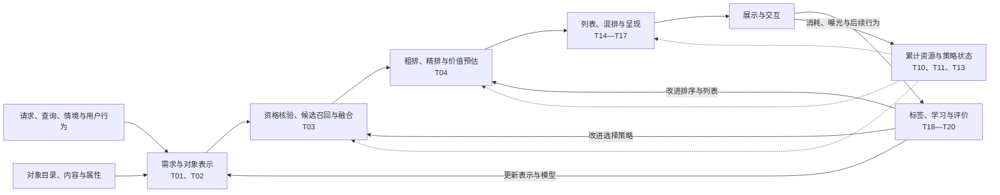
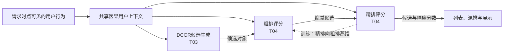

# 搜索推荐和广告的应用架构与研究地图

## 架构视图与课题视图怎样配合

[研究课题](recommendation-and-search-research-topics.md)说明要解决什么问题，架构视图说明这些问题作用于哪些模块，以及一次改动怎样影响其他模块。两种视图共同用于组织正文：推荐概述介绍背景、场景、概念、研究内容、历史与前沿，并建立参考架构与代表路线，各课题再展开模块内的方法及跨模块条件。

这里的应用架构指模块职责、输入输出、决策流程和训练关系。它与某个网络内部的结构不同。模型升级可以保持应用接口不变；联合训练可以保留多个推理阶段；生成候选或整列表则可能改变模块之间的职责。比较时需要分别说明改变了什么。

## 多阶段参考架构

下面以多阶段流程作共同参照，表示请求怎样成为展示结果、反馈怎样进入后续学习。它用于定位研究问题，不表示所有平台具有相同的阶段数量或必须采用相同流程。

图中的用户历史属于T01的输入，T06则按作用对象研究需求、目录、评分及策略何时更新，以及变化后是否仍然有效。反馈闭环说明数据怎样返回各模块，章目按理解、选择和展示组织。目标权衡T09同时作用于召回配额、候选排序与整页决策。搜索查询进入需求表示、候选和相关性排序；明确条件进入核验与展示约束。广告分支还需要分配与支付，预算状态根据实际消耗调整投放参与、出价或分配，广告机制在专题中另画子流程。

拍卖与混排的先后或联合方式取决于业务机制，不能从本参考图中推出统一顺序。频次和营销感也会改变后续请求中的可选内容与目标，不仅影响最后的外观。

## 当前各模块的研究方向

| 架构模块 | 主要输出与职责 | 模块上的研究问题与方向 | 课题归属 |
| --- | --- | --- | --- |
| 需求、兴趣与对象表示 | 表达当前需求、对象属性以及两者的匹配依据 | 序列、会话与显式查询证据；SIM、TWIN、ETA、SDIM的候选相关历史，TWIN-V2与LONGER压缩，PinnerFormer窗口预测及TransAct即时行为；A-LLMRec、Recformer、HLLM语义匹配，KGAT知识关系、LATTICE多模态关系；MeLU、MetaEmb少样本适应，KAR知识补充 | T01、T02；连接T05—T07 |
| 资格核验、召回与融合 | 形成可供进一步比较的候选集合 | 邻域、潜在因子、独立编码、多兴趣及图表示；TDM树访问、PinRec生成向量后近邻访问；TIGER及可学习标识，LIGER、COBRA混合访问；搜索的稀疏、稠密与多向量入口；候选融合、资格与动态目录 | T03；连接T05、T06、T08、T12 |
| 响应预估与排序 | 给定候选，估计响应与价值并确定次序 | FM/FFM到乘积、池化、门控与异质字段计算；Wukong、RankMixer容量扩展；FinalMLP分支融合、InterFormer字段与历史融合，MTGR、OneTrans、MixFormer联合骨干；MMoE/PLE多行为预估、P5/TALLRec语言判定；IntTower粗排、HCCP一致性、OneTrans-V2及UniR²阶段共享；STAR、PEPNet场景适配，概率校准与更新 | T04；跨阶段连接T03，条件连接T09、T12、T18 |
| 列表、混排与呈现 | 决定整组内容、来源数量、位置及素材 | MMR/DPP组合差异，PRM列表上下文、Seq2Slate候选指针、NAR4Rec并行排列与OneRec目录列表；广告与自然内容交互、负载与频次，营销感，整页效用，解释与创意选择 | T14—T17；连接T09—T11、T13 |
| 跨请求资源与策略控制 | 在累计预算、机会及后续效用下调整连续决策 | 预算与曝光机会；SlateQ价值分解与Top-K REINFORCE策略采样；预算节奏和成本约束，RLB/DRLB反馈控制、DiffBid/GAVE/GUIDE生成竞价，以及策略搜索和分层执行 | T10、T11、T13；连接T08、T09、T16 |
| 数据、学习、更新与验证 | 从反馈形成训练依据，判断改变是否有效 | S3-Rec/CL4SRec/DuoRec额外训练信号；标签窗口；Propensity SVM-Rank、DLA与PAL位置纠偏，Affine Correction信任纠偏及DR-LTR残差校正；MACR反事实评分与DICE兴趣／从众分离；曝光选择与DEFER/DDFM延迟回流；日志评价、随机实验及时间泄漏；KuaiRec反馈覆盖、KuaiRand随机曝光，RecSim用户动态、AuctionNet市场交互，变化与适应验证 | T06、T18—T20；连接T03 |

冷启动、多目标、跨场景、时效性与探索是跨模块条件。例如冷启动既改变用户表示，也影响候选覆盖和排序不确定性；目标权衡既影响某次列表，也影响跨请求预算。它们保留独立课题，架构图上通过影响的模块定位。

## T01与T06的明确分工

| 课题 | 核心问题 | 主要内容与评价 |
| --- | --- | --- |
| **T01 用户行为、兴趣与当前需求建模** | 给定截至当前可见的信息，怎样判断现在需要什么？ | 行为语义、顺序与时间间隔、多兴趣、长短期组合、候选相关历史及查询与情境；比较同一请求和同一可用信息下的表示、匹配及预测质量。 |
| **T06 时效性、分布变化与在线适应** | 新行为或环境变化出现后，怎样让表示、目录和预测保持及时有效？ | 变化检测、画像与历史窗口刷新、热点和供给更新、更新频率、反馈滞后、模型适应及旧兴趣保留；比较跨时间表现、变化后的恢复、更新延迟及代价。 |

例如，一个用户有一年登山行为，当前又浏览了几次通勤背包。T01研究长历史和最近操作怎样共同决定这次推荐；T06研究新操作多久进入下一次决策、旧画像何时刷新，以及之后需求继续变化时预测是否失效。T01可以利用时间和近期行为，并非只讲静态兴趣。T06研究应用中的时间条件与更新决策，持续学习的通用算法及更新服务实现分别回指范式卷和系统卷。

长序列主要落在T01，候选相关的历史打分在T04复用；实时更新、漂移和变化后的效果在T06展开。同一论文可以关联多个课题，但必要机制只在主要位置完整解释。

## FM与FFM的明确归属

FM、FFM在本部分的主要输出是给定候选的响应得分或概率，因此主讲位置为T04“个性化排序与响应价值预估”，其中在4.3.1.1“基于特征交互的评分”完整比较FM、FFM的方法。稀疏性解释它们为什么采用交互参数共享，排序与预估解释它们在流程中做什么。[FM作者资料](https://www.libfm.org/)、[FFM原文](https://www.csie.ntu.edu.tw/~cjlin/papers/ffm.pdf)

T03研究怎样取得候选。某种FM使用方式若能分离、预计算或高效搜索相关项，也可以服务候选发现；介绍这种用法时必须说明可检索结构和代价，不能仅凭模型名称认定它属于召回。推荐矩阵分解同样按使用任务讨论：潜在因子可以用于候选检索，也可以为给定候选打分。

## 从代表工作看模块演进与架构迭代

下面按代表工作的年份建立阅读线索，同时标明变化层次。年份表示所列论文的发表或预印本时间，不表示路线起源，也不构成彼此替代的阶段。

| 代表工作与时间 | 主要改变什么 | 在架构图上怎样呈现 | 需要保留的边界 |
| --- | --- | --- | --- |
| [FM，2010](https://www.libfm.org/)、[FFM，2016](https://www.csie.ntu.edu.tw/~cjlin/papers/ffm.pdf) | 预估模块中的稀疏特征交互与参数共享 | 保留候选输入、分数输出，展开排序模块内部的方法 | 模型改变不必改变召回、排序和展示的阶段分工。 |
| [YouTube两阶段推荐，2016](https://research.google/pubs/deep-neural-networks-for-youtube-recommendations/) | 用独立候选模型与排序模型分担大规模选择 | 明确候选集合与候选分数两个接口，比较各阶段目标及成本 | 两阶段是该论文解释的结构，不将其说成所有多阶段系统的起源。 |
| [SIM，2020](https://arxiv.org/abs/2006.05639) | 在长行为历史中先找候选相关子序列，再精细建模兴趣 | 展开表示与排序内部的“历史检索—兴趣匹配”子流程 | 检索历史行为与从物品目录召回候选是两个不同对象上的任务。 |
| [P5，2022](https://arxiv.org/abs/2203.13366) | 用共享文本输入输出组织多个推荐相关任务 | 对照任务接口、表示与训练关系，而非直接删除全部应用模块 | 共享文本框架并不自动整合工业流程中的资格、预算与混排。 |
| [TIGER，2023](https://proceedings.neurips.cc/paper_files/paper/2023/hash/20dcab0f14046a5c6b02b61da9f13229-Abstract-Conference.html) | 通过生成语义标识产生物品候选 | 将候选模块中的检索接口与标识生成、目录映射接口并列比较 | 候选接口改变后，后续排序和对象资格核验仍可保留。 |
| [HSTU，2024](https://proceedings.mlr.press/v235/zhai24a.html) | 以行为序列转导组织推荐建模，研究序列计算与规模化 | 展开行为输入、预测目标及模型计算的组织变化 | 网络和训练的整合范围需具体说明，不直接推断所有应用模块被合并。 |
| [Wukong](https://proceedings.mlr.press/v235/zhang24ao.html)，ICML 2024；[InterFormer](https://arxiv.org/abs/2411.09852)，CIKM 2025 | 交互容量与分离模块的融合方式 | Wukong展开字段交互网络，InterFormer保持字段和历史模块并逐层交换摘要 | 参数更多、融合更早与评分骨干统一分别判断；候选与分数接口仍保留。 |
| [RankMixer，CIKM 2025](https://arxiv.org/abs/2507.15551) | 扩展异质字段交互的容量和实际计算 | 展开排序中的特征交互模块，历史仍由先行序列模块处理；主讲4.3.1.1.9 | 总参数、激活计算与模型时延分别比较，不能按名称当作原始序列及字段统一。 |
| [MTGR，CIKM 2025](https://arxiv.org/abs/2505.18654)、[OneTrans，WWW 2026](https://arxiv.org/abs/2510.26104)、[MixFormer，KDD 2026](https://arxiv.org/abs/2602.14110) | 共同组织字段和历史的评分计算，分别研究交叉特征保留、混合参数化及容量与长度扩展 | 仍保留候选输入、分数输出，替换评分内部的模块组织；主讲4.3.2.2 | 联合骨干不要求所有参数共享；掩码、交互位置及复用范围分别说明，不能将其直接等同跨阶段统一。 |
| [OneRec，2025预印本](https://arxiv.org/abs/2502.18965) | 尝试用统一生成模型整合召回与排序，产生推荐列表 | 在参考流程旁画“历史与情境—列表生成—核验与展示”的替代配置 | 指明整合的任务与平台证据范围；目录资格、广告支付及预算等职责仍需由完整方案处理。 |
| [OneRec-Think，ACL 2026](https://aclanthology.org/2026.acl-long.123/) | 将文字条件、理由生成与下一物品标识生成连接 | 在候选模块展开“文本与行为—理由—物品标识—目录核验”，主讲3.2.2.2；展示决定理由及对象组合怎样使用 | 下一物品与多物品列表分别定义，文字理由的可读性不证明偏好解释的因果正确性。 |
| [LIGER](https://openreview.net/pdf?id=jxdnFIsjCb)、[COBRA](https://proceedings.neurips.cc/paper_files/paper/2025/hash/86ba836d4c5dd859d795a172911745e2-Abstract-Conference.html)，2025；[PinRec](https://arxiv.org/abs/2504.10507)，KDD 2026 | 标识生成与稠密目录访问的组合 | LIGER将生成候选与新物品合并后稠密比较，COBRA生成粗标识后簇内向量访问；PinRec生成向量后近邻访问 | 混合访问不是召回、精排、竞价和展示全部统一，候选名额不是广告资金。 |
| [OneRec-V2](https://arxiv.org/abs/2508.20900)，2025技术报告；[UniR²](https://arxiv.org/abs/2607.24439)，2026预印本 | 生成上下文复用与阶段计算共享 | OneRec-V2分开长上下文处理与目标代码解码；UniR²连接生成轨迹、候选字段与多目标评分 | OneRec-V2以单目标物品预测登记；UniR²保留阶段接口，部分参数共享不等于所有梯度联合更新。 |
| [OneTrans-V2，2026年9月预印本](https://arxiv.org/abs/2609.28589) | 共享召回、粗排与精排的用户计算及联合训练，保留阶段特征和候选缩减 | 将同一用户上下文连到三个选择阶段，另画精排向粗排的训练蒸馏关系；主讲4.3.4.2.1，DCGR在3.2.2.3 | 共享骨干与逐阶段执行可以同时存在；各阶段可见信息、实际预算和资格仍需具体维护。 |

架构迭代的比较重点是：模块数量与职责是否改变，候选、分数和列表接口是否改变，多个阶段是否共享表示或联合训练，优化单位是对象还是列表，以及计算和更新成本怎样分配。端到端应具体说明整合的是训练目标、推理步骤还是最终展示决策，不能只作为性能形容词。

模块研究的比较则固定应用接口，观察表示、历史使用、交互、损失或校准怎样改善模块输出。更换FM、序列模型或语言模型时，应分别检查局部指标及最终展示效果；增加数据、历史长度或推理预算的收益也不能全部归因于架构改变。

## 联合评分与跨阶段共享的区别

评分架构研究先固定“候选输入—响应分数输出”，比较历史聚合与字段交互是否由分离模块承担。MTGR、OneTrans及MixFormer把两类计算纳入共同的层级结构；参数可以按类型共享或专属，信息流仍受可见性规则约束。大纲4.3.1建立各类信息的计算依据，4.3.2再讲完整评分器的组合与统一，这是一条概念依赖。

OneTrans-V2改变的范围更大：三个选择阶段共享用户计算与训练，但仍逐阶段缩小候选集合。下面展开这一共享关系；各阶段还接收自己的可用特征。实线表示推理中的输入输出与上下文读取，虚线仅表示训练蒸馏，不表示线上精排向粗排返回结果。

| 比较层次 | 代表方法与输入输出 | 需要核验的共享或整合范围 |
| --- | --- | --- |
| 特征交互模块 | Wukong、Hiformer、RankMixer：候选字段及已有表示→响应分数 | 字段交互、异质投影与容量；原始历史另有处理路径 |
| 分离模块融合 | FinalMLP、InterFormer：分支或字段/历史各自表示→融合响应分数 | 保留独立模块，分别比较输入门控、输出交互或逐层摘要交换 |
| 完整评分骨干 | MTGR、OneTrans、MixFormer：给定候选、字段与历史→响应分数 | 逐层交互、参数组织、掩码及用户／候选计算边界；仍需外部候选 |
| 阶段衔接与共享 | IntTower、HCCP、OneTrans-V2、UniR²：候选或共享上下文→阶段分数与候选 | 粗排计算、训练一致性、用户上下文或生成轨迹共享；保留各自的信息和参数更新边界 |
| 生成候选表示或标识 | PinRec、TIGER、COBRA、OneRec-V2：历史与条件→目录候选 | 向量访问、标识映射和混合接口分别明确，不由“生成式”推断输出是完整列表 |
| 列表生成 | OneRec：历史、目录编码及反馈→多物品标识序列 | 联合产生整组物品及偏好对齐；真实对象恢复与展示规则继续核验 |

这几层不是互斥研究方向，也不是所有系统都要经历的阶段。规模扩展分别比较参数、历史长度、激活计算与实际时延；复用计算还要保证模型版本和可见历史一致。字段与历史共用一个骨干，不自动意味着各阶段共用模型；各阶段共用模型，也不自动意味着列表与界面决策已被合并。

## 模型讲解与架构比较

模型在所属任务下设独立编号，解释输入怎样成为中间表示、分数、标识或列表，再说明输出接入哪个任务。横向比较固定任务和资源条件，纵向串联保留真实的概念依赖。SIM与TWIN改变历史证据选择，TIGER改变候选接口，OneRec改变对象列表的生成与训练组织，这些变化需分别呈现。

大纲的模型叶节承担计算、训练、使用与例子的完整讲解；本地图定位模块职责和接口变化。生成模型仍须把输出恢复为当前真实对象，序列表示仍须连接明确预测目标，列表优化仍须说明注意与选择的依据。模型、接口、条件和最终效果分别核验，不能只按模型名称推断完整流程已被替换。

## 后续章纲与论文索引

对应[十章大纲](recommendation-and-search-outline.md)的第1章“推荐概述”：研究内容借助参考架构引出理解、选择和展示，研究历史与前沿说明模块方法和架构怎样变化。第2章主讲理解，第3、4章主讲选择，第5章主讲展示；第6、7章扩展多目标、约束和长期价值，第8章检验效果。第9章搜索和第10章广告专题补充自己的输入、相关性、拍卖及预算条件。

论文阅读与登记采用“主要模块—研究问题—改动类型—输入输出变化—证据条件”几个字段。长序列、LLM4Rec等方向可以有多个模块落点，但每篇工作应标出主要改动，避免仅按模型名称聚类。详细来源和发表状态继续维护在[研究文献地图](recommendation-and-search-literature.md)。

反馈按所支持的判断与决策归位：2.1建立证据口径，2.2.1理解用户需求与行为，2.3获取和维护信息，4.3.3建立标签与可靠学习，其中4.3.3.3分析曝光与点击选择，4.3.3.4分析位置与信任，4.3.3.5分析流行度因素；5.2.5、5.3处理拒绝与测试反馈，第7章分析未来影响，第8章检验效果。需求更新、目录维护、评分变化和市场变化分别进入相应模块。呈现、营销感和频次仍在第5章集中建立，第7章复用它们分析长期影响。

章内组织通过父子层级显示关系：第2章把需求、对象与匹配归入建模，第3章在候选生成下比较接口，第4章区分预估与排序目标、评分方案，第5章在展示方案下比较决策变量。第9章按搜索循环组织，第10章按广告应用任务组织，10.3内部按嵌套控制范围展开。长序列在2.2.1服务历史理解，语言模型在1.5提供角色索引，再按用途进入任务；生成标识在3.2.2，列表生成作为5.2.1的组合求解方法。方法、接口和证据的变化分别定位到相应任务。
