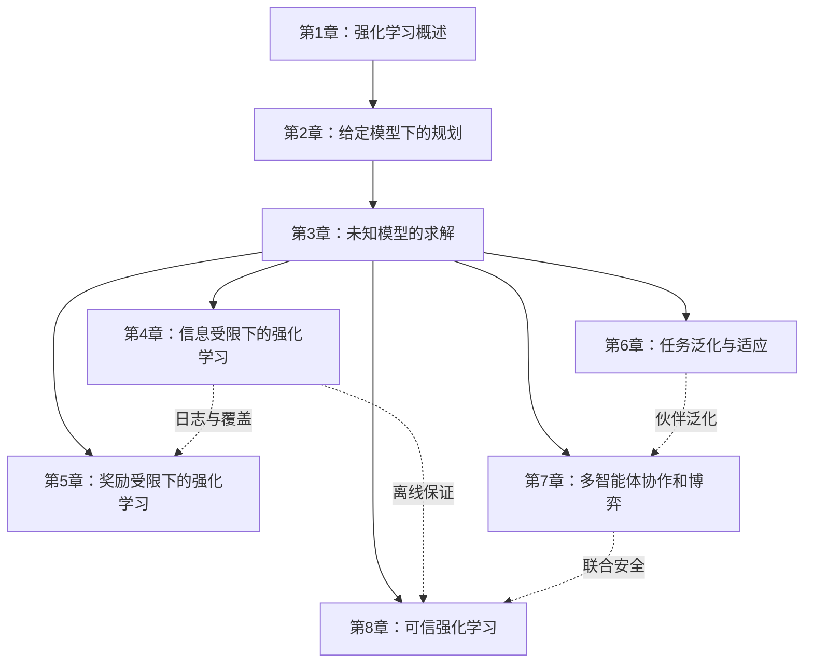
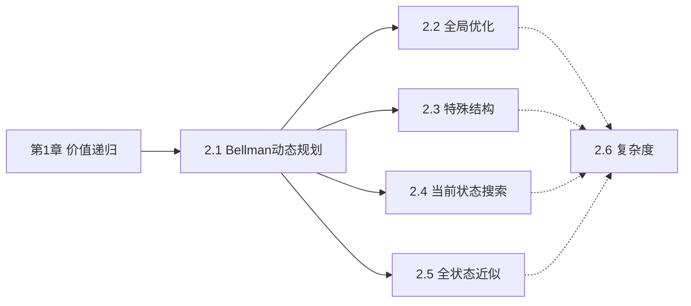
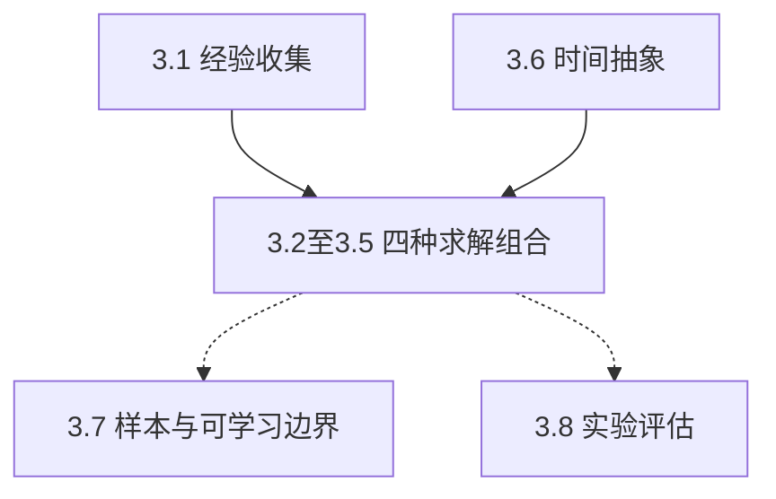
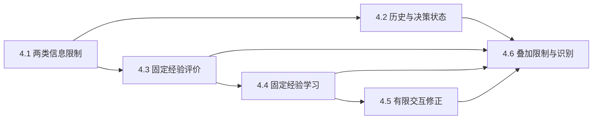
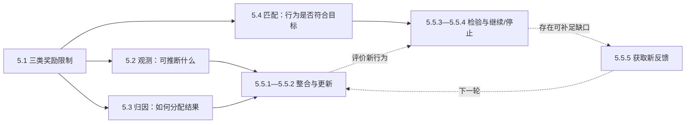
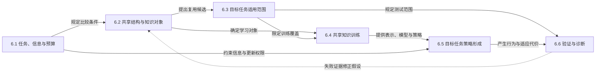
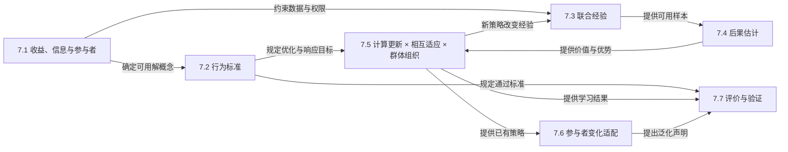
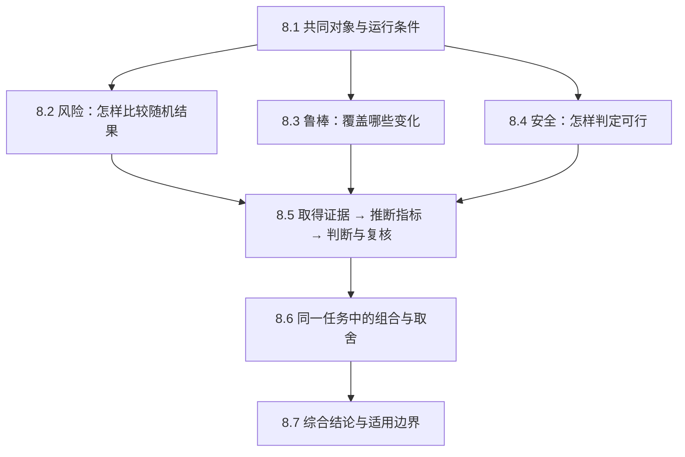

# 《强化学习》部分大纲

正文入口：`tex/04-paradigms/01-reinforcement-learning/part.tex`。当前仅有部分首页，尚未接入章节正文。以下章目与方法是后续写作规划；章、节编号用于本大纲内部定位，不表示当前 PDF 已有这些内容。

本文件规划第四卷“强化学习”部分的八章内容，细化到section及必要的subsection。各小节列出正文要回答的问题、概念铺垫、定义与推导、教学例子及图表安排，并说明章节依赖和证明深度。章次表示本部分内部顺序；正式章号由LaTeX根据出版单元生成，全集在全书范围内连续编号，单卷在当前卷内连续编号。正文归属目录为`tex/04-paradigms/01-reinforcement-learning/`，目前仅有部分入口页，尚无章节正文。

本大纲采用截至2026年10月的研究脉络。经典内容按已经形成稳定概念、算法族或理论结果的工作组织；2023年以来仍在快速变化的世界模型、生成式策略、可验证奖励和通用决策模型由第一章的“强化学习的研究历史”概括方向，并在相应问题下介绍近期进展，不把单篇预印本写成已经定型的范式。后续写作仍须逐项核验原始论文、正式发表版本和实验条件。

## 部分定位

本部分承接第二卷对学习范式、统计学习和可信性的介绍，以及第三卷对经典模型和神经网络的介绍。读者已经知道任务、模型、损失、优化、泛化和常见神经网络结构，但尚未系统学习序贯决策。全部分围绕一个问题展开：当学习者的行动会影响后续观测和可获得的数据时，怎样表示决策问题、从有限经验中估计长期后果，并在信息、反馈、任务和参与者发生变化时改进策略？

章节采用一个统一口径：第1章建立共同概念并介绍研究历史与前沿方向；第2、3章区分使用给定模型规划与从交互中学习的求解条件；第4至7章分别改变信息条件、奖励反馈、任务分布和参与者；第8章扩展风险、鲁棒性和安全要求并建立可靠性证据。

1. 第1章建立交互、策略、回报和价值等共同概念，以标准的完全可观测、单智能体、在线交互问题为基准，并介绍研究历史与前沿方向。
2. 第2章使用给定的环境模型，区分可计算精确期望与可从指定状态动作随机采样两种访问能力，讨论规划和最优控制。
3. 第3章假设环境模型未知但允许在线交互，统一讲解价值学习、策略优化、探索、函数逼近、世界模型、时间抽象和统计理论。
4. 第4章限制智能体在决策时或训练时能够取得的信息，讨论部分可观测和离线强化学习。
5. 第5章改变反馈来源，讨论奖励设计、模仿、偏好和可验证反馈。
6. 第6章把固定任务扩展为任务分布，讨论多任务、迁移、元强化和上下文适应。
7. 第7章把单个决策者扩展为多个相互影响的智能体。
8. 第8章扩展行为要求，分别研究风险准则、环境变化范围和安全约束，并统一讨论可靠性评价与保证。

应用只用于固定对象和检验算法边界。游戏、机器人、推荐、资源调度、科学发现和大模型后训练不单独设章；语言、图像及推荐与搜索的领域细节由应用卷对应部分承接。机器人、资源调度和科学发现目前没有独立的应用部分，本部分保留理解算法所需的任务接口、决策频率、动作约束和评价条件，其余领域知识作为延伸阅读。经验回放服务、分布式采样、仿真平台和部署流水线的系统实现留给系统卷。

## 章节安排

| 次序 | 章名 | 相对于标准设定改变什么 | 本章要解决的问题 |
| --- | --- | --- | --- |
| 1 | 强化学习概述 | 建立基准 | 怎样表示行动影响未来数据的学习问题？ |
| 2 | 给定模型下的规划 | 可计算精确转移期望，或从指定状态动作取得模型样本 | 怎样在不同模型访问能力下计算策略并控制规划误差？ |
| 3 | 未知模型的求解 | 转移和期望奖励未知，但可在线交互并观察奖励样本 | 怎样从交互中估计价值、探索环境并改进策略？ |
| 4 | 信息受限下的强化学习 | 状态不能完全观测，或训练时只能使用固定数据与受限交互 | 怎样在历史信息或数据覆盖不足时评价和学习策略？ |
| 5 | 奖励受限下的强化学习 | 奖励稀疏、延迟、未知或需要由示范、偏好和验证器给出 | 怎样获得并学习行为目标？ |
| 6 | 任务泛化与适应 | 单个固定任务变为任务分布 | 怎样复用经验并适应未见任务？ |
| 7 | 多智能体协作和博弈 | 单个决策者变为多个相互影响的决策者 | 怎样定义解、分配信用并实现合作或竞争？ |
| 8 | 可信强化学习 | 期望回报不足以描述失败、扰动、约束和部署要求 | 怎样使策略在不确定条件下保持可接受行为？ |

## 章节关系

| 章节 | 进入本章时已经具备的基础 | 本章建立的核心能力 | 后续承接 |
| --- | --- | --- | --- |
| 第1章 | 监督学习、概率、优化和神经网络基础 | 用MDP、策略、价值和占用度量描述序贯决策 | 为全部后续章节提供对象与符号 |
| 第2章 | 第1章的MDP和Bellman方程 | 区分精确期望与随机采样访问，通过动态规划、优化和搜索求解策略 | 为第3章提供理想算子、采样近似和规划误差基准 |
| 第3章 | 第1、2章的问题和精确求解基准 | 在模型未知但可以交互时完成评价、控制、探索、表示学习和模型学习 | 为第4至8章提供通用算法部件 |
| 第4章 | 第3章的价值、策略和模型学习方法 | 在部分观测或固定数据下判断哪些量仍可识别和估计 | 为第5章的偏好数据、第6章的任务数据和第8章的离线安全提供基础 |
| 第5章 | 第3章的策略优化和第4章的数据限制 | 从奖励、示范、偏好和验证结果中获得优化信号 | 为第8章分析奖励失效和安全后果提供入口 |
| 第6章 | 第3章的单任务学习；涉及日志与反馈时分别调用第4、5章 | 在任务分布上共享知识、推断任务并适应未见任务 | 为第7章的伙伴泛化提供基础，并解释跨任务决策的学习条件 |
| 第7章 | 第1至3章的决策与学习；部分观测和伙伴泛化分别调用第4、6章 | 在多个学习者共同影响环境时定义解并实现合作或竞争 | 为第8章的多智能体安全提供基础 |
| 第8章 | 第2、3章的规划与学习；按问题调用第4至7章 | 将风险准则、鲁棒要求和安全约束用于决策，并建立可靠性证据 | 收束本部分对行为要求与保证的讨论，并连接应用与系统卷 |

第1至3章形成主干：先定义问题，再讨论给定模型下的规划和未知环境中的交互学习。第4至8章分别改变标准设定的一个主要因素；它们在概念上大多并列，但阅读时依赖第3章提供的算法部件。研究历史与前沿方向在第1章提供整体认识，具体方法按其所解决的问题归入后续各章。

下图中，实线表示主要知识依赖，虚线表示特定专题需要调用的内容。第4至8章是从共同基础出发的问题扩展，不要求按章号完成一个算法流程；其他局部引用见上表和各章导读。

## 统一分类口径

标准强化学习问题可用状态空间$\mathcal S$、动作空间$\mathcal A$、转移核$P$、奖励函数$R$、折扣因子$\gamma$和初始分布$\rho_0$描述。实际学习还取决于观测机制、数据访问协议、任务分布和其他智能体。各章只改变其中一个主要因素：

| 因素 | 标准假设 | 扩展或限制 | 主讲位置 |
| --- | --- | --- | --- |
| 环境模型 | $P$和期望奖励已知或未知 | 已知模型规划；未知模型学习 | 第2、3章 |
| 状态与观测 | 当前状态足以决策 | 只能取得不完整或有噪声的观测 | 第4章前半 |
| 数据与交互 | 可以按当前策略继续采集经验 | 只能使用固定日志或有限批次交互 | 第4章后半 |
| 奖励与反馈 | 每步可观察标量奖励 | 奖励稀疏、未知，或由示范、偏好和验证器给出 | 第5章 |
| 任务分布 | 状态、动作、转移和奖励固定 | 目标、动力学、观测或动作空间跨任务变化 | 第6章 |
| 参与者 | 单个智能体决定动作 | 多个策略共同决定转移和奖励 | 第7章 |
| 行为要求与保证 | 期望回报足以比较策略 | 风险准则、环境变化与安全约束，以及相应的可靠性证据 | 第8章 |

观测是单步经验的一部分，但“观测不完整”和“经验获取受限”发生在不同层次。前者意味着每条轨迹记录可能不足以恢复真实状态；后者意味着训练数据固定，或只能用有限批次交互补充，因而不能任意验证新动作。两者可以组合成离线POMDP，因此第4章先分别建立二者，再讨论其交叉。

环境“未知”也不等于奖励“不可获得”。第3章假设智能体不知道期望奖励函数，但每次交互后能够观察奖励样本；第5章处理没有可信标量奖励、需要从示范或偏好推断目标的情形。第8章进一步讨论目标已经给出之后，怎样控制失败、扰动、尾部风险和约束违反。

## 写作与技术约定

- 第3章承担标准在线学习的主干，先按“学习到的环境模型是否参与策略改进”和“怎样得到最终行为”建立二维坐标，再分别讨论无模型的价值学习、无模型的策略优化、基于模型的价值学习、基于模型的策略优化。经验收集、时间抽象、可学习边界和算法评估作为四种组合的共同问题单独处理；函数逼近、深度网络与行动者—评论家放入所服务的求解环节，不再独立充当分类维度。
- 正文完整展开的方法至少说明可用信息、更新对象、目标量、数据来自哪个策略、主要计算代价和典型失效情形。比较方法沿用已经建立的共同过程，只解释关键差异；延伸阅读不要求逐篇展开。经验优势只按原论文或可靠复现实验的具体设置陈述。
- 理论结果区分有限时域、折扣回报与平均回报，区分表格、线性函数逼近和一般函数类，并写明生成模型、在线轨迹或离线数据等访问条件。
- “基于模型”表示显式使用状态转移或可供规划的预测模型；“世界模型”强调从高维观测学习潜在状态和动态。两者有包含和交叉关系，不按名称强行分成互斥类别。
- Decision Transformer、扩散策略和流模型先按条件生成模型解释，再讨论何时能够实现策略改进；不得仅因训练数据是轨迹就把监督式序列建模等同于强化学习。
- DPO直接优化偏好对上的分类式目标，不执行通常意义上的在线强化学习；正文应说明它与KL正则化奖励最大化的联系以及与RLHF训练流程的区别。
- 强化学习理论不单列为与算法平行的章。第2至8章分别给出对应设定的可解性、收敛、样本复杂度、遗憾、风险或安全保证。
- 每章末尾设置独立的“本章小结”，回答章首问题，概括成立条件和未解决边界，不逐节复述目录。

细纲中的条目是正文写作任务，不要求正文照搬为列表，也不要求每节都配置定理或插图。相邻条目一般按理解依赖展开；方法比较仍按本节明确的分类依据组织。

| 标记 | 正文需要交付的内容 |
| --- | --- |
| 【铺垫】【例】【反例】 | 给出可复核的具体情境，说明已有概念还不能解释什么；反例指出结论缺少哪项条件。教学数值与实验结果分开标明。 |
| 【定义】 | 写清对象、符号、条件和白话含义，并与最容易混淆的概念比较。 |
| 【推导】 | 从前文已经建立的式子得到目标或更新规则，解释关键等式、不等式与近似引入的位置。 |
| 【定理·完整证明】【命题·完整证明】 | 陈述假设与结论，说明证明思路，再完成关键步骤；正文不能只写“可证”。简单性质不必为了形式而升级为定理。 |
| 【证明思路】 | 明确所引结论和适用条件，展开决定结论的关键关系；较长的技术证明指向原始来源，不作为已讲解的前置知识。 |
| 【图】【流程图】 | 画出条目指定的对象和关系，解释箭头、坐标或区域的含义，并在正文说明读者应观察什么。 |
| 【表】 | 固定比较条件，明确行、列和判断标准，使读者能据此分辨对象、方法或保证。 |

章间、章内的Mermaid图用于审阅结构和安排阅读；正式书稿按项目规范改用TikZ绘制结构图、PGFPlots绘制定量曲线。图中的知识依赖、数据流、梯度流和执行顺序须分别标注，不能仅凭箭头让读者猜测。概念在首次主讲位置完整定义，后续章节简要回顾并引用；同一结果不重复证明。

## 核心推导与延伸阅读

第1至3章建立首次阅读的主线，第4至8章按问题需要展开；第1章的研究历史与前沿方向保持概述深度。以下安排决定正文需要讲到什么深度；代表工作覆盖表只用于核对资料，不据此给每篇论文分配相同篇幅。

| 位置 | 完整展开的主线 | 比较与延伸阅读 |
| --- | --- | --- |
| 第2章 | 策略评价、策略改进、价值迭代及误差界；价值与占用度量对偶；有限前瞻与采样规划 | LQR作为特殊结构的主要算例；线性可解MDP、单调结构和Gittins指数保留结构条件与结论，证明作延伸阅读 |
| 第3.1、3.7节 | 用随机老虎机解释探索代价，再用一个表格MDP的乐观探索算法说明覆盖、置信界与有限样本保证 | 其他访问协议、线性结构和一般函数类按假设与保证比较，不逐一展开完整证明 |
| 第3.2节 | 蒙特卡罗、TD、多步回报、SARSA与Q-learning；半梯度和双重采样的区别；DQN的完整更新循环 | 稳定化算法、分布价值方法及表示学习选代表机制比较，组件组合用消融证据说明 |
| 第3.3节 | REINFORCE、基线与自举优势、行动者—评论家；PPO和SAC的目标、采样与更新过程 | 自然梯度与信赖域提供推导依据；其他连续控制、分布式与无梯度方法比较适用条件和代价 |
| 第3.4至3.6节 | Dyna的真实与模拟经验循环；学习模型上的滚动规划；想象轨迹中的策略更新；Option的跨步Bellman关系 | 模型与层级算法围绕模型用途、误差控制和时间尺度比较，避免重复完整训练流程 |
| 第4章 | 信念更新与行动的信息价值；离线覆盖反例；一种重要性采样与一种价值拟合评价器；悲观价值或行为约束下的策略改进 | 模型法与条件生成法分别比较改进接口；复杂记忆架构、估计器和生成模型变种作延伸阅读 |
| 第5章 | 行为克隆到交互式专家查询；奖励可识别性；偏好模型与KL正则化优化；策略不变塑形与目标失配的区别 | 各类模仿、偏好和验证方法按反馈对象比较，多目标权衡仅保留概念入口 |
| 第6章 | 在同一任务族中区分目标变化与动力学变化；后继特征的价值分解、广义策略改进、任务推断与适应过程 | 元梯度、潜在任务推断和上下文适应各选一个主例；跨接口迁移及非平稳理论保留关键条件与比较对象 |
| 第7章 | 从小型矩阵博弈进入序贯博弈；联合价值分解、集中训练与分散执行、反事实信用、互相适应及自博弈的联系 | 不同均衡、遗憾和协作解的保证分别陈述；CFR等较长理论给出关键证明关系与原始来源 |
| 第8章 | 用同一导航任务区分风险、扰动与约束；风险和鲁棒Bellman关系、占用成本约束、安全集保持、有限证据下的失败概率界 | 复杂风险优化、屏障与预测保护方法按条件比较；序贯推断和大型系统验证作为延伸阅读 |

上述“完整展开”至少包含目标、关键推导、学习或求解过程、一个可复核算例和适用边界。进入比较内容前，应让读者能够沿已有算法完成一次更新；不同方法的比较尽量固定任务、数据访问和预算。

## 第1章 强化学习概述

本章回答“行动会改变未来结果与数据时，应怎样描述学习问题”。读者只需概率、条件期望和优化基础；贯穿算例采用含起点、终点、障碍和随机滑移的有限网格世界，推荐任务用于说明现实中的反馈闭环。第1.1至1.5节依次建立交互对象、行动规则、行为目标和长期评价，其中动作与策略、奖励与价值各有不同职责。第1.6节在这些对象上建立研究问题和评价口径，第1.7节解释历史发展与前沿方向，供后续各章定位；历史概览不承担算法推导。主线使用有限时域和折扣MDP，平均奖励、随机最短路与连续时间设定只建立必要边界。

【图】章内关系草图如下，实线表示概念依赖，虚线表示研究定位；历史与研究问题是对共同概念的两种补充。正文用TikZ重绘，不把所有节点排成算法流程。

### 1.1 强化学习的基本设定

#### 1.1.1 智能体与环境的交互

- 【例】从推荐内容改变用户后续兴趣出发，辨认行动、反馈和下一次可用信息；转入网格世界后给出一段明确的状态、动作、奖励记录，说明监督学习中固定数据的直觉为何需要扩展。
- 【定义】【图】定义智能体与环境的接口及离散时刻的事件顺序；画“可用信息—选择动作—环境转移—奖励与新信息”的闭环，箭头分别标注动作和反馈，学习器另从经验接收数据，避免把参数更新画成环境每步必有的操作。
- 区分采集经验、更新参数和部署执行的频率。说明环境可以含其他未显式建模的过程，状态与观测暂不混用；当前章以状态可见为基准，第4章才系统处理信息不完整。

#### 1.1.2 马尔可夫决策过程

- 【定义】沿网格世界逐项定义状态空间、可行动作、转移核、奖励机制和初始分布，再加入有限时域或折扣目标。区分奖励样本与期望奖励；若奖励依赖下一状态，说明如何对联合转移—奖励核取条件期望得到$R(s,a)$。
- 【例/反例】把位置作为状态时，固定滑移概率的网格可满足马尔可夫性；若门是否已经打开影响后续转移，仅记录位置便不充分。以加入门的状态补全信息，解释马尔可夫性是关于所选表示的条件独立关系。
- 【表】比较有限时域、折扣无限时域、平均奖励和随机最短路的终止机制、目标量及典型附加条件。有限时域可把剩余时间并入状态；平均奖励的极限存在性和初始状态依赖需另作假设，不能把$\gamma=1$直接代入折扣结论。

### 1.2 动作

#### 1.2.1 动作空间与可行动作

- 用网格中的方向选择建立离散动作，再以控制力、组合选择和“动作类型加连续参数”区分连续、组合与参数化动作。这里比较选择的数学形式，不把持续多步的技能另列为同一分类轴。
- 【定义】定义状态相关可行动作集合$\mathcal A(s)$及合法策略的支持条件。说明撞墙后原地不动与将撞墙动作排除是两种不同建模；固定一种用于贯穿算例。
- 【图/表】画同一网格中两个状态的合法动作箭头，并列表给出各动作形式的输出对象与约束接口。说明动作空间的定义不同于执行器噪声，也不同于第8章根据安全要求限制动作。

#### 1.2.2 动作后果与时间尺度

- 【例】给出一次向右动作的确定移动与随机滑移两种转移表，比较期望即时奖励相同但通向不同后续区域的动作，建立“动作后果需要看多步”的直觉。
- 【图】在同一条状态轨迹上画动作、奖励与决策时刻，标出一个动作的即时后果和若干步后的终点奖励；另画较低决策频率的采样时刻，说明决策间隔改变后不能机械沿用原来的转移和奖励。
- 解释控制命令、环境执行结果和持续时间分别属于什么对象。多步动作需累计期间奖励并按持续时间折扣，第3.6节用半马尔可夫过程正式处理；此处不提前引入层级算法。

### 1.3 策略

#### 1.3.1 策略及其类型

- 从“走到岔路口后再决定”区别于预先写定动作序列，引出策略是把决策时可用信息映射为动作分布的规则；定义确定性和随机策略，说明确定性策略可视为退化分布。
- 【定义】【表】以是否显式依赖时间区分平稳与非平稳策略，列出这两个维度的四种组合。用有限剩余步数改变绕行选择的例子说明非平稳策略的必要性，不把随机策略等同于非平稳策略。
- 【例/反例】在网格上画两份动作概率，比较局部随机选择与整条轨迹的随机性：即使策略确定，随机转移仍产生随机轨迹。最优确定性平稳策略的存在条件留到第2章证明。

#### 1.3.2 策略诱导的数据

- 【推导】从概率链式法则写有限轨迹的概率，标明初始分布、各步动作概率和转移概率的来源；奖励也随机时使用联合核，避免把给定期望奖励误当成确定奖励样本。
- 【定义】【推导】定义逐时状态—动作分布与归一化折扣占用度量$d^\pi(s,a)=(1-\gamma)\sum_{t\geq0}\gamma^t\mathbb P_\pi(s_t=s,a_t=a)$；用几何级数说明其总质量为1，并约定终止后吸收状态的处理。占用度量的流守恒与策略恢复留给第2.2节。
- 【图】【例】对同一网格的两种策略画访问概率热图与动作箭头，使读者看出策略变化如何改变训练分布；定义行为策略与目标策略，再用某条岔路从未被行为策略访问的例子引出离策略校正的覆盖要求。

### 1.4 奖励

#### 1.4.1 奖励与累计回报

- 【定义】区分奖励样本、条件期望奖励和累计回报，统一记经验为$(s_t,a_t,r_t,s_{t+1})$，其中$r_t$是执行$a_t$后返回、按动作时刻标记的奖励。用两条短网格路径逐项相加，展示即时奖励较大不必意味着总回报较大。
- 【推导】【表】写出有限时域回报、折扣回报与长期平均奖励，并比较时域、终止和归一化方式。平均奖励需说明采用期望时间平均还是样本路径平均，正文选定一种后保持一致。
- 【命题·完整证明】若$|r_t|\leq R_{\max}$且$0\leq\gamma<1$，折扣回报绝对值不超过$R_{\max}/(1-\gamma)$，截去前$H$步以后的尾项误差不超过$\gamma^H R_{\max}/(1-\gamma)$；证明用三角不等式和几何级数。这一界随后直接服务于第2章的截断规划。

#### 1.4.2 时间目标与奖励边界

- 【例】【图】用“较近小奖励、较远大奖励”的两条确定路径推导偏好随$\gamma$变化的交点；横轴为折扣因子，纵轴为两条路径的解析回报，明确这是教学算例而非实验曲线。
- 区分任务真正终止与采样器达到时间上限：前者由问题定义确定后续价值，后者通常仍需估计未观察的未来；如果时间上限本身就是任务规则，则应纳入状态和目标，不能一律继续自举。
- 用“到达目标”与“刷取路途中局部奖励”的分歧说明奖励编码可能偏离预期目标。奖励塑形与反馈构造交给第5章；相同期望回报下的失败概率和硬约束交给第8章，不能用一个奖励数值替代这些区别。

### 1.5 价值

#### 1.5.1 状态价值、动作价值与优势

- 从完整轨迹回报只能评价已经走过的路径，引出需要在行动前估计长期后果；【定义】给出$V^\pi$、$Q^\pi$和$A^\pi=Q^\pi-V^\pi$的条件期望，有限时域额外保留时间索引。
- 【推导】由先选动作再生成回报得到$V^\pi(s)=\sum_a\pi(a\mid s)Q^\pi(s,a)$，进而证明策略下优势的动作期望为零。解释正优势是相对于当前策略平均行为，不是相对于最优行为。
- 【图】【例】在一个网格状态画各动作的$Q$值、中心$V$值及对应优势，使用一套可手算的转移和终点奖励。改变策略后重算一个状态，说明价值属于“环境加策略”，不只是状态固有属性。

#### 1.5.2 回报的递归关系

- 【推导】把回报拆成一次奖励与折扣后的剩余回报，用条件期望的塔式法则导出状态价值和动作价值的Bellman期望关系；逐步说明在哪一步使用了马尔可夫性与固定策略。
- 【命题·完整证明】有限时域通过终端条件和反向归纳验证递推等于回报期望；折扣有界情形通过第1.4.1节的尾项界令截断长度趋于无穷。此处只证明“回报满足递推”，固定点唯一性由第2.1节补足。
- 【图】画一个状态节点到动作节点、再到随机后继状态的两层备份图，箭头分别标出策略概率和转移概率；读者应看出Bellman备份同时平均了哪两种随机性，并理解将策略平均改成动作最大化是第2章的新问题。

### 1.6 强化学习的研究内容

本节沿“研究什么、允许获得什么信息、怎样判断结论”三个并列方面定位后续内容，所用对象均来自第1.1至1.5节。

#### 1.6.1 核心研究问题

- 用网格世界的一份策略提出三个不同问题：它的长期回报是多少，是否有更好的动作，以及还需去哪里采样才能可靠回答前两者；分别落到评价、控制和探索。
- 【图】画经验、价值函数、策略、环境模型四类对象及其可能的信息流，区分预测误差、策略更新和新经验生成。信用分配、表示学习与收敛分析作为作用于这些关系的问题，避免把它们画成互斥算法家族。
- 【表】为研究问题配上输出对象和证据类型，例如价值估计对应误差，控制对应策略损失，持续交互对应遗憾。说明价值、策略和环境模型可同时存在，第3章才按主要求解接口组织方法。

#### 1.6.2 问题边界与变体

- 【表】在同一网格任务中比较在线轨迹、可任意查询状态动作的生成模型、固定日志和有限批次交互；列清能否重置、能否指定查询点、能否新增经验，说明这些能力不能互相默认。
- 把模型、观测、奖励、任务、参与者及行为要求分别当作可改变的条件，用简短例子对应第2至8章。模型未知但每步可见奖励样本，与无法获得可信奖励信号，应明确区分。
- 【例/反例】固定日志缺少一条岔路与当前看不清所在格子是两种不同的信息限制；可以同时发生，但不能用更多网络参数自动补足。将“方法适用于什么协议”确立为阅读理论和实验的第一项检查。

#### 1.6.3 评价与研究证据

- 【定义】【表】区分最终回报、到达某性能所需真实交互、训练和决策计算、随机种子间稳定性、任务外泛化及约束违反；为每一指标注明分母、预算和评价分布。
- 【例】比较相同真实交互下使用大量模型规划与较少计算的两种方案，说明“样本更省”不自动推出“总体更快”；此处设计比较协议，不预设哪一种更好。
- 列出复核结论所需的环境版本、种子、调参预算、检查点选择和测试任务；区分定理、受控消融和跨基准观察的证据强度，详细统计报告在第3.8节展开。

### 1.7 强化学习的研究历史

本节按思想来源、统一框架、规模扩展和问题范围组织历史。每个代表工作都交代其处理的困难、贡献和原始来源；历史时间不充当方法优劣或替代关系的证据。

#### 1.7.1 强化学习的思想源流

- 从“行为会因结果改变”介绍试错学习的思想，再与控制论、运筹学中按目标求解序贯决策的问题并置，区分研究对象相近与数学模型相同。
- 【图】使用三条平行时间带呈现试错学习、动态规划与时序差分预测的代表节点；仅对有来源支持的思想借鉴画连接箭头，标明节点年代和原始文献，避免画成一条前后替代链。
- 说明三条源流分别贡献行为改进、价值递归和相邻预测误差三种认识，后续现代框架如何把这些对象连接起来；不把现代术语直接回写为早期工作的原话。

#### 1.7.2 现代强化学习框架的形成

- 用第1.1至1.5节的共同语言重看MDP、蒙特卡罗、时序差分、行动者—评论家与Q-learning：说明各自使哪些未知量可由经验估计，哪些更新能推动控制。
- 【表】按原始文献列出问题设定、更新对象、数据来源和历史贡献；把模型化框架的形成与具体算法提出分开，不给尚未核验的工作宣称“首次”。
- 用一次经验同时更新预测与行动的简图收束现代闭环；算法公式只展示足以识别差别的一步，完整推导回指第3章，避免历史节变成第二套算法教程。

#### 1.7.3 函数逼近与规模扩展

- 由网格扩大到连续位置时价值表不可存储，解释线性与非线性函数逼近、近似动态规划和策略梯度的研究动机，指出跨状态共享信息既降低存储，也引入相互干扰。
- 【图】画两个状态共享同一参数、一次更新改变两处预测的关系图；对照表格中只更新一个条目的情形，让读者看到规模扩展改变了学习动力学。
- 以自举、离策略和函数逼近的稳定性困难连接第3.2.5节；这里只说明存在发散反例，反例计算留给方法节，不把函数逼近普遍描述为不收敛。

#### 1.7.4 深度强化学习的兴起

- 以DQN、深度连续控制和AlphaGo为少量代表，分别解释高维输入、连续动作和大规模搜索中的新计算需求；区分算法使用的数据、规则模型与专家信息，避免混为统一训练条件。
- 【表】将表示学习、回放、目标网络、策略优化、搜索和规模计算对应到代表系统的具体部件与作用；来源应支持所述组件，不能根据共同年份推断因果关系。
- 回顾原论文任务和资源范围内的证据，说明深度网络、稳定化措施与算力共同改变可求解规模；不将特定基准成功写成真实环境普适可靠性，后者由第8章讨论。

#### 1.7.5 研究范围的拓展

- 沿第1.6.2节的条件变化，说明部分可观测、固定数据、模仿与人类反馈、跨任务学习、多智能体和安全要求各自补上了标准设定中的哪项不足。
- 【表】建立“改变的条件—典型困难—承接章节”的对应关系，并注明这些研究长期交叉发展；本节讨论范围拓展，不假定它们都晚于深度强化学习出现。
- 用一个推荐或机器人任务说明多个限制会叠加，后续章节先分别控制变量，再在必要处讨论交叉；由已有求解能力尚无法覆盖的条件引出前沿问题。

#### 1.7.6 前沿研究方向

- **跨任务预训练与通用决策。** 先解释单任务经验难以直接复用的原因，再列待写的任务接口对齐、跨模态表示、离线预训练和新任务适应；【表】比较训练任务、可用动作与测试协议，具体方法及保证交给第6章，不以预训练规模替代泛化证据。
- **可供策略学习的世界模型。** 从预测视频不等于预测行动后果切入，说明动作条件、反事实区分、闭环滚动和真实环境验证；【图】画“数据—模型内训练或规划—真实执行—校准”的环，技术细节落到第3.4、3.5节。
- **长期交互智能体的学习。** 用多次工具调用完成一个任务说明决策粒度、记忆、外部反馈和错误恢复；区分一次语言输出、一次工具调用和完整任务的动作与回合定义。信用分配、部分观测和反馈构造分别由第3、4、5章承接，比较结果须固定工具权限和预算。
- **因果机制学习与组合泛化。** 由相关预测无法回答环境干预后的后果，引出可复用机制、干预数据和结构假设；说明观察分布相同可能对应不同反事实，后续写作只在明确可识别条件下讨论能力，不把组合泛化描述为已有无条件保证。

### 1.8 本章小结

- 用贯穿网格案例把动作、策略、轨迹分布、回报和价值连成一份完整问题说明，使读者能够辨认所优化的对象与实际获得的数据，而非再列一遍术语。
- 【表】收拢三组易混区别：环境状态与观测、奖励样本与长期价值、行为策略与目标策略；每组用一条具体判断检验是否理解，并注明对应正文入口。
- 回答章首问题：行动同时改变结果与学习证据，研究结论必须绑定目标和访问条件。第2章假定模型可查询，建立理想求解与计算边界；第3章再研究如何从未知环境中取得这些量。

## 第2章 给定模型下的规划

本章回答“已经能够查询环境后果，为何仍需要不同的求解方法”。前置知识是第1章的MDP、条件期望、价值和Bellman递归，以及线性代数与凸优化基础。精确期望访问允许直接计算转移期望；生成模型访问仅允许从指定状态动作取得独立样本，因此还存在采样误差。第2.1、2.2节分别从递推与全局优化求解同一有限折扣问题，第2.3节研究额外结构怎样简化精确解；第2.4与2.5节并列处理当前状态的搜索预算和整个状态空间的表示预算，第2.6节统一分析计算与查询代价。默认状态动作有限、奖励有界且$0\leq\gamma<1$；改变这些条件时在当地重新列明。

【图】以下实线表示方法所依赖的共同基础，虚线表示进入统一比较；两类近似规划是并列选择，均可与特殊结构组合。正式关系图使用TikZ。

### 2.1 Bellman动态规划

本节沿“评价给定策略—利用评价改进策略—直接逼近最优价值”的真实推导关系组织，为后续并列求解方式提供共同算子。

#### 2.1.1 策略评价

- 【推导】【例】将网格策略固定，写出$\bm V^\pi=\bm r^\pi+\gamma\bm P^\pi\bm V^\pi$并手算一个小型线性方程组；解释为何期望奖励向量与策略转移矩阵都已由模型和策略确定，比较直接求解和反复备份。
- 【定理·完整证明】有限折扣MDP的$T^\pi$在无穷范数下是$\gamma$压缩映射，唯一固定点是$V^\pi$，同步迭代误差至多按$\gamma^k$收缩。证明关键是随机转移矩阵的非负性与行和为1，再应用压缩映射定理。
- 【命题·完整证明】对任意有界$v$，$\lVert v-V^\pi\rVert_\infty\leq\lVert T^\pi v-v\rVert_\infty/(1-\gamma)$；由三角不等式与压缩性移项，解释残差怎样成为停止证书。异步与Gauss--Seidel更新只给条件和证明思路，明确每个状态须持续得到更新，优先级本身不是收敛保证。

#### 2.1.2 策略改进与迭代

- 从网格中的一个非最优转向解释评价的用途；【定义】定义相对于$Q^\pi$的贪心策略和允许并列最优动作的选择规则，给出完整评价与改进循环的伪代码。
- 【定理·完整证明】若$T^{\pi'}V^\pi\geq V^\pi$逐状态成立，则$V^{\pi'}\geq V^\pi$；证明用算子单调性反复备份并取极限。在有限折扣MDP中，对不改进的并列动作保留旧选择，策略迭代有限终止于最优策略；用有限确定性策略数及非终止时的严格改进完成论证。
- 【表】【例】比较精确评价、部分评价和修改策略迭代各自完成多少次评价备份、何时改策略；在同一网格追踪两轮更新。广义策略迭代表达评价与改进的相互推动，不给任意不精确交替自动赋予单调改进保证。

#### 2.1.3 价值迭代

- 【定义】【定理·完整证明】在有限折扣MDP中定义$T^*$并证明它保持单调性、具有$\gamma$压缩性；由唯一固定点和贪心策略的Bellman方程，证明固定点是$V^*$，且存在确定性平稳最优策略。
- 【推导】【命题·完整证明】给出同步价值迭代、残差停止规则和贪心策略恢复。若$\lVert v-V^*\rVert_\infty\leq\varepsilon$，由精确模型对$v$贪心得到的策略$\pi_v$满足$\lVert V^*-V^{\pi_v}\rVert_\infty\leq2\gamma\varepsilon/(1-\gamma)$；证明比较两个Bellman备份，再将后续策略价值差移到左侧。
- 【图/表】用网格热图展示价值沿迭代传播，固定奖励和初始化，不虚构经验曲线。对照有限时域的反向递推、折扣固定点迭代与平均奖励相对价值迭代；后者需要另述通信或遍历等条件，不能沿用无穷范数折扣压缩证明。

### 2.2 从动态规划到全局优化

本节把同一个控制问题分别写成价值不等式和可实现的访问流量，说明全局约束、对偶变量与策略之间的关系；线性规划表述不意味着通用求解器必然更快。

#### 2.2.1 价值的线性规划

- 从Bellman最优方程中每个动作都不能超过最优值，建立约束$v(s)\geq R(s,a)+\gamma\sum_{s'}P(s'\mid s,a)v(s')$；说明线性目标为什么要最小化价值上界，而不是任意最大化$v$。
- 【命题·完整证明】任意可行$v$逐状态满足$v\geq V^*$；取状态权重$w(s)>0$时，最小化$\sum_s w(s)v(s)$的唯一解为$V^*$。证明用$T^*$的单调迭代得到最小上界，再由权重严格为正排除任一坐标的严格多余量。
- 【例/反例】构造从初始分布不可达的独立状态，说明某些状态权重为零时目标最优仍可能留下非唯一坐标。区分初始分布下的最优目标与全状态最优价值，后者不能仅靠局部目标值相同推得。

#### 2.2.2 占用度量的线性规划

- 回到第1.3.2节的访问概率，推导归一化折扣占用度量的流守恒：每个状态的动作流出等于$(1-\gamma)\rho_0$加折扣转移流入；【图】用一个三状态网络标出初始注入、转移边和动作流量。
- 【推导】从价值线性规划构造拉格朗日函数，收集每个$v(s)$的系数得到对偶约束。说明以$\rho_0$为目标权重时，自然对偶变量是未归一化占用量；若沿用$d^\pi$，相应目标为$\sum_{s,a}d^\pi(s,a)R(s,a)/(1-\gamma)$，两种规范不能混写。
- 【命题·完整证明】有限折扣MDP中，任意非负且满足流守恒的占用量都可由按状态归一化的平稳随机策略实现；证明将流方程化为该策略的折扣状态分布方程并利用唯一性。零占用状态可任取合法动作，这不妨碍给定初始分布下的实现。

#### 2.2.3 价值与占用度量的对偶关系

- 【推导】【例】对同一个小网格求出一对价值与占用量，验证原始、对偶目标相等；说明有限折扣设定下的可行性、有界性为何允许使用线性规划强对偶。
- 【命题·完整证明】由互补松弛证明正占用的动作必须满足紧的Bellman不等式，再据动作条件分布恢复最优策略；强调初始分布未覆盖的状态不能只靠这一正占用条件证明最优。
- 【表】比较价值迭代的局部备份和线性规划的全局可行约束，展示加入累计成本约束时占用量的便利。此处只准备代数接口，第8章再定义约束MDP及随机化策略的作用。

### 2.3 特殊结构下的精确求解

本节固定模型已知、状态可见和期望目标，从价值表示、方程形式、策略形状和问题分解四个方面讨论结构；它们可以组合，并非互斥模型类别。

#### 2.3.1 价值函数族的封闭结构

- 【定义】以“备份之后是否仍能用同类有限参数表示”为问题，定义函数族在Bellman算子下的封闭性；用一般函数备份未必保留线性形式的例子解释封闭条件的价值。
- 【推导·完整展开】以有限时域LQR为主例，列出线性动力学、二次状态代价、正定动作代价及半正定终端代价；代入二次价值函数，配方求得线性反馈，再反向得到Riccati递推。说明状态完全可见、零均值独立加性噪声与有限二阶矩下，噪声进入常数项而不改变反馈增益。
- 【证明思路】【图】无限时域代数Riccati方程引用标准结果，列明可稳定性、可检测性及代价条件，区分任意代数解与稳定化解。画“二次终端价值—一步备份—二次价值”的闭合关系，避免把任意非线性控制也描绘为二次封闭。

#### 2.3.2 价值方程的可线性化结构

- 从上一节仍需进行非线性最优化转向“能否变换未知量”，建立被动转移分布、可选择的受控转移及KL控制代价；【定义】明确受控转移须受被动转移支持约束，KL系数严格为正。
- 【推导·完整展开】采用有限时域代价最小化约定，先通过KL非负性求出最优受控转移，再令$z=\exp(-V/\lambda)$得到线性反向递推；每一步标明符号正负与终端条件，防止奖励最大化和代价最小化混用。
- 【表】【证明思路】比较有限时域递推、终止型边值问题与满足适当条件的平均代价特征值问题；一般折扣Bellman方程不因同一指数变换自动线性化。强调方程可线性化与参数维数低、函数族封闭是不同性质。

#### 2.3.3 最优策略的单调与阈值结构

- 用库存更多时补货决策怎样变化建立直觉；【定义】在有序状态动作上解释单调策略、阈值策略和基库存策略。说明阈值是一种策略形状，并不预先给出阈值位置。
- 【命题·完整证明】在有限有序动作和成本最小化设定下，若一步优化目标关于状态与动作具有递减差分，则其适当选择的最优动作随状态单调不减；用两个状态、两个最优动作的交叉比较证明。库存中的“订货量”和“订后库存”是不同动作参数化，必须按所选变量判断单调方向。
- 【证明思路】【图】再说明哪些奖励、转移和价值保持条件能使每步Bellman目标满足上述性质，具体库存或排队模型给出一个完整条件集合。画状态横轴与最优动作纵轴的阶梯图，标注阈值由动态规划计算，不能仅凭直觉声称一般库存模型都有基库存结构。

#### 2.3.4 整体价值与策略的可分离结构

- 【命题·完整证明】有限时域或折扣问题中，若子过程转移独立、奖励可加且可行动作集合为笛卡尔积，最优价值可按子过程相加，最优动作可分别选择；证明将加性价值代入Bellman算子，使求和与独立最大化分离。
- 【例/反例】【图】画两个独立子网格及各自动作接口，再加入共享的一次只能激活一个子过程约束，展示动作耦合为何使上述直接证明失效。独立转移本身不足以推出策略可分解。
- 【定理·证明思路】对独立、非激活时冻结、无限时域折扣且每次仅激活一个臂的经典rested Markov老虎机，陈述Gittins指数最优性并解释局部停止问题如何形成指数；完整指数定理引用原始或权威来源。一般restless情形不沿用此保证；局部子问题仍可叠加前三类结构。

### 2.4 面向当前状态的有限预算下的近似规划

#### 2.4.1 有限预算下的近似规划问题

- 用只需决定网格当前位置下一步动作的情形，对比预先求出整张最优价值表；明确当前决策质量、在线延迟、模型调用次数和内存是本节的资源与输出。
- 【图】画有限前瞻树，区分动作节点与随机后继节点，标出深度截断、分支截取、边界价值和下一次采样路径。读者应看出这些是协同工作的近似部件，而非四个互斥算法。
- 列明精确转移期望与生成模型采样分别允许怎样展开节点；采样树还需控制估计误差，已知规则或可查询模型并不消除有限预算的不确定性。

#### 2.4.2 未来步数受限的搜索空间构造

- 【推导】从无限回报截断得到$H$步前瞻目标，给出“规划一段、只执行第一步、取得新状态后重规划”的滚动时域过程；自然终止和人为截断沿用第1.4.2节的区别。
- 【命题·完整证明】在有界奖励折扣问题中，零终端值的$H$步回报误差由第1.4.1节控制；若终端值相对真实剩余价值的无穷范数误差为$\varepsilon$，同一$H$步备份链将误差缩为至多$\gamma^H\varepsilon$。证明逐层使用期望或最大化的非扩张性。
- 【例/图】在含绕行捷径的网格上比较短深度和足够长深度看到的回报，把相同终端估值固定。说明重复规划有助于利用新状态，但不能无条件弥补过短时域、错误终端值或不可逆的早期动作。

#### 2.4.3 未来分支受限的搜索空间构造

- 将树宽拆成候选动作数与随机后继数；比较动作筛选和对转移期望采样，说明删除动作可能遗漏最优选择，抽样后继则是在近似保留动作的期望后果。
- 【推导】【证明思路】给出稀疏采样的递归估值与模型查询计数；在奖励有界、有限动作及可独立查询生成模型的条件下，说明集中不等式、有限树上的联合控制与递推误差如何产生高概率保证。陈述每状态代价可不显含全状态数，但仍可能对有效时域有严重依赖。
- 【图/表】画同一节点预先固定分支与渐进加宽后的两棵树，标出访问次数增加时新增的动作或后继。解释连续空间需规定提议分布、加宽率和覆盖条件，渐进加宽本身不是任意连续控制的最优性证书。

#### 2.4.4 搜索空间外的未来价值评估

- 用截断树中尚未到达终点的叶子说明不能把“未展开”当成“没有后续回报”；【定义】区分零终端值、启发式、基础策略rollout和近似价值函数各自估计的量。
- 【表】【例】固定同一批叶子，比较四种边界评估的额外模型调用、偏差来源与采样方差；rollout估计的是所选基础策略的价值，而不是自动得到最优剩余价值，示例给出可复算的短路径。
- 复用第2.4.2节的终端误差传播结论，说明加深搜索和改善叶值的资源取舍；价值网络在这里是使用接口，其训练与跨状态误差分别留到第2.5节和第3章。

#### 2.4.5 搜索预算的自适应分配

- 【图】【推导】展开一次MCTS的选择、扩展、叶值评估与回传，在网格搜索树的边上记录访问次数和平均回报；演示一次新模拟怎样改变下一次选择，而非只列四个步骤名称。
- 从不确定分支值得追加模拟引出UCT中的经验均值和探索项，区分树内采样回报随下游策略改变与独立固定分布老虎机的差别；一致性或有限样本结果注明具体树、回报和探索条件，不直接搬用UCB的全部保证。
- 【表】以AlphaZero说明已知规则、策略先验、叶值和搜索目标各起何作用，比较有无先验时的预算分配；模型学习不属于此案例的必要条件，自我对弈和对手分布的分析转交第7章。

### 2.5 面向全状态的近似规划

本节构造可跨状态复用的近似价值，表示是评价与改进共用的计算基础；评价给定策略与构造改进策略是不同任务，误差分析在末节统一收拢。

#### 2.5.1 全状态规划的挑战

- 将贯穿网格增加位置、库存等状态分量，计算价值表条目与一次全状态扫描的增长，说明模型公式简短不意味着它诱导的状态空间小。
- 【图】在“状态表示—Bellman备份—拟合价值—动作选择”关系图上标出可发生的近似，区分存储不下、期望算不准、函数拟合不准和动作最大化不精确。
- 明确本节仍可查询给定模型，重点是计算与表示；模型样本用于拟合时需要另计采样误差，模型本身从交互学习的误差留到第3章。

#### 2.5.2 跨状态近似价值的表示

- 从相邻状态价值可能相近但并不总相近切入，定义状态聚合、基函数展开和一般参数化价值，说明参数共享意味着哪些状态会被同一次更新影响。
- 【图】【例】在网格上分别画按位置距离聚合与按障碍可达性聚合的区域，用墙两侧的反例说明几何接近不必意味着价值接近。线性例子明确特征向量、参数维数和可表示函数。
- 【表】比较表示能力、参数数量、一次求值与更新成本，以及函数类之外的逼近误差；不把更灵活的函数类直接等同于更稳定的规划，后两节分别讨论它怎样参与评价与改进。

#### 2.5.3 策略的近似价值评估

- 固定同一策略和状态加权分布，区分拟合已知$V^\pi$、最小化Bellman残差和求解投影Bellman方程；【定义】写明各目标中的范数、投影空间与权重，解释它们为何一般不相同。
- 【推导】【例】在线性特征下写出投影方程的矩阵形式，给出一个低维可手算例子；比较直接解方程与“备份后投影”的迭代，注明矩阵可逆或选定解所需条件。
- 【证明思路】说明若投影与Bellman算子的复合在所选范数下保持压缩，迭代才可沿第2.1节证明收敛；一般投影不能默认在无穷范数下非扩张。原始Bellman残差若有统一上界，可复用第2.1.1节的证书；采样梯度与双重采样问题转交第3.2.5节。

#### 2.5.4 基于近似价值的策略改进

- 承接评价结果，分别写出由$v$借助模型前瞻取动作、由$q$直接比较动作的两种贪心接口；【定义】给出近似贪心误差，明确连续动作数值优化还可能引入独立误差。
- 【图/表】用共享的评价与改进节点对照近似策略迭代、近似价值迭代和修改策略迭代，边上注明每轮备份和拟合次数。最优Bellman更新把动作选择融入备份，但不等于先完成了一次精确策略评价。
- 【例/反例】在动作价值差较小的状态中加入一个可控估计扰动，展示贪心选择怎样翻转；不精确评价下不承诺每轮真实性能单调提高，性能界在下一节给出。

#### 2.5.5 误差传播与策略性能损失

- 【定义】【图】把一次近似更新写成理想Bellman备份加误差，区分表示、期望估计、优化和近似贪心误差；画误差从一次更新沿后续迭代传播的路径，避免把同一误差重复计入。
- 【命题·完整证明】若近似价值迭代每轮满足$\lVert v^{(k+1)}-T^*v^{(k)}\rVert_\infty\leq\delta$，则$\lVert v^{(k)}-V^*\rVert_\infty\leq\gamma^k\lVert v^{(0)}-V^*\rVert_\infty+\delta(1-\gamma^k)/(1-\gamma)$；证明展开一阶误差递推，再接第2.1.3节的贪心策略界。
- 【例/边界】说明加权平均误差小不意味着每个重要状态误差小；若只控制某一采样分布下的误差，还需覆盖或分布转换条件。近似策略迭代的误差传播给证明思路和来源，不把上述价值迭代公式直接套用。

### 2.6 可计算性与复杂度边界

本节统一比较求解资源，不另起算法主线；每项代价同时写明访问模型、输入表示与输出保证。

#### 2.6.1 复杂度指标与模型访问

- 【定义】【表】区分算术运行时间、存储、并行深度和模型调用；给出显式稠密表、稀疏转移表、解析动力学和生成模型的基本操作，解释一次“查询”在不同协议中的含义。
- 用同一状态动作的后继期望说明精确求和与随机样本均值的区别；前者分析计算与近似，后者还要给样本数和置信度，不能只比较迭代次数。
- 区分全状态价值、给定初始分布的策略性能和当前状态动作选择三种输出；输入位长与数值精度关系到位复杂度，后续给算术复杂度时明确采用的口径。

#### 2.6.2 全状态动态规划的计算代价

- 【推导】以状态数$n_S$、动作数$n_A$和每个状态动作平均后继数$b$计数：一次Bellman扫描为$O(n_Sn_Ab)$，稠密转移时$b=n_S$；分别列出模型存储、价值存储与策略存储。
- 用第2.1节的收缩界求达到给定价值误差所需迭代次数，展示$\gamma$接近1时的影响；直接解稠密线性系统给常规消元代价，并说明稀疏与结构化求解可能不同。
- 【表】将策略评价、策略改进、价值迭代和策略迭代的单轮成本与轮数分开。策略迭代有限终止不等于由策略总数得到的界已经是紧的多项式复杂度结论。

#### 2.6.3 时域、分支与搜索复杂度

- 【推导】明确动作分支与随机后继分支后，计算深度$H$的完整树节点数；将相同状态重复出现的树表示与可合并状态的动态规划图表示区分开。
- 【表】比较深度截断、稀疏采样、叶值近似和MCTS分别减少哪部分计算、引入什么误差、依赖什么额外条件；复用第2.4节的同一树形示例。
- 区分最坏情形界、期望模型查询数和固定预算下的经验质量；稀疏采样可以摆脱显式状态数，但不能据此宣称摆脱时域或精度代价，MCTS的选择性展开也不自动给出良好最坏界。

#### 2.6.4 计算下界

- 【例/证明思路】构造两个仅在未查询分支上不同的有限问题，解释算法若未访问该分支便不能区分哪个动作更优；把“不可区分问题对”建立为查询下界的核心思路。
- 将必须读取输入的计算代价、生成模型样本辨识代价和受限搜索代价分开；正式引用某个下界时完整列明奖励界、时域、动作规模、成功概率和误差标准，不将一种接口的下界迁移到另一接口。
- 【表】把所选下界与同条件上界并排，区分已匹配项与仍有差距的项。第3.7节处理真实交互的统计困难，本节不把未知模型探索下界当成精确转移表上的运行时间下界。

### 2.7 本章小结

- 回到已知模型的网格，说明动态规划与线性规划如何得到同一目标的解，额外结构又如何分别简化表示、方程、策略形状或分解；不把四类结构混成唯一适用算法。
- 【表】按“当前状态还是全状态、精确期望还是模型采样、可用时间与存储”归纳方法选择，列出相应误差证书。明确搜索深度、采样误差与函数逼近误差需要分别控制。
- 收束模型已知仍受计算预算制约的结论；第3章继承本章的理想算子和性能界，但还须回答数据从何而来、模型与价值如何估计，以及学习策略怎样改变未来数据。

## 第3章 未知模型的求解

本章回答“不能直接计算环境期望时，怎样利用交互经验改进策略”。读者已掌握第1章的策略、轨迹和价值，以及第2章的Bellman算子、规划与误差传播；此处新增的困难是估计未知量、主动获取数据，以及策略变化引起的数据分布变化。主线假定每步能观察马尔可夫状态和奖励样本，记经验为$(s_t,a_t,r_t,s_{t+1})$，其中$r_t$是执行$a_t$后返回的奖励。第3.2至3.5节按“学习模型是否参与策略改进”和“行为主要由价值或规划导出，还是由显式参数策略产生”形成四种组合；它们共享第3.1节的经验收集，并可分别与第3.6节的时间抽象结合。第3.7节讨论各方法能否以有限样本学会，第3.8节规定经验比较的证据。部分可观测只在世界模型案例中提示接口差异，完整处理转交第4章。

【表】章首设置四种组合表：DQN对应无模型价值学习，PPO或SAC对应无模型策略优化，Dyna-Q或MuZero对应基于模型的价值更新或规划，PILCO或Dreamer对应基于模型的策略优化；每个例子注明模型是否被查询、价值的用途及动作最终怎样产生。行动者—评论家、函数逼近和深度网络可出现在多格中，不作为第五类方法。

【图】以下箭头均表示共同作用或分析关系，不表示四种方法按序执行；虚线表示对方法施加共同分析口径。正式图用TikZ按二维表加外部共同问题重绘。

### 3.1 支持策略改进的经验收集

本节分别改变未知量、反馈条件、学习目标及动作对后续状态的影响。它们是可组合的问题维度，探索方法应按当前目标与信息条件比较。

#### 3.1.1 探索问题中的不确定性与变化维度

- 用网格某条岔路从未走过与已经走过但结果随机作对比，区分知识不足造成的不确定性和环境本身的随机性；前者可能随数据减少，后者通常不会因重复观测消失。
- 【表】固定其他条件，分别比较未知动作回报、出现上下文、奖励由对手选择、只关心最终最佳动作，以及行动影响后续状态的设定；逐行注明可观察信息、可采集样本和所需输出。
- 【定义】引入累积遗憾、最终推荐动作的simple regret、覆盖与最终策略损失的直观含义；正式公式在所需分支给出，解释“采到更多不同数据”不能脱离目标独立作为探索成功标准。

#### 3.1.2 动作回报未知：随机老虎机中的探索

- 【定义】【例】以无状态转移的有限动作、独立同分布且有界的各臂奖励建立随机老虎机；给出均值、最优臂、动作差距及累积伪遗憾，手算一次贪心选择因早期噪声而持续错选的情形。
- 【推导】【图】比较$\varepsilon$-greedy的显式随机试验、UCB的置信上界和Thompson sampling的后验采样。用三臂均值估计与区间图解释一次UCB选择，再用明确先验的伯努利例子演示一次后验更新，不把贝叶斯后验区间自动当作频率学置信区间。
- 【定理·证明思路】选一个有界随机老虎机UCB结果说明高概率均值集中、次优臂被选的必要条件和访问次数求和怎样得到遗憾界；Lai--Robbins下界注明分布族、区分信息量及一致有效策略等条件，仅解释渐近对数代价，不把其直接推广到所有非平稳环境。

#### 3.1.3 反馈条件变化：上下文与对抗老虎机

- 从同一动作在不同用户特征下效果不同，引出上下文策略；【定义】在线性期望奖励假设下写出特征、未知参数和观测噪声，解释LinUCB、OFUL与线性Thompson sampling怎样共享跨动作信息。
- 【推导】【图】对线性置信椭球画参数中心、主轴和某动作方向，说明动作不确定性为何依赖特征方向；列明特征和参数有界、噪声条件及正则化，而非仅把标量UCB换成更大网络。
- 【定义】【推导】将固定随机奖励改为对抗选择，介绍EXP3的抽样概率与重要性加权奖励估计；证明在当前奖励不依赖本轮实际抽样结果、且动作概率为正时估计条件无偏。说明对抗者的信息时序和比较基准必须明确，上下文与对抗性可同时存在，也都不等于MDP转移。

#### 3.1.4 学习目标变化：累积遗憾与最佳臂识别

- 用“试验期间也要服务用户”与“试验结束后只部署一个动作”对比累积收益和纯探索；【定义】写出simple regret与错误识别概率，说明它们不与累积遗憾等价。
- 【表】【推导】比较固定预算协议的输出推荐与固定置信度协议的停止时间，演示successive elimination如何淘汰区间已分离的候选，LUCB如何围绕当前最优与最强竞争者分配样本。
- 【证明思路】【例】在全部置信区间同时覆盖的事件上解释正确识别，再讨论差距趋近零时样本需求增长、并列最优时应改用近似最优识别。固定置信度算法需控制自适应停止下的有效性，不能直接在任意停止时套固定样本区间。

#### 3.1.5 状态随动作变化：MDP中的覆盖、可达性与长时程探索

- 【例/图】用网格的单向门与远处稀疏终点奖励说明当前动作会改变后续可达状态；画通往奖励的一串必要选择，对照老虎机每轮重新面对同一组动作的条件。
- 从不确定状态动作可能隐藏高价值出发，解释乐观价值、模型置信集合和posterior sampling for RL如何引导整段行为；区分逐步重新随机化与保持跨时间一致的探索假设，有限样本表格保证集中放第3.7.2节。
- 【表】按“估计新颖性或预测误差—产生奖励或采样偏好—改变行为”比较计数、伪计数、ICM、RND和episodic curiosity，重点展开一个计数奖励与一个预测误差例子，其他方法只解释估计对象的差异。
- 【反例】【图】用noisy-TV展示不可控噪声可持续产生预测误差；再以Go-Explore和探索性课程区分发现状态、保存可达路径与在执行扰动下复现。重置或存档恢复是额外访问能力，不能与普通单轨迹预算混比；HER的目标重标记转交第6章。

### 3.2 无模型的价值学习

本节把第2章的期望备份变为样本更新，先建立固定策略的目标与估计，再进入价值控制、函数逼近和性能分析。

#### 3.2.1 完整回报与一步自举

- 【推导】【例】在同一条终止网格轨迹上计算首次访问、每次访问蒙特卡罗目标与TD(0)的一步目标$r_t+\gamma V(s_{t+1})$，逐项指出哪些量来自实际奖励、哪些量来自当前估计。
- 【定义】【表】解释自举是用已有预测构造新的训练目标，比较蒙特卡罗等待终止、一步TD可立即更新、初始估计影响及目标偏差与方差；不把TD目标对真实价值的偏差与TD最终估计必然有偏混为一谈。
- 【定理·证明思路】表格固定策略评价在有限折扣MDP、充分访问、适当步长和有界噪声等条件下收敛，展示“期望更新对应Bellman误差—噪声受控—随机逼近”的证明结构。蒙特卡罗一致性与TD收敛依赖不同的数据条件，不为每个访问变种重复整套证明。

#### 3.2.2 多步回报、资格迹与时间信用

- 【定义】【推导】从一步目标和完整回报之间的选择引入$n$步回报，再用几何权重混合得到$\lambda$回报，明确回合末的截断和自举处理，说明$\lambda$调节的是信用传播与估计取舍。
- 【命题·完整证明】【图】在离线更新、固定参数和匹配的回合边界下，展开$\lambda$回报，交换有限求和证明前向回报视图与积累资格迹后向视图的更新总量等价；画时间轴上一次TD误差对过去状态的衰减权重。在线参数变化会破坏这种朴素等价，真实在线TD用于处理相应修正。
- 【表】比较积累迹、替换迹与真实在线TD各改变什么量及适用表示，另以RUDDER说明奖励重分配改变信用信号的位置。若声称保留原目标，必须核对总回报等价条件；重新分配信用不自动解决从未到达奖励区域的探索问题。

#### 3.2.3 离策略回报估计与校正

- 【命题·完整证明】在有限时域、共同初始分布与环境核下固定目标策略和行为策略；目标轨迹分布对行为分布绝对连续且回报可积时，轨迹概率比加权的行为策略期望等于目标策略期望。证明通过轨迹概率分解消去共同转移项，再以条件期望得到逐决策校正。
- 【例/图】在同一网格的两步轨迹上计算动作概率比乘积，并展示很少发生的大权重怎样放大方差。目标策略会选择但行为概率为零的动作无法靠加权恢复，有限时域增长亦可能使权重乘积失控。
- 【表】比较普通重要性校正、截断、Tree Backup、Retrace与V-trace的目标策略、权重形式和固定点；突出截断位置及补偿方式不同，因此不能统一声称“截断只降方差不改目标”。选择Retrace或V-trace展开一次多步更新，其余用差异表承接。

#### 3.2.4 表格与平均奖励条件下的价值控制

- 【推导】【表】从评价目标改为控制目标，逐一比较蒙特卡罗控制、SARSA、Expected SARSA和Q-learning的目标中下一动作由谁产生；使用同一转移样本演示它们学习当前行为还是贪心目标的区别。
- 【例/推导】用两个真实价值相同但估计有噪声的动作展示最大化偏差，再推导Double Q-learning将选择与评价分给两组估计；说明降低最大化偏差不意味着所有误差都被消除。
- 【定理·证明思路】列明表格折扣Q-learning收敛的有界奖励、所有状态动作无限访问和逐对Robbins--Monro步长条件（步长和发散、平方和收敛）；SARSA控制另说明GLIE等行为条件。探索起点和soft policy是促成覆盖的机制，与覆盖假设及收敛定理分开。
- 【定义】【推导】将目标切换为长期平均奖励，定义增益与差分价值，写出减去平均奖励的一步误差，并介绍差分SARSA、差分Q-learning和R-learning的更新对象。注明单链或遍历等具体假设、价值仅确定到常数及所需归一化，不暗示这些算法共用折扣Q-learning的证明。

#### 3.2.5 函数逼近下的价值学习与稳定性

- 从巨大状态表转入线性特征再到一般参数化价值；【定义】【表】在固定策略、固定采样权重下区分均方价值误差、均方Bellman误差和均方投影Bellman误差，明确真实价值、Bellman条件期望与投影分别位于公式哪里。
- 【命题·完整证明】令$\delta_\theta$为样本TD误差，$x$为Bellman条件变量，则$\mathbb E[\delta_\theta^2\mid x]=(\mathbb E[\delta_\theta\mid x])^2+\operatorname{Var}(\delta_\theta\mid x)$；以两种随机后继的可手算例子解释样本平方误差和Bellman残差平方不是同一个目标，证明用条件方差分解。
- 【推导】【图】对均方Bellman误差求完整梯度，标出“条件平均残差乘条件平均梯度”这一乘积；同一随机样本同时估计两因子通常引入相关偏差。状态价值固定$s$后独立按策略抽动作及后果，动作价值固定$(s,a)$后独立抽后果；画两条独立采样支路解释双重采样，说明确定性或特殊结构应单独判断。
- 【推导】【表】明确半梯度TD对自举目标停止求导，因而不是上述完整梯度下降；比较LSTD求投影方程、LSPI交替评价与改进、fitted Q iteration拟合备份目标。各种方法分别注明是评价还是控制、是否要求线性表示，以及对应数据分布。
- 【反例】【证明思路】完整给出Baird反例的状态、特征、行为/目标策略与期望更新矩阵，展示导致发散的方向。选择一种梯度TD方法说明辅助变量怎样估计所需期望乘积，并比较GTD、GTD2、TDC与emphatic TD的目标或权重；收敛保证注明线性、覆盖、步长和矩阵条件，不直接扩展到深度控制。

#### 3.2.6 深度价值控制的训练机制

- 【图】【推导】从表格Q-learning写出DQN的网络、回放样本、目标网络和训练损失，画在线参数与延迟目标参数的两条路径，演示一次更新；分别说明经验相关性、目标随参数移动和异常TD误差对应的计算问题。
- 【表】以Double DQN、dueling architecture、prioritized replay和NoisyNet分别解释动作选择/评价分离、状态—动作价值分解、非均匀抽样与参数探索；优先回放改变抽样分布，校正权重及其近似须交代。
- 以Rainbow与Agent57展示部件组合的实际范围，要求正文选用原论文消融和统一预算证据讨论贡献。稳定化措施不构成任意网络的收敛证明；需要历史信息的DRQN与R2D2转交第4章，避免把部分可观测困难归因于网络大小。

#### 3.2.7 回报分布与控制充分表示

- 从均值相同但波动不同的网格路径引出回报随机变量；【定义】【推导】写分布式Bellman关系，比较C51的固定支撑概率、QR-DQN的分位数和IQN的条件分位表示，展开一种投影或分位损失，其余说明表示差异。
- 【图】【边界】画两种回报分布及其相同期望，说明回报分布表达环境和策略造成的随机性，并不自动给出参数置信度。固定策略下分布算子的压缩结果需注明距离与矩条件，控制时的最大化不直接继承全部结论；风险偏好仍需第8章另定义。
- 【定义】【例】用合并两个网格状态是否保留奖励和后继等价类分布，引出MDP同态、双模拟与价值等价的不同保留要求；给出视觉相似但最佳动作不同的反例。控制充分性比重建像素相似度更直接服务于决策。
- 【表】按监督信号和希望保持的性质比较DeepMDP、CURL、SPR与DrQ，说明预测、对比和增强目标怎样影响表示，哪些是理想结构条件、哪些仅为经验训练目标；不把辅助预测存在本身归为基于模型的控制。

#### 3.2.8 价值误差与策略性能

- 【命题·完整证明】有限折扣MDP中，若$\lVert q-Q^*\rVert_\infty\leq\varepsilon$，对$q$贪心的策略$\pi_q$满足$\lVert V^*-V^{\pi_q}\rVert_\infty\leq2\varepsilon/(1-\gamma)$；证明用两次估计误差控制单步选错损失，再沿策略轨迹求和。
- 【表】与第2.1.3节的状态价值界并列，说明$q$可以直接比较动作，而$v$需要模型前瞻才得到贪心动作。相对$Q^\pi$的误差界首先支持相对当前策略的改进分析，不能偷换成相对$Q^*$的最优性能界。
- 【例/图】在网格关键岔路上集中一小块误差，展示平均误差很低仍可能明显改变行为。将表示、样本和优化误差标在同一估计流程上，说明从训练分布误差转到策略访问分布还需覆盖条件，具体样本量进入第3.7节。

### 3.3 无模型的策略优化

本节显式优化策略参数。评论家可辅助估计梯度，但不学习供控制查询的环境模型；比较围绕目标、梯度估计与更新约束展开。

#### 3.3.1 策略梯度与回报梯度估计

- 从连续动作难以逐一比较，或希望平滑改变动作概率的需求，引入参数化策略；【定义】先在有限时域、有限状态动作下定义期望回报目标，假设策略在所讨论参数邻域内可微且动作概率为正，明确环境转移不依赖策略参数。
- 【定理·完整证明】推导有限时域似然比策略梯度：对轨迹概率求导得到各时刻对数策略梯度之和，再用条件均值为零去掉过去奖励，得到reward-to-go。折扣目标保留与时间对应的外层折扣权重，不将常见实现中的采样权重默认视为同一目标的精确梯度。
- 【推导】【表】将轨迹形式整理成状态访问分布与$Q^\pi$形式的策略梯度定理，说明无限时域交换极限与求导需要可积性等条件；比较REINFORCE、确定性策略梯度和参数黑盒搜索分别需要的概率密度、动作可微性或仅回报查询。

#### 3.3.2 基线、优势与方差控制

- 【命题·完整证明】若基线在本轮动作抽样前已确定且只依赖状态或已有历史，则其与对数策略梯度乘积的条件期望为零；证明用$\sum_a\nabla_\theta\pi_\theta(a\mid s)=0$。完整回报减去不准确但满足条件的基线，不因基线误差本身产生梯度偏差。
- 【推导】【图】从回报减基线进入优势估计，再把多步TD误差按几何权重相加得到GAE；画每个TD误差对当前优势的权重，并解释$\lambda$、截断与近似价值自举各怎样影响偏差和方差。
- 【例/表】将评论家作为状态基线和作为未观察未来的替代值并排：前者满足独立条件时保持期望，后者的价值误差可改变估计目标。同批动作拟合基线、数据反复复用或省略必要权重时，需要重新检查条件，不能把理想控制变量结论无条件套到实现。

#### 3.3.3 自然梯度、信赖域与近端更新

- 【图】【推导】用同一动作分布在不同参数化下的参数位移对比，解释为何欧氏距离不等于行为变化；由KL的局部二次展开得到Fisher度量与自然梯度方向，注明奇异Fisher需在有效子空间处理或采用正则化。
- 【命题·完整证明】有限折扣MDP、相同初始分布和有界奖励下，$J(\pi')-J(\pi)=(1-\gamma)^{-1}\mathbb E_{s\sim d^{\pi'},a\sim\pi'}[A^\pi(s,a)]$，这里$d^{\pi'}$是归一化状态占用分布；沿$\pi'$轨迹将优势中的价值项折扣望远镜求和，并用有界尾项消失完成证明。
- 【推导】【证明思路】用旧策略分布替代新策略分布得到局部代理目标，解释分布差造成的误差项及KL约束的作用；对TRPO给理论界与实际近似求解的分工，兼容函数逼近说明在何条件下保留梯度方向。
- 【图/表】画PPO-Clip在正负优势下的概率比代理曲线，并比较PPO-KL；裁剪限制的是代理贡献，不是对所有状态强制KL界。区分理论单调改进、局部平稳点与特殊参数化下全局结果，不给一般神经网络PPO附加不存在的保证。

#### 3.3.4 行动者—评论家的评价—改进耦合

- 【图】把状态、策略采样、奖励、评论家误差和行动者更新画成两个共享经验的回路，箭头注明谁提供目标、谁决定新数据；说明评论家服务于策略改进，并不使算法成为价值方法之外的第三个并列目标。
- 【推导】【例】从策略梯度带基线形式得到一步行动者—评论家，再接资格迹或GAE；在两动作网格状态上手算一次评论家和行动者更新，区分评论家拟合与策略概率变化。
- 【表】【证明思路】比较A2C、A3C的同步/异步采样和更新接口，说明参数滞后会改变数据条件。双时间尺度收敛只给适用假设与证明思路，明确评论家可跟踪、步长关系和参数化条件；并行采样不自动消除估计偏差。

#### 3.3.5 连续动作、离策略与最大熵更新

- 【推导】在动作价值对动作可微等条件下解释DPG的链式梯度，写明定理中的状态占用分布，再展开DDPG如何用行动者近似连续动作优化。行为分布加权的离策略更新须说明目标与省略导数项的近似，经验回放中的梯度不默认等于原目标的精确梯度；用TD3比较双评论家取较小值、目标动作平滑和延迟行动者更新分别针对的误差。
- 【定义】【命题·完整证明】定义温度$\alpha>0$的奖励加策略熵目标；在有限动作集上证明$\max_p\{\sum_a p_a q_a+\alpha H(p)\}=\alpha\log\sum_a\exp(q_a/\alpha)$，最优分布为Boltzmann形式。证明将差值写成KL散度，为soft Bellman备份提供确切依据。
- 【推导】【图】据此展开SAC的软价值目标、重参数化行动者、双评论家和温度调节，画真实经验到评论家、再到行动者的计算路径；连续动作需说明密度、熵和归一化条件，精确表格软策略迭代结论不直接覆盖神经网络实现。
- 【表】用ACER、IMPALA、MPO与APPO比较校正权重、策略滞后和采样接口，突出它们解决的是数据复用或更新约束问题。分布式基础设施留给系统卷，本节只写会改变目标分布和算法估计的部分。

#### 3.3.6 正则化与无梯度策略搜索

- 从只追求回报可能造成过大策略变化引出熵与参考策略KL正则，明确正则项改变了什么优化目标；【推导】在离散动作分布上写出带参考分布的指数加权更新，并解释参考分布零概率会限制可达策略支持。
- 【图/表】用“旧策略—正则化局部目标—新策略”的关系说明镜像下降与控制即推断的联系，列明后者的概率模型及近似条件；这些视角帮助解释已有目标，不等于所有策略算法具有相同推断保证。
- 【推导】【例】展开一次交叉熵方法的采样、精英选择与分布拟合，再比较进化策略和CMA-ES在参数搜索分布上的更新；区分参数空间试验与每步动作随机探索。回报方差、高维参数和整轨迹评估成本是这类方法的主要比较条件。

### 3.4 基于模型的价值学习

本节从经验学习环境模型，再通过模拟更新、预测控制或搜索比较动作的长期后果。这里的价值接口既包括显式$V$或$Q$，也包括展开模型后形成的隐式动作估值；主要行为由这些估值或规划结果导出。

#### 3.4.1 环境模型的表示与不确定性

- 从网格中同一动作有多个后继状态出发，解释只预测平均下一状态可能得到不可实现的结果；【定义】区分确定性、随机、贝叶斯和集成动力学模型，以及状态、奖励与终止预测的职责。
- 【图】【表】比较显式状态模型和潜在动力学，画编码器、潜在转移、奖励预测与观测重建的输入输出；以World Models和PlaNet说明这些部件的组合。高维观测不自动等于充分状态，涉及历史推断的RSSM等机制在第4章补足信息条件。
- 【例/边界】区分一步测试误差、多步闭环误差与不确定性校准，用两条动力学相近但决策后果不同的分支说明控制要求。集成分歧是有限模型集合中的不一致，不能自动视为真实模型误差的可靠置信界。

#### 3.4.2 模型生成经验与价值更新

- 【图】【推导】展开Dyna-Q的一次真实交互、模型更新和若干次模拟Q更新；图中用实线标真实经验、虚线标模型生成经验，说明两者最终进入同一种价值更新接口。
- 【例/表】在一个未实际再次访问的网格状态上演示模型模拟如何传播已有奖励信息，对照经验回放只能重用记录的转移。模型可以组合新的状态动作预测，也因此可能生成记录中未验证的后果。
- 【推导】介绍模型价值扩展和短滚动构造多步目标，列出模型预测奖励、终端评论家和真实起点的来源；滚动更长减少终端价值依赖但增加模型误差，不能只用模型样本数量衡量新增有效信息。

#### 3.4.3 学习模型上的预测控制

- 回指第2.4节的滚动时域控制，仅增加模型来自数据这一变化；【图】在每次观测后执行“更新状态或模型—优化候选动作序列—执行首动作”的闭环，标出真实环境在哪里纠正预测。
- 【表】【推导】以PETS的模型集成与粒子传播、PlaNet的潜在规划为主要案例，比较shooting、CEM和MPPI怎样生成及加权候选轨迹；选择一种完整给出目标、动作约束、采样预算和迭代停止条件，其余复用接口解释差别。
- 用模型对墙边滑移估计错误的网格例子说明时域、终端价值与模型偏差共同影响选择；闭环重规划可利用新信息，但无法撤销已执行的危险或不可逆动作，安全条件转交第8章。

#### 3.4.4 面向搜索的模型与表示

- 从像素重建不直接说明哪步动作好切入，介绍MuZero和EfficientZero的表示、潜在动力学、奖励、策略先验与价值目标，说明模型服务于搜索所需的预测量。
- 【图】【推导】画真实历史编码、潜在动作展开和叶值备份的搜索树，并将真实轨迹监督与搜索产生的策略目标分别连到相应预测头；演示一次潜在展开怎样形成动作访问统计。
- 【表】【边界】比较可观测状态重建和价值相关预测两种模型要求；明确执行时搜索的作用以及无需完全重建观测的意义。对训练所覆盖策略的预测一致，不自动保证任意反事实动作或深度的控制充分性。

#### 3.4.5 潜在轨迹规划与价值引导

- 承接树搜索转向连续动作序列优化，以TD-MPC和TD-MPC2解释潜在动力学、奖励、价值与策略先验怎样共同缩短候选轨迹评估；不重新介绍第2章已有的有限时域目标。
- 【图】【推导】画真实起点编码后分出多条候选潜在轨迹，末端接价值预测，策略先验为候选动作提供提议；标明训练损失与执行时动作选择的不同路径，防止把策略先验误读为唯一执行器。
- 【表】在相同模型查询预算下比较树搜索、轨迹采样和价值引导各调用哪些模块、需要什么动作结构；归类依据是实际规划接口，经验优势须绑定原论文任务、训练数据和规模条件。

#### 3.4.6 模型偏差与规划边界

- 【例/图】构造训练数据很少覆盖的网格分支，模型误认为存在高回报捷径，规划器遂反复选择它；展示“优化器主动寻找模型高估区域”的model exploitation，而非只说误差随时间积累。
- 【命题·完整证明】对同一有限折扣状态动作空间及固定平稳策略，若两个模型奖励绝对值均不超过$R_{\max}$，且每个状态动作的奖励均值误差至多$\varepsilon_R$、转移分布$L^1$误差至多$\varepsilon_P$，则两个价值函数的无穷范数差不超过$\varepsilon_R/(1-\gamma)+\gamma R_{\max}\varepsilon_P/(1-\gamma)^2$。证明相减两个Bellman方程，界住一次模型误差，再利用压缩性移项；同一初始分布下的回报差由此得到相同上界。
- 【表】【边界】区分重建质量、预测一致性、反事实正确性和控制充分性；统一误差界强于测试集平均误差，从固定策略模型评价到优化后策略的可靠性还须同时控制策略会访问的区域。模型置信范围与鲁棒优化的系统处理转交第8章。

### 3.5 基于模型的策略优化

本节显式优化参数策略，模型用于计算梯度或生成训练经验。部署动作主要由更新后的策略产生，与第3.4节中依赖当前规划结果的接口区分。

#### 3.5.1 模型梯度与策略搜索

- 由固定候选动作序列的规划转向跨状态共享的参数策略，说明优化变量如何改变；【图】画策略输出进入动力学模型、后继状态再进入策略的展开图，标明模型参数和策略参数的不同梯度路径。
- 【推导】以PILCO解释概率动力学、状态分布传播和长期代价的策略梯度，展示一段短时域链式求导；列明模型可微性、分布传播近似及策略参数化，不能把模型不确定性等同于已经精确积分。
- 【表】比较可微反向传播、解析近似和黑盒策略搜索的信息需求与计算代价；指出准确预测有限训练轨迹也可能具有错误导数，模型梯度精度与第3.4节的回报预测精度不是同一条件。

#### 3.5.2 想象轨迹中的行动者—评论家

- 从昂贵真实交互引出在模型里反复训练策略，以World Models进入Dreamer系列；【定义】解释想象轨迹是由学习到的动力学生成的状态和奖励序列，需区分真实后验状态起点与模型先验滚动。
- 【图】【推导】画RSSM状态、行动者、奖励/继续概率预测与价值模型的循环，说明真实数据训练模型、想象数据训练行动者和评论家的分工；展开一段想象回报与价值目标，不把所有Dreamer版本的目标混写为同一个公式。
- 【表】【边界】比较训练时模型调用和部署时状态更新、策略执行的成本；不需要每步前瞻搜索不意味着不再使用模型状态。涉及观测历史的后验推断回指第4章，模型内高回报仍需真实环境检验。

#### 3.5.3 短模型滚动与离策略优化

- 用第3.4.2节的短模型目标对比MBPO：这里模型生成数据后，由SAC等显式行动者—评论家更新策略，说明共同的生成数据部件怎样服务于不同主要改进接口。
- 【图】【推导】画真实回放中的状态作为分支起点、短模型滚动写入模型缓冲、两类数据共同更新策略的流程；定义滚动长度、真实—模型比例和模型更新频率，并追踪一条合成经验的来源。
- 【证明思路】【表】结合模型误差与策略分布变化解释为何限制滚动长度，理论改善界必须写出所用误差度量和覆盖条件；滚动长度日程或不确定性筛选是待验证设计，不自动给出全局安全或性能保证。

#### 3.5.4 模型误差下的策略优化边界

- 【例】让策略在一个模型误差方向上不断优化，说明模型梯度或想象训练同样会主动利用预测错误；比较固定策略模型评估与“在模型内选出最佳策略”所需的保证强度。
- 【表】【图】按误差来源比较不确定性惩罚、缩短想象时域和真实数据校准，画“策略改变访问分布—补充真实数据—模型更新”的反馈环；明确这些措施分别限制哪里，并可能付出保守性或交互成本。
- 将Dreamer 4及动作条件视频模型作为延伸阅读，核对其动作接口、训练数据、部署方式和真实环境证据，再讨论模型能否支持策略训练；不以视觉逼真或开放环视频指标直接证明闭环控制可靠。

### 3.6 时间抽象下的价值与策略学习

前述方法默认每次选择原子动作，本节改变动作持续时间。Option或技能可以与四种求解组合分别结合，不构成第五类模型访问或策略改进接口。

#### 3.6.1 时间抽象解决什么问题

- 【例/图】复用有多个房间的网格，将“走到门口”标为一段可重复调用的行为，对比每步选方向与每次选一个子任务的决策点数量，说明规划深度、探索和信用分配的变化。
- 区分动作的数学形式与持续时间：连续控制力可以是原子动作，离散Option可以持续多步；时间抽象改变决策间隔，并不自动改变奖励目标或给出安全执行保证。
- 【表】列出高层选择、内部控制和终止判定各需要学习什么对象；手工子任务与学习技能是获得这些对象的不同方式，下一节先建立共同的多步备份。

#### 3.6.2 半马尔可夫决策与Options

- 【定义】由动作持续时间随机引入半马尔可夫决策过程，再定义Option的启动集、内部策略和终止规则；明确本节使用的Markov Option条件，Option之外仍可保留原子动作。
- 【推导·完整展开】若一次Option执行$K$步，其高层备份使用$\sum_{j=0}^{K-1}\gamma^j r_{t+j}+\gamma^K V(s_{t+K})$；从原始回报分组推得这一关系，解释为何不能把多步动作只折扣一次。记录须包含起点、终点、持续时间和累计折扣奖励。
- 【命题·证明思路】【例】折扣设定下，若每次持续时间$K\geq1$且几乎处处有限，Option级备份的终端价值差至多乘以$\mathbb E[\gamma^K]\leq\gamma$；证明复用期望非扩张性。讨论非终止Option的定义和目标需另作处理，并手算两个持续时间不同的路线Option。

#### 3.6.3 分层价值与策略学习

- 【图】【表】以同一房间网格画高层任务、子目标和低层动作接口，比较Feudal RL、MAXQ、Option-Critic、HIRO与HAC中哪些结构由人指定、哪些从数据学习；先明确各层观测、目标、动作和奖励。
- 【推导】选择Option-Critic展开高层Option价值、内部策略和终止概率的学习关系，其余方法围绕任务分解、目标条件控制与离策略校正的差异比较；低层策略变化会改变高层动作的实际含义，需说明重标记或校正的依据。
- 【例/边界】展示一个不合适子目标排除最优路径的网格例子，区分给定层级下最优与原始MDP全局最优；层级可以降低搜索深度，也可能增加非平稳性和探索困难。

#### 3.6.4 技能发现与下游复用

- 从手工指定“到门口”依赖任务知识转向无奖励或弱任务目标下发现行为；【定义】用“技能能否使后果可区分且可控制”解释empowerment与互信息，先说明随机技能变量、条件轨迹和判别器各是什么。
- 【推导】【表】选择一个互信息下界推导其判别式训练信号，并比较VIC、DIAYN、DADS与CIC各对状态、轨迹或动力学后果进行区分；避免把不同互信息对象写成同一损失。
- 【图/反例】在网格上画若干技能的访问区域，再展示多样但无助于穿过关键门口的技能集合，说明多样性不等于任务可解或可组合。跨任务复用的评价及适应成本交给第6章。

### 3.7 样本复杂度与可学习边界

本节讨论在访问协议和函数类已固定时，需要多少真实数据才能得到什么保证。具体算法的渐近收敛条件留在相应方法节，此处区分有限样本保证、探索效率与计算可行性。

#### 3.7.1 保证对象与数据访问模型

- 【定义】【表】分别定义输出近似最优策略的PAC目标、交互过程中的累积遗憾、simple regret、策略识别与最后迭代保证；每个量写明参照策略、概率陈述与是否允许输出随机或平均策略。
- 比较生成模型、从初始分布在线采集轨迹、单条持续轨迹和低适应轮数访问；用网格说明“指定一个状态动作查询”比“必须实际到达那里”多了什么能力。
- 【例】把同一句“样本高效”分别补成折扣、有限时域和平均奖励版本，列出状态动作规模、时域、奖励界、精度和置信度。时间步总数与回合数先换算，再比较复杂度阶，避免差一个时域因子。

#### 3.7.2 表格MDP的样本复杂度与遗憾

- 承接第3.1.5节，用已访问计数、经验模型和乐观奖励串起“对未知保持乐观—取得数据—缩小不确定性”；【表】比较E3、R-MAX的PAC目标与UCRL2、UCBVI的遗憾目标，同时注明持续任务和回合任务的条件差别。
- 【定理·证明思路】选UCBVI的一个有限时域结果为代表，完整记录有限状态动作、奖励范围、总时间步、时域和置信度及次要项；讲解高概率乐观性、误差分解、访问计数求和和方差控制四个关键环节，长证明引用原论文。
- 【图/表】用网格的访问计数与乐观价值并排展示探索如何传播；将代表上界与同协议下界比较，解释状态、动作和时域依赖来自哪些辨识难点，不给不同协议算法简单排优劣。

#### 3.7.3 结构化函数逼近的样本效率

- 从状态很多但后果具有共享结构切入；【定义】分别写出线性MDP的奖励与转移表示、线性混合MDP的已知基核与未知系数，注明概率核必须合法，二者不因都称“线性”便可互换。
- 【图】【推导】在线性特征下画经验设计矩阵如何约束未充分探索的方向，展开LSVI-UCB的反向价值拟合与置信奖励，解释自适应采样需要自归一化集中等工具。
- 【定理·证明思路】给出所选结构下的样本或遗憾结果，逐项列特征维数、有界性、模型实现条件与访问协议；说明这些结构如何支持对未见状态泛化。仅有$Q^*$可被某个线性函数表示，一般不足以自动获得该算法的探索保证。

#### 3.7.4 一般函数类的可学习条件

- 【定义】【例】由“真实值在函数类里”未必意味着每次备份仍留在类里，区分realizability与Bellman completeness；用一个小函数集合展示可实现但不封闭的情形，明确它们约束的对象不同。
- 【表】按“约束Bellman误差的因子分解、约束模型区分、约束依次辨识函数”解释Bellman rank、witness rank、eluder dimension与Bellman--Eluder dimension；先给白话对象，再给一种代表性正式定义，其余与之比较，避免一次堆满未经铺垫的量词。
- 【证明思路】【边界】选一个有限复杂度结果说明如何将探索变成逐步排除不一致候选，并注明实现性、可计算的优化或判别预言机等条件；低复杂度、低样本与高效实现分别判断，名称相近的维数不直接替换进同一界。

#### 3.7.5 统计下界与计算—统计差距

- 【例/图】画组合锁式状态链：只有连续正确动作才取得末端奖励，标出可观察状态与重置能力；解释未经限定的“指数困难”可能因状态信息或生成模型访问而改变，必须先固定访问条件。
- 【证明思路】从第2.6.4节的不可区分问题对进入统计下界，解释构造相近奖励或转移、控制观测分布差异、再转成决策错误的三步；正式下界写明成功概率、策略类和问题族，不把单一困难例子当作一般最坏界。
- 【表】区分无足够信息、存在样本有效但难求解的算法，以及计算高效但条件更强的算法；计算—统计差距需注明预言机或计算假设，渐近收敛只说明无限数据极限，不能代替有限预算评价。

### 3.8 算法评估和比较

本节将前述理论条件变为可复核的实验协议，固定任务、信息和预算后再讨论性能差别。

#### 3.8.1 数据与计算预算

- 【表】为环境步、梯度步、重放比例、模型生成样本、训练墙钟时间、参数规模和部署搜索预算分别定义计数方式；模型样本与真实交互单列，重复使用数据不能计作新的真实样本。
- 设计同一网格或连续控制任务上两种预算视角：固定真实交互比较决策质量，固定计算资源比较完成时间；将训练与部署成本分开，不提前指定胜出方法。
- 【图】规划性能—真实交互与性能—计算时间两幅共享图例的曲线，坐标、种子和预算须来自实际复现实验或注明来源；尚无数据时只给作图协议，不画预设领先曲线。

#### 3.8.2 统计报告与模型选择

- 【定义】【表】区分单次轨迹回报、一个训练种子的测试均值和多个独立训练运行的分布；明确置信区间覆盖哪个量，环境测试回合增多不能替代训练种子增多。
- 规定学习曲线、最终策略、跨任务汇总与不确定性报告；比较均值、稳健汇总和性能分布时注明归一化方式、抽样单位及依赖结构，不把多任务中的每一条记录都当作独立样本。
- 【例】对比预先约定最后检查点与根据测试分数选最好检查点，解释选择偏差；固定调参预算和验证集，说明模型选择后另作测试，避免用重复测试调出隐性优势。

#### 3.8.3 基准协议与复现边界

- 【表】以ALE、Procgen与连续控制基准比较观测、动作重复、环境随机性、训练测试分割和终止规则；只列影响算法可用信息或目标的协议项，环境版本必须可追溯。
- 【例/反例】沿用第1章终止与截断的区别，说明错误处理时间上限会改变自举目标；给出归一化分数所需的参照值与定义，跨任务平均之前检查量纲及极端值影响。
- 建立最小复现记录：代码与配置版本、数据与种子、调参预算、失败运行处理和资源条件。采样服务、重放存储与分布式平台留给系统卷，本节保留会改变数据分布和结论的算法接口。

### 3.9 本章小结

- 【图/表】回到章首四种组合，为每类标出经验更新的主要对象与最终动作来源，并加上共同的探索、函数表示和时间抽象条件；混合方法按真实信息流解释，不要求每个系统只含一种学习对象。
- 用贯穿网格总结三条相互作用的误差链：样本与覆盖影响估计，估计影响动作，动作又改变后续样本；模型方法还需检验规划或想象是否进入未验证区域。将本章证明的误差界与实际需测量的量对应起来。
- 收束未知模型求解的条件：算法形式、访问能力、函数类和预算共同决定能学到什么。第4至8章分别改变信息、反馈、任务、参与者和行为要求，复用本章部件时必须重新检查其数据条件与保证。

## 第4章 信息受限下的强化学习

本章回答：当智能体看不清当前状态，或不能自由收集新经验时，哪些决策仍然可以可靠地作出？前一种限制改变一次决策能够依据的信息，后一种限制改变学习能够获得的数据；两者不能用同一种“数据不足”概括。

**组织逻辑与阅读依赖：**第4.1节建立两个独立维度。第4.2节承接第2章的状态与Bellman关系，研究观测历史怎样成为决策依据；第4.3、4.4节暂时固定完全可观测条件，分别研究固定数据上的评价与学习，评价条件先于改进声明。第4.5节放宽新增交互权限，把学习与评价连成有限轮次的修正过程。第4.6节汇合历史表示、行为机制与数据覆盖，判断叠加限制下能作出多强的结论。第3章提供估计、优化与模型学习工具，本章重点检查这些工具的信息条件。

下图中实线箭头表示后项使用前项建立的概念或证据；它是阅读依赖图，不表示算法必须按此顺序运行。第4.2节与第4.3—4.5节是并列主线，最终在第4.6节汇合。正式配图使用TikZ。

### 4.1 两类信息限制

#### 4.1.1 决策所依据的状态信息

- 从“同一画面下是否应该选择同一动作”引出决策信息问题。沿用第1章的状态与观测，把记录写成$(o_t,a_t,r_t,o_{t+1})$，解释隐藏状态$s_t$、可见观测$o_t$及真实时间下标$t$的职责。
- 【定义】给出决策历史$h_t=(o_0,a_0,r_0,\ldots,a_{t-1},r_{t-1},o_t)$，说明历史包括动作与已观察奖励；奖励若透露隐藏状态，也属于决策信息。区分当前观测、有限窗口与完整历史。
- 【例/反例】用外观相同但速度不同的运动物体说明单帧不足、连续观测可能足够；再用较早出现的提示说明固定窗口仍可能遗漏关键线索。判断依据是动作相关的未来，而不是输入长度本身。

#### 4.1.2 学习能够访问的经验

- 区分一条记录是否包含充分信息、整批记录覆盖了哪些行为，以及训练能否主动取得新记录。用“状态记录完整但某动作从未执行”说明完整观测不能补足动作覆盖。
- 【定义】明确固定经验、有限新增交互和持续在线交互三种访问协议；分别写清可用日志、环境调用、重置权限与候选策略测试权限。用离线回放训练多少轮都不增加真实覆盖的例子解释“固定”。
- 【表】以记录字段、行为覆盖、主动采样权限、评价查询权限为列，对照同一任务的三个数据协议。指出固定数据主要限制对新行为后果的检验，不能据此断言每条记录都缺少状态。

#### 4.1.3 观测完整性与数据访问权的组合

- 【表】画出“完全/部分可观测”与“可新增交互/固定经验”的二维表，各格使用同一控制任务的不同记录和访问设置，定位在线POMDP、完全可观测离线学习与离线POMDP。
- 说明两个维度怎样组合：观测不全时仍可主动探查，数据固定时仍可完整记录状态；新增少量经验是访问轴上的放宽，不形成第三种观测类型。
- 建立阅读约定：第4.2节先处理表示与信息更新，第4.3、4.4节先处理固定经验上的评价和学习，第4.6节再检查二者同时变化后的识别条件；不把单条经验的缺失与整个数据集的缺口相互替代。

### 4.2 决策信息不完整下的强化学习

本节沿决策信息的形成过程展开：历史保留什么、怎样压缩、如何随反馈更新，以及压缩后怎样选择动作。近似表示的误差集中在节末比较，不把记忆架构与求解目标混列为不同任务。

#### 4.2.1 从当前观测扩展为观测历史

- 以两个隐藏状态产生相同当前观测、却要求相反动作的例子建立观测混叠问题；回顾第2章的马尔可夫条件，说明环境状态满足该条件并不意味着单次观测也满足。
- 【定义】给出有限POMDP的状态、动作、转移、奖励、观测及初始分布；说明观测发生在动作之前还是之后。允许把奖励与下一观测写成联合反馈，避免后续滤波无意忽略奖励提供的信息。
- 写出历史条件策略$\pi(a_t\mid h_t)$与仅看当前观测的策略，解释增加历史怎样区分原本混叠的情形；说明策略只能使用执行时可得的信息，训练日志中的特权状态不能直接当作部署输入。
- 【图】画出两条隐藏状态轨迹及其相同当前观测，并标出较早提示如何改变此刻动作；实线表示环境演化，虚线表示观测生成，让读者看出“当前相同”与“可用历史相同”的区别。

#### 4.2.2 将观测历史压缩为决策状态

- 从历史长度随时间增加引出压缩需求。【定义】信念状态$b_t(s)=\mathbb{P}(s_t=s\mid h_t)$是对当前隐藏状态的后验分布，不是另一个真实状态，也不是最可能状态的单点猜测。
- 【命题·完整证明】在已知有限POMDP、有限时域、有界奖励和完整记录历史下，精确信念足以支持最优控制。先用全概率公式说明即时奖励和下一反馈的分布由$(b_t,a_t)$决定，再由贝叶斯更新得到递推闭合，最后用反向归纳证明最优历史价值可写成信念的函数。结论针对最优控制，不声称任意依赖历史的策略在相同信念下都作相同行动。
- 对未知模型引入潜在信念与预测状态表示，解释它们分别尝试保存隐藏状态分布或可检验的未来预测；把“保存所有历史细节”与“保留当前决策所需信息”分开。
- 【表】比较对未来反馈预测充分、对给定策略价值充分、对最优控制充分三个要求，列明必须保留的量、需要覆盖的动作或策略及可能丢失的信息。用只预测当前策略回报的表示说明换策略后充分性未必保留。

#### 4.2.3 新观测到来后的决策状态更新

- 【推导】以离散反馈为例，用$y_{t+1}=(r_t,o_{t+1})$表示新反馈，定义已知联合核$K(s',y\mid s,a)$，逐步推导$b_{t+1}(s')\propto\sum_s b_t(s)K(s',y_{t+1}\mid s,a_t)$，补出归一化分母及其非零条件。再在奖励不额外提供状态信息的条件下化为常见的转移预测与观测校正形式。
- 用线性高斯设定解释Kalman滤波为何只需更新均值和协方差：写明线性动态、线性观测及高斯噪声条件，展示一次预测—校正；模型误设或非高斯后验不能沿用精确性的结论。
- 【图】对比递推记忆与历史注意力：前者由旧记忆、动作和新反馈产生新记忆，后者保留历史并重新计算表示；标清训练序列、决策输入和状态重置位置，解释为什么读取长历史仍有资源代价。
- 以DRQN、R2D2和GTrXL比较有限窗口、循环状态、注意力及外部记忆的更新接口，集中解释截断反向传播、burn-in、隐藏状态初始化和序列重放的作用；长上下文与较低预测损失都不是充分性的证明。

#### 4.2.4 基于决策状态的策略求解与动作选择

- 【推导】把精确信念作为belief MDP的状态，写出信念奖励、下一反馈分布和信念更新映射，由第2章Bellman关系得到信念空间备份；解释对未来反馈求期望为何必须位于未来价值之外。
- 【例】用Tiger问题完整演示“倾听—更新信念—开门”：给定先验、听觉准确率、倾听成本和两种开门后果，计算一次后验与两类行动的期望回报。数值明确作为教学设定；即使模型已知，辨认当前状态仍可能有价值。
- 说明有限状态控制器以有限记忆节点近似历史策略，点基值迭代只在选定信念上近似价值；比较二者近似的是策略记忆还是信念空间价值，不重复第2章的完整规划推导。
- 【例/反例】对照直接使用最可能状态的控制与信念决策，指出前者可能放弃有价值的信息收集。LQG分离原则仅在相应线性、高斯、二次成本等条件下介绍，不推广为一般POMDP的估计—控制分离。
- 模型未知时，把循环价值学习、循环行动者—评论家和潜在模型分别接回第3章的评价、优化与规划接口；明确哪些量由数据学习，哪些信息足够性条件只是近似假设。

#### 4.2.5 近似决策状态的误差与计算边界

- 【表】以历史保留范围、更新代价、存储代价、规划空间和充分性依据为列，对照完整历史、精确信念、有限窗口、有限状态控制器及学习型记忆；复杂度注明状态规模、窗口长度等自变量。
- 沿“截断或压缩—未来预测/价值差异—动作选择变化”追踪误差，区分表示遗漏、隐藏状态初始化错误、模型估计误差与优化未收敛；不把统一训练损失直接当作策略损失。
- 【例/反例】沿用早期提示任务，比较有无提示记忆时的最优动作和回报，说明误差可以来自表示本身，而非训练不充分；再说明只为某个奖励任务充分的表示未必支持新的目标。
- 收拢计算边界：充分统计量存在不等于维度小、更新容易或能够高效规划；本节只说明由信息表示引出的代价，通用样本复杂度回指第3.7节。

### 4.3 固定经验下的策略评价与选择

本节固定待评价策略，依次回答日志来自哪里、目标价值是否可识别、怎样估计以及如何据此选择。第4.4节产生的新策略也必须接受同样的证据检查；训练目标上升不能替代评价。

#### 4.3.1 固定经验与行为策略

- 【定义】给出日志数据、行为策略$b$与目标策略$\pi$，说明单一行为策略、已知混合策略和随时间改变的收集策略怎样影响动作概率记录。区分真实记录的概率与事后拟合的行为概率。
- 【表】列出状态、动作、奖励、终止/截断、轨迹标识及行为概率字段，写明各字段分别支撑哪一项评价步骤；说明终止与时间截断混淆会改变回报和自举目标。
- 比较独立回合与一条相关长轨迹所能支持的统计处理，说明轨迹内样本不能直接视为独立重复；数据划分应保留真实采样单位。
- 以D4RL、RL Unplugged、Minari和OGBench说明数据组成、任务目标与评价协议各自需要记录什么。仅作协议对照，不将基准分数视为普遍结论；新增环境测试转入第4.5节预算。

#### 4.3.2 策略价值的可识别性与覆盖条件

- 从“无限重复现有收集方式，是否就能知道候选策略好坏”引入可识别性。【定义】在给定数据生成规律和结构假设下，所有与可观测分布一致的环境是否给出同一目标策略价值；有限样本估计精度在此之后讨论。
- 【命题·完整证明】构造单状态、单步、两个动作的反例：行为策略只执行奖励为零的动作，另一动作在两个候选环境中分别奖励$+1$和$-1$。两环境产生完全相同日志，却对执行未见动作的策略给出不同价值及相反排序，故仅凭此日志无法识别该策略价值。
- 【定义】区分目标轨迹分布相对行为分布的绝对连续、分布比大小对应的集中程度、部分覆盖与可达性。支持非零只排除了上述绝对缺口；行为概率极小仍会使有限样本估计不可靠。
- 【表】按给定策略评价、候选排序、相对基线改进、全局最优四种结论，列出需要支持的行为范围与允许的结构假设；用日志含少量高回报轨迹但缺关键备选动作的例子说明高回报不等于充分覆盖。

#### 4.3.3 离线策略价值的估计

- 【推导】复用第3.2.3节的换测度结论，在有限时域、共同初始分布及环境核、已知行为概率和目标轨迹支持条件下，将日志上的轨迹密度比写成$\prod_t\pi(a_t\mid s_t)/b(a_t\mid s_t)$。本节重点解释字段如何提供这些概率、逐决策形式为何只需奖励发生前的比率，以及哪些日志缺失会破坏前章的条件，不重复完整证明。
- 用两步轨迹算例计算普通、自归一化及截断权重，解释方差随时域和概率比累积的原因；明确自归一化与截断一般引入有限样本偏差，估计行为概率也会改变无偏性条件。
- 【推导】展开fitted Q evaluation：固定$\pi$，由记录的$(s,a,r,s')$构造$r+\gamma\mathbb{E}_{a'\sim\pi}[Q(s',a')]$并迭代回归，再对初始状态和目标动作取期望。用下一步动作缺覆盖的例子指出拟合误差如何经自举传播。
- 【表】把重要性采样、模型评价、FQE、双重稳健估计和DICE按必需信息、拟合对象、覆盖条件及主要误差比较。双重稳健性须指明采用的估计式及其正确模型条件，DICE的占用比也不消除支持要求；不为所有变种给同一个保证。

#### 4.3.4 候选策略的比较与选择

- 区分预先固定候选与使用同一日志反复训练、挑选候选的情形；解释为什么从许多带噪声估计中挑最大值会引入选择偏差。安排训练、选择与最终报告的数据职责，并说明划分不能创造缺失覆盖。
- 【推导】在同一评价样本和共同假设下直接估计$J(\pi_1)-J(\pi_2)$，展示共享轨迹造成的协方差项；分别估计两个价值再比较区间，可能丢失共享信息。
- 【图】画出候选价值估计及性能差区间两组横向误差线，所有数值采用标明的教学数据；解释“单独区间重叠”与“性能差无法确定”并非同义。部分识别下的对应问题在第4.6.4节展开。
- 给出候选数、重复比较、置信水平和模型选择查询的报告规则；若缺少足够证据，应保留候选集合或报告无法排序，不能用估计分数的小差异代替确定结论。

### 4.4 固定经验下的策略学习与改进

本节按控制外推的位置组织：限制候选行为、限制价值估计与更新、限制学习模型上的规划。三种机制可以组合，不是互斥算法类别。每条路线都在内部说明如何形成可执行策略；Transformer、扩散和流模型属于表示或计算选择。

#### 4.4.1 策略学习的目标与数据边界

- 以行为克隆作为可复现起点，解释离线强化学习为何还希望利用奖励重新选择行为；区分拟合行为、提高估计回报、相对基线改进与逼近最优四个目标，分别指明评价对象。
- 【例/反例】在数据动作的价值估计正确、未见动作被高估的单状态例子中执行一次贪心更新，展示优化器如何主动选择估计最不可靠的动作。数据内预测误差低不足以保证优化后策略好。
- 【图】画出固定数据、学习目标、价值/行为模型/环境模型、策略提取和评价证据的关系，箭头标明“拟合”“生成动作”“评价”；在未覆盖动作处标出外推入口，让后续三种控制位置可对应到同一图。
- 统一后续比较口径：训练用了什么数据、优化哪个对象、部署如何动作、额外假设是什么；不以网络形式或能生成新动作直接断言取得改进。

#### 4.4.2 行为数据约束下的策略学习

- 【推导】用TD3+BC写出价值驱动项与行为克隆项，解释二者梯度分别鼓励提高预测价值与靠近记录行为；约束太弱可能利用外推，太强可能退化为模仿，数值尺度也影响权重含义。
- 以BCQ完整连接行为模型拟合、候选动作生成、有限扰动与价值筛选，明确最终输出哪个动作。生成模型的概率高不等于该动作后果已被充分观测，近似行为模型仍可能产生数据外动作。
- 【表】将BEAR、BRAC和ReBRAC按行为接近度的度量、约束施加位置、部署动作产生方式及强度参数比较；只展开相对前述机制发生变化的部分，不重复训练流程。
- 解释Decision Transformer如何把历史与期望回报作为条件学习动作分布，区分“给定回报条件模仿”与“显式行为距离约束”。【例/反例】在随机结果不可由动作控制的任务中，高回报轨迹条件不保证能稳定实现同样回报；目标条件的可达性须单独检验。

#### 4.4.3 价值估计与策略更新中的外推控制

- 用CQL说明为何要压低未经数据支持的高价值估计，写出Bellman拟合项与保守正则项分别作用于什么动作分布；区分特定假设下的价值下界与神经网络训练后每个动作都得到可靠下界，避免把“悲观”当作无条件证书。
- 【推导】按IQL的依赖次序展开：以数据动作的$Q$拟合状态上的上侧expectile值$V$，用$r+\gamma V(s')$更新$Q$，再以$Q-V$形成权重做行为拟合。解释expectile是非对称平方损失确定的位置，并用三个动作价值的算例计算权重；上侧动作价值选择不等于挑选随机转移中的幸运结果。
- 【表】比较直接贪心、优势加权拟合、行为模型采样后按价值选择三种策略提取接口，列出动作来源、需要查询的价值、逼近误差和覆盖风险。说明提取误差可以使价值学习的性质无法直接传递到执行策略。
- 把Diffusion-QL放在行为建模与价值驱动训练的结合处，把IDQL放在灵活行为生成与价值引导提取的接口处；画出候选动作到最终动作的局部流程，解释多模态表达改善了哪一步，以及它没有补足哪些环境数据。

#### 4.4.4 学习模型上的规划与策略优化

- 承接第3章模型学习，指出固定数据中无法随时用真实交互校正规划器发现的模型漏洞。明确环境模型预测的奖励、转移和不确定性，以及这些量在数据内外分别获得什么支撑。
- 以MOPO展开模型滚动、不确定性惩罚与策略优化的连接，说明惩罚须和预测错误建立依据才能解释为保守控制；单纯模型集成分歧小不证明未见行为预测正确。
- 【表】比较MOReL与COMBO分别如何限制可信模型区域或压低模型外推带来的价值，列出限制位置、候选轨迹来源、真实数据依赖及保守程度；沿用同一数据缺口说明各机制可能付出的性能代价。
- 以Trajectory Transformer和Diffuser解释“预测/生成轨迹—搜索或条件采样—执行首个动作—获得新观测后重规划”的动作接口。明确轨迹模型生成的经验不增加真实覆盖；本节讨论学习模型上的规划与优化，通用搜索过程回指第2、3章。

#### 4.4.5 策略改进的保证与比较

- 【命题·完整证明】在一个共同误差事件上，若对候选策略集合$\Pi$及基线中的每个$\pi\in\Pi\cup\{\pi_b\}$均有$|\widehat J(\pi)-J(\pi)|\leq\varepsilon$，且从$\Pi$中选定的策略满足$\widehat J(\pi)\geq\widehat J(\pi_b)$，则$J(\pi)\geq J(\pi_b)-2\varepsilon$。逐项插入估计值完成证明；强调关键前提是对选择后策略仍有效的共同误差事件，单个预固定策略的区间不能直接替代它。
- 用SPIBB解释数据稀少区域为何沿用基线行为、数据充分区域为何允许改进；在引用其原始性能界时明确有限MDP、奖励有界、模型置信条件、基线及容许损失项。名称中的“安全”指给定条件下相对基线的性能控制，不是每次实验必然提高回报。
- 【表】共同报告行为克隆、可复现行为策略和等预算方法的价值证据、约束强度、悲观偏差、训练与推理成本；评价入口统一回指第4.3节，区分真实测试、离线估计与理论界。
- 说明基线本身可能性能差或违反安全要求，基线相对保证不能替代全局最优和成本约束；安全约束及执行保护转交第8章，SPIBB只作为性能改进证据的例子。

### 4.5 有限新增经验下的策略修正

- 从第4.3.2节的两个不可区分环境出发，解释一次针对未见动作的真实查询如何提供原日志没有的信息；同时说明少量新样本还不能保证消除统计误差。明确每轮交互、重置、专家帮助与验证查询的权限。
- 【表】比较AWAC、IQL在线微调和Cal-QL中新旧经验混合、评论家校准、行为约束调整与探索恢复的作用；重点解释离线阶段的保守构造进入在线阶段后为何需要重新检查，不新增算法分类。
- 写出一轮可执行过程：固定本轮策略和预算、收集带版本标识的新经验、更新数据分布及学习对象、重新评价候选再决定下一轮。区分用于改进的数据与用于作最终报告的证据，反复测试也计入预算。
- 【例/反例】比较等总交互量下“一次集中收集”与“多轮自适应收集”，说明轮次改变了可利用的反馈信息；不能只用最终样本数声称访问条件相同。固定日志、有限批次与持续在线学习分别报告。

### 4.6 两类信息限制叠加时的强化学习

本节同时使用第4.2节的历史表示与第4.3节的识别问题。先约定目标结论及信息条件，再按这些条件能够支持的决策强度展开；“完全、部分、不可识别”的划分始终针对指定结论，同一数据对价值和排序可以具有不同识别程度。

#### 4.6.1 两类限制下的决策目标与可用信息

- 明确本次问题要确定策略价值、候选排序、相对基线改进还是策略类中的最优行为，固定时域、初始分布与执行时可用历史；不在推理中悄悄把一个目标换成另一个。
- 【表】把执行可用信息、日志实际字段、行为策略曾使用的信息分为三列，检查历史长度、回合边界、动作概率和额外上下文。用“专家决策时看到但日志未记录的量”引出下一节的行为机制问题。
- 【定义】在给定允许策略类下，若多个潜在模型对相关价值和动作比较给出相同结论，可视为当前问题上的决策等价；不要求给每个隐藏状态恢复唯一语义名称。
- 用同一观测日志的两个潜在解释说明：观测预测一致未必意味着干预动作后的结果一致，因此拟合日志之前就要约定希望获得哪一种决策证据。

#### 4.6.2 策略结论的可识别程度

- 分别检查历史信息、行为机制和历史—动作覆盖。历史条件保证执行输入与记录信息相符；行为机制要求动作选择只依赖记录历史，或具备足以处理未记录信息的额外识别条件；覆盖要求目标行为具有数据支持。
- 【定义】以可观测数据的总体分布及既定假设定义一致模型集合，再定义目标价值或性能差的识别集合。所有模型给同一值是点识别；非单点集合若仍支持部分决策，就报告其范围；若允许相反结论而不能回答当前决策问题，则本节称该结论不可识别。有限样本置信集合在此基础上另行构造。
- 【图】画出记录历史、未记录变量、动作和未来结果之间的依赖，分别展示普通隐藏状态及同时影响动作和结果的隐藏混杂；箭头标明因果假设。解释状态不可见并不自动造成无法校正的混杂。
- 【例/反例】保持完全相同的记录分布，改变未记录变量下的动作选择及其后果，说明只用当前观测拟合行为概率为什么可能产生错误校正；代理变量能否补足信息须说明具体结构条件，不能因有额外字段就认定可识别。

#### 4.6.3 完全可识别时的历史表示与决策学习

- 在已建立识别条件后，比较直接输入历史、显式信念、潜在状态、预测状态与序列记忆的计算取舍；循环网络、Transformer轨迹模型和环境模型各自压缩什么信息，接回第4.2节的充分性要求。
- 【推导】把第4.3.3节的概率比改写为以记录历史为条件的动作概率比，说明环境的隐藏状态不必显式出现在比率中；这一消去依赖正确的行为条件信息与共同环境核，不能直接把$h_t$替换为$o_t$。
- 在历史或充分表示上说明评价、约束学习和策略提取怎样连接，分别记录表示构造误差、行为概率估计误差、有限轨迹误差和优化误差；训练与部署的记忆初始化必须一致。
- 【例/反例】比较保留关键提示与丢弃提示的两种编码：二者可能具有相似重建误差，却产生不同决策。总体可识别只排除信息上的不可能性，不保证所选网络、数据量和优化过程已经实现该结论。

#### 4.6.4 部分可识别时的历史表示与决策学习

- 不把一种拟合成功的隐藏状态解释当作唯一真相；保留与总体信息和假设一致的候选模型，报告价值区间、敏感性曲线或候选排序集合。有限数据时，再在其外层说明统计置信范围。
- 【命题·完整证明】对同一个一致模型集合，若$\inf_M[J_M(\pi_1)-J_M(\pi_2)]>0$，则每个允许模型都支持$\pi_1$更优。用$J_M(\pi_1)=u+1$、$J_M(\pi_2)=u$、$u\in[0,10]$的教学构造说明两个单独价值区间重叠仍可确定排序；证明直接使用共同模型下的差，不能分别挑两个模型作结论。
- 将最坏情形性能、性能差下界和限制偏离已覆盖历史的策略约束放到同一决策例子中比较，说明保守程度如何影响可改进范围；鲁棒优化的系统方法转交第8章。
- 【图】画出随样本量增加收缩到非零宽度的示意识别区间，分开标注统计误差与不可消除的识别宽度；明确这是一幅解释性草图，不是任何算法的经验收敛曲线。

#### 4.6.5 不可识别时的学习边界与信息补充

- 沿第4.6.2节反例说明模型拟合成功与策略结论成立之间缺了哪一条信息条件；给出两种相容环境的相反结论，比笼统宣称“数据不够”更明确。
- 比较缩小策略类、把全局最优改为基线附近的决策、增加可核验的动力学或行为假设，分别改变了目标还是允许模型集合；未经检验的新假设不能伪装成从日志得出的事实。
- 【表】把缺口映射到可能的信息补充：较早提示缺失对应长历史，行为机制缺失对应动作概率或相关上下文，状态混叠对应新传感信息，覆盖不足对应受控交互。指出这些补充各自需要验证的识别条件。
- 允许有限交互时，分别分配状态辨识与策略验证预算，并检查新数据是否需要更新表示；若补充权限不足或新反馈仍不能区分候选环境，应保留无法判断的结论，不能靠增加网络容量越过信息边界。

### 4.7 本章小结

- 用同一任务对照完整状态与有限观测、固定日志与可新增经验，收拢两个维度各自改变了什么；历史表示解决决策依据，数据覆盖与行为机制决定哪些策略结论有证据。
- 把“可识别—可估计—可优化—可验证”连成有条件的关系：前者不自动推出后者；评价固定策略、学习新策略和从学习对象提取动作规则承担不同职责。
- 汇总应随结论报告的条件：执行信息、日志机制、覆盖范围、表示假设、查询预算与误差依据。说明部分识别时仍可作有限决策，无法识别时则需要收缩目标或补充信息。

## 第5章 奖励受限下的强化学习

本章回答：当目标无法由可靠、及时且含义正确的标量奖励直接表达时，智能体依据什么学习，又怎样检查学到的行为仍符合目标？示范、偏好和验证结果提供不同目标信息；取得这些反馈之后，还要区分结果如何归因，以及反馈是否忠实表达了行为要求。

**组织逻辑与阅读依赖：**第5.1节建立奖励观测、归因和目标匹配三个可以独立变化的维度。第5.2节研究可从替代反馈推断什么，第5.3节固定反馈语义研究怎样形成局部学习信号，第5.4节检查优化信号与期望行为的关系；三者不是依次消除的故障。第5.5节把反馈整合、模型与策略更新、独立检验和定向查询连成闭环。阅读需要第3章的策略优化、信用分配与KL正则化，以及第4章对数据覆盖和可识别性的区分；安全成本及运行干预转交第8章。

下图中实线表示前述各方面为综合问题提供知识，虚线表示第5.5节内部一轮学习完成后，根据新反馈返回更新的迭代关系；没有从第5.2节经第5.3节到第5.4节的必经串行关系。正式配图使用TikZ。

### 5.1 奖励信号的三类限制

#### 5.1.1 奖励观测受限

- 用“奖励函数尚未学会”与“根本拿不到可靠奖励样本”两个任务对照建立问题：前者属于标准未知奖励学习，后者需要从其他反馈推断目标信息。
- 【定义】说明示范记录行为，评分赋予绝对数值，偏好比较结果顺序，验证反馈判断某项条件；分别指出反馈对应动作、步骤、片段还是整条轨迹。
- 【表】以反馈对象、粒度、噪声来源、查询权限和可推断对象为列对照四类反馈。解释人类、AI、规则和执行器属于来源维度，不与示范、偏好等形式混列为互斥类别。

#### 5.1.2 奖励归因受限

- 用只有终点成绩的多步任务说明：观察到好结果仍不能直接知道哪些早期决策应该被强化；第3章已经介绍的回报与优势估计是本章的计算基础。
- 【表】区分非零奖励很少、反馈延迟长、只给轨迹总分和反馈噪声大，分别列出对探索、时间信用、局部贡献判断与估计方差的影响；允许同一任务同时占多行。
- 【例/反例】对比“始终没找到成功轨迹”与“已有成功轨迹但不能辨认关键动作”，说明增加探索与改善归因解决的是不同缺口。奖励更密集也未必提供更正确的贡献信息。

#### 5.1.3 奖励与行为目标不匹配

- 【定义】分开单步奖励、累计回报、决策者效用和希望观察到的行为；用某项容易计数的代理指标解释算法能够正确优化一个表达不完整的目标。
- 【例/反例】给出三个可组合情形：即时准确记录的代理分数遗漏真实要求，忠实表达任务成功的反馈只在终局出现，示范提供有效动作却不确定唯一奖励。用例子排除“三类限制互斥”的误解。
- 建立后续诊断入口：先判断缺的是信号、局部贡献还是目标标准，再选择对应机制；训练数值收敛不能单独回答这三个问题，独立行为评价需要在优化之前约定。

### 5.2 奖励观测受限下的强化学习

本节按可获得的反馈及其推断对象展开。示范、评分或偏好、过程或结果验证分别支持不同学习目标；来源和查询权限在每条路线中单独交代，不假定所有反馈都应先变成一个唯一奖励函数。

#### 5.2.1 替代反馈与可推断对象

- 以同一任务的示范轨迹、两条轨迹的偏好标签和结果检查为例，说明“做过什么”“更喜欢哪个”“是否满足规则”是不同信息，不能直接相互替代。
- 【定义】解释策略、状态—动作占用、价值、奖励及效用分别描述什么；沿用前章已有定义，只补反馈如何约束这些对象，不一次引入一套重复符号。
- 【表】给出反馈形式到候选推断对象的多对多关系，列出需要的额外假设、训练时是否需要环境交互和最终可输出什么；例如行为样本可直接用于策略拟合，也可在专家理性假设下约束奖励。
- 【例/反例】用相同专家动作可由多个奖励支持、相同成对排序可由多个效用函数支持的例子说明不唯一性。把固定反馈与可主动查询区分开，反馈量大不能自动替代缺失的目标信息。

#### 5.2.2 从示范直接学习策略

- 【推导】将行为克隆写成专家状态分布上的条件监督学习，明确离散动作负对数似然与连续动作回归各自拟合什么；多模态动作直接取均值可能产生从未出现的行为，专家未记录的信息则可能使相同输入对应不同动作。
- 【命题·完整证明】对有限时域$H$、单步成本在$[0,1]$内、确定性专家及共同环境，若每步专家状态分布上的动作分歧概率不超过$\varepsilon$，则用耦合与首次分歧事件的并集界，得到总额外成本不超过$H(H+1)\varepsilon/2$这一保守界。说明这是误差累积的上界机制，不是所有任务都会二次恶化。
- 展开DAgger的当前策略执行、访问状态上的专家查询、数据聚合与重新拟合，解释其修正的是训练分布而非只增加专家原有轨迹。【图】用两条轨迹画出首次偏离后新状态如何进入下轮训练，箭头分别标注执行、查询和聚合。
- 【定理·证明思路】用理想化的当前策略状态分布版本解释无遗憾归约：定义第$k$轮损失为该轮访问分布下的模仿损失，若平均遗憾至多$\varepsilon_{\mathrm{reg}}$，则至少一个迭代策略的自身分布损失不超过比较类平均最小损失加$\varepsilon_{\mathrm{reg}}$。关键是展开遗憾再取最小迭代；有限样本、专家混合执行及转成任务成本的条件另列，不能据此声称任意实现都有线性时域性能界。
- 将SEARN与AggreVaTe按需要动作标签还是代价信息作简要比较，报告交互权限、专家查询成本与执行风险；不把“可向专家查询”误写为固定示范协议已经提供的能力。

#### 5.2.3 从示范推断占用与奖励

- 从逐状态动作拟合转到长期行为匹配。【定义】回顾折扣状态—动作占用，说明它同时编码策略动作与环境可达性；匹配动作条件分布与匹配完整占用的约束不同。
- 以GAIL展开专家/策略轨迹、判别器与策略更新之间的关系，说明匹配的是访问分布；以IQ-Learn说明可以直接学习软动作价值并导出策略，不必先恢复具有唯一语义的奖励。各自明确环境交互或数据访问条件。
- 由“哪个奖励会使专家选择这些行为”进入Ng与Russell的逆强化学习，连接学徒学习的特征期望匹配与最大熵逆强化学习；解释专家最优或近似最优假设、奖励函数类及轨迹概率模型如何约束答案。
- 【表】比较直接模仿、占用匹配、软价值学习、特征期望匹配与奖励推断的观测输入、学习对象、输出和所需权限；用两个奖励都支持已见专家行为的反例结束，具体等价类及跨环境条件交第5.4.3节。

#### 5.2.4 从评分与偏好学习奖励或策略

- 由TAMER和标量评分解释绝对评价，再转向成对比较。【推导】在同一比较条件下用Bradley--Terry模型$\mathbb{P}(x\succ y)=\sigma(u(x)-u(y))$建立负对数似然，说明轨迹片段的效用如何由局部奖励汇总；比较长度、标注者差异、顺序效应与循环偏好对模型假设的影响。
- 用Deep RL from Human Preferences连接偏好收集、奖励拟合与策略更新，再分解经典RLHF中的监督微调、偏好数据、奖励模型、KL正则化优化及独立评价。【图】明确奖励模型读取完整回答、策略逐token采样、价值模型提供基线的不同粒度，避免把一个序列分数误当成每个token都获得独立监督。
- 以PPO式更新说明序列奖励、回报或优势、价值基线与参考策略KL怎样进入训练；给出长短回答在奖励聚合及KL累加下的比较，区分显式长度偏好与实现中产生的长度影响，不声称一种归一化对所有任务都正确。
- 【命题·完整证明】在固定输入、有限输出空间、参考策略处处为正且$\beta>0$时，证明$\mathbb{E}_{\pi}[r]-\beta\operatorname{KL}(\pi\Vert\pi_{\mathrm{ref}})$的最优策略满足$\pi^*\propto\pi_{\mathrm{ref}}\exp(r/\beta)$：把目标改写成常数减去$\beta\operatorname{KL}(\pi\Vert\pi^*)$，再利用KL非负性。代回同一输入的Bradley--Terry差值，展示归一化常数如何消去并得到DPO的策略概率比目标。
- 对比显式奖励模型加策略优化与DPO的训练对象、数据和采样权限；DPO直接优化离线偏好对的分类式目标，理想换元不保证有限模型类、噪声偏好和有限数据下精确恢复最优策略，也不等于通常的在线强化学习。

#### 5.2.5 从过程与结果验证构造策略更新

- 【定义】区分结果反馈与过程反馈，分别写清检验的是最终产物、某一步状态还是步骤间关系。【例/反例】最终答案偶然正确而中间推理无效，说明结果通过不能自动证明过程可靠。
- 【表】对照规则验证器、执行器、形式检查器和模型评判器，列出可检查对象、检查前提、反馈粒度与漏检方式；“可验证奖励”始终相对于具体验证规则，不等于整个行为目标都被完全验证。
- 【推导】以GRPO连接同一输入下的多次采样、组内奖励基准、相对优势及策略更新；用一组不全相等的验证得分算出相对信号，再分析整组同分时的退化和归一化处理。组内基准不等于真实价值函数，标准化后的量也不能直接宣称是无偏真实优势。
- 比较DeepSeekMath中的奖励模型反馈与DeepSeek-R1推理训练阶段的规则验证奖励，说明GRPO的更新形式与反馈来源是两个不同问题；只保留解释奖励信息和更新机制所需的内容，不将其推广为DeepSeek-R1全流程只使用规则反馈。多轮智能体任务再比较反馈落在动作、工具结果还是最终任务上；前沿定位回指第1.7.6节，具体语言模型工程留给应用卷。

#### 5.2.6 反馈来源与目标可辨识性

- 逐一收拢可推断结论：能模仿可用行为不等于恢复唯一奖励，能预测偏好不等于恢复完整效用，通过检查不等于满足未检查的要求；沿用第4章“指定目标结论再讨论识别”的顺序。
- 【表】把人类反馈、RLAIF、constitutional feedback和模型评判器按判断依据、相关偏差、可追溯性、查询成本与外部校验方式比较；AI来源和规则来源可以降低某些成本，但不会自动解决目标歧义。
- 【例/反例】构造两个反馈源一致赞同但共同遗漏关键要求的例子，说明来源一致不等于目标正确；来源分歧也可能来自不同真实偏好，不能一律当作应删除的噪声。
- 明确当前证据能够支持的任务、策略和输入范围，区分“没有唯一奖励”与“无法选择好策略”；奖励等价类和行为失配的具体诊断转交第5.4.3节。

### 5.3 奖励归因受限下的强化学习

本节固定行为目标与反馈语义，按局部学习信号的构造依据展开：从长期结果回溯、增加过程反馈、变换原奖励或引入辅助目标。它们可以组合，但对原目标的保持条件和额外信息成本不同。

#### 5.3.1 基于长期结果回溯构造局部学习信号

- 沿用同一条含关键早期动作的轨迹，说明完整回报能给早期动作提供学习信号，却可能把许多无关动作一并赋予同样结果；回指第3章多步回报、TD及优势估计，不重复其完整算法。
- 【推导】写出原轨迹回报与重分配后回报的关系，明确需要保持的是采用同一折扣约定的累计目标，不能仅比较未折扣奖励总和。用一条具体轨迹演示终局信号移向早期位置后如何调整数值。
- 解释奖励重分配如何根据结果预测或轨迹结构缩短信用路径，同时指出预测贡献只是建模依据，不能直接当作干预意义下的因果贡献；RUDDER的机制入口回指第3.2.2节。
- 【例/反例】让一个与成功高度相关但不改变结果的标记和真正关键动作同时出现，说明相关性归因可能学到捷径；检验应观察局部信号与实际任务结果，而不只看回归误差下降。

#### 5.3.2 基于过程反馈构造局部学习信号

- 对比只检查终局与在关键中间步骤检查的同一任务，说明新增过程反馈改变了可获得信息，而非仅把已有总分分摊；明确步骤边界及每个判断所覆盖的语义。
- 【图】在一条轨迹上标出人工标注、规则检查、执行记录和模型步骤评价的位置，箭头连接被评价步骤与相应策略更新；让读者看出较短反馈路径如何形成，以及哪些早期动作仍未得到直接评价。
- 【例/反例】给出各局部步骤都满足局部规则却不能完成整体任务的过程，解释步骤之间的组合条件、全局约束或最终目标仍需独立验证。
- 比较额外标注成本、步骤标准一致性和模型生成反馈的误差传播；局部信号更频繁不意味着标准更忠实，标准修订属于第5.4节，获取新过程反馈的闭环属于第5.5节。

#### 5.3.3 基于奖励变换构造局部学习信号

- 从希望给接近目标的行为提供即时信号引入奖励塑形。【定义】用与任务一致的折扣构造$F(s,a,s')=\gamma\Phi(s')-\Phi(s)$，说明$\Phi$是状态势函数，附加信号描述相邻势值的折扣差，而非随意加入启发式奖励。
- 【命题·完整证明】在无限折扣时域、$0\leq\gamma<1$、有界势函数与可积原回报下，对有限前缀逐项相消，再令末端项趋零，得到$G'=G-\Phi(s_0)$。初始分布对策略相同，因此标准期望回报的策略排序不变；这不保证学习速度或有限样本表现。随机初始状态下，势函数偏移可能改变方差或CVaR排序，第8章的风险目标须另行检查不变性。
- 【推导】有限时域使用时间相关势$\Phi_t$，展开末端项$\gamma^H\Phi_H(s_H)$；以终端势为零等足以消除此项的边界条件保持排序。对自然终止和时间截断分别说明如何处理，不把未计算的终端值默认为零。
- 【例/反例】用原回报相同但终端势不同的单步任务说明漏掉边界条件会改变排序；再用不准确却有界的势函数解释启发式差并不单独破坏不变性。比较塑形、奖励重分配与一般辅助奖励保留的量，密集信号不等于因果归因正确。

#### 5.3.4 基于辅助目标构造局部学习信号

- 区分辅助预测损失、加入回报的辅助奖励、训练课程与人为子目标分别改变表示、优化目标、训练任务分布或决策结构；不把四者都简称为奖励塑形。
- 【图】用共享表示的任务损失与辅助预测损失画出参数更新路径，再对照直接把辅助奖励加入回报的路径，标清最终策略评价仍使用原任务目标，解释两种干预位置的差别。
- 【例/反例】给出策略反复完成容易子目标却不完成主任务的例子，说明局部可优化性与最终目标一致性之间缺少何种约束；改善表示也不自动证明得到正确的动作贡献。
- 比较权重调整、课程切换和辅助信号移除后的行为，分别报告原始任务结果与辅助表现。时间抽象回指第3.6节，目标重标记和HER交第6章，避免借辅助目标重复展开其完整算法。

#### 5.3.5 奖励归因方法的误差与适用边界

- 【表】按额外反馈成本、所需轨迹信息、局部信号构造、原目标保持条件和主要失效方式，对照长期结果回溯、过程反馈、奖励变换与辅助目标四条路线；表中“保持目标”须写具体条件，不能只填是或否。
- 区分归因模型错误、有限样本误差与反馈标准错误：前者错误分配现有结果，第二类证据不充分，第三类连结果的含义都偏离目标；它们需要不同检验和补救。
- 【例】沿同一任务分别移除关键过程反馈、打乱无关标记、检查终端势处理，展示怎样定位性能变化来自信息、归因还是目标变更，而非只比较总奖励曲线。
- 收拢与第3章的分工：本节比较奖励受限时局部信号的来源及语义，通用信用分配工具复用前章；未解决的目标标准问题进入第5.4节。

### 5.4 奖励与行为目标不匹配

本节按诊断与修订过程展开。明确要求、检测偏差、判断根因与修订目标存在先后依赖，修订后必须返回检测；它们不是与示范、偏好等并列的反馈类别。

#### 5.4.1 明确行为目标和代理奖励

- 在同一任务中分别写出希望实现的行为、可独立支持该判断的证据和训练实际使用的数值代理；说明评价依据若只是重用训练奖励，就无法检验该奖励是否遗漏要求。
- 【表】以行为要求、训练编码、独立评价和未覆盖条件为列建立对应关系；允许一个行为要求对应多个观测指标，也允许某项要求暂时无法充分观测，不把表格中的空缺隐藏到总分里。
- 【定义】以收益和能耗为例引入向量奖励、标量化及期望回报向量上的Pareto最优：在指定策略类中不存在所有目标均不差且至少一个更好的策略。用两维散点图标出被支配点和候选前沿，数值采用教学构造。
- 区分预先给定偏好后求一个策略、保留多个策略供偏好选择、多个反馈估计同一目标，以及把某个成本设为必须满足的约束；这里只建立多目标问题入口，系统算法留作延伸，约束求解交第8章。

#### 5.4.2 检测行为与代理奖励的偏差

- 在训练前固定独立任务指标、留出反馈来源和需要覆盖的行为情形，说明检测既检查奖励定义是否已遗漏要求，也检查更新后策略是否主动进入原来未见的区域。
- 【图】用标明为示意的双面板画出代理奖励持续上升而独立任务表现先升后降，并在横轴标注优化强度或更新轮次；解释应观察两类证据的关系，不能把示意图当作某方法的实测规律。
- 设计反例、压力测试、对抗测试及人工审查分别针对何种遗漏：极端输出、长时交互、规则边界或策略利用漏洞。记录发现问题的具体行为与反馈版本，避免只给一个汇总分数。
- 说明留出证据一旦被反复用于修订和挑选模型，也会进入开发过程；下一轮需要新的独立检查或诚实报告复用范围。没有检测到偏差不等于已经覆盖所有行为要求。

#### 5.4.3 区分奖励歧义与行为目标偏差

- 承接第5.3.3节，把满足条件、保持标准期望回报策略排序的奖励变换作为“奖励表示不唯一但决策不变”的例子；与仅在已见示范上等价、在未见状态上排序不同的奖励区分开，不把该不变性默认推广到风险目标。
- 【例/反例】构造两条专家未曾比较的备选路径，使两个奖励都解释原示范却选择不同新路径；说明恢复原环境中的可用策略、解释专家的奖励和可跨环境使用的奖励是强度不同的结论。以AIRL说明可迁移奖励依赖相应奖励结构、动态及专家假设，不把论文目标写成无条件保证。
- 【表】按代理定义遗漏、目标信息不充分、反馈模型分布外误差及优化器利用漏洞四种根因，列出可观察症状、不能仅凭什么证据下结论、需要怎样补充验证；同一行为偏差可能由多项共同造成。
- 解释reward hacking与overoptimization发生在“策略改变行为分布—代理在新区域出现误差—优化继续利用误差”的关系中；奖励不唯一不必造成失配，奖励唯一拟合也不能排除标准本身错误。

#### 5.4.4 修订行为目标并约束策略更新

- 按诊断结果区分补充真实要求、修订反馈标注标准、更新奖励模型与修补验证规则；明确哪项改变目标语义，哪项只是改进对既定目标的估计，并保留版本对应关系。
- 比较不确定性惩罚、多奖励模型、保守更新和KL约束各自限制策略利用哪种剩余误差；KL限制相对参考策略的偏移，不能单独补回目标定义遗漏的要求。
- 将对抗数据收集与反馈模型刷新接回已发现的行为缺口，说明应验证新反馈是否真的覆盖反例，而不是只提高旧数据拟合度；同时报告改进幅度、保守代价与新增反馈成本。
- 【图】画出“目标与代理—独立检测—根因判断—目标/模型修订或更新约束—再次检测”的回路，箭头标注实际传递的要求、反例和新行为；风险、约束违反及执行保护仍交第8章。

### 5.5 三类奖励限制叠加时的反馈学习

本节把前述机制放入一轮可检查的反馈学习过程。各小节按本轮数据进入、学习对象改变、行为检验和下一轮信息获取组织；闭环不要求每轮更新所有模型，也不意味着取得新反馈必然消除目标歧义。

#### 5.5.1 整合已有反馈形成当前反馈约束

- 汇集同一任务的示范、偏好、过程和结果验证及少量评分，为每条记录保留输入、所评价行为、反馈来源与标准版本；区分约束策略动作、相对效用或正确性判断的不同语义。
- 【表】给出“反馈记录—约束对象—可靠范围—冲突处理—本轮用途”五列，说明本轮哪些模型参数可从哪些记录学习，哪些要求必须作为独立检查保留。
- 【例】设置专家动作与偏好不一致、局部过程通过但结果失败的两个冲突，分别检查标准优先级、来源可靠性和信息粒度；多个代理分数相加之前必须说明聚合含义，不能把加权和直接命名为真实目标。
- 输出当前轮的目标约定、有效数据范围与未解决分歧，作为第5.5.2节的输入；目标确有多种不可兼容解释时保留不确定性，不借平均分掩盖它。

#### 5.5.2 依据反馈约束联合更新模型与策略

- 明确反馈模型估计奖励、效用或验证结果，归因机制把片段或轨迹信息转成局部信号，策略决定下一批行为；价值基线属于更新工具，不自动承担完整目标定义。
- 【图】画出反馈记录到反馈模型、轨迹结果到归因机制、局部信号到策略及策略到新轨迹的依赖，标出本轮被冻结的目标标准与参考策略；箭头代表数据或学习信号，不暗示所有参数同时反向传播。
- 【表】比较RLHF、RLAIF、迭代式偏好优化、在线RLVR和DAPO各自更新哪些对象、哪些对象固定、采样与反馈何时刷新；只介绍决定反馈闭环的差异，具体优化器回指第3章及第5.2节。
- 给出一轮的实际记录：数据版本、反馈模型版本、策略版本、优化目标和查询预算；说明反馈模型拟合提高与真实行为改善是两个待分别检验的结论，并将更新后的策略交给下一步。

#### 5.5.3 用更新后行为检验反馈约束的有效性

- 对新策略产生的行为分别检查三类问题：是否超出反馈覆盖，局部信号是否仍支持正确归因，代理提高是否伴随独立行为指标改善；复用第5.4.2节的方法，不重新定义评价标准迁就新策略。
- 【表】为每类检查列出输入行为、独立证据、失效判据和仍未覆盖的范围；对多个反馈源增加一致性检查，但不把一致性替代真实性。
- 用一组具体诊断例子区分“证据支持当前反馈有效”“暂未发现失败但样本或覆盖不足”“已出现明确失效”，说明第三类需记录反例，第二类不能按第一类处理。
- 将检查结果返回到相应缺口：观测不足对应补反馈，归因错误对应修订局部信号，目标失配对应修订要求或代理；一次失败不应不加区分地触发所有模型重训。

#### 5.5.4 依据检验结果与反馈预算决定停止或继续

- 在训练前约定独立行为指标的接受标准、必要覆盖与预算上限，再用当前检验结果作继续或停止判断；把因满足要求停止与因预算耗尽停止写成不同结论。
- 【表】按证据充分、证据不足和已发现失效三种状态，列出允许的后续动作、必须保留的结论范围及所需信息。可以停止训练、收窄使用范围或继续查询，不把预算不足解释成系统已可靠。
- 比较下一批反馈的预期作用、获取成本与剩余不确定性，先明确行为覆盖、目标排序、过程贡献或验证标准中的哪一项可能被改善；边际收益只是决策依据，不能在没有数据时虚构数值保证。
- 说明已经检验的任务和策略范围限制了停止结论；更换目标、反馈标准或显著改变行为分布后，原证据需要重新检查。这里的停止判据服务于反馈学习，系统级部署流程交系统卷。

#### 5.5.5 针对反馈缺口获取新反馈

- 【表】把具体缺口映射到查询：行为覆盖不足补当前策略访问状态上的示范，排序不确定补有区分力的偏好，过程贡献不清补关键步骤反馈，验证标准缺失补结果或规则检查；说明每种查询能够排除哪些候选解释。
- 复用第5.2.2节的交互式专家查询，比较主动偏好、不确定性采样、在线验证与对抗反馈收集的样本选择依据；模型认为不确定的样本未必对真实目标最有信息，需要独立校验选择偏差。
- 报告示范轨迹、成对比较、验证器调用、人工审查和策略采样各自的数量与成本，避免混成单一“反馈量”；记录产生每批样本的策略及反馈标准版本。
- 新反馈返回第5.5.1节时重新检查与旧标准是否兼容，决定保留、重标或分开使用。若允许的查询仍不能区分关键目标解释，应保留识别边界或缩小目标，不能以闭环运行次数代替新信息。

### 5.6 本章小结

- 收拢三个问题各自的答案：替代反馈决定能够推断什么，局部信号构造决定结果如何用于更新，独立行为证据判断被优化的信号是否仍代表目标；三类机制可以在同一系统中组合。
- 对照本章两类等价关系：保持策略排序的奖励变换可以不改变行为目标，解释同一批反馈的多个奖励却可能在新行为上分歧；不能从奖励不唯一直接推断失配，也不能从拟合成功直接推断目标正确。
- 以反馈闭环总结可持续改进的条件：每轮明确固定标准、更新对象、检验证据和新增信息，停止时报告证据范围。反馈更密集、模型更大或迭代更多，都不能单独替代正确语义与可辨识信息。

## 第6章 任务泛化与适应

本章把单个固定MDP扩展为任务分布，回答“已有经验能够帮助哪些新任务，以及还需付出多少适应代价”。主要算法前置是第3章的价值、策略和模型学习；涉及隐藏任务、固定经验或替代反馈时，再分别回指第4章的信念更新与覆盖条件及第5章的反馈对象。本章增加的是任务之间的关系，而不是再介绍一套单任务优化算法。

**贯穿示例：**沿用一个小型导航任务族，分别改变终点、移动噪声、观测符号和动作编码，并保留完全相同的状态数与动作数作对照。各节只改变当前讨论的因素；指定奖励、噪声或回报数值均标为教学示例。

**章内关系：**第6.1节规定什么发生变化、智能体知道什么以及允许怎样适应。第6.2节判断可共享的结构和知识对象，第6.3节检验这些对象能用于哪些目标任务；两节共同限定第6.4节的训练目标。第6.5节研究训练完成后怎样形成目标任务策略，第6.6节把这些声明变成可检验的任务划分与预算，并根据失败证据修正共享假设。

关系草图的箭头表示条件约束、知识供给或验证反馈；正式入书时用TikZ重绘。第6.5节中的上下文适应、参数更新和持续交互是由权限决定的可组合机制，不画成人人必须依次完成的步骤。

### 6.1 任务泛化与适应问题

#### 6.1.1 任务要素的变化范围

- 【例】从同一张地图更换终点开始，再分别增加移动噪声、更换观测符号与动作编码；让读者先指出旧策略的哪一部分可能失效，再引入“任务变化”。
- 【定义】用任务参数$c$索引状态、动作、转移、奖励、观测及初始分布，明确哪些分量随$c$改变；同一状态空间中的目标变化也构成不同任务。
- 【表】按“变化分量、保持不变的对象、可直接观察的信息、需要重新学习的对象”比较上述任务，解除“任务变化等于换数据集”或“维数相同就是同一任务”的误解。
- 【边界】区分适应期间固定的未知任务与交互过程中持续变化的任务；后者的估计对象也在移动，转交第6.5.6节讨论跟踪，不能直接沿用固定任务收敛结论。

#### 6.1.2 目标任务信息的可用条件

- 【例】比较导航终点已标在地图上、只有抵达后才给奖励，以及必须试探一次移动才能知道风向三种条件，说明“任务不同”和“任务身份未知”是不同问题。
- 【定义】区分显式任务描述、由历史推断的任务信息和主动辨识动作；说明任务编号、目标坐标、语言描述、奖励与终止反馈分别提供什么信息。
- 【反例】将训练任务的任意编号重新排列，保持任务内容不变，说明编号只标识已见任务，不能单独说明一个新编号对应怎样的动力学或目标。
- 【边界】学习到的上下文向量不自动是校准的后验信念；任务辨识需要可区分的反馈，模型容量和历史长度不能替代缺失的信息。

#### 6.1.3 零样本、少样本与持续适应预算

- 【定义】分别规定未见任务的零样本执行、有限经验适应和持续适应；零样本仍允许使用任务描述及执行所需观测，但不使用目标任务反馈完成额外学习或模型选择。
- 【表】以“目标任务交互数、可见反馈、上下文长度、参数更新次数、额外计算、模型选择查询”为列，为后续方法建立统一预算表。
- 【例】比较同样执行十个回合时，首回合评估、十回合内学习和学习后另外评估三种协议；数值标为教学示例，指出三者回答的能力问题不同。
- 【边界】将用于探测任务、试错和选择检查点的交互一并计入预算；固定参数不等于没有使用目标任务数据，允许更新参数也不必然意味着允许新增交互。

### 6.2 可复用决策知识的确定

#### 6.2.1 由任务要素异同判断共享结构

- 【例】在导航任务族中比较“只换终点”和“左右动作含义互换”：前者可能保留移动规律，后者即使张量形状相同也会使旧策略的动作解释失效。
- 【定义】把共享结构写成关于具体对象的假设，如共同转移核、共同奖励特征、可对齐的观测状态或一致的技能终止条件；区分已知结构、从数据估计的结构和仅凭经验提出的结构。
- 【图】用任务要素矩阵表示每个任务的转移、奖励、观测和动作语义；同一纹理表示共享，变化格明确标注，帮助读者看到“共享某一分量”不等于“整项任务等价”。
- 【边界】通过控制变量比较检验共享假设；相同网络接口、相似训练曲线或相关特征只能提供线索，不能单独证明决策结构相同。

#### 6.2.2 由共享结构确定可复用知识

- 【问题】接住上一节的共享关系，逐项回答要保留的是预测环境的知识、估计后果的知识，还是产生行为的知识，避免把“迁移参数”作为唯一答案。
- 【表】以“共享条件、复用对象、目标任务仍需估计的量、典型失效”为列，比较状态表示、环境模型、奖励特征、后继表示、价值函数、策略初始化与技能。
- 【例】只更换终点时保留地图和动作效果，但重新计算到新终点的价值；只更换移动噪声时保留目标含义，却重新估计转移和到达概率。
- 【边界】技能复用还需启动状态、动作接口、效果及终止语义兼容；旧技能能运行不等于适合新目标，旧价值能计算不等于仍评价正确任务。

### 6.3 可复用决策知识的适用任务

本节固定第6.2节提出的知识对象，分别改变任务生成关系、奖励、动力学以及观测动作接口，判断复用还依赖哪些条件。各变化是并列的检验视角，可以在同一目标任务中组合；不将它们写成迁移方法的必经步骤。

#### 6.3.1 训练任务与目标任务的生成关系

- 【定义】定义训练任务分布与目标任务分布，并区分有限任务清单、可采样任务生成器和用于理论分析的总体分布；任务内采样与任务间采样分别对应不同随机性。
- 【机制】用上下文MDP表示由任务参数决定的环境；任务参数隐藏时，把对任务的信念加入决策状态，承接第4章形成Bayes-adaptive MDP的直觉，具体信念更新留到第6.5.1节。
- 【图】在“目标位置×移动噪声”的任务平面上标训练点与留出点，分别展示同分布采样、支持内插值、未见组合和支持外外推；坐标及所有点均标为教学示例。
- 【边界】有限训练样本未覆盖某一点，不等于该点不在总体支持内；组合变化也可能超出联合支持，必须说明“支持”针对总体分布、经验任务集还是单个因素。

#### 6.3.2 目标与奖励变化下的可复用知识

- 【例】保持导航地图与移动规律不变，只把终点从左上角改到右下角；比较可保留的模型、需重算的价值和可能直接调用的已有技能。
- 【定义】引入线性奖励特征表示$R_c(s,a,s')=\langle\bm{\phi}(s,a,s'),\bm{w}_c\rangle$，说明共享的是特征含义，变化的是任务权重；后继特征把未来访问这些特征的期望存下来。
- 【推导】先固定策略，说明重新给未来访问特征加权可以评价新奖励；再提出“已有多条策略怎样组合得更好”的问题，为第6.4.4节的广义策略改进铺垫。
- 【边界】要求共同动力学、观测与动作语义，以及新奖励在所用特征类中可表示；已有策略未访问新目标必需区域时，可复用表示仍不能保证接近新任务最优。

#### 6.3.3 动力学变化下的可复用知识

- 【例】固定导航终点，把可靠移动改成受风影响的随机移动；让读者比较奖励含义未变与到达终点的长期后果已变之间的区别。
- 【机制】分析已知动力学参数、平滑变化和共享模块分别支持怎样的模型复用；比较重新估计整个模型与只辨识目标任务特定参数的代价。
- 【反例】构造两个地图外观和奖励相同、但同一动作通向相反区域的任务，说明旧策略与旧后继特征都依赖原来的转移，不能仅换奖励权重修复。
- 【边界】共享控制效果、可恢复技能或平滑性都需明确适用范围；训练参数范围内的经验优势不自动支持参数范围外的迁移。

#### 6.3.4 观测与动作接口变化下的可复用知识

- 【例】分别把导航地图的颜色编码换掉、交换左右动作标签，保持其余条件不变；用同一动作序列比较观测变换与控制语义变换造成的不同后果。
- 【定义】说明观测编码与潜在决策状态的对应关系，以及动作映射需要保留的控制效果；技能映射还要保留启动与终止条件。
- 【图】用“新观测→对齐表示→原策略→动作映射→新环境”节点画出迁移接口，箭头分别标编码、决策、映射和执行；指出缺少任一对应关系时哪些模块不能原样复用。
- 【边界】有限日志可能无法唯一确定对齐关系；同尺寸输入输出、感知相似度或重建成功均不等于控制等价，应回指第3、4章的控制充分表示。

#### 6.3.5 组合与支持外任务所需的额外假设

- 【例】训练时分别见过“远终点、无风”和“近终点、有风”，测试“远终点、有风”；对照从未出现过的新动作效果，分开解释因素重组与新因素外推。
- 【定义】区分各因素的边缘支持与任务的联合支持，写明因子分解、模块接口和组合规则；“所有因素都出现过”只给出组合泛化的可能条件。
- 【反例】设置只在“远终点且有风”同时出现时触发的障碍，说明因素间存在未建模交互时，单独学好每个因素也不足以预测组合任务。
- 【边界】支持外外推需额外的平滑性、结构不变性或可识别机制假设；按未见组合和未见因素分别设置测试，不用训练任务数量代替结构证据。

### 6.4 可复用决策知识的训练

本节以训练任务和经验为共同输入，分别训练表示、环境模型以及价值与策略。任务随机化、条件化、蒸馏和目标重标记是服务这些对象的训练手段；它们不与知识对象构成同一级分类。

#### 6.4.1 训练任务与经验的构造

- 【机制】说明参数随机化、程序化关卡与任务生成器怎样抽取任务，再在每项任务内部采集轨迹；明确任务采样权重和策略访问分布共同决定经验覆盖。
- 【例】用一条未到达原终点却抵达另一位置的导航轨迹引出HER：固定状态转移，将已达到的位置用作新目标，并重算奖励与目标相关终止信号。
- 【定义/边界】目标重标记至少要求目标不改变环境转移、反馈可按新目标重算且动作仍有效；这说明样本在语义上可复用，不自动保证随机环境下基于未来达成目标的选择没有统计偏差。
- 【图】画“任务生成→真实轨迹”和“轨迹→目标重标记→训练样本”两条路径，后者不回连为新的真实交互；解除“重标记创造了新的环境覆盖”的误解。

#### 6.4.2 可复用状态表示的训练

- 【问题】比较不同任务都要辨认障碍位置、却不应把各任务终点编码成同一常量的情形，说明“任务不变”应保留什么、允许忽略什么。
- 【机制】比较共享编码器、任务条件表示与模块化表示，说明表示进入策略、价值和模型的具体位置；训练目标需与控制所需信息相联系，而非只追求重建或跨任务相似。
- 【表】按“共享部件、任务特定部件、训练信号、任务采样权重、目标任务适用条件”比较三种设计，区分实现共享和证明充分性。
- 【边界】说明高频任务、难度差异和目标冲突怎样支配共享表示；用任务分层结果与表示消融诊断，不把总体平均损失下降等同于每项任务受益。

#### 6.4.3 可复用环境模型的训练

- 【机制】由共同地图中的不同风向引出任务条件动力学，明确模型输入的状态、动作与任务描述，输出下一状态、观测或奖励中的哪些量。
- 【推导】写出按任务分布与轨迹分布平均的预测目标，分清共享参数、任务特定参数和由历史推断的任务变量；训练期间已知任务标签与部署期间需推断标签应分别处理。
- 【图】画共享动力学模块、任务条件模块与预测输出，箭头标输入条件和组合方式；对照完全共享与完全独立两个端点，解释模块化减少了哪些重复估计。
- 【边界】用未覆盖风向或变化观测机制的反例检查模型失配；目标任务仍须辨识的量和模型内规划可能放大的误差不能由共享参数数量判断。

#### 6.4.4 可复用价值与策略的训练

- 【定义/例】由同一状态通往不同目标时动作不同，引入目标条件MDP与UVFA；比较共享评论家、多头输出和模块化策略，说明任务描述怎样进入价值及动作选择。
- 【定义/推导】固定策略、共同动力学与折扣$0\leq\gamma<1$，定义后继表示及有界特征的后继特征$\bm{\psi}^{\pi}(s,a)=\mathbb{E}_{\pi}[\sum_{t\geq0}\gamma^t\bm{\phi}(s_t,a_t,s_{t+1})\mid s_0=s,a_0=a]$。在第6.3.2节的线性奖励条件下，由期望线性性与几何级数可积性完整推导$Q_c^{\pi}=\langle\bm{\psi}^{\pi},\bm{w}_c\rangle$，强调它依赖策略与转移。
- 【定理·证明思路】在同一有限状态动作、有界奖励的折扣MDP中，有限策略集合的动作价值估计均满足一致误差不超过$\varepsilon$时，以$\max_i\widehat Q^{\pi_i}$作贪心得到的策略满足$Q^{\pi}(s,a)\geq\max_iQ^{\pi_i}(s,a)-2\varepsilon/(1-\gamma)$。先以两次估计误差界控制近似贪心损失，再利用Bellman单调性与压缩性传播误差；强调比较的是已有策略，深度训练不自动满足一致误差条件。用两条绕障策略及新奖励作教学算例。
- 【机制/推导】比较策略蒸馏、多任务压缩与可迁移初始化各自保存的知识；以MAML外循环写清“任务抽样→任务内更新→更新后回报→初始化梯度”的依赖，解释优化的是适应后的目标。内循环实施转交第6.5.4节，不在本节声称快速适应的普遍保证。
- 【表/边界】把技能库作为时间扩展策略比较，列启动集、输入语义、动作效果与终止条件；指出价值复用、参数初始化、策略蒸馏和技能复用分别保留什么以及仍需学习什么。技能发现回指第3章，选择与组合归入第6.5节。

### 6.5 目标任务策略的形成

任务信息决定策略知道什么，适应权限决定策略能使用哪些目标任务数据与更新机制。第6.5.1节给出共同的信息形成过程，其后区分零样本执行、固定参数的上下文适应、参数适应、固定任务上的持续辨识，以及任务本身变化时的跟踪；第6.5.7节再组合这些条件。

#### 6.5.1 从显式描述与交互历史形成任务信息

- 【例】在“向左或向右吹风”的两个隐藏任务中，比较观察终点描述、执行一次试探动作和只重复失败动作提供的信息；让任务推断先表现为可观察的分歧。
- 【定义/推导】对有限任务集合定义任务信念，按“旧信念×当前观测与反馈的似然→归一化”推导贝叶斯更新；写明任务在辨识期间固定、模型似然可得且行动按已记录历史选择。任务隐藏与物理状态隐藏可同时存在，不能混为同一随机变量。
- 【机制/图】以PEARL和VariBAD比较历史编码、任务潜变量、后验近似与条件策略，画“历史→任务信息→策略→新经验→历史”的闭环；实线表示信息流，虚线标训练时的推断目标，不把任意潜变量画成真实任务标签。
- 【反例/边界】构造有限预算内具有相同历史分布却要求不同最优动作的任务，说明任何仅依赖该历史的策略都不能可靠区分；主动辨识只有能产生区分性反馈时才可能补足缺口。

#### 6.5.2 无目标任务更新数据下的零样本策略

- 【机制】在目标坐标已给出且语义与训练一致时，展示直接查询条件策略或条件价值，再以广义策略改进组合已有策略的过程。
- 【定义】明确“零样本”排除哪些目标任务训练、反馈适应与检查点选择，同时保留执行必需的当前观测；若使用目标任务上下文作学习输入，应另标为上下文适应。
- 【例】在同一训练模型上分别测试支持内新终点、未见因素组合和范围外目标，固定描述格式与推理预算，展示三个任务关系不能合并报告。
- 【边界】任意新任务编号无法支持零样本语义迁移；新任务需要未曾形成的行为或动作接口时，直接调用已有策略也可能没有可行解。

#### 6.5.3 参数固定条件下基于上下文的策略适应

- 【例】用重复进入同一个未知风向任务的两个回合说明：第一回合反馈可改变第二回合行为，即使网络权重始终不变。
- 【机制/图】完整展开RL$^2$的输入与记忆：观测、上一动作、奖励和终止标记更新循环状态，再产生动作；画参数不变的外框与变化的内部记忆，标明同一任务跨回合保留、切换任务时重置，解除“无梯度就是无学习”的误解。
- 【比较】将Algorithm Distillation作为由学习轨迹学习更新行为的代表；Decision Pretrained Transformer、Adaptive Agent、Scalable In-Context Q-Learning和Vintix II按“上下文内容、训练轨迹来源、目标任务反馈、策略提取方式”比较，避免逐篇重复网络结构。
- 【边界】核对上下文长度、任务边界、训练轨迹质量和测试反馈预算；模仿训练轨迹中的改进模式不等于对任意新任务实现可证明的探索与更新。

#### 6.5.4 允许有限梯度更新下的参数适应

- 【推导】从第6.4.4节的初始化$\bm{\theta}$出发，写一次目标任务更新$\bm{\theta}'=\bm{\theta}-\alpha\nabla_{\bm{\theta}}\widehat L_c(\bm{\theta})$；明确负回报损失、采样策略、梯度估计与更新后评价数据的角色，再扩展为有限多步。
- 【机制】列出目标任务数据采集、梯度估计、参数更新及再评价的操作顺序；区分一阶近似与保留内循环导数的元梯度，沿用第3章的策略梯度条件。
- 【表】比较上下文、任务信念与参数适应把新任务信息存在哪里，列内存状态、后验参数、策略权重、可逆性与计算代价；说明这些机制可以组合。
- 【边界】少量噪声数据、大步长和离策略覆盖不足都可能导致负适应；无目标任务更新数据、纯部署预算或受约束动作范围下不能默认执行该流程。

#### 6.5.5 持续交互下的任务辨识与在线适应

- 【例】固定未知风向不再改变，对比不断重复安全路线与先作一次辨识动作再利用学到的信息，分开记录信息收益与即时回报成本。
- 【机制】沿“当前任务信息→执行与收集→任务估计更新→策略更新”说明少量批次和持续在线适应；任务推断与参数更新可以同步，也可以只执行其中一种。
- 【图】画两条教学示意曲线：任务辨识误差与策略回报随交互预算变化；分别标“已辨识但控制尚未优化”和“策略优化受信息不足限制”的区间，避免把二者都解释为训练不够久。
- 【边界】探索、恢复与任务辨识全部计入预算；只有反馈可识别且允许访问相关状态时，更多交互才可能补足信息，安全探索限制回指第8章。

#### 6.5.6 任务持续变化下的跟踪与适应

- 【例/机制】把固定风向改为回合间突变或缓慢漂移，说明旧数据从有用经验变成过时证据；比较变化检测与重启、滑动窗口和历史降权的估计精度—响应速度取舍。
- 【定义】采用每回合内固定、回合间可变的有限时域MDP作为主例，定义动态遗憾为各回合最优策略价值与实际策略价值之差的累计；与固定单一比较策略的静态遗憾并列，写明比较者是否预知当前任务及初始分布是否相同。
- 【条件】分别规定变化次数、奖励与转移的累计变化预算、变化幅度和可见信号；持续型非平稳MDP使用相应平均回报或跟踪准则作延伸，不能直接复制回合式公式与界。
- 【反例·完整证明】用每轮独立均匀指定一个高奖励臂、选择前不给线索的两臂教学任务说明任意快速变化的限制：当前最好动作与历史独立，任何算法选中的概率为$1/2$，而知晓当轮任务的比较者总能选中，因此期望动态遗憾随轮数线性增长。
- 【图/边界】画变化时刻、检测时刻与恢复时刻，标明检测延迟、性能下降及恢复代价；本节讨论变化中的决策性能，旧能力保留与一般持续学习理论转交第四卷“知识的演进与迁移”部分。

#### 6.5.7 任务信息与适应权限的组合边界

- 【表】用“显式描述／隐藏任务信息”为行、“零样本调用／上下文更新／参数更新／持续交互”为列，逐格写必要条件和数据来源；列是权限与机制，不假设相互排斥。
- 【例】比较显式目标加少量梯度更新、隐藏风向加固定参数记忆两种组合，说明有任务描述不意味着无需适应，固定参数也不意味着没有利用新信息。
- 【机制】复用技能时分别说明任务信息如何选择或组合技能，以及更新权限允许调整高层策略还是技能内部参数；回指第3章的启动、持续时间与终止语义。
- 【边界】按目标交互数、反馈权限、上下文、梯度步和额外计算选择可比较的方法；主动辨识和测试任务模型选择使用的数据不能从预算中删去。

### 6.6 迁移结论的验证与修正

#### 6.6.1 由目标任务适用范围确定任务级数据划分

- 【机制】把第6.3节的声明转化为任务级训练、验证和测试划分，分别留出新任务、因素组合或因素范围；同任务轨迹随机划分只检验任务内泛化。
- 【图】画“任务→回合→轨迹片段”三级嵌套，标出在哪一级划分以及哪些统计单位相关，解除用大量同任务片段冒充大量独立任务的误解。
- 【条件】预先规定测试任务是否可交互、反馈何时可见、何时重置记忆、允许多少检查点选择；变化任务还要固定时间顺序与未来信息权限。
- 【边界】审查任务生成器模板、共享随机种子和目标描述中的泄漏；测试过程中允许适应，不等于允许反复依据测试成绩改变训练方案。

#### 6.6.2 在任务划分与固定预算下取得性能证据

- 【定义】分别定义零样本回报、预算内适应曲线、适应后回报与相对指定比较策略的适应遗憾；任务变化时另报第6.5.6节的动态遗憾与恢复指标。
- 【表】比较从头学习、无适应、单任务训练和已知任务身份的参考策略，列共同的交互、更新、上下文与计算预算；只有能证明的最优或信息松弛值才称为上界，训练得到的知情策略仅作参考。
- 【图】以目标任务交互数为横轴、回报为纵轴画均值与任务间不确定性带，并标训练种子与任务采样层级；若用假设数据则明确为教学示例，不绘成算法实测排名。
- 【边界】不同任务回报尺度应解释汇总方法；报告差异幅度及不确定性，避免少数高回报任务掩盖大量失败任务。

#### 6.6.3 从迁移结果到共享假设的诊断与修正

- 【定义/例】相对于相同预算的从头学习或不共享基线定义正迁移与负迁移；用共享模型平均较好、某一任务明显退化的教学例说明为什么需要任务分层诊断。
- 【机制】按数据覆盖、表示容量、优化过程、共享结构四类原因安排消融：匹配容量、独立训练、梯度冲突诊断和共享模块替换分别回答不同问题。
- 【图】画“性能退化→补充诊断证据→训练机制失效或结构假设失效”分支；前者连到第6.4节训练调整，后者连到第6.2、6.3节关系重估，箭头标修订对象。
- 【边界】一个基线或一次失败不足以确定根因；改动共享结构后重新验证任务划分，不能沿用原结构条件下的泛化声明。

#### 6.6.4 由评测证据限定泛化与适应声明

- 【表】用“目标任务关系、可用信息、适应预算、评价证据、允许的结论”为列，整理本章贯穿实验分别能支持什么声明。
- 【反例】说明训练任务多但模板单一、组合测试缺失或未来变化信号泄漏时，较高测试分数为何仍不能支持组合泛化或持续适应。
- 【边界】区分在声明任务分布上取得能力与在规定扰动集合中保持最低要求；后者的鲁棒性和可信保证转交第8章，经验泛化不能直接写成最坏情形保证。

### 6.7 本章小结

- 回答章首问题：任务关系决定哪些表示、模型、价值与技能可复用，任务支持与信息条件决定它们可用于哪些新任务；复用对象和适用任务必须成对说明。
- 综合训练与部署的分工：第6.4节形成知识，第6.5节依据任务信息和权限形成策略；参数固定、参数更新和持续交互的差别在数据与状态变化的位置，而非算法名称。
- 收拢保证边界：固定任务适应不等于跟踪持续变化，支持内结果不等于组合或支持外泛化；任务级划分、完整预算和失败诊断共同约束迁移声明，并为第7章的伙伴与对手泛化提供入口。

## 第7章 多智能体协作和博弈

本章把单个决策者扩展为多个相互影响的策略，回答“共同结果由多人决定时，怎样定义好行为、取得支持这种判断的经验，并让学习与执行符合信息条件”。共同基础是第1、2章的MDP与规划，以及第3章的价值和策略学习；局部观测、离线经验、反馈归因和伙伴适应分别按需回指第4、5、6章。新增困难是每个参与者的行为会改变其他人的价值与学习环境，即使物理转移和奖励规则本身固定。

**贯穿示例：**用两名参与者在窄通道中的通行与避让解释信息、协调、反事实信用和伙伴变化；用该情景抽出的两动作矩阵博弈比较合作、零和与一般和目标。CFR另用一个明确列出规则的有限隐藏牌面博弈，避免把信息集强塞进完全可观测导航。所有自设收益和曲线均标教学示例。

**章内关系：**第7.1节规定收益、信息与参与者，第7.2节据此选择行为标准。第7.3节取得并检查联合经验，第7.4节按不同参与者依赖估计后果；这些估计支持第7.5节的更新，而新策略又改变经验来源。第7.5节的“更新计算、相互适应、群体组织”是三个可组合视角。第7.6节改变参与者条件，第7.7节依据原定行为标准、泛化范围和预算验证结果。

箭头分别表示约束、样本、估计或反馈关系，不表示所有方法只有一种执行顺序；正式入书时用TikZ重绘。第7.4节的估计部件与第7.5节的三个更新视角都可以组合，不连成互斥方法的演进链。

### 7.1 收益、信息与参与者的共同设定

#### 7.1.1 用联合动作、转移与个体回报定义决策过程

- 【例】在窄通道中固定自己的“前进”动作，分别让对方等待或前进，比较下一状态与回报，指出单个动作的后果依赖联合行为。
- 【定义】定义参与者索引、联合动作、共同转移、各自奖励、局部历史与联合策略；独立随机化时可分解为各策略的乘积，有公共信号或通信时应明确条件变量。
- 【推导】固定其他参与者策略，将其动作边缘化，得到某个智能体面对的诱导转移和奖励；再说明其他策略变化怎样改变这些诱导量，而原博弈规则仍可保持固定。
- 【边界】部分观测或带记忆的对方策略可能使仅以物理状态描述的单智能体过程不再满足马尔可夫性；需要扩充状态或回到局部历史。

#### 7.1.2 不同收益关系下的合作、零和与一般和问题

- 【例】对同一通行情景分别设置共享完成奖励、输赢相反奖励和各自时间成本，固定动作空间，只改变收益关系。
- 【定义】区分完全合作、两人零和及一般和问题；共享奖励只规定目标一致，不保证局部信息足够，也不保证独立更新能找到团队最优。
- 【表】按“收益关系、优化或稳定标准、单方偏离的意义、是否需额外社会目标”比较三类问题，为第7.2节选择解概念。
- 【边界】一般和并非“各自最大化后再求和”；福利、公平、协调稳定性可能互相冲突，必须先声明取舍。

#### 7.1.3 不同行动、观测与通信时序下的信息结构

- 【图/例】画一次“观测→发送消息→收到消息→行动→环境反馈”的时间线，再改变为顺序行动或延迟通信；标谁在选择动作前已看到什么，解除把训练日志中可见信息当成部署输入的误解。
- 【定义】定义部分可观测随机博弈与共享团队回报的Dec-POMDP，明确局部历史、观测核和同时或顺序行动；不能把局部观测直接当成真实状态。
- 【定义/图】从一个隐藏牌面的小型博弈画历史树、机会节点和决策节点，用虚线围住行动者无法区分的节点以定义信息集；同一信息集必须使用同一行为策略，分支箭头标动作及机会概率。
- 【定义/反例】解释完全回忆为不遗忘自己的过去信息与行动，展示将不同自身行动历史错误合并的信息集为何会破坏该条件；为第7.5.2节CFR明确前提，而非提前堆公式。

#### 7.1.4 信息权限与联合策略表示

- 【定义/图】以集中训练、分散执行（CTDE）为信息契约，画全局训练状态流向评论家、各局部历史流向各行动者；部署图删除训练专用连接，检查每个执行输入确实可用。
- 【机制】比较参数共享、身份编码和独立参数，说明共享参数并不意味着共享观测，身份编码既可区分角色也可能妨碍身份置换后的泛化。
- 【表】以“发送者、接收者、消息内容、时序、带宽、训练与执行条件”为列比较固定协议、可微通信、离散消息和图消息传递；CommNet、DIAL、TarMAC分别用作接口示例，参数更新留给第7.5节。
- 【边界】相同参数要求兼容的观测动作语义；训练中开放的通信必须在部署仍允许，不能以CTDE名称掩盖执行期全局信息泄漏。

#### 7.1.5 不同数据访问与参与者变化方式下的学习问题

- 【表】将在线共同学习、固定联合日志、有限批次访问与固定伙伴、同步学习者、策略群体抽样、主动适应者交叉比较，逐格指出经验生成过程能否由当前学习者改变。
- 【定义】说明本章学习对象可以是一个或多个策略，只要结果由多个参与者行为共同决定；固定策略对手仍可构成学习问题，不要求人人同时更新。
- 【例】比较同一场景中面对固定避让规则、共同训练的避让策略和从历史策略库抽样伙伴的经验，指出参与者数量未变但学习条件已经不同。
- 【边界】仅运行多个固定规则代理或语言模型角色并不自动构成多智能体强化学习；需要指出被优化的策略、交互反馈和更新目标。

### 7.2 不同收益关系下的行为标准

本节按收益关系并列规定联合最优、极小极大以及均衡与社会目标，不将它们排成由低到高的算法阶段。先用有限矩阵博弈建立偏离与随机化的直觉，再说明哪些对象在序贯博弈中需换成完整策略；第7.7节负责验证行为满足标准的程度。

#### 7.2.1 共同目标下的联合最优标准

- 【定义】以共同团队回报最大化定义联合最优，明确可行策略集合受局部信息、通信与公共随机性的限制。
- 【例/反例】在需要双方依照同一个隐藏通行信号行动的教学任务中，比较集中决策可见信号与分散双方仅见局部信息的最优行为，说明团队目标一致不等于集中最优可实现。
- 【命题·完整证明】当集中控制器能够使用分散系统的全部信息并模拟其随机机制时，分散可行策略集包含于集中策略集，因此分散最优值不超过集中最优值；证明直接用策略嵌入与集合上的最大化，标明反向等号需额外信息条件。
- 【边界】团队最优不是一般和博弈的默认社会目标，局部最优或训练协调成功也不等于全局联合最优。

#### 7.2.2 零和对抗下的极小极大标准

- 【例】用猜左右或匹配硬币的收益矩阵说明纯策略会被针对，混合策略通过随机化控制最坏情形；逐项计算两种纯策略和均匀随机策略的收益。
- 【定义】定义有限两人零和矩阵博弈中的混合策略、最佳响应、极小极大价值和鞍点，明确零和结构只需分析一方收益矩阵。
- 【定理·完整证明】有限动作集合、允许混合策略且期望收益双线性时，最大最小值等于最小最大值；将双方问题写成互为对偶的线性规划，验证可行且有界，再用第2章的强对偶得到等值与最优策略。结论不直接推广到任意非凸参数化策略类。
- 【推导/边界】把下一状态联合动作价值视为阶段矩阵，用其极小极大值构造Minimax-Q备份；说明备份目标正确与采样学习收敛是不同问题，后者还需访问、步长及表示条件。

#### 7.2.3 一般和博弈下的均衡与社会目标

- 【例】用一个两动作协调博弈逐项检查单方改动收益，引出“对方固定时无人能获利偏离”；再用囚徒困境式教学矩阵说明稳定结果可能不是福利最大的结果。
- 【定义】定义Nash均衡及混合策略；对固定阶段博弈，分别用“收到建议前决定是否改用固定动作”和“可根据收到的建议改动作”解释粗相关均衡与相关均衡，明确联合建议分布与独立策略乘积的区别。
- 【定理·证明思路】有限参与者、有限纯策略和混合策略期望收益下存在Nash均衡；说明混合策略单纯形的紧凸性与最佳响应对应满足不动点条件，证明只保留关键桥梁，不推导高效求解或学习收敛。
- 【表/边界】列偏离对象、相关信号权限、保证内容与额外社会目标，比较Nash、相关、粗相关均衡及福利目标；随机博弈需说明偏离是完整策略还是状态条件规则，不能直接把单轮动作约束当成序贯均衡。
- 【机制】用Nash-Q说明阶段价值的均衡选择如何进入备份，同时指出多均衡选择和特殊收敛条件；不把Nash存在性解释成任意深度Nash-Q都能收敛。

### 7.3 多智能体的联合经验获取

本节按数据依赖组织：先规定经验需求，再采集并记录来源，然后检验覆盖；覆盖充分时构造可用经验，覆盖不足时按访问权限补充信息或收缩结论。固定日志使用者无法重做采集，只能从已有来源信息进入检验。

#### 7.3.1 联合经验需求与采集方案的确定

- 【问题】在通行任务中分别提出评价现有团队、改进自身策略、检验单方偏离三个目标，让读者看到它们需要的伙伴、联合动作与状态覆盖不同。
- 【机制】规定参与者或策略群体抽样分布、各行为策略、角色分配、行动时序与探索方式，再形成采集方案；把策略身份、版本和学习状态分开记录。
- 【表】以“待估量、所需联合行为、参与者范围、可控制采集因素、预算”为列，将经验需求与方案对应，避免只按轨迹数量评价数据充分性。
- 【边界】方案描述的是预期支持，实际是否覆盖需采后检验；固定日志只能还原确知的生成条件，未知来源不能凭数据外观补造。

#### 7.3.2 联合轨迹采集与生成条件记录

- 【机制】列最小轨迹字段：状态或局部观测、联合动作、各自奖励、消息、终止、参与者身份与策略版本；再记录伙伴抽样概率、行为动作概率和当前可用信息，以支持后续校正。
- 【例】用两个智能体必须同时选择低概率动作才能打开通道的教学任务，计算独立探索下联合事件概率，说明各自偶尔探索不等于获得足够联合探索。
- 【图】比较独立噪声、公共随机信号、角色条件和通信协调的采集路径，箭头标可见信号；执行时的相关性必须能由参与者共享的信息实现。
- 【边界】仅存策略版本时还需保留可重现参数、探索噪声与动作分布的检查点；相关采样或通信策略下不能将边缘动作概率的乘积冒充联合概率。

#### 7.3.3 经验分布变化与目标覆盖检验

- 【推导】固定自身动作，边缘化不同版本对方策略，比较诱导转移、奖励和访问分布；区分版本变化的可能性与由实际数据支持的分布漂移证据。
- 【反例】让日志只出现联合动作$(0,0)$和$(1,1)$，虽然每人的两个动作都出现过，却未覆盖$(0,1)$和$(1,0)$；说明边缘覆盖不能支持任意联合策略与单方偏离评价。
- 【表】分别检查目标联合价值、最佳响应、个体反事实贡献所需的状态、联合动作、参与者与消息支持，明确哪些字段缺失会造成不可识别。
- 【边界】样本中的零频率与总体零支持应区分；覆盖检验有有限样本不确定性，未观察到漂移也不是生成机制恒定的证明。

#### 7.3.4 覆盖充分时的可用经验构造

- 【机制】在目标支持已被行为支持覆盖的前提下，比较最近窗口、按参与者分层、对手条件价值与重要性校正，各方法分别调整哪些样本或条件。
- 【推导】先写联合动作或完整轨迹的目标概率与行为概率之比；仅在给定记录历史后各参与者条件独立随机化时，才分解为各自策略比的乘积。若伙伴抽样分布也改变，还需相应参与者权重。
- 【例/边界】以多个参与者的小概率比相乘说明方差可随群体规模放大，比较截断的方差收益与偏差；支持缺失不能靠无限权重恢复。
- 【比较】说明策略指纹记录数据年代或生成条件，可作为模型输入，但不等于精确概率校正；最近数据也不自动覆盖目标策略。

#### 7.3.5 覆盖不足时的经验补充与学习边界

- 【机制】把缺口分为未见参与者、未见联合动作、未达状态和未记录信息，分别调整伙伴抽样、协调探索、到达策略或日志字段。
- 【图】画“覆盖检验→可补充或不可补充”的分支：在线访问返回采集，有限批次在批间更新方案，固定日志转向限制策略或保守结论；箭头明确访问权限。
- 【条件】有限批次方案在一批内固定行为策略与参与者抽样规则，只在批间利用新反馈调整方案，并声明总批次和每批交互预算，不能默认拥有逐步反馈权限。
- 【边界】固定日志中不可识别的联合效果只能通过额外可检验假设、目标收缩或第4章的悲观准则处理；扩大网络不能制造缺失经验。

### 7.4 不同参与者依赖下的行为后果估计

本节固定可用经验，按计算时保留哪些参与者依赖展开五种估计视角。联合价值、个体反事实、局部组合、对方策略条件和相互响应可以同时出现在一个算法中；它们不是五个互斥算法家族。

#### 7.4.1 基于联合行为的后果估计

- 【定义】固定联合策略，定义各参与者的联合动作价值与状态价值；解释对联合动作求条件期望与将当前动作边缘化的区别。
- 【推导】写出固定联合策略的Bellman评价，再说明Minimax-Q与Nash-Q怎样用相应阶段博弈解替换后继评价量；共同依赖第7.2节的行为标准。
- 【表】比较MADDPG集中动作价值与MAPPO集中状态价值的输入、所评价对象、训练可用信息和执行需求；防止把“集中评论家”一律理解为输入联合动作的$Q$函数。
- 【边界】集中信息可改善估计条件，但不会自动消除共同学习导致的分布变化、函数逼近误差或部署信息限制。

#### 7.4.2 基于个体行为反事实的后果估计

- 【例】在双方配合成功的通行轨迹中固定另一方动作，逐项比较自身“等待”与“前进”的团队后果，说明团队奖励不能直接指出谁的动作起作用。
- 【定义/推导】定义difference reward、个体优势与COMA基线；COMA用当前策略对本智能体替代动作的价值作加权平均，保持其他动作不变。写清基线需要评论家估计未执行的候选动作，而不是新增实测事实。
- 【推导】复用第3.3.2节的零均值基线证明，补清多智能体条件：给定充分历史及其他动作后，本智能体按其可微策略独立采样；基线不依赖其实际抽样动作，且梯度不穿过基线。对本智能体动作求和验证基线项仍为零，解释其他动作可以进入基线的原因；相关动作或共享信号须在条件信息中正确处理。
- 【边界】无偏基线不保证方差一定降低，近似评论家仍有误差；COMA的候选动作边缘化与因果结构模型中的个体反事实识别不同，不能宣称恢复唯一真实因果贡献。

#### 7.4.3 基于局部行为组合的后果估计

- 【问题/定义】从部署时每人只能看局部信息出发，定义局部效用与联合动作价值，并解释individual-global-max要求局部贪心能够实现联合贪心；效用不必等于本人的环境回报。
- 【命题·完整证明】固定训练状态与局部历史，若联合价值是各局部效用的逐坐标非减函数，则每个局部效用各自取最大所得联合动作也是联合最大：逐一替换每个分量证明值不会下降。只得到局部贪心组合属于联合最优集合；非严格单调和并列最优时，不声称两个argmax集合完全相等。
- 【图/比较】画VDN加和与QMIX单调混合器的节点，局部历史流向局部效用、全局状态仅流向训练混合器；比较QTRAN、QPLEX和优势分解改变的是哪些表示约束，不重复训练流程。
- 【反例/边界】用收益排序随对方动作反转的非单调教学矩阵说明单调表示的限制；存在可执行最优动作、不受限价值可表示以及训练能找到它，是三个不同问题。

#### 7.4.4 基于其他参与者策略的行为后果估计

- 【例】面对可能“主动让行”或“坚持前进”的固定伙伴，根据数次交互更新对其策略类型的判断，再比较同一自身动作的期望后果。
- 【定义/机制】定义对其他策略或类型的信念、策略表示与条件价值，承接第6章任务推断；分清身份、策略版本和潜在行为类型，身份相同不意味着策略固定。
- 【推导】在明确类型似然与观测权限后，用历史更新对方策略信念，并对该信念平均候选动作价值；对在线系统辨识只给可观察数据与预测对象，不假设能读取对方参数。
- 【边界】本节处理未知但给定或外生变化的其他策略；自身更新诱发的对方响应放到下一节，未见伙伴超出训练分布后的适配留给第7.6节。

#### 7.4.5 基于参与者相互响应的行为后果估计

- 【例】比较面对固定避让规则时采取更激进动作，与对方也会因此改变规则时的长期结果，说明只预测当前对方策略可能漏掉响应效应。
- 【定义/机制】定义依赖自身策略的对方响应映射，比较固定对方、一步预期响应和有限层次递归推理；每增加一层都需指出对方知道什么、优化什么。
- 【推导】当响应映射可微时，用链式法则分开自身参数的直接收益梯度与通过对方响应产生的间接项；不可微、多解最佳响应或未知学习规则时，不套用这一表达式。
- 【边界】更深推理增加模型错设与计算风险；正确预测一次响应、找到Stackelberg式承诺解和达到同时行动Nash均衡不是同一个结论，此处不另扩展求解体系。

### 7.5 多智能体的策略更新与学习动态

后果估计转化为策略变化时，需要组合三个选择：第7.5.1节规定价值或梯度怎样产生更新，第7.5.2节规定学习者如何彼此响应，第7.5.3节规定与哪些策略共同训练。第7.5.4节统一分析组合后的动态与保证。PSRO可以用策略梯度训练对群体混合策略的近似最佳响应，再扩充策略库；这个例子贯穿三种视角，不能将它们改成互斥分类或三个必经算法步骤。

#### 7.5.1 由价值与梯度计算策略更新

- 【机制】固定本轮其他策略及可用评论家，沿一个训练批次展开“估计目标→更新价值或优势→产生动作规则或梯度→更新策略”，说明本节只确定更新的计算接口。
- 【表】比较独立Q学习、Minimax-Q、Nash-Q、VDN与QMIX的价值输入、后继备份、动作选择及执行信息；共同学习时不能直接继承单智能体Q-learning的平稳MDP收敛保证。
- 【推导】对因子化联合策略写出某个智能体的策略梯度，说明局部策略得分与集中价值估计的分工；比较独立PPO、MADDPG、MAPPO、COMA使用的值、优势与信息权限。
- 【图/边界】在同一CTDE图上标训练梯度流与部署动作流，分清共享参数时各参与者梯度如何汇总；合作、竞争和混合收益规定梯度目标，不由梯度算法名称决定。

#### 7.5.2 多个学习者之间的相互适应

- 【例/图】用同一个两人零和矩阵博弈画同时更新与交替更新的策略轨迹，再与历史对手分布上的最佳响应比较；教学曲线注明更新规则和步长，展示个体改进可能伴随联合策略循环。
- 【定义/推导】定义外部遗憾为与事后最佳固定行为的累计比较，说明它和每轮最佳响应不同；用正累积遗憾归一化展示一次regret matching更新，零正遗憾时明确回退分布。依赖未选动作收益的版本需模型或相应估计访问，不能默认只有实际奖励也能直接计算。
- 【定义/图】承接第7.1.3节的隐藏牌面树，定义信息集反事实价值：按对方与机会的到达概率加权，并人为不计自己的先前到达因子。用“即使自己此前很少走到这里，也要判断此处动作”的例子解释权重；区别于第7.4.2节对当前联合动作的COMA基线。
- 【机制/定理·证明思路】完整说明CFR内部一次循环：遍历或合规采样求反事实价值、累计信息集各动作遗憾、局部regret matching、构造平均策略。在有限完全回忆扩展式博弈中，总外部遗憾由各信息集正反事实遗憾之和控制；证明沿信息集递归分解偏离收益，再将局部上界求和。局部次线性遗憾由此支持总体次线性遗憾，采样版本另需相应无偏估计或明确误差控制。
- 【条件/边界】两人零和且双方平均外部遗憾均不超过$\varepsilon$时，适当平均策略构成至多$2\varepsilon$近似Nash均衡；有限扩展式行为策略须按各自到达概率加权平均，分母为零的信息集另行规定合法策略。此结论涉及平均策略，不保证当前策略收敛，也不推广到任意深度近似或一般和博弈。

#### 7.5.3 自我对弈与策略群体的迭代组织

- 【例/机制】由只与当前对手训练容易忘记旧对手的例子引出策略保留与抽样；比较self-play和fictitious self-play面向当前策略或历史策略分布的差别。
- 【图】展开PSRO外循环：“候选策略库→组合收益表→元策略→近似最佳响应→扩充策略库”；标明收益表靠对局估计、响应可调用第7.5.1节、元策略可调用第7.5.2节，展示三个视角怎样组合。
- 【定义/例】区分经验元博弈的纯策略索引、元混合策略与原环境中的行为策略；用三种互相克制的教学策略构造收益表，说明当前胜率高不代表群体覆盖充分。
- 【比较/边界】以AlphaStar的league training和OpenAI Five的自我对弈组织比较角色、对手抽样与保留机制；有限群体和近似响应下的元博弈最优不能直接证明完整博弈不可利用，系统规模也不替代该证据。

#### 7.5.4 学习动态的稳定性与保证对象

- 【表】用“更新接口、响应规则、训练群体、当前策略表现、平均策略表现、保证条件”为列，比较前述组合，明确一次更新的方向与长期联合动态分别需要什么证据。
- 【例/图】在同一教学博弈上同时画当前策略、平均策略的偏离收益，以及累计平均遗憾；说明轨迹持续摆动时平均结果仍可能改善，单条回报曲线看不出这种区别。
- 【条件】分别列精确或近似响应、完全回忆、两人零和、有限策略类、模型或采样访问、误差控制等前提，指出估计误差与共同学习非平稳性进入哪个环节。
- 【边界】区分赢过训练对手、解好经验元博弈与抵御完整策略空间中的最佳响应；恶意通信、攻击与安全约束转交第8章，不用训练稳定替代安全保证。

### 7.6 多智能体的参与者变化适配

本节复用第6章的任务关系与预算思想，但变化对象是参与者的数量、身份或策略分布。规模变化、未见合作者和未见竞争者是并列适配问题；不能将与旧伙伴协调成功视为三者均已解决。

#### 7.6.1 参与者规模变化下的跨规模适配

- 【例】将两人通行扩展到多人局部避让，说明固定长度联合输入和两人约定在哪些位置失效；区分增加参与者与单纯改变身份排列。
- 【定义/机制】解释置换等变性、局部交互图和邻域聚合，说明共享图策略如何接收可变数量输入；mean-field MARL用其他参与者行为的聚合分布近似交互，而非逐个建模。
- 【图】画局部交互图及消息汇聚节点，标邻域边、角色特征和聚合方向；对比身份置换前后的输出对应关系，解除“顺序无关等于数量无关”的误解。
- 【边界】置换结构只保证表示的一致性，不保证新规模性能；均场近似依赖大量或较弱个体影响等具体条件，强协调、异质角色和拓扑突变可能破坏近似。

#### 7.6.2 未见合作者条件下的零样本协调与在线适配

- 【例】让两个独立训练的策略分别习惯靠左与靠右让行，说明它们各自self-play成功仍可能在cross-play中失败。
- 【定义】零样本协调不使用伙伴特定更新，ad hoc teamwork允许根据交互历史辨识伙伴并适配；明确是否共享约定、可用通信、可见角色和允许的探测动作。
- 【机制】比较训练群体多样性、角色或对称性约定、伙伴条件策略和在线信念更新，说明每种机制需要何种共同信息；cross-play评价安排在第7.7.3节。
- 【边界】训练伙伴覆盖与可辨识历史共同限制适配；若双方局部信息完全对称且无公共破缺信号，不应假设必能形成指定不对称角色。

#### 7.6.3 未见竞争者条件下的策略适应

- 【例】用三种互相克制的对手说明专门击败固定对手的策略可能更容易被另一对手利用，先区分针对性收益与稳健性。
- 【机制】结合对手群体、行为表示与在线辨识形成目标对手条件策略，明确探索对手弱点的交互和反馈来源，复用第6.5节的适应预算。
- 【表】按“对手固定或变化、是否见过该类型、可用历史、允许更新、比较对象”区分最佳响应、群体内适应和跨对手泛化。
- 【边界】对手可主动欺骗辨识或在适应期间继续改变策略；对固定对手的学习保证不能直接延伸到反应型对手，需回指第7.4.5节。

#### 7.6.4 参与者变化适配的泛化与扩展边界

- 【机制】把参与者数量、身份、策略类型、收益关系和通信拓扑分别作为变化因素，规定训练、验证与测试范围；避免多个条件同时改变却只归因于“泛化”。
- 【表】复用第6章的任务关系表，增加伙伴与对手留出方式、公共约定和通信权限，说明支持内新组合与未见类型所需条件。
- 【反例/边界】同一批伙伴更换随机种子只能检验运行随机性；同一策略换身份编号也未必构成新行为类型。只有与声明一致的留出变化才能支持参与者泛化结论。

### 7.7 多智能体的行为评价和验证

评价先回答获得了什么收益，再检验是否满足第7.2节的行为标准，随后检查参与者泛化及资源代价。基准成绩、均衡质量、交叉协调和运行成本是不同证据，不能合并为一个排名。

#### 7.7.1 共同评价目标下的效用、福利与公平评价

- 【定义】按任务收益关系确定团队回报、各自收益、社会福利与公平指标；福利聚合与公平口径由行为目标决定，不由基准名称决定。
- 【表】以“任务接口、合作或竞争结构、可用观测、通信、主要指标”为列比较SMAC、MPE、Overcooked、PettingZoo中的具体环境与连续多智能体控制任务；PettingZoo按环境接口理解，不视为单一任务或单一分数。
- 【例】用相同总收益但分配不同的教学结果说明团队或福利总分可能掩盖个体损失；并列报告均值、分布与失败率，规范性公平结论需额外依据。
- 【边界】不同环境奖励尺度与回合长度不可直接相加比较；评价条件应与训练执行权限和原定社会目标一致。

#### 7.7.2 行为标准下的偏离收益、遗憾与可利用性验证

- 【定义/例】逐个固定其他策略，计算或近似寻找最佳响应，定义单方偏离收益与两人零和可利用性；用已知小型收益矩阵手算一次，并说明算法约定的是总偏离间隙还是其一半。
- 【命题·完整证明】固定有限阶段博弈重复交互中，若每个参与者对任意固定替代动作的累计外部遗憾至多$n\varepsilon$，将各偏离不等式除以$n$并写成联合经验分布的期望，即得到$\varepsilon$粗相关均衡约束；若每对建议动作与替代动作的内部遗憾也满足相应界，则得到采用未条件化偏离约束的近似相关均衡。直接从定义推导，避免把相关经验分布换成边缘乘积。
- 【命题·完整证明】在两人零和矩阵博弈中，两方平均外部遗憾分别不超过$\varepsilon_1,\varepsilon_2$时，平均边际策略的鞍点间隙至多$\varepsilon_1+\varepsilon_2$；将两方遗憾不等式相加，利用收益零和消去实际对局项。一般和情形没有这一消去关系，不能据此得到Nash结论。
- 【边界】随机博弈必须按完整策略、状态条件或轨迹偏离重新定义标准；有限扩展式情形核对完全回忆及到达概率加权平均。第7.5.2节讲怎样产生低遗憾，这里只验证结论；经验上找到的近似响应通常只给可利用性的下界，没有响应误差上界就不能认证不可利用。
- 【表】列“固定对手回报、阶段外部或内部遗憾、平均策略间隙、当前策略可利用性”的对象、计算权限和适用结论，说明四项不能互相替代。

#### 7.7.3 基于交叉对局与留出参与者的泛化验证

- 【定义】分别规定self-play、不同种子策略的cross-play、群体内留出以及未见行为类型测试，明确何者检验约定兼容性、伙伴泛化或对手稳健性。
- 【图】画交叉对局矩阵，行列为来源不同的策略或伙伴，主对角与非对角使用不同标识；标清团队分数或哪一方收益，解释对角较高而非对角较低的含义。
- 【机制】在固定训练群体与交互预算下，报告留出伙伴的零样本结果和适应曲线；禁止用测试对手反复筛选训练检查点而不计入协议。
- 【边界】有限对局覆盖不能穷尽所有伙伴或对手；平均交叉对局成绩与最坏对手表现分别报告，不把群体平均当作不可利用性证据。

#### 7.7.4 固定样本、通信与计算预算下的效率评价

- 【定义】区分联合环境步、各参与者动作数、训练梯度步、对手查询、通信量与推理时延；明确共享一次转移不能按不同算法需要选择有利计数方式。
- 【表】按参与者数量、联合动作规模、采样量、带宽、集中状态权限与推理复杂度比较方法，说明哪些资源属于训练、哪些属于部署。
- 【图】以参与者数量为横轴、样本或时延为纵轴画教学扩展曲线，分别标全连接交互与局部稀疏交互假设；不把假设复杂度曲线写成实测性能。
- 【边界】参数共享、通信和集中状态可能减少某种资源却增加其他资源；跨规模比较必须同时维持任务难度和信息契约的可比性。

#### 7.7.5 行为评价与复现所需的协议信息

- 【表】汇总参数共享、身份编码、集中状态、动作屏蔽、死亡或退出参与者处理、回放、对手抽样、通信及终止规则，注明每一项影响的训练或执行环节。
- 【机制】固定种子之外还记录策略库版本、伙伴与对手生成流程、训练检查点选择和评估对局分配；区分训练随机性、环境随机性与伙伴抽样随机性。
- 【边界】报告独立训练次数、对局次数和参与者范围，避免把相关对局当作独立训练样本；无法恢复的来源与外部系统条件限制可复现的结论范围。

### 7.8 本章小结

- 回答章首问题：共同结果须先由收益关系规定行为标准，再由信息权限限定可实现的策略；团队最优、极小极大、均衡和社会目标不可互换。
- 串起数据与学习闭环：联合经验要保留参与者和行为来源，估计要明确保留哪些依赖，更新则组合计算接口、相互适应和群体组织；单次有效改进不自动产生稳定联合动态。
- 收拢验证边界：当前与平均策略、训练对手与未见参与者、群体胜率与完整博弈可利用性是不同对象；只有将行为标准、参与者范围、信息契约和资源预算一起报告，结果才可解释，并能承接第8章的联合安全与可信性要求。

## 第8章 可信强化学习

平均回报较高的策略，仍可能偶尔造成严重损失、在环境变化后失效，或违反行为约束。本章研究怎样把这些要求写入决策问题，选择相应的学习与保护方法，并判断证据能够支持多强的保证。奖励是否忠实表达行为目标由第5章讨论；这里从已经明确的要求出发，分析它们对序贯决策的影响。

**前置知识与章节分工：**第2章提供Bellman递推和占用度量，第3章提供价值、策略与模型学习，第4章提供离线覆盖与可识别性，第7章提供涉及其他参与者时的联合行为模型。本章分别改变回报比较准则、允许的环境变化和行为可行性，求解工具仍复用前文；可靠性验证则判断这些额外要求是否得到证据支持。

**组织逻辑：**第8.1节建立共同设定，第8.2至8.4节并列讨论风险、鲁棒性与安全三类要求。三节内部按问题条件分支：风险准则怎样跨时间作用、扰动进入交互的哪个位置、约束怎样判定满足。第8.5节是各分支共用的验证过程，第8.6节研究要求组合后的取舍。下图中的箭头表示“提供设定、待验证策略或验证结论”，不表示风险、鲁棒和安全必须依次执行。

### 8.1 行为要求与保证对象

- 【铺垫与例】沿用移动机器人导航，分别展示平均到达时间短但偶尔严重延误、地面摩擦改变后失控、进入危险区域以及依靠外部保护才避免碰撞的情形。每个例子只改变一个条件，让读者看到高平均回报没有回答哪些问题。
- 【定义】分别规定回报、损失、安全成本与失败事件，再解释风险准则、鲁棒要求、安全约束和可靠性的含义。以“到达效率、严重延误、危险暴露、碰撞”对齐四种量，说明同一事件可以参与多个要求，但指标不能直接替代。
- 【表】列“保证对象—随机性来源—评价单位—要求作用时机”：固定策略对应运行轨迹，学习算法对应重复训练，策略与保护层组成的系统对应实际执行轨迹。借表区分训练稳定、策略可靠和系统安全，并补充初始状态、观测、交互权限及参与者范围。
- 【概念铺垫】用两个问题区分失败概率与置信度：“这个策略运行时多常失败”与“有限试验得到的界有多可靠”。前者属于行为，后者属于取证和推断程序；阈值、运行范围与证据标准在验证前确定。

### 8.2 风险敏感决策

本节按风险准则的时间结构区分“开始时评价整段累计结果”和“后续每个阶段按条件风险递归比较”。前者并不一概缺少递归表示，后者也不是所有静态目标的等价算法。两节共享一个两阶段路线选择例子，先确定想比较什么，再讨论能够采用何种递推或策略更新。

#### 8.2.1 累计结果分布上的风险决策

- 【铺垫与例】设置两个期望损失均为1的教学策略：一个损失恒为1，另一个以0.95概率损失为0、以0.05概率损失为20。用它解释均值为何看不到严重后果，再比较效用、均值—方差、分位数与尾部均值分别改变什么偏好。
- 【定义与推导】对可积损失$L$，约定$0<\alpha<1$为分位水平，定义$\operatorname{VaR}_\alpha(L)$及$\operatorname{CVaR}_\alpha(L)=\inf_\eta\{\eta+(1-\alpha)^{-1}\mathbb E[(L-\eta)_+]\}$。推导最优阈值与分位数的关系，说明有概率原子时须按尾部质量处理，不能无条件写成$\mathbb E[L\mid L\geq\operatorname{VaR}_\alpha(L)]$。
- 【图】画上述两策略的离散损失分布，标出均值、0.95分位点及最差5%的概率质量。图注说明这是教学数值，重点观察“均值相同但尾部不同”，并避免把离散概率画成连续密度。
- 【内容与算法】以累计损失的静态CVaR为主线，展开轨迹采样、阈值与尾部估计、策略参数更新的完整联系；再说明何时可用状态增广求解。标注哪些信息来自真实轨迹、哪些来自模型，以及稀少尾部样本、策略选取和估计偏差怎样影响结果。
- 【反例与衔接】构造两阶段决策树，比较初始承诺策略与到达中间节点后重新优化条件CVaR的选择。指出静态CVaR一般不能在原状态上直接套用普通Bellman递推；适当增广状态可以保留原目标，改成嵌套CVaR则可能改变目标本身。

#### 8.2.2 逐阶段条件风险下的决策

- 【铺垫与定义】沿用两阶段树，先说明“在每个历史下怎样比较未来损失”，再定义条件风险映射、嵌套风险和时间一致性。用后续两方案排序一致时，前一阶段也不应颠倒其排序的直觉解释时间一致性，再给形式化条件。
- 【推导】从最后阶段的一步条件风险向前组合，写出有限时域嵌套目标与风险Bellman关系，说明状态为何必须保留风险评价需要的信息。比较静态CVaR与嵌套CVaR所评价的随机对象，不把二者写成同一目标的两种实现。
- 【命题·完整证明】对有限状态动作、$0<\gamma<1$，且每个一步风险映射具有单调性与平移等变性的、已正确建立的折扣风险Bellman算子，证明其在无穷范数下为$\gamma$压缩。关键步是用常数上下界夹住两个价值函数，再将风险映射的差界传过动作优化；固定点是否对应所声明目标，还须核对时间一致性、状态表示及允许策略类。
- 【图与算法】在同一决策树上画“叶节点损失—条件风险汇总—前一阶段汇总”的回传箭头，并与上一节的整段损失分布计算并排比较。选一种风险价值更新完整展开，其余策略梯度和分布评论家只比较所需估计；平均收益与保守代价留到第8.6节统一检验。

### 8.3 不确定环境下的鲁棒决策

本节按变化进入交互闭环的位置分支，各分支固定其他环节并说明扰动权限。画一张共用的【图】：“环境真实状态—观测通道—策略提出动作—执行通道—环境转移”，用三组带文字标记的虚线箭头分别指向环境机制、观测通道和执行通道。后续各节只突出其中一组，避免把建模对象与对抗训练等求解手段混为一类。

#### 8.3.1 环境机制变化下的鲁棒决策

- 【铺垫与定义】用地面摩擦参数变化解释“估计出一个模型”与“知道真实模型属于一个集合”的区别。定义标称模型、不确定集和最坏情形性能，明确不确定对象是转移、奖励还是初始分布；结合数据给出的置信集另说明其覆盖概率。
- 【推导与命题·完整证明】以奖励已知、有限状态动作、非空紧转移集合和折扣回报为主例，在状态—动作矩形不确定集及相应对手信息条件下写出鲁棒Bellman算子。证明期望、内层最小化和外层最大化都不放大价值差，从而得到$\gamma$压缩；再解释矩形性怎样使局部最坏选择与所声明的全局问题一致。
- 【反例与图】让两个状态共享同一个未知动力学参数，画出真实允许的参数组合与逐状态独立选择得到的扩大集合。说明任意拆开耦合不确定性可能引入根本不可能同时出现的环境，并改变最坏情形目标；不能将算子收敛当作原问题被正确求解。
- 【内容与表】比较参数集合、转移分布歧义集和随机模型参数分布的歧义集，表中列“不确定对象、集合如何确定、矩形条件、内层求解、保证范围”。分布鲁棒优化在此说明其具体对象；其他参与者改变诱导转移时回指第7章，在线识别和适应新任务则回指第6章。

#### 8.3.2 观测信息受扰下的鲁棒决策

- 【铺垫与定义】保持真实路线与动力学不变，只改变传感读数或通信消息。区分真实状态、原始观测、受扰观测与策略可用历史，定义扰动预算、攻击时机及扰动者能看到的信息，避免把观测扰动直接当成环境状态变化。
- 【内容与算法】以有界观测误差为主例，展开“构造允许观测—搜索不利输入—更新策略—在未用于更新的扰动上检查”的训练过程，再比较鲁棒状态估计、历史信息利用和输入保护各自需要的假设。将输入修复误差如何影响决策解释清楚；需要信念或历史状态时回指第4.2节。
- 【图与反例】在共用闭环图中只突出观测通道，并配一个“真实位置相同、传感读数不同、策略动作改变”的小例子。说明在若干攻击样本上表现良好不能推出全部允许扰动下的最坏情形保证，近似内层求解误差必须进入结论。

#### 8.3.3 动作执行受扰下的鲁棒决策

- 【铺垫与定义】从“策略请求制动，但实际制动力不足”区分提出动作与执行动作，明确执行误差、延迟、篡改及其预算。若执行动作可被记录，指出它与策略请求动作各自在模型学习和数据解释中的作用。
- 【推导与例】用固定一步执行延迟说明当前物理状态不足以确定下一步结果；将上一拍待执行动作并入状态后，展示条件转移怎样重新写成马尔可夫形式。说明随机延迟、误差相关性或执行动作不可见时，还需额外状态或历史信息。
- 【内容与图】在共用闭环图中突出动作执行通道，比较执行误差模型下的鲁棒规划、扰动对手训练和反馈补偿。列明哪些误差可吸收入转移核、哪些信息仍须显式保留；如果同时要求保持安全状态，则将修正后动作交给第8.4节的约束与保护机制判断。

### 8.4 安全约束下的策略学习与保护

本节按约束的判定方式分支：期望累计成本上限、轨迹事件概率上限、逐步或逐轨迹硬要求。先用【表】并列写出“约束对象、是否允许个别轨迹违反、是否考虑严重程度、覆盖学习还是部署”，再让三节分别给出对应方法。数据权限、模型知识和训练时机作为分支内的条件，不构成新的约束类别。

#### 8.4.1 期望累计成本约束下的安全学习

- 【铺垫与定义】定义CMDP的奖励、一个或多个成本及阈值，明确目标是提高回报且使期望累计成本达标。用平均危险暴露较低但少量轨迹碰撞的例子说明该约束没有禁止所有事故。
- 【推导】承接第2.2节，把成本约束加入占用度量线性规划。使用归一化折扣占用度量时，明确其与未归一化累计成本相差$1-\gamma$因子，避免阈值单位改变；说明占用解怎样恢复随机策略。
- 【例与命题·完整证明】在单步任务中设两动作的“回报、成本”为$(1,1)$和$(0,0)$，成本上限为$1/2$。证明确定性可行策略的最优回报为0，而各以一半概率选取两动作可以达到回报$1/2$；用这个小例子说明随机化可能是约束最优所必需的。
- 【算法与图】写出拉格朗日目标，推导乘子在成本超标时增大惩罚的更新方向；画“策略采样—回报与成本评论家—策略更新／乘子更新”的两条相互作用路径。比较CPO局部信赖域与RCPO、Lagrangian PPO/SAC的约束处理，不把神经网络迭代自动等同于凸占用规划。
- 【定理·证明思路】对有限状态动作、折扣回报、有界奖励与成本且可行的CMDP，由占用度量线性规划说明强对偶及最优乘子的作用；不把这一结论直接搬到神经网络参数化的非凸优化。CPO的性能与约束界按原论文列出条件与关键估计界，完整证明作延伸阅读。分别检查理想问题、近似更新、最终策略和训练轨迹上的保证。

#### 8.4.2 轨迹事件概率约束下的安全学习

- 【铺垫与定义】从“一次导航途中至少碰撞一次”定义轨迹事件、时域与机会约束。对照累计成本解释事件概率只计是否发生，而成本还可能衡量次数或严重程度；相同概率可以对应不同的事故损失。
- 【推导与命题·完整证明】用危险事件指示量或增广状态将首次到达危险区域的问题写成概率计算；推导有限时域并集界$\mathbb P(\bigcup_t E_t)\leq\sum_t\mathbb P(E_t)$。由此说明逐阶段分配的预算必须合计满足总预算，该充分条件不要求独立，但可能保守；若采用条件概率预算，要先写清条件事件并推导其对应关系。
- 【算法与表】比较直接估计整段轨迹事件、概率价值递推与风险预算分配，需要分别记录事件标记、剩余预算与时域。CVaR替代约束须写出它如何蕴含所需机会约束及所增加的保守性，不直接把尾部均值阈值当作失败概率阈值。
- 【图与边界】画事件树，标出单步违规、整回合违规以及多回合训练期违规三个不同事件。用相同单步阈值在不同长度轨迹上的累积说明时域影响，并区分最终策略的概率保证与整个探索过程的保证。

#### 8.4.3 逐步与逐轨迹硬要求下的安全学习

- 【铺垫与定义】从“当前动作合法但下一步无路可退”的例子引入安全集、可恢复集、控制不变性、备份策略与逐轨迹剩余预算。说明保持未来可行性比只检查当前动作是否越界多了什么条件。
- 【命题·完整证明】在已知离散时间动力学、扰动始终属于给定集合、初始状态在安全集内的条件下，若每个安全状态都有动作使所有允许后继状态仍在安全集，则相应选择规则保持安全。以一步封闭性和数学归纳法证明；明确不存在可行保护动作、状态估计不准或扰动越界时结论为何不成立。
- 【算法与图】画“候选策略—安全判断／修正—实际动作—环境”的保护流程，并将可用模型、状态估计和备份策略接入保护模块，把实际动作及干预记录反馈给学习器。比较离散屏蔽、连续投影、控制屏障函数、预测安全过滤器与恢复控制，各自注明验证的是哪种可恢复或不变条件。
- 【推导边界】分别说明离散一步条件与连续时间屏障条件的动力学、可行输入和求解要求，避免混用。一般action masking只剔除非法动作；获得长期安全还需有效的安全模型、可行区域或相应证明。
- 【未知模型与多智能体】说明安全种子、Gaussian process置信集合及可达性分析怎样支持安全探索。若置信模型在整个声明范围内以概率至少$1-\delta$包含真实动力学，则将“模型覆盖事件上保持安全”与该事件本身的置信水平分别陈述；点态校准不能替代联合覆盖。多智能体还要检查联合可行域和执行信息，不能从个体可行直接推出团队安全。

### 8.5 可靠性评价与保证

本节按验证过程展开，各类证据可以在同一阶段合用。绘制【流程图】“预设要求与协议—取得轨迹／日志／模型证据—计算指标及误差界—达标判断”，再从运行条件变化画回到协议与取证的复核箭头。箭头表示验证中的输入输出依赖；保护与回退是判断结果触发的动作，监测基础设施留给系统卷。

#### 8.5.1 确定验证协议并取得证据

- 【铺垫与协议】用同一策略在不同初始位置、同一算法不同随机种子、同一系统不同摩擦条件下的试验，说明三种变异针对不同评价对象。先写清统计单位、抽样分布、时域、预算、阈值及保护层是否启用，再设计试验。
- 【表】列“重复训练、固定策略重复运行、压力测试、已有日志、形式化模型分析”的证据来源、可控条件和可支持结论。固定日志检查事件是否记录及目标策略覆盖；主动制造的极端情况不能直接按原运行分布统计失败频率。
- 【内容】说明测试任务、扰动与种子的留出方式，调参和策略选择为何消耗验证信息；将恢复时间、保护干预和长尾失败纳入记录。针对稀有事件，区分增加有效取证与仅重复已有成功轨迹，采样分布改变时交代校正条件。

#### 8.5.2 由证据估计指标与保证范围

- 【内容与定义】从轨迹计算回报、尾部损失、事件频率、安全成本与恢复时间，并逐一对应第8.1节的要求。区分点估计、置信上界、模型误差界与形式化性质；一般统计定义回指第二卷，本节解释策略诱导的相关性、选择偏差和模型错设如何进入结论。
- 【命题·完整证明】对固定策略、固定运行分布下$n$次独立同分布Bernoulli失败试验，在零次失败时推导单侧$1-\delta$置信上界$1-\delta^{1/n}$。关键步是反演零失败事件概率$(1-p)^n$；用$n=100,\delta=0.05$得到约2.95%的教学数值，解释“未观察到”与“概率很小”之间还缺多少样本证据。
- 【离线推断与证明思路】复用第4.3节估计器，并回指第4.6节检查隐藏风险与不可识别性。用SPIBB区分相对基线性能界和安全成本界，同时要求二者时分别推导回报差下界及成本或事件概率上界，并用联合置信控制处理多项声明；不能把策略选择后的普通固定策略区间直接复用。
- 【表与边界】用“指标—估计方法—覆盖条件—误差来源—保证对象”表对齐统计与模型证据。价值、分布和世界模型的校准须指明策略分布；集成分歧不自动是置信界。形式化结论则检查真实系统、状态估计和执行机制是否满足证明前提。

#### 8.5.3 依据要求作出判断并持续复核

- 【决策规则】将置信界而非只将点估计与预设阈值比较，区分证据支持达标、证据支持不达标和信息不足三个结果。信息不足时可以补充试验或收窄运行范围，不能直接归为已经安全或一定不安全。
- 【例与图】用相同点估计、不同样本量的两组教学结果说明判断可能不同；画“估计值与置信区间相对阈值”的示意图，标出需要上界的失败概率与需要下界的回报，避免方向混淆。
- 【持续复核】说明环境、策略版本、保护机制或参与者改变时，原证据为何可能失效。监测需重新检查分布与模型前提，触发补充取证、收窄范围、保护或回退；反复查看固定样本置信区间不能自动维持同一整体错误率，序贯有效推断作为延伸阅读。

### 8.6 多种要求的组合与取舍

- 【综合案例】沿用同一导航任务、初始条件与预算，依次比较只优化平均到达效率，以及分别加入尾部风险、环境扰动和安全约束后的行为。这里的顺序仅是控制变量的比较设计，不是实际系统必须遵循的算法流程。
- 【定义与推导】将风险目标、鲁棒环境范围和安全成本约束写入同一个优化问题，说明鲁棒性可以作用于回报也可以作用于成本。画可行域交集，解释要求合并可能缩小可行集合，甚至使问题不可行；优先级或阈值修改属于需求取舍，不能伪装成求解器已经满足原要求。
- 【表与图】表列平均回报、尾部损失、标称与变化环境表现、事件概率、成本、干预频率及证据强度。配“同一候选策略启用／关闭保护”的路径示意，区分策略自身改进与外部保护贡献；不编造实验优势，正式数值须来自可复现的教学计算或注明来源的实验。
- 【收束】讨论探索信息、任务收益、保守性和保护代价之间的取舍，结论同时限定行为标准、运行范围、实际执行机制和证据。公平、隐私、解释及目标对齐的共同框架回指第二卷。

### 8.7 本章小结

- 回答平均回报为什么不足：风险改变随机结果的比较，鲁棒性改变要求覆盖的环境范围，安全约束改变可行行为集合；三类要求可以组合，但需要不同的建模条件。
- 用“要求—条件—方法—证据”四列收拢本章，并要求读者能够解释一个方法维护什么性质、保证针对策略还是受保护系统、哪些前提失效会使结论失效。
- 将未解决问题明确交回相应基础：数据支持不足回到第4章，奖励语义不清回到第5章，新任务适应回到第6章，参与者响应回到第7章；不在小结新增方法。

## 代表工作覆盖表

以下清单用于后续建书目和核对覆盖，不表示正文必须逐篇介绍。正文应围绕问题选择少量工作展开，其余可放在边注、比较表或延伸阅读中。

| 章节 | 奠基与经典工作 | 后续代表工作与近期方向 |
| --- | --- | --- |
| 第1章 | Bellman；Howard；Sutton与Barto；Puterman；试错学习与时序差分的思想源流 | 函数逼近与深度强化学习的发展；通用决策、世界模型、长期交互与因果机制学习的方向概述 |
| 第2章 | policy/value iteration；线性规划；LQR；线性可解MDP；单调动态规划；Gittins指数；UCT | 近似动态规划、启发式搜索、AlphaZero |
| 第3章 | TD、Q-learning、SARSA、Dyna、REINFORCE、actor--critic | DQN、Rainbow、PPO、SAC、Agent57、DeepMDP、CURL、SPR、DrQ、MuZero、DreamerV3、TD-MPC2、DIAYN |
| 第3章理论 | E3、R-MAX、UCRL2、UCBVI、LSTD、GTD | 线性MDP、LSVI-UCB、Bellman rank、Bellman--Eluder dimension、低适应RL |
| 第4章观测 | POMDP belief state、有限状态控制器、predictive state representation、LQG | DRQN、R2D2、GTrXL、学习型信念表示 |
| 第4章离线 | importance sampling、doubly robust、FQE、BCQ、BEAR、CQL、SPIBB | TD3+BC、IQL、Cal-QL、ReBRAC、Decision Transformer、Diffusion-QL、DEAS |
| 第5章反馈 | Behavioral Cloning、DAgger、Apprenticeship Learning、MaxEnt IRL | GAIL、AIRL、IQ-Learn、RLHF、DPO、RLAIF、RLVR、GRPO |
| 第6章 | UVFA、successor representation、MAML、RL$^2$、非平稳MDP与动态遗憾 | successor features、PEARL、VariBAD、Algorithm Distillation、Decision Pretrained Transformer、Scalable In-Context Q-Learning、Vintix II |
| 第7章 | stochastic games、POSG、Dec-POMDP、扩展式博弈、CFR、Minimax-Q、Nash-Q、independent Q-learning | MADDPG、COMA、VDN、QMIX、QPLEX、MAPPO、CommNet、DIAL、mean-field MARL、PSRO、league training |
| 第8章 | CMDP、robust MDP、risk-sensitive control、安全探索 | CPO、RCPO、CVaR策略学习、distributionally robust RL、置信校准、shielding、barrier functions、safe offline RL、运行时监测 |

## 与其他部分的边界

- 第六部分中的《范式简介》章建立单智能体固定任务的基本对象，解释奖励反馈、老虎机、完整序贯决策、离线强化学习、模仿和逆强化学习的基本区别，并简要指出任务变化、多智能体及风险、鲁棒性与安全要求；本部分负责完整形式化、算法、理论和模型。
- 第七部分《机器学习理论》提供PAC、容量、稳定性和分布变化的一般工具；本部分第3至8章研究强化学习中特有的交互访问、占用覆盖、遗憾、Bellman结构、博弈、风险和安全保证。
- 第十部分《神经网络模型》负责通用网络结构与训练；本部分只解释目标网络、价值头、策略头、潜在动力学、记忆和生成式策略怎样服务于序贯决策。
- 第四卷第八、九部分负责自监督、迁移、持续、多任务和元学习的一般方法。第6章只保留RL特有的任务推断、探索、策略适应和回报评价，并在一般结论处回指。
- 第二卷可信机器学习部分负责可靠性、公平、目标对齐、解释、隐私和对抗安全的共同框架；第5章聚焦奖励与反馈，第8章聚焦CMDP、风险度量、安全探索、鲁棒决策和RL特有的可靠性评价。
- 第五卷按既定的自然语言处理、图像处理、推荐与搜索三个部分承接领域内容。本部分中的Atari、围棋、机器人控制和资源调度只用于解释算法；尚无对应应用章节的案例须在本部分交代必要接口与评价条件，其领域知识列为延伸阅读。
- 第六卷负责数据收集、经验存储、分布式采样、仿真、训练服务，以及监测数据采集、告警和回滚基础设施；本部分只保留理解算法所需的系统接口、策略滞后、监测指标和干预语义。

## 图表与贯穿示例建议

- 使用一个小型随机网格世界贯穿第1至3章，依次展示MDP、已知模型规划、未知模型估计、探索和函数逼近。
- 使用同一连续控制示意贯穿第2、3、4和8章，比较LQR、行动者—评论家、世界模型、固定日志和安全约束。
- 使用同一延迟反馈任务贯穿第3和第5章，区分信用分配困难与奖励规格错误。
- 在随机网格世界中比较样本TD误差与Bellman残差，在Tiger问题中比较直接行动与先付费探测，分别说明双重采样和行动的信息价值。
- 使用同一任务族贯穿第6章，固定算法和交互预算，分别改变目标、动力学和观测，再比较任务固定与交互期间持续变化时的适应曲线。
- 使用小型隐藏信息博弈连接第7章的信息集、CFR更新与平均策略评价；用同一基线策略连接第4章的性能改进和第8章的安全成本约束。
- 用统一的“问题要素矩阵”比较各章：模型是否已知、状态是否可见、训练时能否交互、奖励是否直接可见、任务是否固定、是否存在其他学习者。
- 定量曲线使用PGFPlots，Bellman备份、行动者—评论家、世界模型、POMDP和CTDE结构使用TikZ。

## 资料选择与更新规则

- 奠基性定义和定理优先使用原始论文、Sutton与Barto的《Reinforcement Learning: An Introduction》、Puterman的《Markov Decision Processes》及可靠理论专著。
- 算法介绍优先引用原始论文；只有原文缺少统一比较或历史脉络时才引用高质量综述。
- 近期工作进入正文主线至少应满足以下条件之一：形成可区分的问题或算法族；被多个后续工作作为稳定基线；给出已核验的重要理论结果；在多个任务和独立实现中显示稳定影响。
- 仅有单一基准提升、尚未同行评议或结论依赖未公开系统的工作放在“近期进展”或“前沿观察”，不写成领域共识。
- 每次修订都检查研究历史中的前沿方向是否仍对应明确问题；具体定义和方法在相应章节中展开。
- 每次正式写作前按章节更新检索，重点复查世界模型、离线生成式策略、RLVR、in-context RL、agentic RL、多智能体和安全RL，并记录检索截止日期、论文版本、正式出处及独立复现情况。使用arXiv链接不等于工作尚未正式发表。

### 概念与保证的原始来源

- 第1至3章的基础定义与标准推导：[Reinforcement Learning: An Introduction作者书稿](https://www.incompleteideas.net/book/bookdraft2018mar21.pdf)。
- 第2章的模型访问：[A Sparse Sampling Algorithm for Near-Optimal Planning in Large Markov Decision Processes](https://www.cis.upenn.edu/~mkearns/papers/sparsesampling-journal.pdf)，区分显式模型、生成模型与连续交互轨迹。
- 第2.3.2节的KL控制与指数变换：[Linearly-solvable Markov Decision Problems](https://proceedings.neurips.cc/paper/2006/hash/d806ca13ca3449af72a1ea5aedbed26a-Abstract.html)，核对可线性化的目标与边界条件。
- 第3.2.5节的双重采样：[Borrowing From the Future: An Attempt to Address Double Sampling](https://proceedings.mlr.press/v107/zhu20a.html)。
- 第3.3.1节的策略梯度及兼容逼近：[Policy Gradient Methods for Reinforcement Learning with Function Approximation](https://proceedings.neurips.cc/paper/1999/hash/464d828b85b0bed98e80ade0a5c43b0f-Abstract.html)。
- 第3.3.2节的基线与自举优势：[High-Dimensional Continuous Control Using Generalized Advantage Estimation](https://arxiv.org/abs/1506.02438)。
- 第3.3.3节的性能代理与更新范围：[Trust Region Policy Optimization](https://proceedings.mlr.press/v37/schulman15.html)，区分理论界与实际近似求解。
- 第3.3.5节的连续动作与熵目标：[Deterministic Policy Gradient Algorithms](https://proceedings.mlr.press/v32/silver14.html)和[Soft Actor-Critic](https://proceedings.mlr.press/v80/haarnoja18b.html)，分别核对状态分布与离策略近似，以及软策略迭代和神经网络实现的条件差别。
- 第3.7.2节的表格有限时域保证：[Minimax Regret Bounds for Reinforcement Learning](https://proceedings.mlr.press/v70/azar17a.html)，用于UCBVI的乐观性、误差分解与方差控制证明路线。
- 第4.2节的信息价值与信念规划：[Planning and Acting in Partially Observable Stochastic Domains](https://www.sciencedirect.com/science/article/pii/S000437029800023X)。
- 第4.4.3节的价值学习与策略提取：[Conservative Q-Learning for Offline Reinforcement Learning](https://proceedings.neurips.cc/paper/2020/hash/0d2b2061826a5df3221116a5085a6052-Abstract.html)和[Offline Reinforcement Learning with Implicit Q-Learning](https://arxiv.org/abs/2110.06169)，分别核对保守价值的条件及expectile、价值备份与优势加权提取的依赖。
- 第4.4.5与第8.5.2节的基线性能保证：[Safe Policy Improvement with Baseline Bootstrapping](https://proceedings.mlr.press/v97/laroche19a.html)。
- 第5.2.2节的交互式模仿：[A Reduction of Imitation Learning and Structured Prediction to No-Regret Online Learning](https://proceedings.mlr.press/v15/ross11a.html)。
- 第5.2.4节的KL正则化与偏好换元：[Direct Preference Optimization](https://arxiv.org/abs/2305.18290)，核对最优策略形式、参考策略支持与归一化常数消去的条件。
- 第5.3.3与第5.4.3节的策略不变性：[Policy Invariance under Reward Transformations: Theory and Application to Reward Shaping](https://ai.stanford.edu/~ang/papers/shaping-icml99.pdf)。
- 第5.4.1节的多目标入口：[Multi-Objective Reinforcement Learning using Sets of Pareto Dominating Policies](https://www.jmlr.org/papers/v15/vanmoffaert14a.html)，仅用于概念边界及延伸阅读。
- 第5.4.3节的可迁移奖励：[Learning Robust Rewards with Adversarial Inverse Reinforcement Learning](https://arxiv.org/abs/1710.11248)，区分解释示范与跨环境奖励恢复所需的结构条件。
- 第6.3.2与第6.4.4节的后继特征和广义策略改进：[Successor Features for Transfer in Reinforcement Learning](https://proceedings.neurips.cc/paper/2017/file/350db081a661525235354dd3e19b8c05-Paper.pdf)，核对共同动力学、线性奖励及统一价值估计误差下的策略下界。
- 第6.4.1节的目标重标记：[Hindsight Experience Replay](https://papers.nips.cc/paper/7090-hindsight-experience-replay.pdf)，区分可重新解释的经验与新增环境覆盖。
- 第6.4.4、第6.5.3与第6.5.4节的适应机制：[Model-Agnostic Meta-Learning for Fast Adaptation of Deep Networks](https://proceedings.mlr.press/v70/finn17a.html)和[RL²: Fast Reinforcement Learning via Slow Reinforcement Learning](https://arxiv.org/abs/1611.02779)，分别核对内外层更新目标与跨回合记忆协议。
- 第6.5.6节的非平稳学习：[Non-stationary Reinforcement Learning without Prior Knowledge: an Optimal Black-box Approach](https://proceedings.mlr.press/v134/wei21b.html)。
- 第7.2.3节的有限博弈均衡存在性：[Equilibrium Points in n-Person Games](https://doi.org/10.1073/pnas.36.1.48)，只用于存在性及不动点证明思路，不推出学习收敛。
- 第7.3.4节的联合经验处理：[Stabilising Experience Replay for Deep Multi-Agent Reinforcement Learning](https://proceedings.mlr.press/v70/foerster17b.html)，区分概率校正与训练进度指纹。
- 第7.4.2节的反事实动作基线：[Counterfactual Multi-Agent Policy Gradients](https://arxiv.org/abs/1705.08926)，核对集中价值输入与本智能体动作边缘化。
- 第7.4.3节的局部贪心与联合贪心：[QMIX: Monotonic Value Function Factorisation for Deep Multi-Agent Reinforcement Learning](https://proceedings.mlr.press/v80/rashid18a.html)，区分弱单调下的最优动作包含关系、价值表示能力和训练保证。
- 第7.5.2节的CFR：[Regret Minimization in Games with Incomplete Information](https://papers.nips.cc/paper_files/paper/2007/hash/08d98638c6fcd194a4b1e6992063e944-Abstract.html)。
- 第7.5.3节的群体迭代：[A Unified Game-Theoretic Approach to Multiagent Reinforcement Learning](https://arxiv.org/abs/1711.00832)，核对PSRO的经验元博弈、元策略和近似响应接口。
- 第7.7.2节的遗憾与相关均衡：[A Simple Adaptive Procedure Leading to Correlated Equilibrium](https://ma.huji.ac.il/hart/papers/adapt.pdf)，区分内部遗憾与外部遗憾对应的偏离约束；零和平均策略间隙另由双方遗憾不等式直接推导。
- 第8.2节的静态与动态风险：[Risk-Sensitive and Robust Decision-Making: a CVaR Optimization Approach](https://papers.neurips.cc/paper/6014-risk-sensitive-and-robust-decision-making-a-cvar-optimization-approach.pdf)和[Risk-Averse Dynamic Programming](https://optimization-online.org/wp-content/uploads/2009/12/2497.pdf)，分别用于累计CVaR的状态增广与条件风险的递归结构。
- 第8.3.1节的不确定性建模：[Robust Markov Decision Processes](https://pubsonline.informs.org/doi/10.1287/moor.1120.0566)和[Distributionally Robust Markov Decision Processes](https://proceedings.neurips.cc/paper_files/paper/2010/file/19f3cd308f1455b3fa09a282e0d496f4-Paper.pdf)，核对不确定对象、集合结构与求解条件。
- 第8.4.1与第8.4.2节的约束学习：[Constrained Policy Optimization](https://proceedings.mlr.press/v70/achiam17a.html)和[Risk-Constrained Reinforcement Learning with Percentile Risk Criteria](https://www.jmlr.org/papers/volume18/15-636/15-636.pdf)，区分期望成本、事件概率与尾部风险约束。
- 第8.4.3节的执行保护：[Safe Reinforcement Learning via Shielding](https://ojs.aaai.org/index.php/AAAI/article/view/11797)和[A Predictive Safety Filter for Learning-Based Control of Constrained Nonlinear Dynamical Systems](https://www.sciencedirect.com/science/article/pii/S0005109821001175)，说明保护机制与安全结论所依赖的模型及误差条件。
- 第8.4.3节的未知动力学与安全探索：[Safe Model-based Reinforcement Learning with Stability Guarantees](https://arxiv.org/abs/1705.08551)，核对模型置信集合、初始安全区域与稳定性保证的条件。
- 第8.5.3节持续复核的延伸阅读：[Time-uniform, Nonparametric, Nonasymptotic Confidence Sequences](https://arxiv.org/abs/1810.08240)，用于区分固定样本置信区间与序贯有效推断。
- 第1.7.6节因果方向的延伸阅读：[Counterfactual Off-Policy Evaluation with Gumbel-Max Structural Causal Models](https://proceedings.mlr.press/v97/oberst19a.html)。

### 近期来源入口

- [DreamerV3：Mastering Diverse Domains through World Models](https://arxiv.org/abs/2301.04104)。
- [TD-MPC2：Scalable, Robust World Models for Continuous Control](https://openreview.net/forum?id=Oxh5CstDJU)。
- [Dreamer 4：Training Agents Inside of Scalable World Models](https://arxiv.org/abs/2509.24527)，截至本大纲日期为预印本，正文应按前沿工作处理。
- [Offline and Low-Adaptive RL with Structures](https://arxiv.org/abs/2501.02089)。
- [PAC Guarantees for Reinforcement Learning: Sample Complexity, Coverage, and Structure](https://arxiv.org/abs/2603.01309)，截至本大纲日期为预印本，只作为理论文献导航。
- [Reinforcement Learning from Human Feedback](https://arxiv.org/abs/2504.12501)。
- [DeepSeekMath与GRPO](https://arxiv.org/abs/2402.03300)及[DeepSeek-R1](https://arxiv.org/abs/2501.12948)。
- [DAPO: An Open-Source LLM Reinforcement Learning System at Scale](https://arxiv.org/abs/2503.14476)，用于第5.5.2节比较反馈与策略更新闭环。
- [RLVR中的GRPO损失与动力学分析](https://arxiv.org/abs/2503.06639)。
- [Safe RL与CMDP技术综述](https://arxiv.org/abs/2505.17342)。
- [DEAS：面向长时程离线RL的动作块价值学习](https://openreview.net/forum?id=bVTaAXeBmE)。
- [Scalable In-Context Q-Learning](https://openreview.net/forum?id=NuGAhTDYTd)及[Vintix II](https://arxiv.org/abs/2604.05112)，用于跟踪通用上下文决策模型。
- [Agent Lightning: Train ANY AI Agents with Reinforcement Learning](https://arxiv.org/abs/2508.03680)，作为第1.7.6节长期交互方向与第5.2.5节信用分配的延伸阅读。

## 交稿检查

- [ ] 八章均有明确核心问题，共同基础、求解条件与问题扩展的层级清楚。
- [ ] 每个末级小节都有具体写作内容，复杂概念具有例子、前置定义和必要的中间推理。
- [ ] 章间与章内关系图区分知识依赖、并列视角和真实步骤，图表安排说明对象、读法及解释目的。
- [ ] 定理与命题注明结论、必要假设和证明深度，图示、直觉和经验比较没有代替一般性证明。
- [ ] 第2章区分精确期望与指定状态动作下的随机采样访问，第3章统一讨论未知环境中的在线交互学习。
- [ ] 第4章区分决策时观测不足和训练时经验受限，并说明二者的交叉。
- [ ] 第5章统一解释奖励与反馈的来源和学习，没有把学到奖励等同于学到全部要求。
- [ ] 第6章独立讨论任务泛化，并位于第7章多智能体之前。
- [ ] 固定任务的辨识与任务持续变化的跟踪分别定义了比较对象、访问权限和适应预算。
- [ ] 第8章按风险时间结构、扰动作用位置和约束判定方式分别划分问题，方法置于相应条件下，可靠性验证另按步骤展开。
- [ ] 定义、算法目标、数据来源、更新规则、理论条件和失效情形齐全。
- [ ] 完整推导、代表性比较和延伸阅读的深度明确，核心算法能够由贯穿算例复核。
- [ ] 基线误差与自举偏差、策略等价与奖励歧义、性能改进与安全约束保证没有混用。
- [ ] 同策略／离策略、在线／离线、模型自由／基于模型、状态／观测等易混概念保持一致。
- [ ] 理论结论写明时域、访问模型、函数类、覆盖和概率保证。
- [ ] 经验比较写明基准、指标、数据预算、计算预算和模型选择协议。
- [ ] 近期预印本与成熟工作分层陈述，没有把单篇结果写成普遍结论。
- [ ] 第1章最后一个内容节为“强化学习的研究历史”，涵盖思想来源、发展脉络和少量前沿方向，后接独立本章小结。
- [ ] 与理论、可信性、模型、其他范式、应用和系统各卷的边界清楚。
- [ ] 每章末尾均设独立的“本章小结”。
